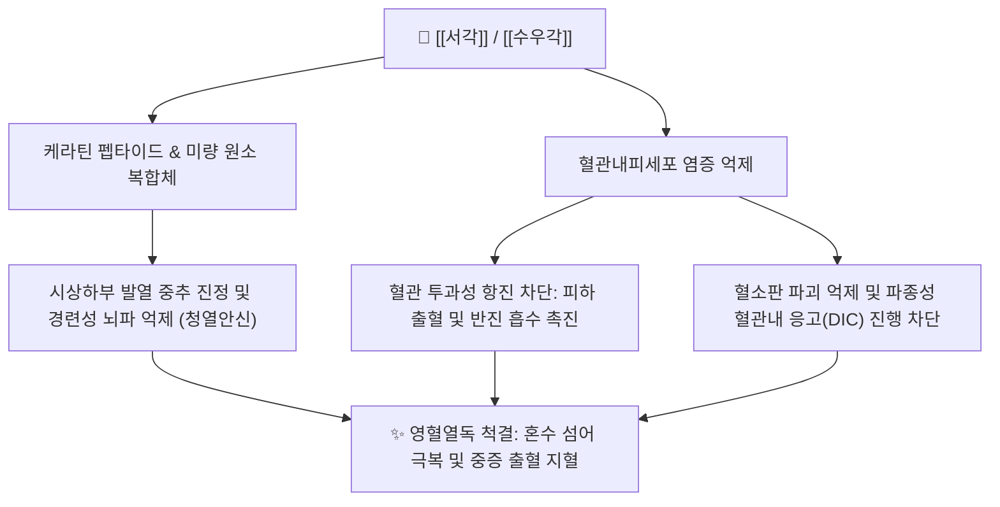

# 🦏 [[서각]] (犀角, Rhinocerotis Cornu)

> **핵심 요약 (Key Summary)**:
> 코뿔소과 동물의 뿔로 청열양혈과 사화해독 및 안신정경의 온병 열입영혈 대표 본초
> 케라틴 및 펩타이드 복합체로 고열 중추 진정, 혈소판 감소증 억제 및 혈관내피 투과성 억제
> 온병 열병 고열신혼, 섬어, 발반, 토혈·뉵혈 출혈 및 서각지황탕·안궁우황환의 핵심 군약

---

> [!abstract]+ 🧪 3D 약리 분자 구조 (Interactive 3D Viewer)
> <iframe src="https://molecule-viewer-rho.vercel.app/?cid=10208" style="width: 100%; height: 600px; border: none; border-radius: 12px; box-shadow: 0 4px 20px rgba(0,0,0,0.15);" allowfullscreen></iframe>

## 📌 목차
1. [기본 본초 정보 & 수우각 대체 원칙 (Pharmacognosy)](#1-기본-본초-정보--수우각-대체-원칙-pharmacognosy)
2. [분자약리 기전 & 현대 효능](#2-분자약리-기전--현대-효능)
3. [해부생체역학 / 시상하부 발열중추·혈관내피 연계](#3-해부생체역학--시상하부-발열중추혈관내피-연계)
4. [사상의학 및 체질별 임상 응용 (적응증 vs 금기)](#4-사상의학-및-체질별-임상-응용-적응증-vs-금기)
5. [배오 원리 및 CITES 규제 고찰](#5-배오-원리-및-cites-규제-고찰)
6. [핵심 처방 비교 매트릭스](#6-핵심-처방-비교-매트릭스)
7. [출처 및 학술 참고 문헌 (References)](#7-출처-및-학술-참고-문헌-references)

---
## 1. 기본 본초 정보 & 수우각 대체 원칙 (Pharmacognosy)

| 항목 | 상세 내용 |
| :--- | :--- |
| **본초명** | [[서각]] (犀角, Rhinoceros Horn) |
| **기원 동물** | 코뿔소과(Rhinocerotidae) 인도코뿔소(*Rhinoceros unicornis*) 등의 뿔 |
| **분류** | 청열약(淸熱藥) / 청열양혈약(淸熱涼血藥) |
| **법적 지위** | CITES 멸종위기 야생동식물 1급 협약에 의해 국제 거래 및 약용 전면 금지 (현대 임상에서는 [[수우각]]으로 전량 대체) |

---
| 항목 | 상세 내용 |
| :--- | :--- |
| **성미 (性味)** | 고(苦)·함(鹹), 한(寒) |
| **귀경 (歸經)** | 심경(心經), 간경(肝經), 위경(胃經) |
| **효능 (Actions)** | 청열양혈(淸熱涼血), 사화해독(瀉火解毒), 안신정경(安神定驚), 양혈지혈(涼血止血) |
| **주치 (Indications)** | 온병 열입영혈(熱入營血), 고열신혼(高熱神昏), 섬어, 발반(發斑), 토혈, 뉵혈, 경간(驚癇) |

### 🦬 현대 임상 대체: [[수우각]] (水牛角)
* **대체 규격**: 서각의 약용 금지로 인해 현대 한의 임상에서는 소과(Bovidae) 물소(*Bubalus bubalis*)의 뿔인 [[수우각]]을 대신 사용함.
* **용량 환산**: 수우각은 서각에 비해 약력이 완만하므로, 고전 처방의 서각 용량 대비 약 3~5배 증량하여 30~60분 이상 선전(先煎)하여 처방함.

---
## 2. 분자약리 기전 & 현대 효능



### (1) 중추성 해열 및 항경련 안신 (Antipyretic & Sedative)
* 시상하부 열조절 중추의 cAMP 분비를 하향 조절하여 고열로 인한 뇌세포 과흥분을 억제하고, 섬어 및 수족 경련(풍동)을 진정시킴.

### (2) 지혈 및 모세혈관 안정화
* 혈열망행(血熱妄行)으로 모세혈관 파열과 점막 출혈이 발생하는 상태에서 혈관벽 탄성을 보강하고 혈액 응고 이상을 교정함.

---
---
## 3. 해부생체역학 / 시상하부 발열중추·혈관내피 연계

* **시상하부 체온조절 중추와의 직접 연계**:
  * 케라틴 펩타이드 복합체가 시상하부 발열 중추의 cAMP 신호를 하향 조절하는 경로는 해부학적으로 혈액뇌장벽을 투과하는 미량 펩타이드가 중추 체온조절 뉴런에 도달하는 경로에 해당하며, 고열·경련(풍동)의 중추성 억제를 설명합니다.
* **전신 모세혈관내피 투과성 조절**:
  * 온병 열입영혈의 발반·출혈은 전신 모세혈관 내피세포 간 밀착연접 손상에서 비롯되며, 서각/수우각의 혈관벽 안정화 작용이 이 내피 장벽을 보강하는 해부학적 표적입니다.

---
## 4. 사상의학 및 체질별 임상 응용 (적응증 vs 금기)

```
[✅ 최적 적응증 (Sweet Spot)]
• 온병 열입영혈(熱入營血): 고열신혼, 섬어, 발반(피부 반점)
• 혈열망행성 출혈: 토혈, 뉵혈(코피), 대변출혈
• 경간(驚癇): 고열로 인한 소아 경련

[⚠️ 신중 투여 및 금기 (Caution / Contraindication)]
• 비위 허한자: 성질이 지극히 차가우므로 비위가 허약하거나 양기가 부족한 음증(陰證) 환자에게는 투여하지 않음
• CITES 준수 의무: 자연산 서각의 사용 및 유통은 국제법상 엄격히 처벌되므로, 임상에서는 [[수우각]] 대체 사용을 원칙으로 함
```

---
## 5. 배오 원리 및 CITES 규제 고찰

* **청열양혈 배오**: [[서각]](수우각) + [[생지황]] + [[목단피]] + [[적작약]] — 혈분의 열을 식히고 출혈·발반을 동시에 다스리는 서각지황탕의 골격.
* **개규성화 배오**: [[서각]] + [[우황]] + [[사향]] + [[황련]] — 혼수·섬어를 깨우는 개규(開竅) 계열 배오의 핵심.
* **수우각 대체 원칙**: 서각의 약용 금지로 인해 현대 한의 임상에서는 소과(Bovidae) 물소(*Bubalus bubalis*)의 뿔인 [[수우각]]을 대신 사용하며, 약력이 완만하므로 고전 처방의 서각 용량 대비 약 3~5배 증량하여 30~60분 이상 선전(先煎)합니다.

---
## 6. 핵심 처방 비교 매트릭스

| 처방명 | 배오 목적 및 주치 | 배오 구성 |
| :--- | :--- | :--- |
| [[서각지황탕]] | 열입영혈로 인한 토혈, 코피, 대변출혈, 발반 치료 | [[서각]](또는 수우각), [[생지황]], [[목단피]], [[적작약]] |
| [[안궁우황환]] | 뇌졸중 급성기, 온병 고열신혼, 섬어, 뇌염 치료 | [[우황]], [[서각]], [[사향]], [[황련]], [[황금]], [[치자]] |
| [[청영탕]] | 온병 열이 영분(營分)에 들어가 밤에 열이 심하고 번조한 증상 | [[서각]], [[현삼]], [[맥문동]], [[죽엽심]], [[은화]], [[연교]] |

---


## 7. 출처 및 학술 참고 문헌 (References)

* 전국한의과대학 본초학교수 공편저, 《본초학》, 영림사
* 장중경, 《금궤요략(金匱要略)》
* Liu Y et al. Pharmacological comparison of Cornu Rhinocerotis and Cornu Bubali. Chin J Chin Mater Med. 2011.
  * [연구 요약] 수우각과 서각의 성분 프로파일 및 중추 해열·항혈소판 응집 효과를 비교 분석하여 수우각의 유효한 대체 가능성을 규명함.
