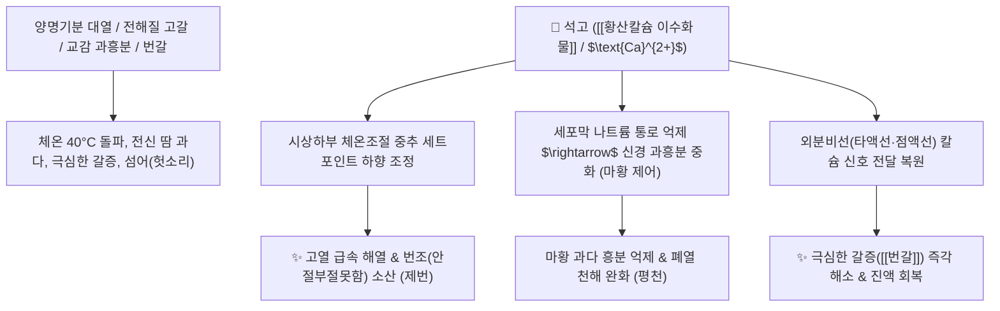

# 🌿 [[석고]] (石膏, Gypsum Fibrosum)

> **핵심 요약 (Key Summary)**:
> 황산염류 광물인 천연 [[황산칼슘 이수화물]]($\text{CaSO}_4 \cdot 2\text{H}_2\text{O}$) 광석
> 해리된 [[칼슘]]($\text{Ca}^{2+}$) 이온이 시상하부 체온조절 중추를 안정시키고 세포막 나트륨 펌프 과흥분을 차단하여 강력한 해열 및 외분비선 분비 정상화 작용 발휘
> [[상한론]] 양명병(陽明病) 기분실열(氣分實熱)의 4대 증상(대열·대갈·대한·대맥) 및 폐열천해(肺熱喘咳)·번갈(煩渴)을 치료하는 대표적인 [[청열사화]](淸熱瀉火)·[[제번지갈]](除煩止渴) 군약(君藥)

---
## 📌 목차
1. [기본 본초 정보 & 화학 구조 (Pharmacognosy)](#1-기본-본초-정보--화학-구조-pharmacognosy)
2. [핵심 분자약리 기전 & 칼슘 이온·체온 중추·마황 중화 네트워크](#2-핵심-분자약리-기전--칼슘-이온체온-중추마황-중화-네트워크)
3. [해부생체역학 / 외분비선 분비 & 액틴-미오신 근수축 연계](#3-해부생체역학--외분비선-분비--액틴-미오신-근수축-연계)
4. [사상의학 및 임상 응용 (생석고 청열 vs 단석고 생기렴창)](#4-사상의학-및-임상-응용-생석고-청열-vs-단석고-생기렴창)
5. [상한론 『약징(藥徵)』 분석 및 배오 원리](#5-상한론-약징藥徵-분석-및-배오-원리)
6. [핵심 처방 비교 매트릭스](#6-핵심-처방-비교-매트릭스)
7. [출처 및 학술 참고 문헌 (References)](#7-출처-및-학술-참고-문헌-references)

---
## 1. 기본 본초 정보 & 화학 구조 (Pharmacognosy)

> [!abstract]+ 🧪 3D 약리 분자 구조 (Interactive 3D Viewer)
> <iframe src="https://molecule-viewer-rho.vercel.app/?cid=24497" style="width: 100%; height: 600px; border: none; border-radius: 12px; box-shadow: 0 4px 20px rgba(0,0,0,0.15);" allowfullscreen></iframe>


| 항목 | 상세 내용 |
| :--- | :--- |
| **광물 기원** | 황산염광물 석고족(Gypsum family) 섬유석고 *Gypsum fibrosum* 광석 ($\text{CaSO}_4 \cdot 2\text{H}_2\text{O}$) |
| **성미 (性味)** | 辛·甘, 大寒 |
| **귀경 (歸經)** | 肺·胃經 (폐경, 위경) - **양명경(陽明經) 기분(氣分)의 대열을 사함** |
| **효능 (Actions)** | [[청열사화]](淸熱瀉火), [[제번지갈]](除煩止渴), [[생기렴창]](生肌斂瘡, 단석고), [[사폐평천]](瀉肺平喘) |
| **주요 성분** | • **주화학성분**: [[황산칼슘 이수화물]] ($\text{CaSO}_4 \cdot 2\text{H}_2\text{O}$, KP 규격 $\ge 95.0\%$)<br>• **미량 원소**: 마그네슘, 철, 알루미늄, 아연, 실리카 |

> **[유래 및 본초학적 기전]**:
> * 핥으면 서릿발처럼 차가운 광물로, 체내에 불길처럼 번지는 기분실열(氣分實熱)을 단숨에 진압하는 '청열의 대장(大將)'입니다.
> * 고열로 땀과 수분이 빠져나가 전해질이 고갈되고 입이 바짝 마르는 번갈(煩渴) 상태에서, 이온화된 칼슘을 공급하여 세포막 안정화와 외분비선(침, 점액) 분비를 복원합니다.
> * 불에 구운 단석고(煅石膏)는 수렴성이 극대화되어 궤양과 화상의 새살을 돋게 합니다.

### 🔬 석고의 칼슘 해리 및 신경근 반응
![[Pasted image 20240513150519.png|450]]
![[석고-20240820093847016.png|500]]
> [구조적 특징 및 이온 메커니즘]: 석고를 전탕하면 황산칼슘 수화물에서 [[칼슘]]($\text{Ca}^{2+}$) 이온이 유리되어 신경 시냅스 말단의 칼슘 채널 및 근세포질 그물막(SR)의 칼슘 방출을 정상화하고, 두부를 응고시키듯 과이완된 혈관을 수축시켜 삼출을 억제합니다.

---
## 2. 핵심 분자약리 기전 & 칼슘 이온·체온 중추·마황 중화 네트워크



### (1) 체온 조절 중추 안정 및 해열
* **시상하부 발열 세트포인트 정상화**:
  * 내인성 발열원(Pyrogen)에 의한 체온조절 중추의 과열을 신속히 식혀 4대 증상(대열·대갈·대한·대맥)을 가라앉힙니다.
* **마황(에페드린)의 과흥분 중화 및 시너지**:
  * 마황이 교감신경을 흥분시켜 혈관을 수축시킬 때, 석고는 나트륨 통로를 닫아 과흥분을 완충하면서 기관지 확장을 보조합니다 ([[마행감석탕]], [[대청룡탕]]).
* **저칼슘혈증 및 번갈(煩渴) 해소**:
  * 체온 상승과 탈수로 인한 이온 불균형을 교정하여 침과 소화액 분비를 촉진하고 마른 목을 적셔줍니다.

---
## 3. 해부생체역학 / 외분비선 분비 & 액틴-미오신 근수축 연계

* **샘분비세포(Glandular Epithelium) 분비 촉진**:
  * 칼슘 신호 전달을 통해 침샘과 호흡기 점막 분비를 활성화하여 구강 건조를 해소합니다.
* **골격근 T-세관 및 근형질세망(SR) 칼슘 항상성 유지**:
  * 고열로 인한 근육 무력감과 경련을 안정화합니다.

---
## 4. 사상의학 및 임상 응용 (생석고 청열 vs 단석고 생기렴창)

```
[✅ 법제에 따른 효능 감별]
• 생석고(生石膏, 가루 내어 전탕): 청열사화(淸熱瀉火)·제번지갈(除煩止渴) $\rightarrow$ 고열, 폐열천해, 번갈
• 단석고(煅石膏, 불에 구운 무수황산칼슘): 수렴생기(收斂生肌)·렴창(斂瘡) $\rightarrow$ 습진, 화상, 피부 궤양, 외상 출혈

[✅ 최적 적응증 (Sweet Spot)]
• 양명기분 대열증: 고열이 나고 땀이 비 오듯 쏟아지며, 찬물을 벌컥벌컥 들이켜도 갈증이 가시지 않는 상태 ([[백호탕]])
• 폐열 해수·천식: 숨이 차고 쌕쌕거리며 콧구멍을 벌렁거리는 급성 폐렴/기관지염 ([[마행감석탕]])
• 위화 치통: 잇몸이 붓고 피가 나며 뺨까지 부어오르는 윗니 통증
• 외용: 진물이 줄줄 흐르는 만성 습진, 욕창, 2도 화상

[⚠️ 신중 투여 및 금기 (Caution)]
• 비위허한(脾胃虛寒)으로 속이 차고 맥이 침미한 환자 복용 절대 금기
```

---
## 5. 상한론 『약징(藥徵)』 분석 및 배오 원리

### (1) 『[[약징]]』에 나타난 석고의 주치
> **"石膏 主治煩渴也. 旁治譫語, 煩躁, 身熱..."**  
> (석고의 주치는 가슴이 답답하고 몹시 갈증이 나는 번갈(煩渴)이며, 곁들여 헛소리(섬어), 안절부절못하는 번조, 몸에 열이 펄펄 끓는 신열을 치료한다.)

* **핵심 배오 원리**:
  * [[석고]] + [[지모]] $\rightarrow$ 기분의 대열을 끄고 진액을 보충하는 양명병 최고의 명방 ([[백호탕]])
  * [[석고]] + [[마황]] + [[행인]] + [[감초]] $\rightarrow$ 폐열 천해를 시원하게 뚫어주는 천하 명방 ([[마행감석탕]])
  * [[석고]] + [[마황]] + [[계지]] $\rightarrow$ 표한과 이열을 안팎으로 동시에 씻어냄 ([[대청룡탕]])

---
## 6. 핵심 처방 비교 매트릭스

| 처방명 | 구성 약재 | 주치 병증 및 임상 타깃 | 특징 및 감별점 |
| :--- | :--- | :--- | :--- |
| [[백호탕]] | [[석고]], [[지모]], [[감초]], [[경미]](멥쌀) | **양명기분증, 4대증(대열, 대갈, 대한, 대맥), 번조** | 청열사화의 천하제일 방 |
| [[백호가인삼탕]] | [[백호탕]] + [[인삼]] | **백호탕증 + 진액과 기운 고갈, 구갈 심함, 소갈(당뇨)** | 기운을 보하며 갈증을 해소 |
| [[마행감석탕]] | [[마황]], [[행인]], [[감초]], [[석고]] (석고가 마황의 2배) | **폐열천해, 콧구멍 벌렁거림, 고열, 유한/무한, 천명** | 소아 폐렴 및 천식의 구급방 |
| [[대청룡탕]] | [[마황탕]] + [[석고]], [[생강]], [[대추|대조]] | **표한리열(表寒裏熱), 오한발열, 무한, 번조, 신통** | 안팎의 한열을 동시에 폭격 |
| [[월비탕]] | [[마황]], [[석고]], [[생강]], [[대추|대조]], [[감초]] | **풍수(風水), 전신 급성 부종, 발열, 오풍, 구갈** | 부종과 열을 동시에 배출 |

---
## 7. 출처 및 학술 참고 문헌 (References)

1. **Wang T et al. (2026)**. The discovery of the material basis and mechanism of gypsum as an antipyretic based on the theory of the diverse applications of raw and processed products. *Journal of ethnopharmacology*, 355(Pt A): 120623. [PMID: 40972731](https://pubmed.ncbi.nlm.nih.gov/40972731/)
   - **[연구 요약]**: 석고의 칼슘 이온 해리가 시상하부 PGE2 발열 신호를 억제하고 전해질 항상성을 회복시켜 강력한 해열 효과를 나타냄을 입증.
2. **대한민국약전(KP) 제12개정 (2022)**. 의약품각조 제2부: 석고 (Gypsum Fibrosum) 규격 기준.
   - **[공정서 규격]**: 황산칼슘 이수화물($\text{CaSO}_4 \cdot 2\text{H}_2\text{O}$) 95.0% 이상 함유 필수 규격 명시.
3. **길익동동 (吉益東洞, 1784)**. 『약징(藥徵)』: 石膏 조문.
   - **[고전 원전]**: "石膏 主治煩渴也. 旁治譫語, 煩躁, 身熱" - 번갈 및 섬어·신열 주치 원리 제시.
