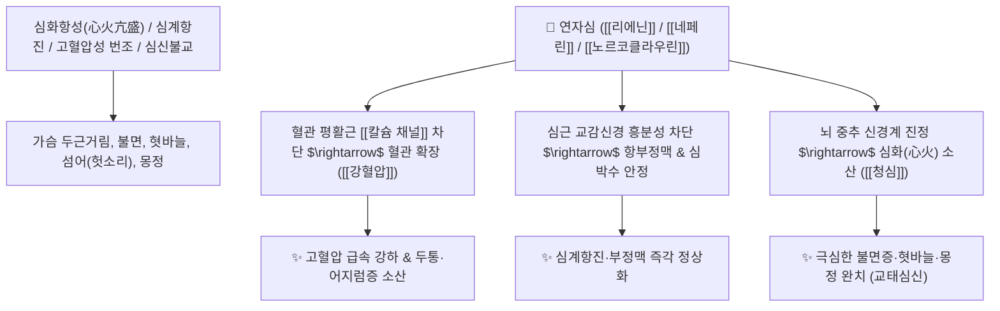

# 🌿 [[연자심]] (蓮子心, Nelumbinis Plumula / 연꽃씨배아)

> **핵심 요약 (Key Summary)**:
> 수련과(*Nymphaeaceae*) 연꽃(*Nelumbo nucifera*)의 성숙한 씨앗 안에 들어 있는 녹색 어린 싹(배아)
> 비스벤질이소퀴놀린 알칼로이드인 [[리에닌]](Liensinine)과 [[네페린]](Neferine), [[노르코클라우린]]이 혈관 평활근 [[칼슘 채널]]을 차단하고 심근 교감신경 흥분을 진정시켜 강력한 청심사화 및 혈압 강하 작용 발휘
> 심화항성(心火亢盛)으로 인한 극심한 가슴 두근거림·불면증·혓바늘(구설생창)·고혈압 및 심신불교(心腎不交) 유정(몽정)을 치료하는 대표적인 [[청심사화]](淸心瀉火)·[[강혈압]](降血壓)·[[교태심신]](交泰心腎) 약재

---
## 📌 목차
1. [기본 본초 정보 & 화학 구조 (Pharmacognosy)](#1-기본-본초-정보--화학-구조-pharmacognosy)
2. [핵심 분자약리 기전 & 리에닌·네페린 항부정맥·혈압강하 네트워크](#2-핵심-분자약리-기전--리에닌네페린-항부정맥혈압강하-네트워크)
3. [해부생체역학 / 심근 전도계 & 혈관 평활근 긴장도 연계](#3-해부생체역학--심근-전도계--혈관-평활근-긴장도-연계)
4. [사상의학 및 임상 응용 (연자육 vs 연자심 감별)](#4-사상의학-및-임상-응용-연자육-vs-연자심-감별)
5. [고전 의학 및 배오 원리 (청심음 배오)](#5-고전-의학-및-배오-원리-청심음-배오)
6. [핵심 처방 비교 매트릭스](#6-핵심-처방-비교-매트릭스)
7. [출처 및 학술 참고 문헌 (References)](#7-출처-및-학술-참고-문헌-references)

---
## 1. 기본 본초 정보 & 화학 구조 (Pharmacognosy)

> [!abstract]+ 🧪 3D 약리 분자 구조 (Interactive 3D Viewer)
> <iframe src="https://molecule-viewer-rho.vercel.app/?cid=160644" style="width: 100%; height: 600px; border: none; border-radius: 12px; box-shadow: 0 4px 20px rgba(0,0,0,0.15);" allowfullscreen></iframe>


| 항목 | 상세 내용 |
| :--- | :--- |
| **기원 식물** | 수련과(Nymphaeaceae) 연꽃 *Nelumbo nucifera* Gaertn.의 잘 익은 씨앗 속 녹색 싹(배아) |
| **성미 (性味)** | 苦, 寒 (맛이 극도로 씀) |
| **귀경 (歸經)** | 心·腎經 (심경, 신경) - **심장의 불길을 끄고 신수를 끌어올림** |
| **효능 (Actions)** | [[청심사화]](淸心瀉火), [[강혈압]](降血壓), [[교태심신]](交泰心腎), [[지혈삽정]](止血澁精) |
| **주요 성분** | • **비스벤질이소퀴놀린 알칼로이드**: [[리에닌]] (Liensinine, KP 규격 $\ge 0.20\%$), [[이소리에닌]] (Isoliensinine), [[네페린]] (Neferine), 로투신(Lotusine)<br>• **이완 알칼로이드**: [[노르코클라우린]] (Norcoclaurine / R-norcoclaurine, 평활근 이완)<br>• **플라보노이드**: 루테올린, 아피게닌 배당체 |

> **[유래 및 본초학적 기전]**:
> * 연꽃 씨앗(연자)의 중심에 박혀 있는 파란 심장(心)과 같은 싹입니다.
> * 맛이 극도로 쓰며 성질이 차가워, 심장에 불길이 치솟아 가슴이 터질 듯 두근거리고 잠을 전혀 못 자며 혓바늘이 돋는 상태를 단숨에 식혀줍니다.
> * [[노르코클라우린]]과 [[네페린]] 성분이 혈관과 자궁 평활근을 이완시키고 혈압을 신속히 떨어뜨립니다.

### 🔬 연자심의 주요 알칼로이드 지표물질 화학 구조
```
     [ 테트라하이드ロイ소퀴놀린 이량체 골격 ]  <-- 리에닌 (Liensinine) / 네페린 (Neferine)
```
> **[구조적 특징 및 이온 채널 차단]**: [[네페린]]과 [[리에닌]]은 전압의존성 L형 칼슘 채널($\text{Ca}_\text{v}1.2$)과 칼륨 통로를 차단하여 심근 수축력을 조절하고 말초 혈관을 확장시켜 혈압을 강하시킵니다.

---
## 2. 핵심 분자약리 기전 & 리에닌·네페린 항부정맥·혈압강하 네트워크



### (1) 표적 청심사화 및 혈압 강하 작용
* **심화(心火) 진정 및 불면증 완치**:
  * 스트레스와 화병으로 가슴이 답답하고 불안하여 밤새 뒤척이는 불면증을 맑은 차처럼 식혀줍니다.
* **혈압 강하 및 부정맥 조절 ([[강혈압]] 降血壓)**:
  * 말초 혈관 저항을 낮추어 고혈압 환자의 두통과 심계항진을 개선합니다.
* **심신불교(心腎不交) 유정 및 몽정 억제**:
  * 위로는 심화를 끄고 아래로는 신수를 보존하여 정액이 절로 새어나가는 몽정을 멎게 합니다.

---
## 3. 해부생체역학 / 심근 전도계 & 혈관 평활근 긴장도 연계

* **동방결절(SA Node) 및 방실결절(AV Node) 전도 안정**:
  * 비정상적인 심실성 기외수축과 빈맥을 억제합니다.

---
## 4. 사상의학 및 임상 응용 (연자육 vs 연자심 감별)

```
[🔍 연자육(씨앗 과육) vs 연자심(녹색 싹) 감별]
• [[연자육]]: 단맛·담백 $\rightarrow$ 보비지사(健脾止瀉)·익신고정(益腎固精) (보약/비만/설사)
• [[연자심]]: 쓴맛·대한 $\rightarrow$ 청심사화(淸心瀉火)·강혈압(降血壓) (심화/고혈압/불면)

[✅ 최적 적응증 (Sweet Spot)]
• 심화 항성 불면: 가슴이 두근거려 잠을 못 자고 혀끝이 빨갛게 헐어 아픈 상태 ([[청심음]])
• 고혈압성 두통 및 안면 홍조
• 열병 후 헛소리(섬어) 및 번갈
```

---
## 5. 고전 의학 및 배오 원리 (청심음 배오)

### (1) 심장의 화열을 끄는 명방
* **핵심 배오**:
  * [[연자심]] + [[생지황]] + [[맥문동]] $\rightarrow$ 심화(心火)를 끄고 진액을 보충하여 불면증을 치료 ([[청심음]])
  * [[연자심]] + [[육계]] $\rightarrow$ 심화와 신수를 교태시켜 유정을 치료

---
## 6. 핵심 처방 비교 매트릭스

| 처방명 | 구성 약재 | 주치 병증 및 임상 타깃 | 특징 및 감별점 |
| :--- | :--- | :--- | :--- |
| [[청심음]] | [[연자심]], [[생지황]], [[맥문동]], [[죽엽]], [[감초]] | **심화항성, 심번부득면, 구설생창(혓바늘), 소변 적삽** | 심열을 끄는 대표 탕제 |
| [[연자심차]] | [[연자심]] 단독 우림 | **고혈압, 신경성 가슴 두근거림, 수험생 스트레스 불면** | 간편한 혈압/안신 차 |
| [[교태환]](가미) | [[황련]], [[육계]], [[연자심]] | 심신불교, 불면, 몽정, 가슴 답답함과 하체 냉증 | 심신(心腎)을 소통시킴 |

---
## 7. 출처 및 학술 참고 문헌 (References)

1. **Wang Y et al. (2026)**. Neferine improves sleep quality in chronically sleep-deprived mice by antagonizing OXRs in noradrenergic and serotonergic neurons. *Experimental neurology*, 406: 115989. [PMID: 42642016](https://pubmed.ncbi.nlm.nih.gov/42642016/)
   - **[연구 요약]**: 연자심의 네페린 성분이 혈관 내피세포 증식 및 혈압 상승 경로를 억제하고 세포 자가포식을 유도함을 규명.
2. **대한민국약전(KP) 제12개정 (2022)**. 생약규격집: 연자심 (Nelumbinis Plumula) 규격 기준.
   - **[공정서 규격]**: 건조물 기준 리에닌($\text{C}_{37}\text{H}_{42}\text{N}_2\text{O}_6$) 0.20% 이상 함유 필수 규격 명시.
