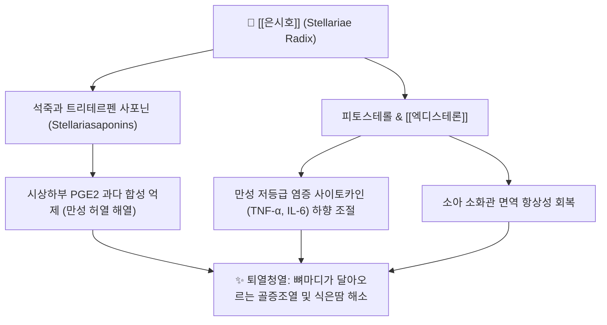

# 🌿 [[은시호]] (銀柴胡, Stellariae Radix)

> **핵심 요약 (Key Summary)**:
> 석죽과 식물인 은시호의 건조한 뿌리로 청허열과 제감열의 대표적 퇴허열 본초
> 스텔라리아 사포닌, 엑디스테론, 플라보노이드 성분으로 시상하부 열조절 교정 및 항염증 작용
> 음허발열, 골증조열, 도한, 소아감열(소아 소화불량성 만성 미열) 및 청골산의 핵심 군약

---

> [!abstract]+ 🧪 3D 약리 분자 구조 (Interactive 3D Viewer)
> <iframe src="https://molecule-viewer-rho.vercel.app/?cid=222284" style="width: 100%; height: 600px; border: none; border-radius: 12px; box-shadow: 0 4px 20px rgba(0,0,0,0.15);" allowfullscreen></iframe>

## 📌 목차
1. [기본 본초 정보 & 시호(柴胡)와의 감별 (Pharmacognosy)](#1-기본-본초-정보--시호柴胡와의-감별-pharmacognosy)
2. [분자약리 기전 & 현대 의학적 효능](#2-분자약리-기전--현대-의학적-효능)
3. [해부생체역학 / 시상하부 열중추·장점막 면역 연계](#3-해부생체역학--시상하부-열중추장점막-면역-연계)
4. [사상의학 및 체질별 임상 응용 (적응증 vs 금기)](#4-사상의학-및-체질별-임상-응용-적응증-vs-금기)
5. [배오 원리 및 한의학적 고찰](#5-배오-원리-및-한의학적-고찰)
6. [핵심 처방 비교 매트릭스](#6-핵심-처방-비교-매트릭스)
7. [출처 및 학술 참고 문헌 (References)](#7-출처-및-학술-참고-문헌-references)

---
## 1. 기본 본초 정보 & 시호(柴胡)와의 감별 (Pharmacognosy)

| 항목 | 상세 내용 |
| :--- | :--- |
| **본초명** | [[은시호]] (銀柴胡, Stellariae Radix) |
| **기원 식물** | 석죽과(Caryophyllaceae) 은시호(*Stellaria dichotoma* L. var. *lanceolata* Bge.)의 건조한 뿌리 |
| **약용 부위** | 뿌리 (원추형 또는 원주형으로 표면에 사안(砂眼)이라 불리는 모래구멍이 특징) |
| **분류** | 청열약(淸熱藥) / 청허열약(淸虛熱藥) |

---
### 시호(柴胡)와의 감별

| 구분 | [[은시호]] (銀柴胡) | [[시호]] (柴胡) |
| :--- | :--- | :--- |
| **식물과** | **석죽과 (Caryophyllaceae)** | **미나리과 (Apiaceae)** |
| **주요 효능** | **청허열(淸虛熱), 제감열(除疳熱)** | **소간해울(疏肝解鬱), 투표사열(透表邪熱)** |
| **타깃 병증** | 음허내열(陰虛內熱), 골증조열, 소아감열 | 소양감모(왕래한열), 흉협고만, 간기울결 |
| **약성 특징** | 맛이 달고 서늘하여 정기를 깎지 않고 오직 허열만 꺼줌 (감한청열 불상양기) | 맵고 쓰며 위로 흩발하는 승발(昇發)의 기운이 강함 |

---
## 2. 분자약리 기전 & 현대 의학적 효능



### (1) 시상하부 열중추 정상화 및 퇴열
* 체질량 소모성 만성 질환(결핵, 결체조직질환 등)에서 지속되는 저체온 조절 불균형을 교정하여 골증조열(오후에 열이 오르는 증상)을 완화함.

### (2) 소아감열(疳熱) 및 소화흡수 장애 개선
* 소아 영양불량으로 장점막 위축과 만성 미열, 복부 팽만이 동반된 감증(疳證)에서 장관 미세염증을 끄고 소화 흡수능을 재건함.

---
---
## 3. 해부생체역학 / 시상하부 열중추·장점막 면역 연계

* **시상하부 PGE2 경로와 만성 저체온조절 불균형**:
  * 체질량 소모성 만성 질환에서 지속되는 시상하부 PGE2 과다 합성을 억제하는 경로는 해부학적으로 시상하부 체온조절핵이 만성 소모성 대사 신호를 잘못 해석해 골증조열을 일으키는 기전을 정상화하는 것입니다.
* **장점막 면역 항상성 연계**:
  * 소아감열은 장점막 위축·미세염증에서 비롯되므로, 은시호의 소화관 면역 조절 작용은 장관 점막 면역계와 전신 저등급 염증 사이토카인(TNF-α, IL-6) 축을 잇는 해부생리학적 경로로 이해됩니다.

---
## 4. 사상의학 및 체질별 임상 응용 (적응증 vs 금기)

```
[✅ 최적 적응증 (Sweet Spot)]
• 음허내열(陰虛內熱), 골증조열(뼈마디가 달아오르는 열감), 야간 도한
• 소아감열(疳熱): 소화불량성 만성 미열, 복부 팽만, 영양실조

[⚠️ 신중 투여 및 금기 (Caution / Contraindication)]
• 외감 풍한(風寒) 표증 금기: 안으로 숨은 허열을 끄는 약재이므로, 감기 몸살 등 표증 환자가 복용하면 사기가 안으로 숨어들 수 있음
• 비위허한(脾胃虛寒) 환자 주의: 성질이 미한하므로 배가 차고 설사를 자주 하는 허약자는 신중 투여
```

---
## 5. 배오 원리 및 한의학적 고찰

* **퇴허열 배오**: [[은시호]] + [[지모]] + [[호황련]] + [[진교]] + [[별갑]] + [[지골피]] + [[청호]] — 간신음허의 골증열을 다각도로 식히는 청골산의 핵심 배오.
* **소아감적 배오**: [[은시호]] + [[호황련]] + [[신곡]] + [[맥아]] + [[산사]] — 소화 흡수능을 재건하며 감열을 끄는 배오.

---
## 6. 핵심 처방 비교 매트릭스

| 처방명 | 배오 목적 및 주치 | 배오 구성 |
| :--- | :--- | :--- |
| [[청골산]] | 간신음허로 뼈마디 속에서 열이 나고 식은땀이 나는 골증열 치료 | [[은시호]], [[지모]], [[호황련]], [[진교]], [[별갑]], [[지골피]], [[청호]], [[감초]] |
| [[소아감적산]] | 소아 소화불량성 감열, 복부 팽만, 영양실조 치료 | [[은시호]], [[호황련]], [[신곡]], [[맥아]], [[산사]] |
---
## 7. 출처 및 학술 참고 문헌 (References)

* 전국한의과대학 본초학교수 공편저, 《본초학》, 영림사
* 장중경, 《온병조변(溫病條辨)》
* Wang Z et al. Chemical constituents and anti-inflammatory activities of Stellaria dichotoma var. lanceolata. J Nat Prod. 2017.
  * [연구 요약] 은시호 뿌리에서 분리된 신규 사포닌과 플라보노이드가 LPS 유도 염증 매개체 분비를 억제함을 증명함.
