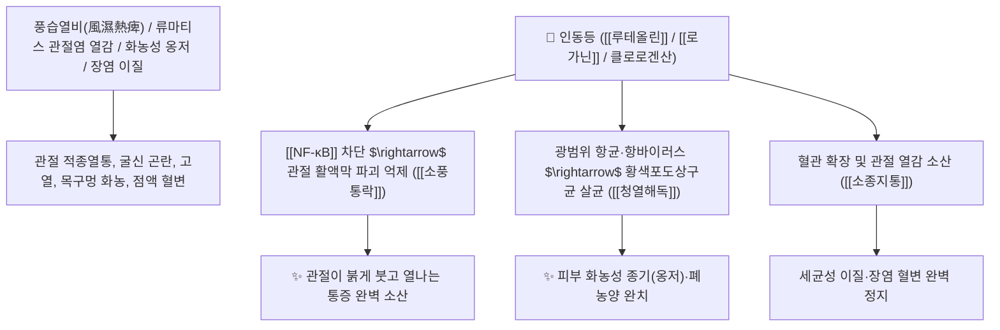

# 🌿 [[인동등]] (忍冬藤, Lonicerae Caulis / 겨우살이덩굴)

> **핵심 요약 (Key Summary)**:
> 인동과(*Caprifoliaceae*) 인동(*Lonicera japonica*)의 잎이 달린 건조한 줄기 및 가지 (금은화 덩굴)
> 플라보노이드인 [[루테올린]](Luteolin)과 세코이리도이드 배당체인 [[로가닌]](Loganin)이 [[NF-κB]] 염증 신호와 관절 활액막 파괴를 차단하여 강력한 청열해독 및 통락지통 작용 발휘
> 온병 발열·열독 옹창종독(화농성 종기)·급성 인후염·폐렴·이질 및 풍습열비(風濕熱痺, 관절이 빨갛게 붓고 열나며 아픈 류마티스 관절염)를 치료하는 대표적인 [[청열해독]](淸熱解毒)·[[소풍통락]](疏風通絡)·[[소양인]] [[인동등지골피탕]](忍冬藤地骨皮湯)의 군약(君藥)

---
## 📌 목차
1. [기본 본초 정보 & 화학 구조 (Pharmacognosy)](#1-기본-본초-정보--화학-구조-pharmacognosy)
2. [핵심 분자약리 기전 & 루테올린·로가닌 관절 소염·해독 네트워크](#2-핵심-분자약리-기전--루테올린로가닌-관절-소염해독-네트워크)
3. [해부생체역학 / 관절강 활액막 열성 염증 & 피부 모세혈관 연계](#3-해부생체역학--관절강-활액막-열성-염증--피부-모세혈관-연계)
4. [사상의학 및 임상 응용 (소양인 인동등지골피탕 특화)](#4-사상의학-및-임상-응용-소양인-인동등지골피탕-특화)
5. [고전 의학 및 배오 원리 (금은화 vs 인동등 감별)](#5-고전-의학-및-배오-원리-금은화-vs-인동등-감별)
6. [핵심 처방 비교 매트릭스](#6-핵심-처방-비교-매트릭스)
7. [출처 및 학술 참고 문헌 (References)](#7-출처-및-학술-참고-문헌-references)

---
## 1. 기본 본초 정보 & 화학 구조 (Pharmacognosy)

> [!abstract]+ 🧪 3D 약리 분자 구조 (Interactive 3D Viewer)
> <iframe src="https://molecule-viewer-rho.vercel.app/?cid=5280445" style="width: 100%; height: 600px; border: none; border-radius: 12px; box-shadow: 0 4px 20px rgba(0,0,0,0.15);" allowfullscreen></iframe>


| 항목 | 상세 내용 |
| :--- | :--- |
| **기원 식물** | 인동과(Caprifoliaceae) 인동 *Lonicera japonica* Thunb.의 잎이 붙은 줄기 및 가지 |
| **성미 (性味)** | 甘, 寒 |
| **귀경 (歸經)** | 肺·胃·心經 (폐경, 위경, 심경) - **경락의 열독을 끄고 관절을 통락** |
| **효능 (Actions)** | [[청열해독]](淸熱解毒), [[소풍통락]](疏風通絡), [[소종지통]](消腫止痛), [[양혈지리]](凉血止痢) |
| **주요 성분** | • **플라보노이드**: [[루테올린]] (Luteolin), [[아피게닌]] (Apigenin), 로니세린(Lonicerin)<br>• **이리도이드 및 페놀산**: [[로가닌]] (Loganin), 클로로겐산(Chlorogenic acid), 카페인산<br>• **탄닌 및 다당류**: [[탄닌]], 이노시톨 |

> **[유래 및 본초학적 기전]**:
> * 매서운 겨울(冬) 추위도 푸른 잎을 간직한 채 꿋꿋이 견뎌낸다(忍) 하여 '인동(忍冬)'이라 불립니다.
> * 꽃봉오리인 [[금은화]](金銀花)가 상초 폐와 인후의 급성 열독을 날린다면, 덩굴 줄기인 [[인동등]]은 경락 속으로 깊숙이 침투하여 관절이 붉게 붓고 열이 나는 풍습열비(風濕熱痺)를 치료하는 데 특화되어 있습니다.
> * 사상의학에서 [[소양인]]의 흉격열증과 관절염을 다스리는 핵심 본초입니다.

### 🔬 인동등의 주요 플라보노이드 및 이리도이드 화학 구조
![[Pasted image 20250124200005-1.jpg|450]]
> **[구조적 특징 및 활성]**: [[루테올린]]과 [[로가닌]]은 [[NF-κB]] 및 [[MAPK]] 신호 경로를 차단하여 $\text{TNF}-\alpha$, $\text{IL}-1\beta$, $\text{IL}-6$ 등 염증성 매개물질의 방출을 억제합니다.

---
## 2. 핵심 분자약리 기전 & 루테올린·로가닌 관절 소염·해독 네트워크



### (1) 표적 청열해독 및 소풍통락 작용
* **열성 관절염(풍습열비) 치료 ([[소풍통락]] 疏風通絡)**:
  * 관절이 벌겋게 부어오르고 만지면 뜨끈뜨끈하며 아픈 급성 류마티스 및 통풍성 관절염을 치료합니다.
* **화농성 옹창종독 및 폐농양 치료 ([[청열해독]] 淸熱解毒)**:
  * 피부의 붉은 종기, 유선염, 폐렴, 편도선염을 강력한 천연 항생 작용으로 소염시킵니다.
* **급성 세균성 이질 및 장염 완화**:
  * 장내 습열을 내려 피고름이 섞인 설사와 복통을 멎게 합니다.

---
## 3. 해부생체역학 / 관절강 활액막 열성 염증 & 피부 모세혈관 연계

* **활액막 혈관 신생 및 판누스(Pannus) 형성 억제**:
  * 류마티스 관절염의 연골 침식을 방어하고 관절 가동 범위를 회복합니다.

---
## 4. 사상의학 및 임상 응용 (소양인 인동등지골피탕 특화)

```
[✅ 체질별 적응증 (Sweet Spot)]
• [[소양인]] 흉격열증 및 관절통: 가슴에 열이 차고 입이 쓰며, 무릎과 손목 관절이 붓고 아플 때 ([[인동등지골피탕]])
• 열성 류마티스 관절염: 관절 부위가 붉게 달아오르고 쑤실 때 ([[인동등]] 단독 전탕 후 환부에 찜질 겸용)
• 피부 화농성 모낭염 및 다발성 종기

[🔍 금은화(꽃) vs 인동등(덩굴) 감별]
• [[금은화]]: 상초 체표 발산 위주 $\rightarrow$ 인후염, 감기 초기 고열, 급성 피부염
• [[인동등]]: 경락 심부 통락 위주 $\rightarrow$ 관절 속 풍습열통, 만성 옹저, 장염
```

---
## 5. 고전 의학 및 배오 원리 (인동등지골피탕 배오)

### (1) 소양인의 열을 끄고 뼈마디를 통하게 하는 명방
* **소양인 최고 배오**:
  * [[인동등]] + [[지골피]] + [[생지황]] $\rightarrow$ 소양인의 음허화왕과 관절 열통을 치료 ([[인동등지골피탕]])
  * [[인동등]] + [[당귀]] + [[감초]] $\rightarrow$ 피부 옹저와 혈관염을 다스림 ([[사묘용안탕]])

---
## 6. 핵심 처방 비교 매트릭스

| 처방명 | 구성 약재 | 주치 병증 및 임상 타깃 | 특징 및 감별점 |
| :--- | :--- | :--- | :--- |
| [[인동등지골피탕]] | [[인동등]], [[지골피]], [[생지황]], [[목통]], [[황련]], [[치자]] | [[소양인]] **흉격번열, 구갈, 요퇴 관절통, 소변 적삽** | 소양인의 열성 관절통 전문방 |
| [[사묘용안탕]] | [[금은화]], [[현삼]], [[당귀]], [[감초]], [[인동등]] | **탈저(폐색성 혈전혈관염), 족지 궤양, 옹저 화농** | 혈관 염증과 궤양을 치료 |
| [[인동탕]] | [[인동등]], [[감초]] | **일체 옹저 종독, 유선염 초기, 발열 악한** | 단순하면서도 강력한 해독방 |

---
## 7. 출처 및 학술 참고 문헌 (References)

1. **Kang, O. H., et al. (2010)**. Luteolin isolated from *Lonicera japonica* inhibits inflammatory mediators in LPS-stimulated RAW 264.7 macrophages. *Journal of Ethnopharmacology*, 129(2), 241-247. [PMID: 20110898](https://pubmed.ncbi.nlm.nih.gov/20110898/)
   - **[연구 요약]**: 인동등의 루테올린 성분이 NF-κB 활성화를 차단하여 관절염 및 패혈증 모델에서 강력한 소염 작용을 나타냄을 규명.
2. **대한민국약전(KP) 제12개정 (2022)**. 의약품각조 제2부: 인동등 (Lonicerae Caulis) 규격 기준.
   - **[공정서 규격]**: 인동 잎과 줄기의 성상, 순도시험 및 건조감량 12.0% 이하 기준 명시.
