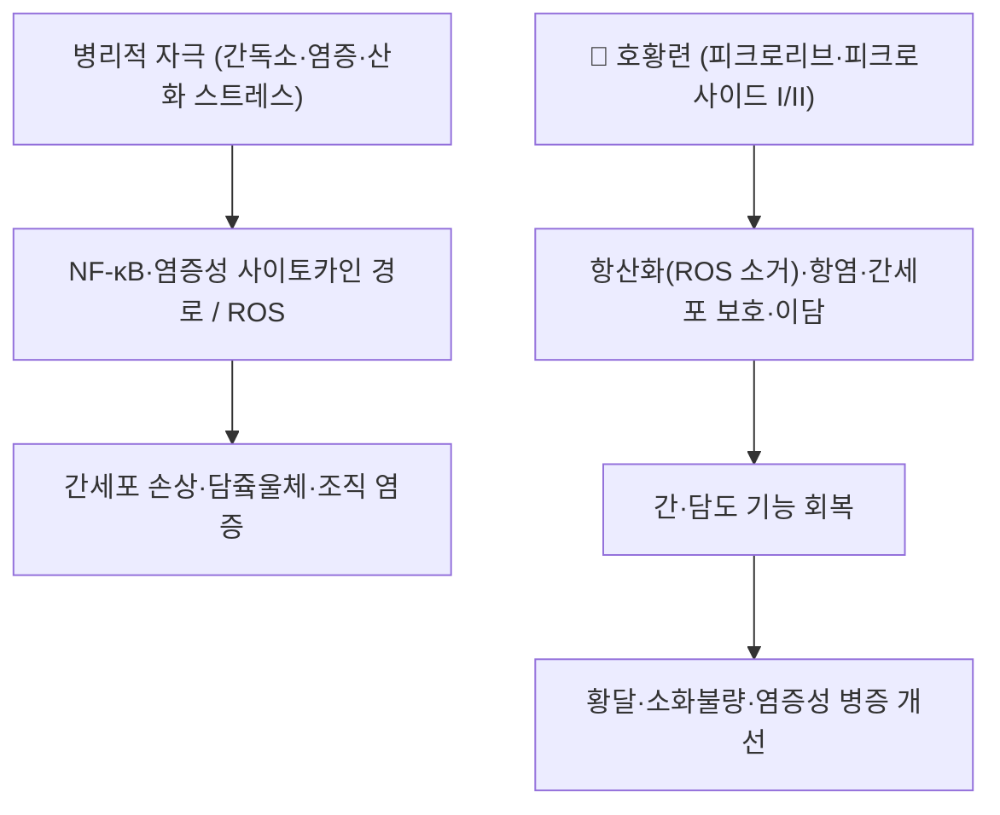

---
aliases:
  - 胡黃連
  - 호연(胡連)
  - 인도호황련
  - 서장호황련
  - Kutki
  - Picrorrhizae Rhizoma
tags:
  - 본초
  - 청열조습
  - 퇴허열
  - 한약재
---

# 🌿 [[호황련]] (胡黃連, Picrorrhizae Rhizoma)

> **핵심 요약 (Key Summary)**:
> 현삼과(玄蔘科, Scrophulariaceae — APG 체계에서는 질경이과 Plantaginaceae로 보는 문헌도 있음)의 다년생 초본인 호황련(Picrorhiza kurroa Royle ex Benth.) 또는 서장호황련(Picrorhiza scrophulariiflora Pennell)의 뿌리줄기로, 가을에 채취하여 잔뿌리를 제거하고 건조한 약재입니다.
> 주요 지표 성분인 [[피크로사이드 I·II]](Picroside I/II)와 쿠트코사이드(Kutkoside)의 혼합물인 쿠트킨(Kutkin)·피크로리브(Picroliv)가 항산화·항염·간세포 보호(hepatoprotection) 및 담즙 분비 촉진 기전을 통해 약리 효과를 나타냅니다.
> 한의학적으로는 성미가 고(苦)·한(寒)하여 청열조습(淸熱燥濕), 퇴허열(退虛熱), 제감열(除疳熱), 양혈해독(涼血解毒)의 효능으로 음허조열, 소아감적, 습열 하리·황달 등에 응용되는 대표적인 청허열약(淸虛熱藥)입니다.

---

## 📌 목차
1. [기본 본초 정보 & 화학 구조 (Pharmacognosy)](#1-기본-본초-정보--화학-구조-pharmacognosy)
2. [핵심 분자약리 기전 & 대사 네트워크](#2-핵심-분자약리-기전--대사-네트워크)
3. [임상 응용: 적응증 vs 금기](#3-임상-응용-적응증-vs-금기)
4. [사상의학 및 체질별 임상 응용](#4-사상의학-및-체질별-임상-응용)
5. [배오 원리 및 한의학적 고찰](#5-배오-원리-및-한의학적-고찰)
6. [핵심 처방 비교 매트릭스](#6-핵심-처방-비교-매트릭스)
7. [출처 및 학술 참고 문헌 (References)](#7-출처-및-학술-참고-문헌-references)

---

## 1. 기본 본초 정보 & 화학 구조 (Pharmacognosy)

> [!abstract]+ 🧪 3D 약리 분자 구조 (Interactive 3D Viewer)
> <iframe src="https://molecule-viewer-rho.vercel.app/?cid=6440892" style="width: 100%; height: 600px; border: none; border-radius: 12px; box-shadow: 0 4px 20px rgba(0,0,0,0.15);" allowfullscreen></iframe>


| 항목 | 상세 내용 |
| :--- | :--- |
| **기원 식물** | 현삼과(Scrophulariaceae, 전통 분류) 호황련 *Picrorhiza kurroa* Royle ex Benth. 또는 서장호황련 *Picrorhiza scrophulariiflora* Pennell의 뿌리줄기 (최신 APG 분류에서는 질경이과 Plantaginaceae로 보는 문헌도 있음) |
| **성미 (性味)** | 고(苦), 한(寒) — 무독 |
| **귀경 (歸經)** | 간(肝) · 대장(大腸) · 위(胃) 경 |
| **효능 (Actions)** | 청열조습(淸熱燥濕), 퇴허열(退虛熱), 제감열(除疳熱), 양혈해독(涼血解毒), 조습(燥濕) |
| **주요 성분** | • **지표 성분군**: 이리도이드 배당체 — [[피크로사이드 I]](Picroside I, 6-O-*trans*-cinnamoylcatalpol), 피크로사이드 II, 쿠트코사이드(Kutkoside, 10-O-vanilloylcatalpol) 등<br>• **복합 정제물**: 쿠트킨(Kutkin)·피크로리브(Picroliv, 피크로사이드 I·쿠트코사이드 약 1:1.5 혼합물)<br>• 그 외 쿠쿠르비타신류, 아포시닌(apocynin) 등 |

### 🔬 주요 지표물질 화학 구조
> ⚠️ 내용 검토 필요 — 피크로사이드 I/II·쿠트코사이드 이리도이드 골격의 화학 구조 이미지를 PubChem 등 공개 도해에서 확보하여 삽입 예정. 구조적 특징: catalpol 골격의 6-O-신나모일/10-O-바닐로일 치환에 따라 친유성과 생체이용률이 달라지는 C-9 이리도이드 배당체입니다.

---

## 2. 핵심 분자약리 기전 & 대사 네트워크



### (1) 표적 경로 및 약리 활성
* **간 보호(Hepatoprotection)**: 피크로리브(Picroliv)는 갈락토사민, 파라세타몰, 티오아세트아미드, 사염화탄소(CCl4) 유발 동물 간손상 모델에서 실리마린(silymarin)에 필적하는 보호 효과를 보였습니다 (PMID 19619118).
* **담즙 분비(Choleretic) 및 항담즙울체 효과**: 랫드에서 이담 작용, 파라세타몰·에티닐에스트라디올 병용 모델에서 항콜레스타시스 효과가 보고되었습니다 (PMID 19619118).
* **항염·면역조절·항산화**: in vitro/in vivo에서 항염증, 면역조절, 신장 보호, 항암, 심장 보호, 항산화 활성이 종합 보고되어 있습니다 (PMID 32674016).
* **항산화**: 피크로사이드 I·II 동시 정량과 항산화 연구가 P. kurroa 및 대체종 P. scrophulariiflora에서 수행되었습니다 (PMID 21413048).

---

## 3. 임상 응용: 적응증 vs 금기

```
[✅ 적응증 (한의학적 주치)]
• 음허조열·도한(盜汗)·오심번열(五心煩熱) — 퇴허열
• 소아감적(疳積)·감열(疳熱) — 제감열
• 습열 하리(下痢)·설사, 습열 황달 — 청열조습
• 혈분의 열(血熱)로 인한 각종 출혈·발진 — 양혈해독

[⚠️ 신중 투여 및 금기 (Caution / Contraindication)]
• 비위허약자(脾胃虛弱者), 음혈본갈(陰血本竭)한 자는 복용 금기 (한국생약규격집·익생 한약재 DB 기준)
• 고한(苦寒)한 성질이 강하므로 장기 복용 시 비위 손상 주의
• 임상 처방 적용 시 반드시 변증(虛實) 확인 필요
```

---

## 4. 사상의학 및 체질별 임상 응용

> ⚠️ 내용 검토 필요 — 호황련의 사상의학(四象醫學) 체질별 배속에 대한 신뢰 가능한 문헌 근거를 아직 확보하지 못했습니다. 고한(苦寒) 청열약의 일반적 사용 원칙(소음인·소양인의 陰虛/열증 변증 활용 가능성)은 추후 [[동의수세보원]] 계열 문헌 대조 후 보강 예정입니다.

---

## 5. 배오 원리 및 한의학적 고찰

* **황련과의 감별**: 호황련(胡黃連)은 황련(黃連, [[황련, 황금, 황백]])과 이름이 유사하나 기원이 다릅니다. 황련은 미나리아재비과 황련(Coptis속) 뿌리줄기로 심화(心火)를 사하고, 호황련은 현삼과 식물로 주로 허열(虛熱)·감열(疳熱)·간담·장위의 습열을 다스리는 점에서 감별합니다.
* **전통 용법**: 민간·전통의학 체계(인도 Ayurveda의 Kutki, 티베트·중국)에서 간질환, 발열, 천식, 황달, 소화불량, 위장·비뇨 질환, 염증성 질환 등에 사용된 기록이 PubMed 문헌에 다수 확인됩니다 (PMID 32674016 · PMID 21413048).
* ⚠️ 내용 검토 필요 — 『약징(藥徵)』 및 동의보감 처방에서의 배오(配伍) 상세는 원문 대조 후 보강 예정입니다.

---

## 6. 핵심 처방 비교 매트릭스

| 처방명 | 구성 약재 | 주치 병증 및 임상 타깃 | 특징 및 감별점 |
| :--- | :--- | :--- | :--- |
| ⚠️ (내용 검토 필요) | [[호황련]] 포함 처방 | — | 동의보감 처방 구성 성분 대조 후 기재 예정 |

> 참고: 익생닷컴 한약재 DB는 호황련이 동의보감 처방의 구성 성분으로 사용되었음을 표기하고 있으나, 구체 처방명은 원문 대조 후 확정 예정입니다.

---

## 7. 출처 및 학술 참고 문헌 (References)

1. **Dwivedi Y, et al. (1992/재인용 문헌)**. *Pharmacology and chemistry of a potent hepatoprotective compound Picroliv isolated from the roots and rhizomes of Picrorhiza kurroa royle ex benth. (kutki)*. https://pubmed.ncbi.nlm.nih.gov/19619118/
   - **[연구 요약]**: 피크로리브가 갈락토사민·파라세타몰·CCl4 등 간손상 모델에서 실리마린에 필적하는 간 보호 및 이담·항담즙울체 효과를 보임을 정리한 고전 약리 문헌.
2. **Wang Y, et al. (2020)**. *The beneficial pharmacological effects and potential mechanisms of picroside II: Evidence of its benefits from in vitro and in vivo*. https://pubmed.ncbi.nlm.nih.gov/32674016/
   - **[연구 요약]**: 피크로사이드 II의 간 보호·항염·면역조절·항산화 등 다중 약리와 분자 기전을 종합한 리뷰 — 호황련 지표 성분의 현대 근거.
3. **Bhandari P, et al. (2009/재인용 문헌)**. *TLC densitometric quantification of picrosides (picroside-I and picroside-II) in Picrorhiza kurroa and its substitute Picrorhiza scrophulariiflora and their antioxidant studies*. https://pubmed.ncbi.nlm.nih.gov/21413048/
   - **[연구 요약]**: 두 종 호황련의 피크로사이드 I·II 동시 정량법 확립 및 항산화 활성 확인 — 품질관리·대체종 근거.
4. **Picrorhiza kurroa and Its Secondary Metabolites: A Comprehensive Review**. https://pmc.ncbi.nlm.nih.gov/articles/PMC9738980/
   - **[연구 요약]**: P. kurroa의 민족약리·화학·생물 활성·임상·독성 전반을 종합한 최신 리뷰 (전통 사용: 소화불량부터 간염까지).
5. **익생닷컴 한약재 DB·한국생약규격집 (약전 기재 기준)**. 호황련(胡黃連) 조항 — 성미 고·한, 작용부위 간·대장·위, 금기(비위허약·음혈본갈).
   - **[공정서 규격]**: 한국 한의학계의 호황련 성미·귀경·금기 표준 근거.

---
_🕐 생성: 2026-09-08 (다빈치, 미노트화 배치) — 본초 템플릿 기준 · 미확인 세부는 ⚠️ 내용 검토 필요로 표기_
