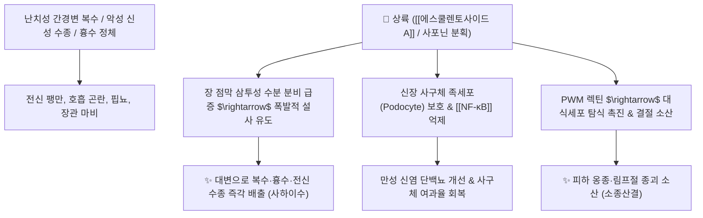

# 🌿 [[상륙]] (商陸, Phytolaccae Radix / 자리공)

> **핵심 요약 (Key Summary)**:
> 자리공과(*Phytolaccaceae*) 자리공(*Phytolacca esculenta*) 또는 미국자리공의 뿌리
> 트리테르펜 사포닌인 [[에스쿨렌토사이드 A]](Esculentoside A)와 [[피토라카사이드]](Phytolaccoside)가 장 점막 분비를 극대화하고 사구체 족세포 염증을 차단하여 강력한 준하축수(峻下逐水) 및 소종산결 작용 발휘
> 악성 복수(간경변)·흉수·신성 전신 수종(부종) 및 림프절 결절·창양 종독을 치료하는 맹렬한 [[사하이수]](瀉下利水)·[[소종산결]](消腫散結) 공하(攻下) 약재

---
## 📌 목차
1. [기본 본초 정보 & 화학 구조 (Pharmacognosy)](#1-기본-본초-정보--화학-구조-pharmacognosy)
2. [핵심 분자약리 기전 & 에스쿨렌토사이드·준하축수 네트워크](#2-핵심-분자약리-기전--에스쿨렌토사이드준하축수-네트워크)
3. [해부생체역학 / 장관 수분 삼출 & 사구체 족세포 연계](#3-해부생체역학--장관-수분-삼출--사구체-족세포-연계)
4. [사상의학 및 임상 응용 (적응증 vs 독성 식초 법제)](#4-사상의학-및-임상-응용-적응증-vs-독성-식초-법제)
5. [고전 의학 및 배오 원리](#5-고전-의학-및-배오-원리)
6. [핵심 처방 비교 매트릭스](#6-핵심-처방-비교-매트릭스)
7. [출처 및 학술 참고 문헌 (References)](#7-출처-및-학술-참고-문헌-references)

---
## 1. 기본 본초 정보 & 화학 구조 (Pharmacognosy)

> [!abstract]+ 🧪 3D 약리 분자 구조 (Interactive 3D Viewer)
> <iframe src="https://molecule-viewer-rho.vercel.app/?cid=21594228" style="width: 100%; height: 600px; border: none; border-radius: 12px; box-shadow: 0 4px 20px rgba(0,0,0,0.15);" allowfullscreen></iframe>


| 항목 | 상세 내용 |
| :--- | :--- |
| **기원 식물** | 자리공과(Phytolaccaceae) 자리공 *Phytolacca esculenta* Houtt. 또는 미국자리공 *Phytolacca americana* L.의 뿌리 |
| **성미 (性味)** | 苦, 寒, 有毒 (유독) |
| **귀경 (歸經)** | 肺·脾·腎·大腸經 (폐경, 비경, 신경, 대장경) |
| **효능 (Actions)** | [[사하이수]](瀉下利水), [[소종산결]](消腫散結), [[준하축수]](峻下逐水), [[통리이변]](通利二便) |
| **주요 성분** | • **올레아난계 트리테르펜 사포닌**: [[에스쿨렌토사이드 A]] (Esculentoside A-H), [[피토라카사이드]] (Phytolaccoside A-G), Phytolaccagenin<br>• **독성 알칼로이드 및 렉틴**: 피토라카톡신, 포크위드 미토겐(Pokeweed mitogen, PWM)<br>• **유기산 및 피그먼트**: 감마-아미노낙산(GABA), 베타닌 |

> **[유래 및 본초학적 기전]**:
> * 약효가 너무나 신속하여 상인이 상륙을 먹고 육지에 오르자마자(上陸) 곧바로 대소변을 쏟아냈다는 전설에서 유래했습니다.
> * 몸속에 차오른 악성 물(흉수, 복수, 수종)을 대변과 소변 양방향으로 쏟아내어 몰아내는 준하축수(峻下逐水)의 구급 약재입니다.
> * 외용 시 단단한 림프절 결절, 유선염, 악성 종기를 삭입니다.

### 🔬 상륙의 주요 지표물질 화학 구조
```
     [ 올레아난계 사포게닌 골격 ]───O──[ Glc - Xyl 당사슬 ]
                    │
           (C-28 위치에 COOH)
                    │
         에스쿨렌토사이드 A (Esculentoside A)
```
> **[구조적 특징 및 활성]**: [[에스쿨렌토사이드 A]]는 장관 점막의 삼투성 수분 분비를 급격히 촉진하는 동시에, 신장 사구체의 염증성 손상을 억제하는 이중 약리 작용을 지닙니다.

---
## 2. 핵심 분자약리 기전 & 에스쿨렌토사이드·준하축수 네트워크



### (1) 준하축수 및 이뇨 배출
* **대소변을 통한 악성 체액 배출 ([[사하이수]] 瀉下利水)**:
  * 장관 연동운동을 폭발적으로 촉진하고 장관 내 수분 분비를 유도하여 일반 이뇨제로 빠지지 않는 간경변 복수와 신부전성 중증 부종을 신속히 배출합니다.
* **만성 사구체신염 억제 ([[에스쿨렌토사이드 A]])**:
  * 사구체 상피 족세포의 손상을 막고 염증성 단백뇨를 유의하게 감소시킵니다.
* **외용 소종산결(消腫散結)**:
  * 외용 첩부 시 국소 염증성 결절과 옹종을 삭여 부종을 가라앉힙니다.

---
## 3. 해부생체역학 / 장관 수분 삼출 & 사구체 족세포 연계

* **복막 및 늑막 삼출액 급속 감압**:
  * 복강 및 흉강 내압을 낮추어 횡격막 압박으로 인한 호흡곤란을 즉시 완화합니다.

---
## 4. 사상의학 및 임상 응용 (적응증 vs 독성 식초 법제)

```
[✅ 최적 적응증 (Sweet Spot)]
• 난치성 복수 및 흉수: 간경화 말기 복수, 늑막염으로 가슴과 배에 물이 차서 숨이 턱까지 차오른 응급 상태
• 중증 신성 수종: 온몸이 부어 누르면 쑥 들어가서 나오지 않고 소변이 한 방울도 안 나오는 경우
• 외용: 유선염, 경부 림프절염(나력), 악성 종기

[⚠️ 독성 관리 및 식초 법제 수칙 (Safety / Toxicity)]
• 맹독성 본초: 생용 시 구토, 설사, 중추신경 마비, 심장마비를 유발하므로 반드시 식초로 볶은 초상륙(醋商陸) 사용 (독성 완화)
• 정기 쇠약자, 임산부 절대 금기 (즉각적인 유산 유발)
• 중병에 정기가 남아 있는 실증(實證) 환자에게만 단기간 구급 투여
```

---
## 5. 고전 의학 및 배오 원리

### (1) 고전 본초학적 배오
* **핵심 배오**:
  * [[상륙]] + [[복령피]] + [[대복피]] + [[생강피]] $\rightarrow$ 전신의 수기를 통리하는 축수 명방 ([[상륙탕]])
  * [[상륙]] + [[마늘]] $\rightarrow$ 찧어서 배꼽에 붙여 소변을 통하게 하는 외용 요법

---
## 6. 핵심 처방 비교 매트릭스

| 처방명 | 구성 약재 | 주치 병증 및 임상 타깃 | 특징 및 감별점 |
| :--- | :--- | :--- | :--- |
| [[상륙탕]] | [[상륙]], [[적소두]], [[복령피]], [[생강피]], [[대복피]] | **수종창만, 이변불통, 복수, 전신 극심한 부종** | 대소변으로 수기를 쏟아내는 준하제 |
| [[소천황원]] | [[상륙]], [[흑축]](견우자), [[대황]], [[감수]] | **간경변 악성 복수, 징가적취, 대소변 불통** | 강력한 공하축수 처방 |
| [[상륙산]](외용) | [[상륙]](식초 혼화 외용 도포) | 악성 옹저 창양, 유선염, 림프절 결핵 | 독을 뽑아내고 결절을 삭임 |

---
## 7. 출처 및 학술 참고 문헌 (References)

2. **대한민국약전(KP) 제12개정 (2022)**. 의약품각조 제2부: 상륙 (Phytolaccae Radix) 규격 기준.
   - **[공정서 규격]**: 자리공 근경의 성상, 순도시험(이물, 중금속, 비소) 및 회분 10.0% 이하 기준 명시.
