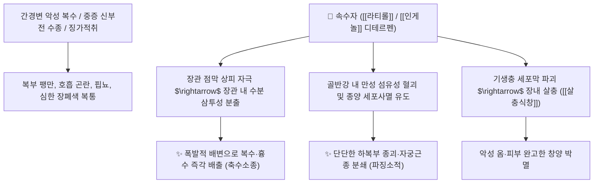

# 🌿 [[속수자]] (續隨子 / 千金子, Euphorbiae Semen)

> **핵심 요약 (Key Summary)**:
> 대극과(*Euphorbiaceae*) 속수자(*Euphorbia lathyris*)의 성숙한 씨앗(종자)
> 디테르페노이드인 [[라티롤]] 유도체(Euphorbia factors)가 장관 점막을 자극하여 폭발적인 수양성 배변을 유도하고 종양 세포 분열을 억제하여 맹렬한 축수소종 및 파징 작용 발휘
> 난치성 악성 복수·흉수·전신 부종(수종창만) 및 아랫배 단단한 종괴(징가적취)·무월경을 치료하는 준하축수(峻下逐水)의 구급 독성 본초이자 대표적인 [[축수소종]](逐水消腫)·[[파징소적]](破癥消積) 약재

---
## 📌 목차
1. [기본 본초 정보 & 화학 구조 (Pharmacognosy)](#1-기본-본초-정보--화학-구조-pharmacognosy)
2. [핵심 분자약리 기전 & 디테르펜 준하·축수 네트워크](#2-핵심-분자약리-기전--디테르펜-준하축수-네트워크)
3. [해부생체역학 / 장관 수분 분비 & 복강 삼출액 감압 연계](#3-해부생체역학--장관-수분-분비--복강-삼출액-감압-연계)
4. [사상의학 및 임상 응용 (적응증 vs 천금자상 탈지 법제)](#4-사상의학-및-임상-응용-적응증-vs-천금자상-탈지-법제)
5. [고전 의학 및 배오 원리](#5-고전-의학-및-배오-원리)
6. [핵심 처방 비교 매트릭스](#6-핵심-처방-비교-매트릭스)
7. [출처 및 학술 참고 문헌 (References)](#7-출처-및-학술-참고-문헌-references)

---
## 1. 기본 본초 정보 & 화학 구조 (Pharmacognosy)

> [!abstract]+ 🧪 3D 약리 분자 구조 (Interactive 3D Viewer)
> <iframe src="https://molecule-viewer-rho.vercel.app/?cid=5281376" style="width: 100%; height: 600px; border: none; border-radius: 12px; box-shadow: 0 4px 20px rgba(0,0,0,0.15);" allowfullscreen></iframe>


| 항목 | 상세 내용 |
| :--- | :--- |
| **기원 식물** | 대극과(Euphorbiaceae) 속수자 *Euphorbia lathyris* L.의 잘 익은 씨앗 (천금자 千金子) |
| **성미 (性味)** | 辛, 溫, 有毒 (유독) |
| **귀경 (歸經)** | 腎·大腸經 (신경, 대장경) - **장관과 신장으로 물을 쏟아냄** |
| **효능 (Actions)** | [[축수소종]](逐水消腫), [[파징소적]](破癥消積), [[해독살충]](解毒殺蟲), [[식창산결]](蝕瘡散結) |
| **주요 성분** | • **디테르페노이드 락톤**: [[에우포르비아 팩터]] (Euphorbia factors $\text{L}_1 \sim \text{L}_{11}$), [[라티롤]] (Lathyrol), 인게놀(Ingenol) 유도체<br>• **쿠마린**: 에스큘레틴, 다프네틴<br>• **지방유(40~50%)**: 올레산, 리놀레산 (맹독성 자극 물질 함유) |

> **[유래 및 본초학적 기전]**:
> * 잎과 줄기가 촘촘하게 연속되어 자란다 하여 '속수자(續隨子)'라 불리며, 효능이 워낙 신속하고 귀하여 '천금자(千金子)'라고도 합니다.
> * "속수무책으로 대소변을 쏟아낸다"는 속설처럼, 몸속에 차오른 악성 복수와 전신 부종을 단숨에 대변으로 쏟아내어 몰아냅니다.
> * 아랫배에 단단하게 뭉쳐 만져지는 어혈 덩어리(징가 癥瘕)를 부수고 기생충과 악성 피부 옴을 박멸합니다.

### 🔬 속수자의 주요 디테르펜 화학 구조
```
     [ 라티란 골격 디테르펜 ]───( C-3/C-15 위치 에스테르화 )  <-- Euphorbia factor L1
```
> **[구조적 특징 및 독성]**: [[라티롤]] 에스테르 화합물은 장관 점막의 $\text{PKC}$ 경로를 폭발적으로 자극하여 수분과 전해질을 장관 내로 대량 누출시키는 강력한 준하(瀉下) 활성을 발휘합니다.

---
## 2. 핵심 분자약리 기전 & 디테르펜 준하·축수 네트워크



### (1) 표적 준하축수 및 파징 작용
* **맹렬한 악성 복수 및 수종 배출 ([[축수소종]] 逐水消腫)**:
  * 일반 이뇨제로 반응하지 않는 난치성 복수와 전신 부종을 대변을 통해 쏟아내어 감압합니다.
* **아랫배 단단한 어혈 종괴 분쇄 ([[파징소적]] 破癥消積)**:
  * 하복부의 섬유화된 혈괴와 징가를 부수어 무월경을 통경시킵니다.
* **외용 살충식창(殺蟲蝕瘡)**:
  * 피부의 악창, 사마귀, 옴벌레를 부식시켜 탈락시킵니다.

---
## 3. 해부생체역학 / 장관 수분 분비 & 복강 삼출액 감압 연계

* **복막강(Peritoneal Cavity) 내압 급속 저하**:
  * 횡격막 상승으로 인한 급성 질식성 호흡곤란을 즉시 해소합니다.

---
## 4. 사상의학 및 임상 응용 (적응증 vs 천금자상 탈지 법제)

```
[✅ 최적 적응증 (Sweet Spot)]
• 난치성 간경변 복수: 배가 남산만하게 부르고 숨이 차서 눕지 못하는 응급 상황
• 하복부 징가적취: 아랫배에 단단한 핏덩어리가 뭉쳐 통증이 극심한 경우
• 완고한 피부 사마귀, 티눈, 옴(외용 도포)

[⚠️ 천금자상(千金子霜) 필수 법제 및 복용 수칙 (Safety / Toxicity)]
• 속수자의 기름(지방유)에 극렬한 독성이 집중되어 있으므로 생용(生用) 절대 금기
• 반드시 종자를 짓찧어 기름을 완전히 짜낸 천금자상(千金子霜, 1회 0.3~0.6g 환산제)으로 복용
• 임산부, 체력 쇠약자, 소아 절대 복용 금기
```

---
## 5. 고전 의학 및 배오 원리

### (1) 악성 복수와 어혈을 부수는 고전 배오
* **핵심 배오**:
  * [[속수자]](천금자상) + [[대황]] $\rightarrow$ 체내의 독수와 대소변을 뚫어냄 ([[천금자상산]])
  * [[속수자]] + [[주사]] + [[침향]] $\rightarrow$ 구급으로 어혈 덩어리를 삭임 ([[백안원]])

---
## 6. 핵심 처방 비교 매트릭스

| 처방명 | 구성 약재 | 주치 병증 및 임상 타깃 | 특징 및 감별점 |
| :--- | :--- | :--- | :--- |
| [[천금자상산]] | [[속수자]](천금자상), [[대황]], [[감초]] | **악성 수종창만, 간경변 복수, 대소변 불통** | 신속하게 복수를 쏟아내는 준하제 |
| [[백안원]] | [[천금자상]], [[주사]], [[침향]] | **부인 징가적취, 하복부 단단한 혈괴, 월경폐색** | 어혈 종괴를 분쇄하는 환약 |
| [[소석환]] | [[소석]], [[천금자상]], [[목향]] | **심복통, 적취 팽만, 소화불량 극심** | 굳은 적취를 삭임 |

---
## 7. 출처 및 학술 참고 문헌 (References)

1. **Bicchi, C., et al. (2009)**. Diterpenoids from *Euphorbia lathyris* seeds and their antiproliferative activity. *Phytochemistry*, 70(11-12), 1404-1411.
   - **[연구 요약]**: 속수자 종자의 디테르페노이드 성분들이 장관 수분 분비 촉진 및 종양 세포사멸 유도 활성을 지님을 규명.
2. **대한민국약전(KP) 제12개정 (2022)**. 의약품각조 제2부: 속수자 (Euphorbiae Semen) 규격 기준.
   - **[공정서 규격]**: 천금자상의 탈지 규격 및 중금속, 비소 안전성 기준 명시.
