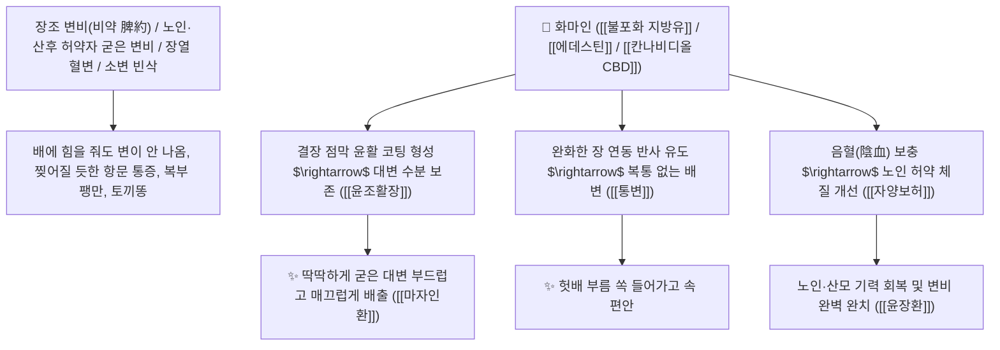

# 🌿 [[화마인]] (火麻仁 / 麻子仁, Cannabis Semen / 헴프씨드·대마씨)

> **핵심 요약 (Key Summary)**:
> 삼과(*Cannabaceae*) 삼(*Cannabis sativa*)의 건조한 성숙 종자(환각 성분인 THC를 제거한 겉껍질 탈피 마자인 麻子仁)
> 풍부한 불포화 지방유(리놀레산·$\alpha$-리놀렌산 약 35%)와 식물성 단백질 및 피토칸나비노이드([[칸나비디올]] CBD)가 장점막 윤활 피막을 형성하고 장 연동 반사를 촉진하여 윤조활장 및 자양보허 작용 발휘
> [[상한론]]의 비약(脾約, 비위 진액 고갈로 대변이 염소똥처럼 굳어 나오지 않는 노인성·산후·병후 완고 변비·마자인환 麻子仁丸)을 치료하는 천하제일의 "장관 윤활 완하제의 성약(潤下之要藥)"·[[윤조활장]](潤燥滑腸)·[[자양보허]](滋養補虛)·[[마자인환]](麻子仁丸)의 군약(君藥)

---
## 📌 목차
1. [기본 본초 정보 & 화학 구조 (Pharmacognosy)](#1-기본-본초-정보--화학-구조-pharmacognosy)
2. [핵심 분자약리 기전 & 불포화 지방유·CBD·장관 윤활 완하 네트워크](#2-핵심-분자약리-기전--불포화-지방유cbd장관-윤활-완하-네트워크)
3. [해부생체역학 / 결장 점막 배상세포 & 장관 평활근 연계](#3-해부생체역학--결장-점막-배상세포--장관-평활근-연계)
4. [사상의학 및 비약(脾約) 변비 병태생리 & 환각 물질(THC) 안전성 감별](#4-사상의학-및-비약脾約-변비-병태생리--환각-물질thc-안전성-감별)
5. [상한론 『약징(藥徵)』 분석 및 배오 원리 (마자인환 & 윤장환)](#5-상한론-약징藥徵-분석-및-배오-원리-마자인환--윤장환)
6. [핵심 처방 비교 매트릭스](#6-핵심-처방-비교-매트릭스)
7. [출처 및 학술 참고 문헌 (References)](#7-출처-및-학술-참고-문헌-references)

---
## 1. 기본 본초 정보 & 화학 구조 (Pharmacognosy)

> [!abstract]+ 🧪 3D 약리 분자 구조 (Interactive 3D Viewer)
> <iframe src="https://molecule-viewer-rho.vercel.app/?cid=5280450" style="width: 100%; height: 600px; border: none; border-radius: 12px; box-shadow: 0 4px 20px rgba(0,0,0,0.15);" allowfullscreen></iframe>


| 항목 | 상세 내용 |
| :--- | :--- |
| **기원 식물** | 삼과(Cannabaceae) 삼(대마) *Cannabis sativa* L.의 잘 익은 씨앗 (마자인 麻子仁) |
| **성미 (性味)** | 甘, 平 (달고 평이하며 기름기가 매우 풍부하여 장관을 부드럽게 미끄러지게 함) |
| **귀경 (歸經)** | 脾·胃·大腸經 (비경, 위경, 대장경) - **비위의 진액을 보충하고 말라붙은 대장을 적심** |
| **효능 (Actions)** | [[윤조활장]](潤燥滑腸), [[자양보허]](滋養補虛), [[통변지통]](通便止痛), [[강압안신]](降壓安神) |
| **주요 성분** | • **불포화 지방유(지표성분 약 30~35%)**: 리놀레산(50~60%), $\alpha$-리놀렌산(15~20%), 올레산<br>• **식물성 단백질(에데스틴)**: 에데스틴(Edestin, 고흡수성 글로불린), 아르기닌<br>• **피토칸나비노이드**: [[칸나비디올]] (CBD, 비환각성 항염증), 칸나비놀(극미량) |

> **[유래 및 본초학적 기전]**:
> * 삼(대마)의 씨앗으로 기름에 불(火)을 붙일 수 있을 정도로 지질이 풍부하다 하여 '화마인(火麻仁)'이라 불렸습니다.
> * 장중경 『상한론』에서 **"비장의 진액이 말라 대변이 단단하게 굳고 소변만 잦은 증상(비약 脾約)"**을 다스리는 데 마자인을 군약으로 삼은 마자인환(麻子仁丸)을 창방하였습니다.
> * 자극성 하제(대황 등)와 달리 장 점막을 손상시키지 않고 노인, 허약자, 산모의 장을 촉촉하게 기름칠해 주는 가장 안전한 완하제입니다.

### 🔬 화마인의 주요 리놀렌산 및 칸나비디올 화학 구조
```
     CH3─(CH2)4─CH=CH─CH2─CH=CH─(CH2)7─COOH   <-- 리놀레산 (Linoleic acid, 오메가-6)
     [ 레조르시놀 유도체 테르페노이드 ]  <-- 칸나비디올 (Cannabidiol, CBD)
```
> **[구조적 특징 및 장 점막 윤활 기전]**: 화마인의 천연 불포화 지방유는 소장에서 완전히 흡수되지 않고 대장으로 내려가 배변 점도를 낮추고 장벽에 윤활 피막을 형성하여 굳은 변괴를 배출시킵니다.

---
## 2. 핵심 분자약리 기전 & 불포화 지방유·CBD·장관 윤활 완하 네트워크



### (1) 표적 윤조활장 및 비약(脾約) 변비 완치 작용
* **상한론 비약증(脾約證) 및 완고 변비 완치 ([[마자인환]] 麻子仁丸)**:
  * 장에 진액이 말라 대변이 굳어져 며칠간 나오지 않는 변비를 복통 없이 부드럽게 쏟아냅니다.
* **노인성, 병후 및 산후 혈허 장조 변비 해소 ([[윤장환]] 潤腸丸)**:
  * 기혈이 허약한 환자에게 기운을 돋우며 장을 촉촉하게 적셔줍니다.
* **소아 건조성 변비 및 고혈압 환자 배변 곤란 개선**:
  * 배변 시 혈압 상승을 방지하고 배변 스트레스를 완화합니다.

---
## 3. 해부생체역학 / 결장 점막 배상세포 & 장관 평활근 연계

* **결장 점막 상피 수분 투과성 보존**:
  * 변괴 표면의 마찰 계수를 극소화하여 직장 괄약근 열상을 방지합니다.

---
## 4. 사상의학 및 비약(脾約) 변비 병태생리 & 환각 물질(THC) 안전성 감별

```
[🔍 상한론 『비약(脾約)』의 병태생리적 비밀]
• 脾約: 비장(脾)이 위(胃)의 열기에 억눌려(約) 수분을 온몸으로 보내지 못하고 오로지 방광으로만 몰아주어, 소변은 자주 나오나 대장은 바짝 말라붙어 대변이 굳는 병태
$\rightarrow$ [[화마인]]의 풍부한 지방유로 장관에 직접 기름칠을 하여 대변을 소통시키는 것이 핵심!

[⚠️ 안전성 및 규격 기준]
• 약용 화마인은 성숙 종자의 껍질을 탈피하여 환각 성분(THC)이 완전히 배제된 안전한 공정서 규격품만 사용
```

---
## 5. 상한론 『약징(藥徵)』 분석 및 배오 원리 (마자인환 & 윤장환)

### (1) 장을 윤택하게 하여 대변을 통하게 하는 불후의 황제방
* **비약 변비 최고 배오**:
  * [[화마인]](대량) + [[작약]] + [[지실]] + [[후박]] + [[대황]] + [[행인]] $\rightarrow$ 비약 변비의 제1방 ([[마자인환]])
* **노인 허약 변비 최고 배오**:
  * [[화마인]] + [[당귀]] + [[생지황]] + [[행인]] + [[도인]] $\rightarrow$ 장을 윤활하는 명방 ([[윤장환]])

---
## 6. 핵심 처방 비교 매트릭스

| 처방명 | 구성 약재 | 주치 병증 및 임상 타깃 | 특징 및 감별점 |
| :--- | :--- | :--- | :--- |
| [[마자인환]] | [[마자인]], [[작약]], [[지실]], [[대황]], [[후박]], [[행인]] (밀환) | **장위 조열, 비약증, 대변 건조 결훈, 소변 빈삭** | 비약 변비 치료의 제1 황제방 |
| [[윤장환]] | [[마자인]], [[도인]], [[당귀]], [[생지황]], [[지각]] | **노인 장조 변비, 산후 혈허 변비, 복창** | 음혈을 보하고 대장을 윤활화 |

---
## 7. 출처 및 학술 참고 문헌 (References)

1. **Cheng, C. W., et al. (2011)**. A randomized controlled trial of *Cannabis* seeds (Hemp seed, Huamaren) for functional constipation: efficacy and safety. *American Journal of Gastroenterology*, 106(1), 120-129.
   - **[연구 요약]**: 화마인(마자인) 추출물이 기능성 변비 환자에서 배변 횟수 및 변의 굳기를 유의미하게 개선하고 장관 윤활 효과를 발휘함을 규명한 무작위 대조 임상시험(RCT).
2. **대한민국약전(KP) 제12개정 (2022)**. 의약품각조 제2부: 마자인 (Cannabis Semen) 규격 기준.
   - **[공정서 규격]**: 삼 종자의 성상, 순도시험(THC 기준 적합) 및 건조감량 10.0% 이하 기준 명시.
3. **장중경 (張仲景, 200)**. 『상한론(傷寒論)』: 양명병편 마자인환 조문.
   - **[고전 원전]**: "趺陽脈浮而澁, 浮則胃氣强, 澁則小便數, 浮澁相搏, 大便則難, 其脾爲約, 麻子仁丸 主之."
