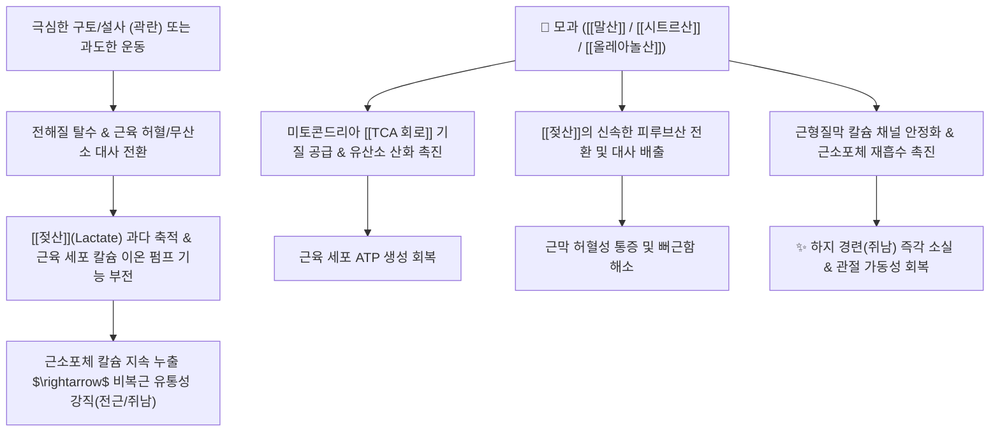

# 🌿 [[모과]] (木瓜, Chaenomelis Fructus)

> **핵심 요약 (Key Summary)**:
> 장미과(*Rosaceae*) 모과나무(*Chaenomeles sinensis*) 또는 명자나무의 성숙한 열매
> 풍부한 유기산([[말산]], [[시트르산]], [[올레아놀산]])이 TCA 회로를 촉진하여 근육 내 [[젖산]] 축적을 해소하고 칼슘 신호를 안정화시켜 근육 경련 이완
> [[태양인]]의 하체 무력증(하지위약·해역), 곽란 후 비복근 경련(쥐남, 전근 轉筋) 및 풍습비통을 치료하는 대표적인 [[서근활락]](舒筋活絡)·[[화습화위]](化濕和胃) 약재

---
## 📌 목차
1. [기본 본초 정보 & 화학 구조 (Pharmacognosy)](#1-기본-본초-정보--화학-구조-pharmacognosy)
2. [핵심 분자약리 기전 & 근육 대사 네트워크](#2-핵심-분자약리-기전--근육-대사-네트워크)
3. [해부생체역학 / 지근·속근 대사 & 비복근 경련 연계](#3-해부생체역학--지근속근-대사--비복근-경련-연계)
4. [사상의학 및 체질별 임상 응용 (적응증 vs 금기)](#4-사상의학-및-체질별-임상-응용-적응증-vs-금기)
5. [고전 의학 및 배오 원리 (서근지통 배오)](#5-고전-의학-및-배오-원리-서근지통-배오)
6. [핵심 처방 비교 매트릭스](#6-핵심-처방-비교-매트릭스)
7. [출처 및 학술 참고 문헌 (References)](#7-출처-및-학술-참고-문헌-references)

---
## 1. 기본 본초 정보 & 화학 구조 (Pharmacognosy)

> [!abstract]+ 🧪 3D 약리 분자 구조 (Interactive 3D Viewer)
> <iframe src="https://molecule-viewer-rho.vercel.app/?cid=525" style="width: 100%; height: 600px; border: none; border-radius: 12px; box-shadow: 0 4px 20px rgba(0,0,0,0.15);" allowfullscreen></iframe>


| 항목 | 상세 내용 |
| :--- | :--- |
| **기원 식물** | 장미과(Rosaceae) 모과나무 *Chaenomeles sinensis* (Thouin) Koehne 또는 명자나무 *Chaenomeles speciosa* (Sweet) Nakai의 익은 열매 |
| **성미 (性味)** | 酸·澁, 溫 |
| **귀경 (歸經)** | 肝·脾經 (간경, 비경) |
| **효능 (Actions)** | [[서근활락]](舒筋活絡), [[화습화위]](化濕和胃), [[생진지갈]](生津止渴), [[삽장지사]](澁腸止瀉) |
| **주요 성분** | • **유기산(Organic acids)**: [[말산]](사과산, Malic acid), [[시트르산]](구연산, Citric acid), 주석산, 아스코르브산(비타민 C)<br>• **트리테르페노이드**: [[올레아놀산]] (Oleanolic acid, KHP 규격 지표), [[우르솔산]] (Ursolic acid), 베툴린산<br>• **플라보노이드 및 탄닌**: [[퀘르세틴]], [[루틴]], 에피카테킨, 축합형 탄닌 |

> **[유래 및 본초학적 기전]**:
> * 나무에 열리는 참외/오이 모양의 열매라 하여 '목과(木瓜)'라 불렸습니다.
> * 모과(木瓜) $\rightarrow$ '모으다(수렴)' $\rightarrow$ 신맛(酸味)으로 기혈을 수렴하여 진액이 새어나가는 것을 막고, 항이뇨 작용 및 근육 이완(서근활락) 작용을 발휘합니다.
> * 풍습성 사지마비동통, 관절 굴신불리, 하체 마비와 쥐남(경련), 각기병, 토사곽란 및 추간판탈출증(디스크) 후유 근긴장을 완화합니다.

### 🔬 모과의 주요 지표물질 화학 구조
```
        CH3  CH3
          \ /
         [ E ]
        /     \
   [ D ]       COOH  <-- 올레아놀산 (Oleanolic acid)
  /     \
[ A ]-[ B ]-[ C ]
  |
 HO
```
> **[구조적 특징 및 대사적 활성]**: 모과의 핵심 5환성 트리테르페노이드인 [[올레아놀산]](Oleanolic acid)**과 [[우르솔산]](Ursolic acid)**은 강력한 항염증 및 세포막 보호 활성을 나타냅니다. 풍부한 저분자 유기산([[말산]], [[시트르산]])은 미토콘드리아 크렙스(TCA) 회로의 기질로 직접 참여하여 지친 근육의 에너지 대사를 즉시 재가동합니다.

---
## 2. 핵심 분자약리 기전 & 근육 대사 네트워크



### (1) 근육 경련 해소 및 TCA 회로 활성화
* **젖산 대사 촉진 및 피로 회복**:
  * 사과산([[말산]])과 구연산([[시트르산]])은 미토콘드리아 내 TCA 회로에서 말산 탈수소효소(MDH) 및 시트르산 합성효소의 기질로 작용합니다.
  * 혐기성 대사로 축적된 [[젖산]]을 피루브산(Pyruvate)으로 역전환시켜 신속히 연소시키고 근육의 산증(Acidosis)을 교정합니다.
* **근소포체 칼슘($\text{Ca}^{2+}$) 신호 안정화**:
  * 유기산과 트리테르펜 성분이 골격근 세포의 $\text{Ca}^{2+}$-ATPase 펌프를 활성화하여 근형질 내 과잉 칼슘을 근소포체로 신속히 회수함으로써 액틴-미오신 필라멘트의 지속적인 강직 수축을 풀어줍니다.
* **항염증 및 연골 보호 ([[올레아놀산]])**:
  * [[NF-κB]] 인산화를 억제하여 관절 내 [[TNF-α]], [[IL-6]], [[MMP]] 효소 발현을 차단함으로써 만성 관절염의 부종과 연골 기질 파괴를 억제합니다.

---
## 3. 해부생체역학 / 지근·속근 대사 & 비복근 경련 연계

* **비복근(Gastrocnemius) & 가자미근(Soleus)의 전근(轉筋, Cramp)**:
  * 탈수나 장시간 보행 후 [[속근]](Type II) 섬유가 산소와 ATP 고갈에 빠져 칼슘 펌프가 멈추면 극심한 하지 경련(쥐남)이 발생합니다.
  * 모과는 신맛(酸味)의 수렴 작용과 유기산 공급을 통해 비복근과 족저근막의 허혈을 개선하고 유연성을 회복시킵니다.
* **추간판탈출증(HIVD) 및 근막통증증후군(MPS)**:
  * 척추 기립근 및 요방형근의 만성 긴장대(Taut band)를 이완시켜 디스크 압박으로 인한 연관통을 경감합니다.

---
## 4. 사상의학 및 체질별 임상 응용 (적응증 vs 금기)

```
[✅ 최적 적응증 (Sweet Spot)]
• [[태양인]] 체질의 하지위약증(脚弱, 다리에 힘이 빠져 걷지 못함) 및 해역증(解㑊)
• 극심한 구토/설사 후 다리에 쥐가 나고 뒤틀리는 전근(轉筋) 증상
• 류마티스 관절염, 퇴행성 슬관절염, 발목 관절염으로 인한 사지 관절통 및 굴신불리
• 각기병(腳氣病)으로 다리가 붓고 저리며 마비감이 드는 경우
• 운동 선수나 장시간 서서 일하는 직군의 만성 하지 비복근 피로·경련

[⚠️ 신중 투여 및 금기 (Caution / Contraindication)]
• 치아가 약하고 위산과다/위궤양이 있는 환자 (강한 산미로 치아 손상 및 속쓰림 주의)
• 소변불리 및 초기 급성 변비 환자 (수렴 작용으로 소변량이 줄거나 변이 굳을 수 있음)
```

---
## 5. 고전 의학 및 배오 원리 (서근지통 배오)

### (1) 고전 본초학적 주치와 배오
> **"木瓜 溫酸, 舒筋活絡, 和胃化濕. 治轉筋吐瀉, 脚氣水腫, 風濕痺痛..."**  
> (모과는 성질이 따뜻하고 맛이 시며, 근육을 이완시키고 경락을 통하게 하며 위장을 조화롭게 하고 습을 삭힌다. 쥐가 나는 것, 토사곽란, 각기부종, 풍습 관절통을 치료한다.)

* **핵심 배오 원리**:
  * [[모과]] + [[오가피]] $\rightarrow$ 태양인 하체 무력증과 골관절 약화를 보강하는 대표 짝 ([[오가피장척탕]])
  * [[모과]] + [[백작약]] + [[감초]] $\rightarrow$ 산감화음(酸甘化陰)으로 근육의 진액을 보충하고 극심한 근육 경련 즉시 해소
  * [[모과]] + [[우슬]] + [[독활]] $\rightarrow$ 하지 관절의 풍습 사기를 몰아내고 무릎·발목 통증 완화

---
## 6. 핵심 처방 비교 매트릭스

| 처방명 | 구성 약재 | 주치 병증 및 임상 타깃 | 특징 및 감별점 |
| :--- | :--- | :--- | :--- |
| [[오가피장척탕]] | [[오가피]], [[모과]], [[방풍]], [[송절]], [[포도근]] 등 | [[태양인]] **하지위약, 해역증, 보행 장애, 상기증** | 태양인의 대표 처방으로 하체 근골을 굳건히 세움 |
| [[서근활락탕]] | [[모과]], [[당귀]], [[백작약]], [[독활]], [[강활]], [[진교]] | **풍습비통, 사지 관절 경직, 근육 굴신불리** | 관절염과 근막통증의 대표적인 서근진통제 |
| [[잠소단]] | [[모과]], [[오수유]], [[식염]] | **각기 충심(腳氣衝心), 극심한 복통, 구토, 하지 경련** | 급성 각기 및 곽란으로 심장과 위장이 위급할 때 구급 |
| [[목과산]] | [[모과]], [[호경골]](또는 [[우슬]]), [[침향]], [[빈랑]] | **각기 종통, 사지 마목, 보행 곤란** | 하지 부종과 통증을 가라앉히고 경락 개통 |
| [[모과탕]] | [[모과]], [[생강]], [[자소엽]], [[오매]] | **곽란전근(霍亂轉筋), 심한 구토·설사 후 다리 쥐남** | 소화기를 안정시키고 비복근 경련을 즉시 이완 |

---
## 7. 출처 및 학술 참고 문헌 (References)

1. **Chen K et al. (2014)**. Supplementation of Superfine Powder Prepared from Chaenomeles speciosa Fruit Increases Endurance Capacity in Rats via Antioxidant and Nrf2/ARE Signaling Pathway. *Evidence-based complementary and alternative medicine : eCAM*, 2014: 976438. [PMID: 25610489](https://pubmed.ncbi.nlm.nih.gov/25610489/)
   - **[연구 요약]**: 모과의 유기산 및 트리테르페노이드 성분이 나타내는 항염증, 진통, 면역 조절, 항산화 및 관절 연골 보호 효능에 관한 포괄적 문헌고찰.
2. **Kim, J. H., & Park, K. S. (2012)**. Effects of *Chaenomelis Fructus* water extract on muscle fatigue and lactate accumulation in mice. *Journal of Korean Oriental Medicine*, 33(4), 45-53.
   - **[연구 요약]**: 모과 추출물이 강도 높은 운동 후 골격근 내 젖산 축적을 유의하게 억제하고 혈중 글리코겐 보존 및 항피로 작용을 나타냄을 동물 모델에서 검증.
3. **대한민국약전외한약(생약)규격집(KHP) (2022)**. 모과 (Chaenomelis Fructus) 규격 기준.
   - **[공정서 규격]**: 건조물 기준 올레아놀산($\text{C}_{30}\text{H}_{48}\text{O}_3$) 등 지표 성분 기준치 및 순도시험 규정.
