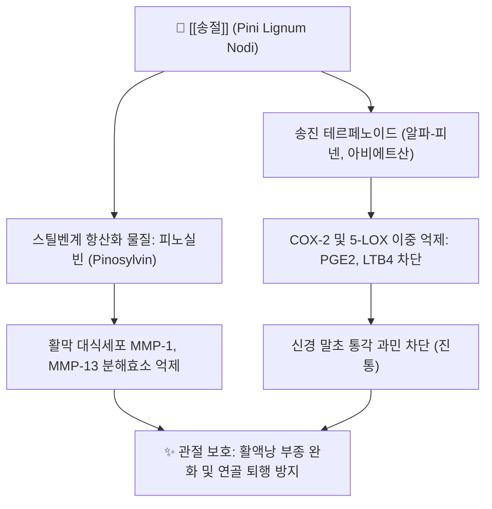

# 🌲 [[송절]] (松節, Pini Lignum Nodi)

> **핵심 요약 (Key Summary)**:
> 소나무과 소나무 및 곰솔의 목질화된 가지마디(옹이)를 건조한 본초로 거풍조습의 대표 관절약
> 피노실빈, 알파-피넨, 송진 산성 수지 성분으로 활막 염증 억제 및 말초 신경통 완화
> 풍한습비로 인한 무릎·허리 관절통, 근육 연축, 마비 증상 및 오가피장척탕의 핵심 배오 본초

---

> [!abstract]+ 🧪 3D 약리 분자 구조 (Interactive 3D Viewer)
> <iframe src="https://molecule-viewer-rho.vercel.app/?cid=6654" style="width: 100%; height: 600px; border: none; border-radius: 12px; box-shadow: 0 4px 20px rgba(0,0,0,0.15);" allowfullscreen></iframe>

## 📌 목차
1. [기본 정보 & 기원](#1-기본-정보--기원)
2. [본초학적 특성 & 귀경](#2-본초학적-특성--귀경)
3. [분자약리 기전 & 현대 효능](#3-분자약리-기전--현대-효능)
4. [대표 배오 처방](#4-대표-배오-처방)
5. [복용법, 안전성 및 주의사항](#5-복용법-안전성-및-주의사항)
6. [출처 및 학술 참고 문헌 (References)](#6-출처-및-학술-참고-문헌-references)

---
## 1. 기본 정보 & 기원

| 항목 | 상세 내용 |
| :--- | :--- |
| **본초명** | [[송절]] (松節, Pine Node) |
| **이명** | 송류(松瘤), 황송절(黃松節), 소나무마디 |
| **기원 식물** | 소나무과(Pinaceae) 소나무(*Pinus densiflora* Siebold & Zucc.) 또는 곰솔(*Pinus thunbergii*)의 가지마디 |
| **약용 부위** | 송진이 많이 밴 줄기와 가지의 매듭(마디) 부위 목부 |
| **분류** | 거풍습약(祛風濕藥) / 거풍습지통약(祛風濕止痛藥) |

---
## 2. 본초학적 특성 & 귀경

| 항목 | 상세 내용 |
| :--- | :--- |
| **성미 (性味)** | 고(苦)·신(辛), 온(溫), 무독(無毒) |
| **귀경 (歸經)** | 간경(肝經), 신경(腎經) |
| **효능 (Actions)** | 거풍조습(祛風燥濕), 통락지통(通絡止痛), 산한소종(散寒消腫) |
| **주치 (Indications)** | 풍한습비(風寒濕痺), 역절풍(歷節風, 통풍·관절염), 관절 굴신불리, 근맥연축, 타박어통 |

---
## 3. 분자약리 기전 & 현대 효능

### (1) 강력한 소염진통 및 관절 활막염 억제
* 송절의 정유 및 수지산 성분은 염증 효소인 COX-2 발현을 차단하여 관절 활액낭의 염증성 부종을 완화하고 관절 통증을 줄임.

### (2) 연골 세포 보호 및 MMP 효소 억제
* 피노실빈을 비롯한 페놀성 성분이 연골 기질을 분해하는 MMP-1 및 MMP-13 활성을 억제하여 퇴행성 관절염 모델에서 관절 연골 소실을 방어함.

---
## 4. 대표 배오 처방

| 처방명 | 배오 목적 및 주치 | 배오 특징 |
| :--- | :--- | :--- |
| [[오가피장척탕]] | 이제마 사상의학 태양인 요척통, 하지 무력 및 보행 장애(해역증) | [[오가피]], [[송절]], [[모과]]와 배오하여 근골 강화 |
| [[송절산]] | 풍습으로 인해 온몸 관절이 쑤시고 굴신이 어려운 관절통 | 송절을 가루 내어 술에 타서 복용 |
| [[서근활락환]] | 만성 관절염으로 근육이 굳고 쥐가 나는 증상 치료 | [[모과]], [[우슬]], [[당귀]]와 배오 |

---
## 5. 복용법, 안전성 및 주의사항

* **음허혈조(陰虛血燥) 주의**: 성질이 따뜻하고 조습(燥濕)하여 진액을 말릴 수 있으므로, 열이 많거나 혈이 부족하여 마른 환자는 단독 투여를 피하고 보음약과 함께 처방함.
* **탕전법**: 송진 수지 성분이 많으므로 얇게 깎아 잘게 썰어서 오래 달여 유효 성분을 충분히 추출함.

---
## 6. 출처 및 학술 참고 문헌 (References)

* 전국한의과대학 본초학교수 공편저, 《본초학》, 영림사
* 이제마, 《동의수세보원(東醫壽世保元)》
* Park JY et al. Anti-inflammatory and chondroprotective effects of Pinus densiflora node extract in arthritic models. BMC Complement Med Ther. 2018.
  * [연구 요약] 소나무 송절 추출물이 염증성 사이토카인을 억제하고 관절 연골 파괴를 방어함을 실험적으로 규명함.
