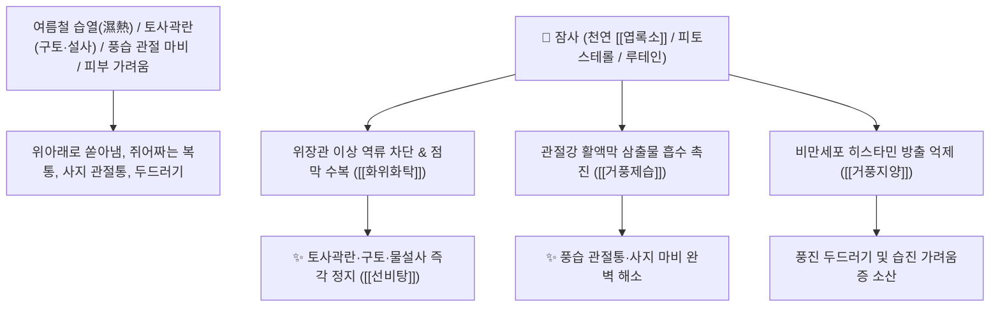

# 🌿 [[잠사]] (蠶砂 / 原蠶砂, Bombycis Faeces / 누에똥)

> **핵심 요약 (Key Summary)**:
> 누에과(*Bombycidae*) 누에(*Bombyx mori*) 유충의 건조한 분변(배설물)
> 천연 식물성 [[엽록소]](Chlorophyll)와 피토스테롤 및 유기산 복합체가 관절 활액막 염증을 가라앉히고 위장관 연축을 안정시켜 거풍제습 및 화위화탁 작용 발휘
> 풍습비통(風濕痺痛, 류마티스 관절염·사지 마비·근육 경련) 및 여름철 습열 곽란(토사곽란·구토·설사·복통)·풍진 피부 가려움증을 치료하는 대표적인 [[거풍제습]](祛風除濕)·[[화위화탁]](和胃化濁)·[[선비탕]](宣痺湯)의 군약(君藥)

---
## 📌 목차
1. [기본 본초 정보 & 화학 구조 (Pharmacognosy)](#1-기본-본초-정보--화학-구조-pharmacognosy)
2. [핵심 분자약리 기전 & 엽록소·화위화습·관절통락 네트워크](#2-핵심-분자약리-기전--엽록소화위화습관절통락-네트워크)
3. [해부생체역학 / 위장관 신경총 & 사지 말초 감각신경 연계](#3-해부생체역학--위장관-신경총--사지-말초-감각신경-연계)
4. [사상의학 및 임상 응용 (토사곽란 vs 관절 비통 특화)](#4-사상의학-및-임상-응용-토사곽란-vs-관절-비통-특화)
5. [고전 의학 및 배오 원리 (선비탕 배오)](#5-고전-의학-및-배오-원리-선비탕-배오)
6. [핵심 처방 비교 매트릭스](#6-핵심-처방-비교-매트릭스)
7. [출처 및 학술 참고 문헌 (References)](#7-출처-및-학술-참고-문헌-references)

---
## 1. 기본 본초 정보 & 화학 구조 (Pharmacognosy)

> [!abstract]+ 🧪 3D 약리 분자 구조 (Interactive 3D Viewer)
> <iframe src="https://molecule-viewer-rho.vercel.app/?cid=12085802" style="width: 100%; height: 600px; border: none; border-radius: 12px; box-shadow: 0 4px 20px rgba(0,0,0,0.15);" allowfullscreen></iframe>


| 항목 | 상세 내용 |
| :--- | :--- |
| **기원 동물** | 누에과(Bombycidae) 누에 *Bombyx mori* L. 유충의 건조 배설물 (원잠사 原蠶砂) |
| **성미 (性味)** | 甘·辛, 溫 |
| **귀경 (歸經)** | 肝·脾·胃經 (간경, 비경, 위경) - **풍습을 쫓고 비위의 탁한 기운을 맑힘** |
| **효능 (Actions)** | [[거풍제습]](祛風除濕), [[화위화탁]](和胃化濁), [[활혈산풍정통]](活血散風定痛), [[거풍지양]](祛風止痒) |
| **주요 성분** | • **엽록소 화합물**: [[클로로필]] (Chlorophyll a, b), 클로로필린(Chlorophyllin, 소염 지표)<br>• **피토스테롤 및 카로티노이드**: $\beta$-시토스테롤, 루테인, 카로틴, 비타민 A<br>• **유기산 및 아미노산**: 옥살산, 시트르산, 필수 아미노산 |

> **[유래 및 본초학적 기전]**:
> * 맑고 깨끗한 뽕잎(桑葉)만을 먹고 자란 누에(蠶)의 모래알(砂) 같은 똥입니다.
> * 뽕잎의 차가운 성질과 누에의 생명력이 결합하여, **비위가 탁한 습기에 막혀 위로는 토하고 아래로는 쏟아내는 곽란(토사곽란 吐瀉霍亂)을 화해시킵니다(화위화탁 和胃化濁)**.
> * 풍습(風濕)으로 인해 팔다리가 저리고 마비되며 무릎이 시큰거리는 관절통과 피부 두드러기를 가라앉힙니다.

### 🔬 잠사의 엽록소 유도체 화학 구조
```
     [ 포르피린 고리 (마그네슘 중심 이온) ]───( 피톨 에스테르 사슬 )  <-- 클로로필 a (Chlorophyll a)
```
> **[구조적 특징 및 소염 활성]**: 잠사의 고농도 [[엽록소]] 유도체는 위장관 점막 손상을 치유하고 백혈구 유주 및 염증성 활성산소를 소거하여 관절 활액막 부종을 완화합니다.

---
## 2. 핵심 분자약리 기전 & 엽록소·화위화습·관절통락 네트워크



### (1) 표적 화위화탁 및 거풍제습 작용
* **여름철 토사곽란 및 급성 위장염 완치 ([[화위화탁]] 和胃化濁)**:
  * 찬 음식이나 더위로 위장이 뒤틀려 구토와 설사를 동시에 하는 급성 곽란을 신속히 안정시킵니다.
* **풍습성 관절통 및 근육 마비 치료 ([[거풍제습]] 祛風除濕)**:
  * 비가 오면 무릎과 허리가 쑤시고 저린 증상과 사지 근육 경련을 치료합니다 ([[선비탕]]).
* **피부 풍진 소양증 해소 ([[거풍지양]] 祛風止痒)**:
  * 온몸에 붉은 두드러기가 돋고 가려워 긁는 알레르기 피부염을 다스립니다.

---
## 3. 해부생체역학 / 위장관 신경총 & 사지 말초 감각신경 연계

* **아우에르바흐 및 마이스너 신경총 연축 이완**:
  * 장관의 불규칙한 경련성 수축을 가라앉혀 복통을 완화합니다.

---
## 4. 사상의학 및 임상 응용 (토사곽란 vs 관절 비통 특화)

```
[✅ 최적 적응증 (Sweet Spot)]
• 여름철 토사곽란: 속이 메스꺼워 토하고 물설사를 쏟아내며 다리에 쥐가 날 때 ([[선비탕]])
• 만성 류마티스 관절통 및 사지 저림 ([[잠사탕]])
• 풍습성 두드러기 및 습진(외용 전탕액 세정)
```

---
## 5. 고전 의학 및 배오 원리 (선비탕 배오)

### (1) 습열 관절통을 뚫는 최고 명방: 선비탕(宣痺湯)
* **거풍화습 최고 배오**:
  * [[잠사]] + [[방기]] + [[행인]] + [[활석]] + [[산치자]] $\rightarrow$ 습열 관절통과 토사곽란을 치료하는 오국통의 명방 ([[선비탕]])
  * [[잠사]] + [[목과]] + [[우슬]] $\rightarrow$ 다리 쥐남과 관절통을 다스림

---
## 6. 핵심 처방 비교 매트릭스

| 처방명 | 구성 약재 | 주치 병증 및 임상 타깃 | 특징 및 감별점 |
| :--- | :--- | :--- | :--- |
| [[선비탕]] | [[잠사]], [[방기]], [[행인]], [[활석]], [[치자]], [[반하]] | **습열비통, 관절 적종열통, 신열, 소변 황적, 곽란** | 습열을 빼고 관절을 통락 |
| [[잠사탕]] | [[잠사]], [[목과]], [[우슬]], [[당귀]], [[강활]] | **풍습 각기, 하지 마비 무력, 굴신불리, 관절염** | 다리와 관절의 풍습을 제거 |
| [[잠사산]] | [[잠사]] 단독 볶아서 온주 복용 | **산후 중풍, 요통, 사지 저림, 복통** | 민간의 대표적인 활혈통락산 |

---
## 7. 출처 및 학술 참고 문헌 (References)

1. **대한민국약전(KP) 제12개정 (2022)**. 생약규격집: 잠사 (Bombycis Faeces) 규격 기준.
   - **[공정서 규격]**: 누에 건조 분변의 성상, 순도시험 및 건조감량 12.0% 이하 기준 명시.
