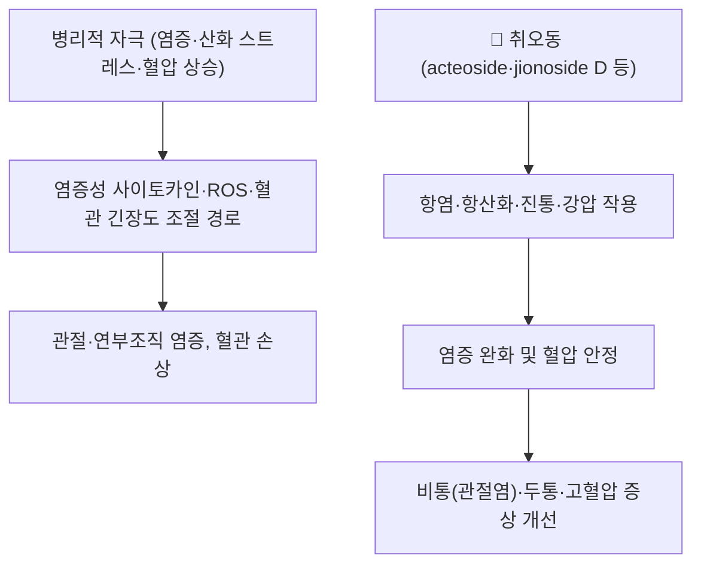

---
aliases:
  - 臭梧桐
  - 누리장나무
  - 취오동엽(臭梧桐葉)
  - Harlequin Glory Bower
  - Clerodendrum trichotomum
tags:
  - 본초
  - 거풍제습
  - 강압
  - 관절염
  - 한약재
---

# 🌿 [[취오동]] (臭梧桐, 누리장나무 — Clerodendrum trichotomum Thunb.)

> **핵심 요약 (Key Summary)**:
> 마편초과(馬鞭草科, Verbenaceae — APG 체계에서는 꿀풀과 Lamiaceae로 보는 문헌도 있음)의 낙엽 관목 누리장나무(*Clerodendrum trichotomum* Thunb.)의 어린 가지와 잎을 쇄건(曬乾)하여 쓰는 약재로, 잎에서 나는 특유의 냄새 때문에 취오동(臭梧桐)이라 이름 붙였습니다.
> 페닐프로파노이드 배당체(acteoside·isoacteoside 계열), 플라보노이드, 이리도이드·디테르페노이드(clerodendrin 등) 성분이 항염·항산화·진통·진정 및 혈압 강하 기전에 관여합니다.
> 한의학적으로는 거풍제습(祛風除濕), 강압(降壓), 지통(止痛)·진정(鎭靜) 효능으로 풍습비통(관절염·신경통), 반신불수(중풍 후유증), 고혈압, 두통, 피부 가려움증(습진) 등에 응용되는 약재입니다.

---

## 📌 목차
1. [기본 본초 정보 & 화학 구조 (Pharmacognosy)](#1-기본-본초-정보--화학-구조-pharmacognosy)
2. [핵심 분자약리 기전 & 대사 네트워크](#2-핵심-분자약리-기전--대사-네트워크)
3. [임상 응용: 적응증 vs 금기](#3-임상-응용-적응증-vs-금기)
4. [사상의학 및 체질별 임상 응용](#4-사상의학-및-체질별-임상-응용)
5. [배오 원리 및 한의학적 고찰](#5-배오-원리-및-한의학적-고찰)
6. [핵심 처방 비교 매트릭스](#6-핵심-처방-비교-매트릭스)
7. [출처 및 학술 참고 문헌 (References)](#7-출처-및-학술-참고-문헌-references)

---

## 1. 기본 본초 정보 & 화학 구조 (Pharmacognosy)

> [!abstract]+ 🧪 3D 약리 분자 구조 (Interactive 3D Viewer)
> <iframe src="https://molecule-viewer-rho.vercel.app/?cid=442523" style="width: 100%; height: 600px; border: none; border-radius: 12px; box-shadow: 0 4px 20px rgba(0,0,0,0.15);" allowfullscreen></iframe>


| 항목 | 상세 내용 |
| :--- | :--- |
| **기원 식물** | 마편초과(Verbenaceae, 전통 분류) 누리장나무 *Clerodendrum trichotomum* Thunb.의 어린 가지와 잎 — 8~10월 개화 후 또는 6~7월에 채취하여 쇄건(曬乾). (APG 체계에서는 꿀풀과 Lamiaceae로 보는 문헌도 있음) |
| **성미 (性味)** | 고(苦)·미신(微辛), 평(平) — 무독 (중국사천중약지: 성질은 평하고 맛은 쓰고 독이 없다) |
| **귀경 (歸經)** | ⚠️ 내용 검토 필요 — 문헌별 귀경 기재 상이. 간(肝) 경 위주로 보는 견해가 있으나 KIOM 본초 DB 원문 대조 후 확정 예정 |
| **효능 (Actions)** | 거풍제습(祛風除濕), 강압(降壓), 지통(止痛), 진정(鎭靜), 소염(消炎) — 풍습비통, 반신불수, 고혈압, 두통, 피부 소양증 |
| **주요 성분** | • **페닐프로파노이드 배당체**: acteoside(verbascoside), isoacteoside, jionoside D 등<br>• **플라보노이드·리그난·테르페노이드**: clerodendrin 등 네오클레로단 디테르페노이드, 스테로이드, 알칼로이드, 안트라퀴논류 (PMID 39064848) |

### 🔬 주요 지표물질 화학 구조
> ⚠️ 내용 검토 필요 — acteoside·jionoside D·clerodendrin 구조 이미지를 PubChem 등 공개 도해에서 확보하여 삽입 예정. 페닐프로파노이드 배당체의 카페오일·람노실 치환이 항산화·항염 활성에 핵심적입니다.

---

## 2. 핵심 분자약리 기전 & 대사 네트워크



### (1) 표적 경로 및 약리 활성
* **항염 작용**: 취오동 잎 메탄올 추출물에서 3종의 페닐프로파노이드 배당체가 분리되었으며 항염 활성이 확인되었습니다 (Arch Pharm Res 2009, PMID 19183871).
* **항산화 작용**: jionoside D가 세포 내 활성산소(ROS)와 DPPH 라디칼 소거 및 지질과산화 억제 활성을 보였습니다 (Biol Pharm Bull 2004, DOI 10.1248/bpb.27.1504).
* **종합 약리**: 항염·진통·항암·진정·저혈압(강압) 효과가 전통 사용처(류마티스 관절염, 관절통, 피부 염증, 천식)와 함께 리뷰로 정리되어 있습니다 (PMID 39064848 · PMID 39834825).

---

## 3. 임상 응용: 적응증 vs 금기

```
[✅ 적응증 (한의학적 주치)]
• 풍습비통(風濕痺痛): 류머티즘 관절염·관절통·신경통 — 거풍제습
• 중풍 후유증·반신불수·사지 마비 — [[중풍]]의 후유증 치료로 민간·전통의학에서 응용 (통경활락 관점)
• 고혈압·두통·편두통 — 강압·진정
• 피부 가려움증(습진·피부염), 이질, 말라리아(전통 용법)

[⚠️ 신중 투여 및 금기 (Caution / Contraindication)]
• 강압 작용이 있으므로 저혈압 환자, 강압제 병용 시 혈압 변동 주의
• 임신·수유 및 장기 복용 안전성에 대한 현대 임상 근거 부족 — 주의
• 잎·줄기 외 부위(뿌리·열매)는 기전·용량이 다를 수 있어 구분 사용
```

---

## 4. 사상의학 및 체질별 임상 응용

> ⚠️ 내용 검토 필요 — 취오동의 사상의학 체질별 배속 문헌 근거를 아직 확보하지 못했습니다. 풍습·담음·열이 병존하는 변증(비증) 위주 약재로 이해되나, 체질 처방 적용은 추후 문헌 대조 후 보강 예정입니다.

---

## 5. 배오 원리 및 한의학적 고찰

* **이명(異名)과 기원**: 누리장나무(臭梧桐)의 어린 가지와 잎을 취오동이라 하며, 열매는 취오동자(臭梧桐子)로 따로 구분합니다 (KIOM 한약자원연구센터 DB).
* **전통 용법의 현대적 연결**: 동아시아 민간·전통의학에서 류머티즘, 반신불수, 고혈압, 편두통, 말라리아, 이질 등에 사용된 기록이 있으며, 중국·한국·일본·타이완에서 줄기·잎이 염증성 피부 질환·두통·고혈압·류머티즘 관절통에 쓰였습니다 (PMID 39834825).
* ⚠️ 내용 검토 필요 — 『약징(藥徵)』·동의보감 조문 대조 및 대표 처방(예: 취오동탕 계열)은 원문 확인 후 보강 예정입니다.

---

## 6. 핵심 처방 비교 매트릭스

| 처방명 | 구성 약재 | 주치 병증 및 임상 타깃 | 특징 및 감별점 |
| :--- | :--- | :--- | :--- |
| ⚠️ (내용 검토 필요) | [[취오동]] 포함 처방 | — | 원문 대조 후 기재 예정 (취오동자·취오동엽 처방 구분 포함) |

---

## 7. 출처 및 학술 참고 문헌 (References)

1. **Ogunlakin AD, et al. (2024)**. *Clerodendrum trichotomum Thunberg — An Ornamental Shrub with Medical Properties*. https://pubmed.ncbi.nlm.nih.gov/39064848/
   - **[연구 요약]**: C. trichotomum의 식물학·화학 성분·생물 활성(항염·진통·항암·진정·강압) 및 전통 사용처를 종합한 리뷰.
2. **(2025)**. *Clerodendrum trichotomum Thunb.: a review on phytochemical composition and pharmacological activities*. https://pubmed.ncbi.nlm.nih.gov/39834825/
   - **[연구 요약]**: 잎·줄기·뿌리 부위별 민족약리와 페닐프로파노이드·플라보노이드 등 화학 성분 및 약리 활성의 최신 종합 리뷰.
3. **(2009)**. *Anti-inflammatory phenylpropanoid glycosides from Clerodendron trichotomum leaves*. Arch Pharm Res 32(1):7-13. https://pubmed.ncbi.nlm.nih.gov/19183871/
   - **[연구 요약]**: 취오동 잎에서 분리한 3종 페닐프로파노이드 배당체의 항염 활성 확인 — 지표 성분 근거.
4. **Chae S, Kim JS, Kang KA, et al. (2004)**. *Antioxidant activity of jionoside D from Clerodendron trichotomum*. Biol Pharm Bull 27(9):1504-1508. https://doi.org/10.1248/bpb.27.1504
   - **[연구 요약]**: jionoside D의 세포 내 ROS·DPPH 소거 및 지질과산화 억제 항산화 활성 확인.
5. **한국한의학연구원 한약자원연구센터 (KIOM herb'lib)**. 취오동(臭梧桐)·취오동자(臭梧桐子) 본초 DB — 마편초과 누리장나무 어린 가지·잎, 쇄건 사용. https://herba.kr/boncho/?m=view&t=dict&id=37113
   - **[공인 데이터]**: 국내 한의학 본초 DB의 기원·채집·가공 기준.

---
_🕐 생성: 2026-09-08 (다빈치, 미노트화 배치) — 본초 템플릿 기준 · 미확인 세부는 ⚠️ 내용 검토 필요로 표기_
