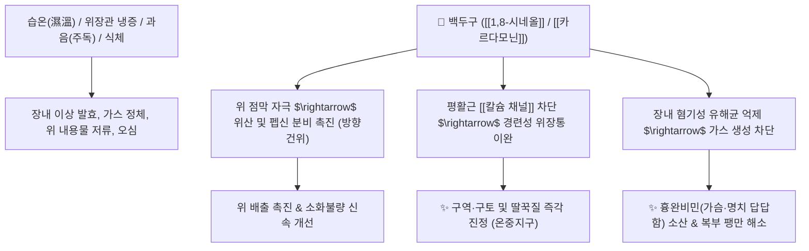

# 🌿 [[백두구]] (白豆蔲, Amomi Cardamomi Fructus)

> **핵심 요약 (Key Summary)**:
> 생강과(*Zingiberaceae*) 백두구(*Amomum kravanh*)의 성숙한 열매
> 방향성 모노테르펜인 [[1,8-시네올]](1,8-Cineole)과 [[테르피네올]](Terpineol)이 위장관 점막 분비를 촉진하고 장내 이상 발효 및 가스 팽만을 억제
> 습온(濕溫) 초기의 흉완비민(가슴·명치 답답함)과 위한(胃寒) 구토·식체 및 주독(酒毒)을 치료하는 대표적인 [[화습행기]](化濕行氣)·[[온중지구]](溫中止嘔) 약재

---
## 📌 목차
1. [기본 본초 정보 & 화학 구조 (Pharmacognosy)](#1-기본-본초-정보--화학-구조-pharmacognosy)
2. [핵심 분자약리 기전 & 소화관 운동·항균 네트워크](#2-핵심-분자약리-기전--소화관-운동항균-네트워크)
3. [해부생체역학 / 위 유문부 & 장관 평활근 연계](#3-해부생체역학--위-유문부--장관-평활근-연계)
4. [사상의학 및 임상 응용 (적응증 vs 감별점)](#4-사상의학-및-체질별-임상-응용-적응증-vs-감별점)
5. [고전 의학 및 배오 원리 (삼인탕 배오)](#5-고전-의학-및-배오-원리-삼인탕-배오)
6. [핵심 처방 비교 매트릭스](#6-핵심-처방-비교-매트릭스)
7. [출처 및 학술 참고 문헌 (References)](#7-출처-및-학술-참고-문헌-references)

---
## 1. 기본 본초 정보 & 화학 구조 (Pharmacognosy)

> [!abstract]+ 🧪 3D 약리 분자 구조 (Interactive 3D Viewer)
> <iframe src="https://molecule-viewer-rho.vercel.app/?cid=2758" style="width: 100%; height: 600px; border: none; border-radius: 12px; box-shadow: 0 4px 20px rgba(0,0,0,0.15);" allowfullscreen></iframe>


| 항목 | 상세 내용 |
| :--- | :--- |
| **기원 식물** | 생강과(Zingiberaceae) 백두구 *Amomum kravanh* Pierre ex Gagnep. 또는 인도네시아백두구의 잘 익은 열매 |
| **성미 (性味)** | 辛, 溫 |
| **귀경 (歸經)** | 肺·脾·胃經 (폐경, 비경, 위경) |
| **효능 (Actions)** | [[화습행기]](化濕行氣), [[온중지구]](溫中止嘔), [[개위소식]](開胃消食) |
| **주요 성분** | • **방향성 정유**: [[1,8-시네올]] (1,8-Cineole, 유칼립톨), [[알파-테르피네올]] ($\alpha$-Terpineol), 캄펜, 피넨, 미르센<br>• **플라보노이드 및 디페닐헵타노이드**: 카르다모닌(Cardamonin), 알피네틴 |

> **[유래 및 본초학적 기전]**:
> * 껍질이 희고 둥근 투구 모양을 닮아 '백두구(白豆蔲)'라 불렸습니다.
> * 방향성이 매우 맑고 상쾌하여 상초(폐)와 중초(비위)의 습탁(濕濁)한 사기를 흩어버리고, 과음 후 숙취 및 위장관 이상 발효로 인한 가스 팽만과 구토, 딸꾹질을 멎게 합니다.
> * 생강과 씨앗류 약재 특유의 신속한 위장관 연동운동 촉진 작용을 지닙니다.

### 🔬 백두구의 주요 정유 성분 화학 구조
```
        CH3
         |
      [고리]===O=== (에테르 다리 결합)  <-- 1,8-시네올 (1,8-Cineole / Eucalyptol)
     /      \
    (CH3)2
```
> **[구조적 특징 및 활성]**: [[1,8-시네올]]은 산소 가교를 가진 바이사이클릭 에테르 구조로, 점막 투과성이 우수하여 위 점막의 혈류를 즉시 늘리고 소화 효소 분비를 촉진하며 장내 유해 발효균을 살균합니다.

---
## 2. 핵심 분자약리 기전 & 소화관 운동·항균 네트워크



### (1) 방향성 건위 및 진토 작용
* **위액 분비 촉진 및 소화 효소 활성화**:
  * 혀와 위의 미각·후각 수용체를 자극하여 타액, 위액, 담즙 분비를 반사적으로 촉진하여 식욕을 돋우고 식체를 풀어줍니다.
* **장내 이상 발효 억제 및 가스 배출**:
  * 장내 부패균 증식을 차단하여 이상 발효로 인한 복명(뱃속 꼬르륵 소리), 헛배부름, 트림을 해소합니다.
* **항구토 및 중초 온양**:
  * 차가운 음식이나 술로 인해 비위가 냉해져 발생하는 위한(胃寒) 구토를 따뜻하게 덥혀 멎게 합니다.

---
## 3. 해부생체역학 / 위 유문부 & 장관 평활근 연계

* **위 유문부(Pyloric Sphincter) 협조 운동 촉진**:
  * 위에서 십이지장으로의 음식물 배출 시간을 단축시켜 식후 상복부 팽만감을 해소합니다.
* **딸꾹질(Hiccup) 및 횡격막 경련 진정**:
  * 미주신경 반사를 안정화시켜 완고한 딸꾹질을 진정시킵니다.

---
## 4. 사상의학 및 임상 응용 (적응증 vs 감별점)

```
[✅ 최적 적응증 (Sweet Spot)]
• 습온병(濕溫病) 초기: 몸이 무겁고 열이 나며, 가슴과 명치가 꽉 막힌 듯 답답하고 혀에 미끄러운 백태가 낄 때 ([[삼인탕]])
• 소화기 한습증: 속이 차서 메스껍고 구토하며, 헛배가 부르고 소화가 안 되는 경우
• 주독(酒毒) 및 숙취: 과음 후 다음 날 속이 울렁거리고 신물이 올라올 때
• 소아의 젖 토함(토유 吐乳) 및 소화불량

[🔍 백두구 vs 초두구 vs 사인 감별]
• [[백두구]]: 기운이 맑고 상초(폐)와 중초(위)의 습탁(濕濁)을 날려 보냄 (가슴 답답함·구토에 특화)
• [[사인]]: 기운이 중초와 하초(비신)로 들어가 태아를 안정시키고 설사를 멎게 함 (안태·지사에 특화)
• [[초두구]]: 온조(溫燥)한 성질이 가장 강하여 비위의 심한 한습을 쫓아냄

[⚠️ 신중 투여 및 금기 (Caution / Contraindication)]
• 음허혈조(陰虛血燥): 진액과 혈액이 부족하여 입이 바짝 마르는 환자
• 전탕 시 주의: 방향성 정유 보존을 위해 탕약 전탕 마지막에 후하(後下)
```

---
## 5. 고전 의학 및 배오 원리 (삼인탕 배오)

### (1) 상·중·하 3초 습열을 뚫는 삼인탕(三仁湯) 배오
* **3대 씨앗 약재 배오**:
  * [[행인]] $\rightarrow$ **상초(폐)의 기를 선포하여 수기를 아래로 내림** (宣通上焦)
  * [[백두구]] $\rightarrow$ **중초(비위)의 기를 통하게 하여 습을 날림** (宣通中焦)
  * [[의이인]] $\rightarrow$ **하초(방광)로 습열을 끌고 나가 소변으로 배출** (宣通下焦)
* **시너지**: 세 가지 씨앗의 상중하 분업으로 전신의 갇힌 습열 사기를 완벽히 소통.

---
## 6. 핵심 처방 비교 매트릭스

| 처방명 | 구성 약재 | 주치 병증 및 임상 타깃 | 특징 및 감별점 |
| :--- | :--- | :--- | :--- |
| [[삼인탕]] | [[행인]], [[백두구]], [[의이인]], [[반하]], [[후박]], [[활석]], [[통초]], [[죽엽]] | **습온병, 오열(오후 발열), 신체중, 흉민, 설태 백니** | 상중하 삼초의 습열을 소통시키는 명방 |
| [[연박음]] | [[황련]], [[후박]], [[백두구]], [[반하]], [[석고]], [[치자]] 등 | **습열 콜레라, 토사곽란, 가슴 답답함, 구토** | 한열을 조화시켜 급성 위장염 치료 |
| [[향사평위산]](가미) | [[평위산]] + [[목향]], [[사인]] + [[백두구]] | 과음 후 구토, 식체, 위완통, 가스 팽만 | 방향성 소도 작용으로 주독과 식체 즉시 해소 |
| [[백두구산]] | [[백두구]], [[정향]], [[생강]] | **소아 구토, 위한성 딸꾹질, 반위(反胃)** | 중초를 따뜻하게 덥혀 구역질을 멎게 함 |

---
## 7. 출처 및 학술 참고 문헌 (References)

1. **Juergens, U. R., et al. (2003)**. Anti-inflammatory activity of 1.8-cineol (eucalyptol) in bronchial asthma: a double-blind placebo-controlled trial. *Respiratory Medicine*, 97(3), 250-256. [PMID: 12645832](https://pubmed.ncbi.nlm.nih.gov/12645832/)
   - **[연구 요약]**: 백두구의 주성분인 1,8-시네올이 염증성 매개물질 억제를 통해 호흡기 및 위장관 점막의 항염증·진경 활성을 나타냄을 인체 임상 시험을 통해 입증.
2. **대한민국약전외한약(생약)규격집(KHP) (2022)**. 백두구 (Amomi Cardamomi Fructus) 규격 기준.
   - **[공정서 규격]**: 정유 함량 4.0% 이상 함유 및 순도시험(이물, 중금속) 규격 명시.
