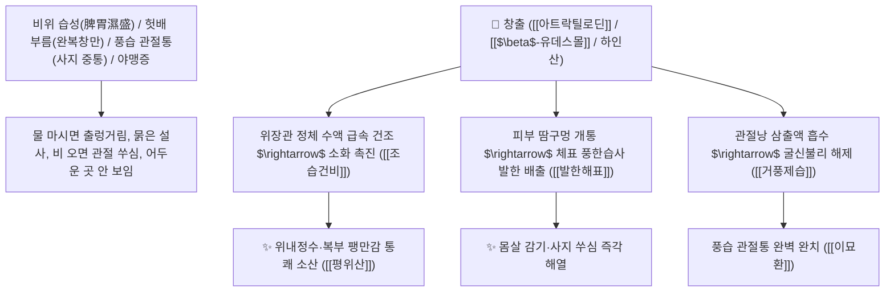

# 🌿 [[창출]] (蒼朮 / 茅蒼朮, Atractylodis Rhizoma / 가는잎삽주뿌리줄기)

> **핵심 요약 (Key Summary)**:
> 국화과(*Asteraceae*) 가는잎삽주(*Atractylodes lancea*) 또는 북창출의 건조한 뿌리줄기(모창출 茅蒼朮)
> 세스퀴테르페노이드 정유인 [[아트락틸로딘]](Atractylodin)과 [[$\beta$-유데스몰]]($\beta$-Eudesmol)이 위장관 카하알 사이세포(ICC)를 자극하여 위체액 저류를 제거하고 땀을 내어 조습건비 및 거풍산한 작용 발휘
> 비위 습체(소화불량·복부 팽만·설사·수양성 위내정수) 및 풍한습비(무릎 관절통·사지 무거움·마비)·야맹증(명목)을 치료하며 겉과 속의 궂은 물을 동시에 말리는 대표적인 [[조습건비]](燥濕健脾)·[[거풍제습]](祛風除濕)·[[발한해표]](發汗解表)·[[평위산]](平胃散)·[[이묘환]](二妙丸)의 군약(君藥)

---
## 📌 목차
1. [기본 본초 정보 & 화학 구조 (Pharmacognosy)](#1-기본-본초-정보--화학-구조-pharmacognosy)
2. [핵심 분자약리 기전 & 아트락틸로딘·위장관 건조·습기 제거 네트워크](#2-핵심-분자약리-기전--아트락틸로딘위장관-건조습기-제거-네트워크)
3. [해부생체역학 / 위장관 평활근 긴장도 & 사지 관절낭 연계](#3-해부생체역학--위장관-평활근-긴장도--사지-관절낭-연계)
4. [사상의학 및 창출 vs 백출 조습/보기 정밀 감별](#4-사상의학-및-창출-vs-백출-조습보기-정밀-감별)
5. [고전 의학 및 배오 원리 (평위산 & 이묘환 배오)](#5-고전-의학-및-배오-원리-평위산--이묘환-배오)
6. [핵심 처방 비교 매트릭스](#6-핵심-처방-비교-매트릭스)
7. [출처 및 학술 참고 문헌 (References)](#7-출처-및-학술-참고-문헌-references)

---
## 1. 기본 본초 정보 & 화학 구조 (Pharmacognosy)

> [!abstract]+ 🧪 3D 약리 분자 구조 (Interactive 3D Viewer)
> <iframe src="https://molecule-viewer-rho.vercel.app/?cid=5321047" style="width: 100%; height: 600px; border: none; border-radius: 12px; box-shadow: 0 4px 20px rgba(0,0,0,0.15);" allowfullscreen></iframe>


| 항목 | 상세 내용 |
| :--- | :--- |
| **기원 식물** | 국화과(Compositae / Asteraceae) 가는잎삽주 *Atractylodes lancea* (Thunb.) DC. 또는 북창출 *Atractylodes chinensis*의 뿌리줄기 |
| **성미 (性味)** | 辛·苦, 溫 (맵고 쓰며 성질이 따뜻하고 몹시 건조함 燥烈) |
| **귀경 (歸經)** | 脾·胃·肝經 (비경, 위경, 간경) - **비위의 습기를 말리고 체표의 풍습을 날림** |
| **효능 (Actions)** | [[조습건비]](燥濕健脾), [[거풍제습]](祛風除濕), [[발한해표]](發汗解表), [[명목]](明目), [[벽예]](辟穢) |
| **주요 성분** | • **퓨란형 세스퀴테르펜 정유(핵심 지표)**: [[아트락틸로딘]] (Atractylodin, KP 규격 모창출 $\ge 1.3\%$, 북창출 $\ge 0.30\%$), [[아트락틸론]] (Atractylon)<br>• **세스퀴테르펜 알코올**: [[$\beta$-유데스몰]] ($\beta$-Eudesmol), 엘레몰, 하인산(Hinesol)<br>• **폴리아세틸렌 및 비타민**: 비타민 A 유도체 (야맹증 치료) |

> **[유래 및 본초학적 기전]**:
> * 뿌리줄기 단면에 붉은 기름점(주사점 朱砂點)이 빽빽하고 푸르스름한(蒼) 빛을 띠며, 강렬한 향기로 궂은 습기를 날린다 하여 '창출(蒼朮)'이라 불렸습니다.
> * 밖으로는 체표의 풍한습(몸살, 관절통)을 땀으로 흩어 날리고(발한해표 發汗解表), **안으로는 위장에 출렁거리는 궂은 물과 습기를 바짝 말려버리는(조습건비 燥濕健脾) 한의학 최강의 건습제(乾濕劑)**입니다.
> * [[백출]](白朮)**이 비위를 '보(補)'하는 완만함이 있다면, [[창출]](蒼朮)**은 비위의 습기를 '말리는(燥)' 폭발적인 힘을 발휘합니다.

### 🔬 창출의 주요 아트락틸로딘 화학 구조
```
     [ 퓨란 고리 결합 트리엔 세스퀴테르펜 골격 ]  <-- 아트락틸로딘 (Atractylodin)
```
> **[구조적 특징 및 위장관 연동 촉진]**: [[아트락틸로딘]]은 위장관의 그렐린(Ghrelin) 수용체를 자극하여 위 배출능을 개선하고, $\beta$-유데스몰은 신경근 접합부 전달을 조절하여 위장관 경련을 완화하고 관절 부종을 흡수시킵니다.

---
## 2. 핵심 분자약리 기전 & 아트락틸로딘·위장관 건조·습기 제거 네트워크



### (1) 표적 조습건비 및 발한해표 작용
* **위내정수(胃內停水) 및 복부 팽만 설사 완치 ([[조습건비]] 燥濕健脾)**:
  * 배에서 물소리가 나고 헛배가 부르며 진흙 같은 변을 보는 습체 증상을 말끔히 치료합니다 ([[평위산]]).
* **풍습성 관절통 및 사지 저림 치료 ([[거풍제습]] 祛風除濕)**:
  * 몸이 천근만근 무겁고 다리가 붓고 쑤시는 풍습 비증을 땀을 내어 다스립니다 ([[구미강활탕]]).
* **하초 습열 관절통 및 야맹증 해소 ([[이묘환]] & 명목)**:
  * 황백과 배오하여 무릎과 발목의 열감 있는 관절염을 치료하고, 비타민 A 활성으로 야맹증을 개선합니다.

---
## 3. 해부생체역학 / 위장관 평활근 긴장도 & 사지 관절낭 연계

* **관절낭(Joint Capsule) 활액막 부종 소산**:
  * 활액 내 인터루킨 분비를 억제하여 관절 압력을 낮추고 운동 범위를 회복시킵니다.

---
## 4. 사상의학 및 창출 vs 백출 조습/보기 정밀 감별

```
[🔍 삽주 2대 본초 정밀 감별: 창출 vs 백출]
• [[창출]](蒼朮, 껍질째 건조): 辛烈燥濕, 발한해표(發汗解表) $\rightarrow$ 비위의 습기를 맹렬히 말림 (습체 실증)
• [[백출]](白朮, 코르크층 제거): 甘溫補氣, 건비지한(健脾止汗) $\rightarrow$ 비위를 보하고 땀을 멎게 함 (비허 허증)

[💡 배오 팁]
• 습기가 많아 몸이 무겁고 배가 부를 때는 [[창출]], 기운이 없고 소화력이 떨어질 때는 [[백출]]을 선택
```

---
## 5. 고전 의학 및 배오 원리 (평위산 & 이묘환 배오)

### (1) 습기를 말리는 천하제일 2대 명방
* **위장 습기 제거 제1방**:
  * [[창출]] + [[후박]] + [[진피]] + [[감초]] $\rightarrow$ 소화기 습체를 말리는 불후의 명방 ([[평위산]])
* **하초 습열 관절통 제1방**:
  * [[창출]] + [[황백]] (동량 배오) $\rightarrow$ 하지 습열 관절통을 치료하는 최고 배방 ([[이묘환]])

---
## 6. 핵심 처방 비교 매트릭스

| 처방명 | 구성 약재 | 주치 병증 및 임상 타깃 | 특징 및 감별점 |
| :--- | :--- | :--- | :--- |
| [[평위산]] | [[창출]], [[후박]], [[진피]], [[감초]], [[생강]], [[대추|대조]] | **비위 습체, 완복 창만, 식욕부진, 트림, 설사, 오심, 구토** | 위장의 습기를 말리는 대표방 |
| [[이묘환]] | [[창출]], [[황백]] | **습열 하주, 각기 하지 위약, 족슬 종통, 대하, 습진** | 하초의 습과 열을 동시에 제거 |
| [[구미강활탕]] | [[강활]], [[방풍]], [[창출]], [[세신]], [[황금]], [[생지황]] | **외감 풍한습, 두통, 전신 관절통, 오한 발열, 땀 없음** | 땀을 내어 관절통과 감기 치료 |
| [[신출산]] | [[창출]], [[고본]], [[백지]], [[세신]], [[강활]] | **사시 감모, 두통 신통, 콧물, 재채기, 전신 무거움** | 풍한습 감기를 몰아냄 |

---
## 7. 출처 및 학술 참고 문헌 (References)

2. **대한민국약전(KP) 제12개정 (2022)**. 의약품각조 제2부: 창출 (Atractylodis Rhizoma) 규격 기준.
   - **[공정서 규격]**: 모창출 기준 아트락틸로딘 1.3% 이상 함유 필수 규격 명시.
