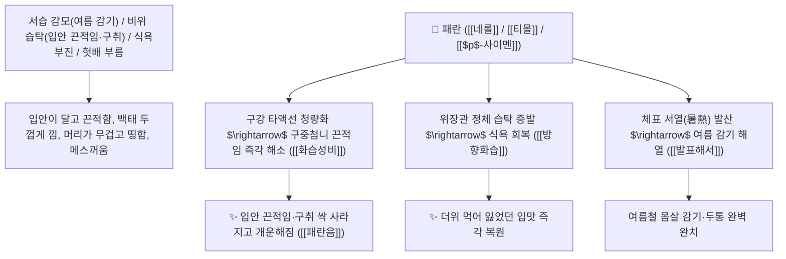

# 🌿 [[패란]] (佩蘭 / 蘭草, Eupatorii Herba / 벌등골나물지상부)

> **핵심 요약 (Key Summary)**:
> 국화과(*Asteraceae*) 벌등골나물(*Eupatorium fortunei*)의 건조한 지상부(전초)
> 모노테르펜 정유인 [[네롤]](Nerol)과 [[티몰]](Thymol) 및 $p$-사이멘이 타액선 분비를 정상화하고 위장관 점막의 정체 습탁(濕濁)을 증발시켜 방향화습 및 화습성비 작용 발휘
> 여름철 서습(暑濕) 감모(오한 발열·두통 신중) 및 비위 습탁으로 인한 입안이 달고 끈적한 구중첨니(口中甛膩)·구취·소화불량 헛배 부름·오심 설사를 치료하는 대표적인 [[방향화습]](芳香化濕)·[[화습성비]](化濕醒脾)·[[발표해서]](發表解暑)·[[곽향정기산]](藿香正氣散)·[[패란음]](佩蘭飲)의 군약(君藥)

---
## 📌 목차
1. [기본 본초 정보 & 화학 구조 (Pharmacognosy)](#1-기본-본초-정보--화학-구조-pharmacognosy)
2. [핵심 분자약리 기전 & 네롤·티몰·비위 습탁 증발 네트워크](#2-핵심-분자약리-기전--네롤티몰비위-습탁-증발-네트워크)
3. [해부생체역학 / 타액선 배설관 & 위점막 점액 수송 연계](#3-해부생체역학--타액선-배설관--위점막-점액-수송-연계)
4. [사상의학 및 곽향 vs 패란 방향화습 정밀 감별](#4-사상의학-및-곽향-vs-패란-방향화습-정밀-감별)
5. [고전 의학 및 배오 원리 (패란음 & 곽향정기산 배오)](#5-고전-의학-및-배오-원리-패란음--곽향정기산-배오)
6. [핵심 처방 비교 매트릭스](#6-핵심-처방-비교-매트릭스)
7. [출처 및 학술 참고 문헌 (References)](#7-출처-및-학술-참고-문헌-references)

---
## 1. 기본 본초 정보 & 화학 구조 (Pharmacognosy)

> [!abstract]+ 🧪 3D 약리 분자 구조 (Interactive 3D Viewer)
> <iframe src="https://molecule-viewer-rho.vercel.app/?cid=643820" style="width: 100%; height: 600px; border: none; border-radius: 12px; box-shadow: 0 4px 20px rgba(0,0,0,0.15);" allowfullscreen></iframe>


| 항목 | 상세 내용 |
| :--- | :--- |
| **기원 식물** | 국화과(Compositae / Asteraceae) 벌등골나물 *Eupatorium fortunei* Turcz.의 지상부 |
| **성미 (性味)** | 辛, 平 (맵고 향기가 매우 맑으며 성질이 평이하고 치우침이 없음) |
| **귀경 (歸經)** | 脾·胃·肺經 (비경, 위경, 폐경) - **비위의 끈적한 습탁을 날리고 맑은 향기로 입맛을 깨움** |
| **효능 (Actions)** | [[방향화습]](芳香化濕), [[화습성비]](化濕醒脾), [[발표해서]](發表解暑), [[생진지갈]](生津止渴) |
| **주요 성분** | • **모노테르펜 정유(핵심 방향 지표)**: [[네롤]] (Nerol), [[티몰]] (Thymol), $p$-사이멘($p$-Cymene), 리모넨<br>• **플라보노이드 및 벤조퓨란**: 에우파토리올, 코스티크산, 퀘르세틴<br>• **콜린 및 유기산**: 타락사스테롤 |

> **[유래 및 본초학적 기전]**:
> * 옛날 선비들이 몸에 향낭으로 차고 다니던(佩) 향기로운 난초(蘭) 풀이라 하여 '패란(佩蘭)'이라 불렸습니다.
> * [[곽향]](藿香)이 매운맛으로 땀을 내고 구토를 멎게 하는 데 특화되어 있다면, 패란은 맑고 평이한 향기로 입안이 끈적거리고 단내가 나는 비열(脾熱) 구중첨니(口中甛膩)를 시원하게 씻어내는 최고 명약입니다.
> * 여름철 더위와 습기로 입맛이 뚝 떨어지고 헛배가 부르며 설사하는 서습증을 치료합니다.

### 🔬 패란의 주요 네롤 및 티몰 화학 구조
```
     [ 모노테르펜 알코올: 시스-제라니올 ]  <-- 네롤 (Nerol, 상쾌한 천연 방향)
     [ 2-이소프로필-5-메틸페놀 ]  <-- 티몰 (Thymol, 항균 및 점막 청량화)
```
> **[구조적 특징 및 타액선/소화액 분비 촉진]**: 패란의 정유 분획은 구강 미뢰 및 타액선을 자극하여 구강 건조와 점착감을 해소하고, 위점막 점액 분비를 조절하여 위장관 팽만을 완화합니다.

---
## 2. 핵심 분자약리 기전 & 네롤·티몰·비위 습탁 증발 네트워크



### (1) 표적 구중첨니 및 방향화습 작용
* **비열 구중첨니(口中甛膩) 및 구취 완치 ([[화습성비]] 化濕醒脾)**:
  * 입안에 단 침이 고이고 끈적끈적하며 입냄새가 나고 혀에 백태가 두껍게 끼는 증상을 맑게 씻어냅니다.
* **여름철 서습 감모 및 식욕 부진 치료 ([[발표해서]] 發表解暑)**:
  * 덥고 습한 날씨에 머리가 무겁고 몸이 천근만근이며 밥맛이 없는 증상을 날려줍니다 ([[곽향정기산]]).
* **소화불량 및 복부 팽만 설사 해소**:
  * 위장의 습기를 말려 헛배 부름과 설사를 멎게 합니다.

---
## 3. 해부생체역학 / 타액선 배설관 & 위점막 점액 수송 연계

* **설하선 및 악하선 장액성 분비 촉진**:
  * 타액 점조도를 낮추고 소화 효소 아밀라아제 활성을 높여 음식물 분해를 돕습니다.

---
## 4. 사상의학 및 곽향 vs 패란 방향화습 정밀 감별

```
[🔍 방향화습 2대 명약: 곽향 vs 패란 정밀 감별]
• [[곽향]](藿香): 辛微溫, 發表·止嘔 $\rightarrow$ 땀을 내고 위로 치솟는 구토를 멎게 하는 데 특화
• [[패란]](佩蘭): 辛平, 化濕·生津 $\rightarrow$ 성질이 평이하여 진액을 상하지 않고 입안 끈적임(구중첨니)과 서습을 날림
$\rightarrow$ 둘을 동량으로 배오(곽패 藿佩)하면 여름철 모든 위장 질환을 완벽히 평정
```

---
## 5. 고전 의학 및 배오 원리 (패란음 & 곽향정기산 배오)

### (1) 여름철 입맛과 습기를 잡는 최고 명방
* **구중첨니 최고 배오**:
  * [[패란]] (단방 달임차) $\rightarrow$ 입안 끈적임과 단맛을 없애는 명방 ([[패란음]])
  * [[곽향]] + [[패란]] + [[자소엽]] + [[백출]] $\rightarrow$ 여름철 서습 토사곽란을 치료 ([[곽향정기산]])

---
## 6. 핵심 처방 비교 매트릭스

| 처방명 | 구성 약재 | 주치 병증 및 임상 타깃 | 특징 및 감별점 |
| :--- | :--- | :--- | :--- |
| [[패란음]] | [[패란]] (단방 전탕) | **비달 구감, 구중첨니, 타액 점착, 식욕 부진** | 입안 끈적임을 씻어내는 제1방 |
| [[곽향정기산]](가미) | [[곽향]], [[패란]], [[소엽]], [[백지]], [[반하]], [[복령]] | 외감 풍한, 내상 습체, 곽란 토사, 복통, 두통 | 여름철 위장 감기의 최고 명방 |

---
## 7. 출처 및 학술 참고 문헌 (References)

2. **대한민국약전(KP) 제12개정 (2022)**. 생약규격집: 패란 (Eupatorii Herba) 규격 기준.
   - **[공정서 규격]**: 벌등골나물 지상부의 성상, 순도시험 및 건조감량 13.0% 이하 기준 명시.
