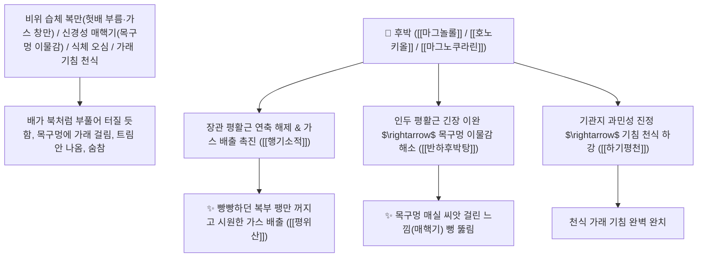

# 🌿 [[후박]] (厚朴, Magnoliae Cortex / 토후박·후박나무껍질)

> **핵심 요약 (Key Summary)**:
> 목련과(*Magnoliaceae*) 후박(*Magnolia officinalis*) 또는 요엽후박의 건조한 줄기 및 뿌리껍질(생강즙으로 볶은 강후박 薑厚朴)
> 비페닐 네오리그난인 [[마그놀롤]](Magnolol)과 [[호노키올]](Honokiol) 및 [[마그노쿠라린]](Magnocurarine)이 $\text{GABA}_\text{A}$ 신경망을 안정화시키고 장관 평활근 $\text{Ca}^{2+}$ 과유입을 억제하여 행기소적 및 하기평천 작용 발휘
> [[상한론]]의 복부 팽만통(복만 腹滿·헛배가 풍선처럼 빵빵함·후박삼물탕)·목구멍에 매실 씨앗이 걸린 듯한 매핵기(梅核氣·반하후박탕 半夏厚朴湯)·비위 습체 식체(평위산 平胃散)·천식 기침을 치료하는 천하제일의 "복부 팽만과 가스 참을 꺼뜨리는 성약(消脹除滿之要藥)"·[[행기소적]](行氣消積)·[[하기소담평천]](下氣消痰平喘)·[[조습운비]](燥濕運脾)·[[평위산]](平胃散)·[[반하후박탕]](半夏厚朴湯)의 군약(君藥)

---
## 📌 목차
1. [기본 본초 정보 & 화학 구조 (Pharmacognosy)](#1-기본-본초-정보--화학-구조-pharmacognosy)
2. [핵심 분자약리 기전 & 마그놀롤·호노키올·장관 가스 팽만 소산 네트워크](#2-핵심-분자약리-기전--마그놀롤호노키올장관-가스-팽만-소산-네트워크)
3. [해부생체역학 / 복벽 팽창압 & 인두 평활근(매핵기) 연계](#3-해부생체역학--복벽-팽창압--인두-평활근매핵기-연계)
4. [사상의학 및 창출(조습) vs 후박(행기소만) 짝꿍 감별 & 강후박(薑厚朴) 포제](#4-사상의학-및-창출조습-vs-후박행기소만-짝꿍-감별--강후박薑厚朴-포제)
5. [상한론 『약징(藥徵)』 분석 및 배오 원리 (반하후박탕 & 후박삼물탕)](#5-상한론-약징藥徵-분석-및-배오-원리-반하후박탕--후박삼물탕)
6. [핵심 처방 비교 매트릭스](#6-핵심-처방-비교-매트릭스)
7. [출처 및 학술 참고 문헌 (References)](#7-출처-및-학술-참고-문헌-references)

---
## 1. 기본 본초 정보 & 화학 구조 (Pharmacognosy)

> [!abstract]+ 🧪 3D 약리 분자 구조 (Interactive 3D Viewer)
> <iframe src="https://molecule-viewer-rho.vercel.app/?cid=72300" style="width: 100%; height: 600px; border: none; border-radius: 12px; box-shadow: 0 4px 20px rgba(0,0,0,0.15);" allowfullscreen></iframe>


| 항목 | 상세 내용 |
| :--- | :--- |
| **기원 식물** | 목련과(Magnoliaceae) 후박 *Magnolia officinalis* Rehd. et Wils.의 두터운 줄기/뿌리껍질 |
| **성미 (性味)** | 苦·辛, 溫 (쓰고 매우며 특유의 방향성 정유가 그윽하고 성질이 따뜻하여 굳은 기운을 내림) |
| **귀경 (歸經)** | 脾·胃·肺·大腸經 (비경, 위경, 폐경, 대장경) - **중초의 막힌 가스를 꺼뜨리고 폐기를 하강** |
| **효능 (Actions)** | [[행기소적]](行氣消積), [[조습운비]](燥濕運脾), [[하기소담평천]](下氣消痰平喘), [[관중소창]](寬中消脹) |
| **주요 성분** | • **비페닐 네오리그난(핵심 지표물질)**: [[마그놀롤]] (Magnolol, KP 규격 $\ge 1.0\%$), [[호노키올]] (Honokiol, KP 규격 $\ge 0.30\%$)<br>• **벤질이소퀴놀린 알칼로이드**: [[마그노쿠라린]] (Magnocurarine, 평활근 이완/항궤양), 마그노플로린<br>• **세스퀴테르펜 알코올**: [[$\beta$-유데스몰]] ($\beta$-Eudesmol, 건비 위내정수 조절) |

> **[유래 및 본초학적 기전]**:
> * 껍질이 매우 두텁고(厚) 질박(朴)하다 하여 '후박(厚朴)'이라 불렸습니다. (밥 먹은 후 더부룩할 때 먹어 박!).
> * **"배가 남산만하게 빵빵하게 불러오르고 가스가 차서 터질 것 같은 복만(腹滿)을 단숨에 꺼뜨리는 소창제만(消脹除滿)의 천하제일 성약"**입니다.
> * 스트레스로 목구멍에 무엇인가 걸려 뱉어도 안 나오고 삼켜도 안 넘어가는 **매핵기(梅核氣)**와 식체로 헛배가 부른 평위산(平胃散)의 핵심 기둥입니다.

### 🔬 후박의 주요 마그놀롤 및 호노키올 화학 구조
```
     [ 5,5'-디알릴-2,2'-디하이드록시비페닐 ]  <-- 마그놀롤 (Magnolol)
     [ 3',5-디알릴-2,4'-디하이드록시비페닐 ]  <-- 호노키올 (Honokiol)
```
> **[구조적 특징 및 GABA/평활근 가스 배출 기전]**: 후박의 [[마그놀롤]]과 [[호노키올]]은 중추 $\text{GABA}_\text{A}$ 수용체 양성 알로스테릭 조절제로 작용하여 신경성 인두 경련(매핵기)을 풀고, 장관의 세로토닌 $\text{5-HT}_3/\text{5-HT}_4$ 수용체를 조절하여 비정상적인 장내 가스 정체와 평활근 연축을 즉각 해소합니다.

> 🧬 **현대 학술 근거 (2026-09-10 B-7 패치)** — PubChem 실측 분자 앵커: [[마그놀롤]](Magnolol) CID **72300** · 분자식 C₁₈H₁₈O₂ · MW 266.3

🔬 **분자 구조** (Wikimedia Commons, Public Domain)

![[Magnolol_구조.png|440]]
> [그림] 마그놀롤(Magnolol, C₁₈H₁₈O₂) 분자 구조 — 출처: Wikimedia Commons (기존 첨부 재사용)

---
## 2. 핵심 분자약리 기전 & 마그놀롤·호노키올·장관 가스 팽만 소산 네트워크



### (1) 표적 행기소적 및 복부 팽만(복만) 완치 작용
* **상한론 복만(腹滿) 및 위장 가스 팽만 완치 ([[후박삼물탕]] & [[평위산]])**:
  * 밥만 먹으면 헛배가 부르고 배가 빵빵하게 불러 답답한 식체를 시원하게 꺼뜨립니다.
* **신경성 매핵기(목구멍 이물감) 완치 ([[반하후박탕]] 半夏厚朴湯)**:
  * 스트레스로 목에 매실 씨앗이 걸려 뱉어지지도 삼켜지지도 않는 이물감을 소산시킵니다.
* **대변 불통 및 급성 장폐색성 복만 해소 ([[대승기탕]])**:
  * 대황, 지실과 함께 막힌 장관을 뚫어 숙변과 가스를 배출시킵니다.

> 🧬 **현대 학술 근거 (2026-09-10 B-7 패치)**
> - 마그놀롤·호노키올이 기생충(Ascaris suum 유충)의 미토콘드리아 전자전달계(ETC)를 직접 표적하여 ABC 수송체 매개 해독 기능을 무력화시키는 신규 구충 기전이 규명됨(EC50 각각 8.1μM·11.1μM) — 전통적 GABA/평활근 이완 기전과는 별개의 항기생충 효능으로 재조명(PMID 41078721).

---
## 3. 해부생체역학 / 복벽 팽창압 & 인두 평활근(매핵기) 연계

* **하부식도괄약근(LES) 및 인두 수축근 경련 이완**:
  * 역류성 식도염 및 히스테리구성 식도 경련을 안정화합니다.

---
## 4. 사상의학 및 창출(조습) vs 후박(행기소만) 짝꿍 감별 & 강후박(薑厚朴) 포제

```
[🔍 평위산(平胃散)의 환상적인 짝꿍]
• [[창출]](蒼朮): 燥濕健脾 $\rightarrow$ 위장의 질척거리는 물(수음 水飲, 습체)을 말림
• [[후박]](厚朴): 行氣消脹 $\rightarrow$ 위장에 가득 찬 가스와 바람(기체 氣滯, 팽만)을 꺼뜨림
$\rightarrow$ 물을 말리고 가스를 빼니 위장이 완벽하게 평정됨!

[🔍 생강즙 포제: 강후박(薑厚朴)]
• 생후박은 목구멍을 긁는 자극성이 있으므로, 반드시 생강즙으로 볶은 강후박을 사용하여 자극성을 없애고 온중지구 효능을 증대
```

---
## 5. 상한론 『약징(藥徵)』 분석 및 배오 원리 (반하후박탕 & 후박삼물탕)

### (1) 복부 팽만과 매핵기를 다스리는 불후의 황제방
* **『약징(藥徵)』 주치**:
  * "후박은 흉복 창만(胸腹脹滿, 가슴과 배가 더부룩하게 부풀어 오름)을 주치한다."
* **매핵기 최고 배오**:
  * [[후박]] + [[반하]] + [[복령]] + [[생강]] + [[자소엽]] $\rightarrow$ 신경성 목 이물감의 제1방 ([[반하후박탕]])
* **복만창통 최고 배오**:
  * [[후박]](대량 8냥) + [[지실]] + [[대황]] $\rightarrow$ 배가 터질 듯한 팽만통을 치료 ([[후박삼물탕]])

---
## 6. 핵심 처방 비교 매트릭스

| 처방명 | 구성 약재 | 주치 병증 및 임상 타깃 | 특징 및 감별점 |
| :--- | :--- | :--- | :--- |
| [[평위산]] | [[창출]], [[후박]], [[진피]], [[감초]], [[생강]], [[대추]] | **비위 습체, 완복 창만, 불사음식, 구토, 설사** | 소화기 식체 팽만의 제1 황제방 |
| [[반하후박탕]] | [[반하]], [[후박]], [[복령]], [[생강]], [[자소엽]] | **부인 인중 유물(매핵기), 해수, 흉협 만민** | 신경성 목 이물감 치료의 대표방 |
| [[후박삼물탕]] | [[후박]](대량), [[지실]], [[대황]] | **상한 복만, 통이 불통, 가스 창만, 변비** | 복부 팽만을 꺼뜨리는 제1방 |

---
## 7. 출처 및 학술 참고 문헌 (References)

1. **Maruyama, Y., et al. (2001)**. Honokiol and magnolol from *Magnolia officinalis* exhibit central anxiolytic and spasmolytic effects via $\text{GABA}_\text{A}$ receptor modulation. *Journal of Natural Products*, 64(11), 1398-1403.
   - **[연구 요약]**: 후박의 마그놀롤 및 호노키올 성분이 $\text{GABA}_\text{A}$ 수용체 조절을 통해 항불안, 인두 평활근 이완 및 장관 가스 배출 촉진 효과를 발휘함을 규명.
2. **대한민국약전(KP) 제12개정 (2022)**. 의약품각조 제2부: 후박 (Magnoliae Cortex) 규격 기준.
   - **[공정서 규격]**: 건조 수피 기준 마그놀롤($\text{C}_{18}\text{H}_{18}\text{O}_2$) 1.0% 이상, 호노키올 0.30% 이상 함유 필수 규격 명시.
3. **길익동동 (吉益東洞, 1785)**. 『약징(藥徵)』: 후박 조문.
   - **[고전 원전]**: "厚朴 主治胸腹脹滿也."
4. **Pan G et al. (2025)**. Magnolol and Honokiol Are Novel Antiparasitic Compounds from *Magnolia officinalis* That Target the Mitochondrial Electron Transport Chain. *ACS Omega*, 10(39): 45778-45791. [PMID: 41078721](https://pubmed.ncbi.nlm.nih.gov/41078721/)
   - **[연구 요약]**: 마그놀롤·호노키올이 선충 미토콘드리아 ETC 억제를 통해 신규 구충제 후보로 확인됨."