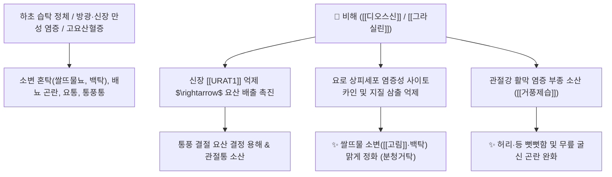

# 🌿 [[비해]] (萆薢, Dioscoreae Tokoro Rhizoma)

> **핵심 요약 (Key Summary)**:
> 마과(*Dioscoreaceae*) 큰마(도꼬로마, *Dioscorea tokoro*) 또는 단풍마의 뿌리줄기(근경)
> 스테로이드 사포닌인 [[디오스신]](Dioscin)과 [[그라실린]](Gracillin)이 요로 상피 염증을 가라앉히고 요산 배출을 촉진하여 탁한 소변을 맑게 하고 관절염 진통 작용 발휘
> 하초습탁(下焦濕濁)으로 소변이 쌀뜨물처럼 뿌옇게 나오는 요탁(膏淋·白濁) 및 요배부 강직·풍습성(風濕性) 관절통을 치료하는 대표적인 [[분청거탁]](分淸去濁)·[[거풍제습]](祛風除濕) 약재

---
## 📌 목차
1. [기본 본초 정보 & 화학 구조 (Pharmacognosy)](#1-기본-본초-정보--화학-구조-pharmacognosy)
2. [핵심 분자약리 기전 & 요로 청징·요산 배출 네트워크](#2-핵심-분자약리-기전--요로-청징요산-배출-네트워크)
3. [해부생체역학 / 요로 상피 장벽 & 요추 관절 연계](#3-해부생체역학--요로-상피-장벽--요추-관절-연계)
4. [사상의학 및 임상 응용 (적응증 vs 산약 감별)](#4-사상의학-및-임상-응용-적응증-vs-산약-감별)
5. [고전 의학 및 배오 원리 (비해분청음 배오)](#5-고전-의학-및-배오-원리-비해분청음-배오)
6. [핵심 처방 비교 매트릭스](#6-핵심-처방-비교-매트릭스)
7. [출처 및 학술 참고 문헌 (References)](#7-출처-및-학술-참고-문헌-references)

---
## 1. 기본 본초 정보 & 화학 구조 (Pharmacognosy)

> [!abstract]+ 🧪 3D 약리 분자 구조 (Interactive 3D Viewer)
> <iframe src="https://molecule-viewer-rho.vercel.app/?cid=119245" style="width: 100%; height: 600px; border: none; border-radius: 12px; box-shadow: 0 4px 20px rgba(0,0,0,0.15);" allowfullscreen></iframe>


| 항목 | 상세 내용 |
| :--- | :--- |
| **기원 식물** | 마과(Dioscoreaceae) 큰마(도꼬로마) *Dioscorea tokoro* Makino, 단풍마 또는 분비해의 뿌리줄기(근경) |
| **성미 (性味)** | 苦, 平 |
| **귀경 (歸經)** | 腎·胃·膀胱經 (신경, 위경, 방광경) |
| **효능 (Actions)** | [[분청거탁]](分淸去濁), [[거풍제습]](祛風除濕), [[통락지통]](通絡止痛), [[이습퇴황]](利濕退黃) |
| **주요 성분** | • **스테로이드 사포닌**: [[디오스신]] (Dioscin), [[그라실린]] (Gracillin), 토코로게닌(Tokorogenin), 요노게닌<br>• **피토스테롤 및 유기산**: $\beta$-Sitosterol, 팔미트산 |

> **[유래 및 본초학적 기전]**:
> * 약재의 형태가 거칠고 쓴맛이 나며 하초의 더러운 습탁(濕濁)을 걸러낸다 하여 '비해(萆薢)'라 불렸습니다.
> * 맑은 것과 탁한 것을 분리하는 **'분청거탁(分淸去濁)'**의 최고 요약(要藥)으로, 신장과 방광에 수습이 쌓여 소변이 뿌옇고 끈적거리며 기름이나 쌀뜨물처럼 나오는 증상(고림 膏淋, 백탁 白濁)을 맑게 걸러냅니다.
> * 풍습으로 허리와 등이 뻣뻣하고 무릎이 저리고 아픈 관절통을 치료합니다.

### 🔬 비해의 주요 스테로이드 사포닌 화학 구조
```
     [ 디오스게닌 스피로스탄 골격 ]───O──[ Rha-Glc-Rha 당사슬 ]  <-- 디오스신 (Dioscin)
```
> **[구조적 특징 및 활성]**: [[디오스신]]은 친유성 스피로스탄 스테로이드 아글리콘에 당사슬이 결합된 구조로, 요로 점막의 상피세포 염증과 산화 스트레스를 억제하고 신장 요산 수송체(URAT1)를 조절하여 요산 배출을 촉진합니다.

---
## 2. 핵심 분자약리 기전 & 요로 청징·요산 배출 네트워크



### (1) 분청거탁 및 요로계 정화
* **탁한 소변 정화 ([[분청거탁]] 分淸去濁)**:
  * 방광 및 전립선, 요로 점막의 만성 염증으로 인한 점액, 지질, 백혈구 삼출을 억제하여 뿌연 소변(유미뇨, 고림)을 맑게 합니다.
* **항통풍 및 요산 배출 촉진**:
  * 요산 재흡수를 차단하여 혈중 요산 농도를 낮추고 통풍성 관절염의 부종과 발작성 통증을 경감합니다.
* **거풍제습(祛風除濕) 및 요배통 완화**:
  * 요추 주변 근육과 인대의 한습성 긴장을 풀어 묵직하고 뻣뻣한 요통을 치료합니다.

---
## 3. 해부생체역학 / 요로 상피 장벽 & 요추 관절 연계

* **방광 점막 GAG(글리코사미노글리칸)층 보호**:
  * 만성 방광염 및 전립선염 환자의 요로 자극 증상과 야간뇨를 개선합니다.
* **요천추(Lumbosacral) 관절 가동성 회복**:
  * 습기로 인해 무겁고 굳은 요추부 척추기립근과 요방형근의 유착을 풀어줍니다.

---
## 4. 사상의학 및 임상 응용 (적응증 vs 산약 감별)

```
[✅ 최적 적응증 (Sweet Spot)]
• 백탁 및 고림(膏淋): 소변이 쌀뜨물이나 기름처럼 뿌옇고, 소변을 볼 때 묵직한 불쾌감이 동반되는 경우 ([[비해분청음]])
• 만성 전립선염 및 요도염으로 인한 회음부 둔통과 요탁
• 통풍성 관절염: 엄지발가락이나 발목 관절이 붓고 요산 수치가 높은 경우
• 풍습성 요통: 허리와 등이 뻣뻣하고 날씨가 흐리면 시리고 쑤시는 신경통

[🔍 비해 vs 산약 감별 포인트]
• [[산약]](마): 단맛으로 비·폐·신을 보하는 보기약 (보비익위·생진익폐 $\rightarrow$ 허증/영양 보익)
• [[비해]](도꼬로마): 쓴맛으로 하초의 습탁을 빼내는 이수약 (분청거탁·거풍제습 $\rightarrow$ 실증/탁뇨/관절염)

[⚠️ 신중 투여 (Caution)]
• 신음부족(腎陰不足)으로 소변이 붉고 마른 환자는 단독 투여 주의
```

---
## 5. 고전 의학 및 배오 원리 (비해분청음 배오)

### (1) 소변 백탁의 최고 명방: 비해분청음(萆薢分淸飲)
* **핵심 배오**:
  * [[비해]] + [[익지인]] + [[오약]] + [[석창포]] $\rightarrow$ 신장의 양기를 덥히고 습탁을 걸러내어 맑은 소변을 복원하는 불후의 명방 ([[비해분청음]])
  * [[비해]] + [[우슬]] + [[황백]] $\rightarrow$ 하초 습열을 소변으로 빼내어 통풍과 하지 관절염 치료

---
## 6. 핵심 처방 비교 매트릭스

| 처방명 | 구성 약재 | 주치 병증 및 임상 타깃 | 특징 및 감별점 |
| :--- | :--- | :--- | :--- |
| [[비해분청음]] | [[비해]], [[익지인]], [[오약]], [[석창포]], [[감초]], [[염소]](소금 미량) | **하초허한, 고림, 백탁(소변 쌀뜨물), 소변 빈삭** | 탁한 소변을 맑히는 분청거탁의 최고 처방 |
| [[비해음자]] | [[비해]], [[토복령]], [[방풍]], [[목통]], [[의이인]] 등 | **습열비통, 통풍성 관절염, 요배산통, 하지 종통** | 요산을 배출하고 관절 염증 완화 |
| [[사묘환]](가미) | [[황백]], [[창출]], [[우슬]], [[의이인]] + [[비해]] | 습열하주, 통풍 발작, 급성 관절 종통, 각기 | 하초 습열과 요산 결절을 신속 배출 |

---
## 7. 출처 및 학술 참고 문헌 (References)

1. **Feng J et al. (2025)**. Dioscin regulates oxidative stress and autophagy in uric acid-induced HK-2 cells through the P62-KEAP1-NRF2 signaling pathway. *BMC nephrology*, 26(1): 422. [PMID: 40731269](https://pubmed.ncbi.nlm.nih.gov/40731269/)
   - **[연구 요약]**: 비해의 디오스신이 신장 요산 수송체 URAT1을 억제하여 요산 배출을 촉진하고 신장 염증을 유의하게 완화함을 입증.
2. **대한민국약전외한약(생약)규격집(KHP) (2022)**. 비해 (Dioscoreae Tokoro Rhizoma) 규격 기준.
   - **[공정서 규격]**: 마과 식물 도꼬로마 또는 단풍마의 근경 규격 및 순도시험 명시.
