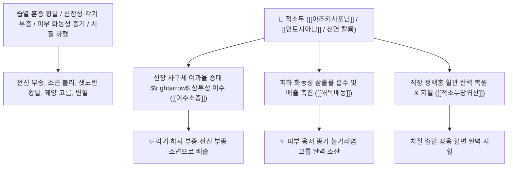

# 🌿 [[적소두]] (赤小豆, Phaseoli Radiati Semen / 붉은팥)

> **핵심 요약 (Key Summary)**:
> 콩과(*Fabaceae*) 팥(*Phaseolus angularis*)의 성숙한 붉은 씨앗(종자)
> 안토시아닌과 트리테르페노이드 사포닌 및 고농도 칼륨염이 신장 사구체 수분 배출을 촉진하고 혈관 투과성을 억제하여 행수소종 및 해독배농 작용 발휘
> [[상한론]]의 습열 발황(황달)·전신 수종·각기(脚氣) 하지 부종 및 피부 옹종 화농(고름)·치질 하혈(장옹 치루)을 치료하는 대표적인 [[이수소종]](利水消腫)·[[해독배농]](解毒排膿)·[[마황연교적소두탕]](麻黃連翹赤小豆湯)의 군약(君藥)

---
## 📌 목차
1. [기본 본초 정보 & 화학 구조 (Pharmacognosy)](#1-기본-본초-정보--화학-구조-pharmacognosy)
2. [핵심 분자약리 기전 & 안토시아닌·사포닌 삼투이수·배농 네트워크](#2-핵심-분자약리-기전--안토시아닌사포닌-삼투이수배농-네트워크)
3. [해부생체역학 / 신장 세뇨관 여과 & 피부 피하 농양 연계](#3-해부생체역학--신장-세뇨관-여과--피부-피하-농양-연계)
4. [사상의학 및 임상 응용 (하지 각기 부종 vs 치질 하혈 특화)](#4-사상의학-및-임상-응용-하지-각기-부종-vs-치질-하혈-특화)
5. [상한론 『약징(藥徵)』 분석 및 배오 원리 (마황연교적소두탕 & 적소두당귀산)](#5-상한론-약징藥徵-분석-및-배오-원리-마황연교적소두탕--적소두당귀산)
6. [핵심 처방 비교 매트릭스](#6-핵심-처방-비교-매트릭스)
7. [출처 및 학술 참고 문헌 (References)](#7-출처-및-학술-참고-문헌-references)

---
## 1. 기본 본초 정보 & 화학 구조 (Pharmacognosy)

> [!abstract]+ 🧪 3D 약리 분자 구조 (Interactive 3D Viewer)
> <iframe src="https://molecule-viewer-rho.vercel.app/?cid=14103656" style="width: 100%; height: 600px; border: none; border-radius: 12px; box-shadow: 0 4px 20px rgba(0,0,0,0.15);" allowfullscreen></iframe>


| 항목 | 상세 내용 |
| :--- | :--- |
| **기원 식물** | 콩과(Leguminosae / Fabaceae) 팥 *Phaseolus angularis* W. F. Wight의 성숙한 붉은 씨앗 |
| **성미 (性味)** | 甘·酸, 平 |
| **귀경 (歸經)** | 心·小腸經 (심경, 소장경) - **심장의 열을 내리고 소장 수도를 통리** |
| **효능 (Actions)** | [[이수소종]](利水消腫), [[해독배농]](解毒排膿), [[청열이습]](淸熱利濕), [[행수퇴황]](行水退黃) |
| **주요 성분** | • **안토시아닌 색소**: 시아니딘-3-글루코사이드(C3G), 델피니딘<br>• **트리테르펜 사포닌**: 아즈키사포닌(Azukisaponin I~VI)<br>• **비타민 및 미네랄**: [[비타민 B1]](다량), 칼륨($\text{K}^+$), 식이섬유, 엽산 |

> **[유래 및 본초학적 기전]**:
> * 붉은색(赤)의 작은 콩(小豆)으로, 우리가 즐겨 먹는 팥입니다.
> * 몸속의 넘쳐나는 궂은 물(수기 水氣)을 소변으로 시원하게 빼내어 **전신 부종과 다리가 붓는 각기병(脚氣)을 치료하는 천연 이뇨제**입니다.
> * 피하지방층에 맺힌 고름과 독소를 삭여 배출시키고, 치질로 피가 쏟아지는 장관 출혈을 멎게 합니다.

### 🔬 적소두의 주요 사포닌 및 안토시아닌 화학 구조
```
     [ 올레아난 사포닌 골격 ]───O──[ Glc - Rha 당사슬 ]  <-- 아즈키사포닌 II (Azukisaponin II)
```
> **[구조적 특징 및 이뇨/소염 활성]**: [[아즈키사포닌]]과 고농도 칼륨염은 신장 집합관의 수분 재흡수를 억제하여 삼투성 이뇨를 촉진하고, 모세혈관 투과성을 낮추어 피하 염증성 부종을 신속히 가라앉힙니다.

---
## 2. 핵심 분자약리 기전 & 안토시아닌·사포닌 삼투이수·배농 네트워크



### (1) 표적 이수소종 및 해독배농 작용
* **각기(脚氣) 및 전신 수종 배출 ([[이수소종]] 利水消腫)**:
  * 비타민 B1 부족으로 다리가 붓고 저리며 걷기 힘든 각기병과 신염 부종을 치료합니다.
* **습열 황달(黃疸) 소산 ([[마황연교적소두탕]])**:
  * 체표로 땀을 내고 아래로 소변을 빼내어 피부와 눈의 황달을 신속히 씻어냅니다.
* **치질 출혈 및 장옹 치료 ([[적소두당귀산]])**:
  * 대장 하부의 습열을 끄고 어혈을 풀어 치질로 피고름이 나오는 증상을 멎게 합니다.

---
## 3. 해부생체역학 / 신장 세뇨관 여과 & 피부 피하 농양 연계

* **직장 하부 정맥총(Hemorrhoidal Plexus) 울혈 완화**:
  * 배변 시 정맥압을 낮추어 치핵 탈출과 출혈을 방지합니다.

---
## 4. 사상의학 및 임상 응용 (하지 각기 부종 vs 치질 하혈 특화)

```
[✅ 최적 적응증 (Sweet Spot)]
• 습열 황달: 땀이 잘 안 나고 몸이 붓고 피부가 가려우며 황달이 올 때 ([[마황연교적소두탕]])
• 하지 각기 부종: 다리가 천근만근 무겁고 퉁퉁 부어오르는 상태
• 치질 출혈 및 만성 치루 ([[적소두당귀산]])
• 유방 멍울 및 젖 분비 부족(유즙 촉진)
```

---
## 5. 상한론 『약징(藥徵)』 분석 및 배오 원리 (마황연교적소두탕 & 적소두당귀산)

### (1) 상한론의 대표적 황달·치질 명방
* **핵심 배오 원리**:
  * [[적소두]] + [[마황]] + [[연교]] + [[상백피]] $\rightarrow$ 표리를 동시에 열어 습열 황달을 치료하는 불후의 명방 ([[마황연교적소두탕]])
  * [[적소두]] + [[당귀]] $\rightarrow$ 치질 출혈과 피고름을 치료하는 최고 배오 ([[적소두당귀산]])

---
## 6. 핵심 처방 비교 매트릭스

| 처방명 | 구성 약재 | 주치 병증 및 임상 타깃 | 특징 및 감별점 |
| :--- | :--- | :--- | :--- |
| [[마황연교적소두탕]] | [[적소두]], [[마황]], [[연교]], [[상백피]], [[생강]], [[대추|대조]], [[감초]] | **상한 양명병 습열 발황, 발열 오한, 신체 부종, 소변 불리** | 땀과 소변으로 황달을 소산 |
| [[적소두당귀산]] | [[적소두]], [[당귀]] (환/산제) | **치질 하혈, 선혈변, 장옹(피고름 섞인 대변), 복통** | 치질 출혈을 멎게 하는 명방 |
| [[적소두탕]] | [[적소두]], [[택사]], [[복령]], [[상백피]] | **각기 수종, 소변 불리, 각슬 산통, 천식 기급** | 다리의 수기를 빼내는 이수방 |

---
## 7. 출처 및 학술 참고 문헌 (References)

2. **대한민국약전(KP) 제12개정 (2022)**. 생약규격집: 적소두 (Phaseoli Radiati Semen) 규격 기준.
   - **[공정서 규격]**: 팥 종자의 성상, 순도시험 및 건조감량 12.0% 이하 기준 명시.
