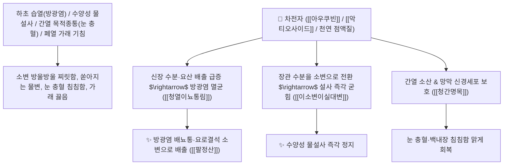

# 🌿 [[차전자]] (車前子, Plantaginis Semen / 질경이씨앗)

> **핵심 요약 (Key Summary)**:
> 질경이과(*Plantaginaceae*) 질경이(*Plantago asiatica*)의 건조한 성숙 종자(씨앗)
> 이리도이드 배당체인 [[아우쿠빈]](Aucubin)과 페닐프로파노이드 [[악티오사이드]](Acteoside) 및 수용성 점액질이 신장 사구체 수분과 요산 배설을 촉진하고 망막 혈관을 보호하여 청열이습 및 청간명목 작용 발휘
> 습열(濕熱)로 인한 방광염 요도통(임병 淋病·소변 찔끔거림)·수양성 물설사(이소변이실대변 利小便以實大便) 및 간열 안구 충혈·눈 침침함(목적종통)·가래 끓는 기침을 치료하는 천하제일의 [[청열이뇨통림]](淸熱利尿通淋)·[[청간명목]](淸肝明目)·[[팔정산]](八正散)의 군약(君藥)

---
## 📌 목차
1. [기본 본초 정보 & 화학 구조 (Pharmacognosy)](#1-기본-본초-정보--화학-구조-pharmacognosy)
2. [핵심 분자약리 기전 & 아우쿠빈·악티오사이드·삼투이뇨·명목 네트워크](#2-핵심-분자약리-기전--아우쿠빈악티오사이드삼투이뇨명목-네트워크)
3. [해부생체역학 / 방광 삼각부 상피 & 망막 미세혈관망 연계](#3-해부생체역학--방광-삼각부-상피--망막-미세혈관망-연계)
4. [사상의학 및 임상 응용 (이소변이실대변 지사 vs 간열 안질환)](#4-사상의학-및-임상-응용-이소변이실대변-지사-vs-간열-안질환)
5. [고전 의학 및 배오 원리 (팔정산 & 차전자산)](#5-고전-의학-및-배오-원리-팔정산--차전자산)
6. [핵심 처방 비교 매트릭스](#6-핵심-처방-비교-매트릭스)
7. [출처 및 학술 참고 문헌 (References)](#7-출처-및-학술-참고-문헌-references)

---
## 1. 기본 본초 정보 & 화학 구조 (Pharmacognosy)

> [!abstract]+ 🧪 3D 약리 분자 구조 (Interactive 3D Viewer)
> <iframe src="https://molecule-viewer-rho.vercel.app/?cid=91458" style="width: 100%; height: 600px; border: none; border-radius: 12px; box-shadow: 0 4px 20px rgba(0,0,0,0.15);" allowfullscreen></iframe>


| 항목 | 상세 내용 |
| :--- | :--- |
| **기원 식물** | 질경이과(Plantaginaceae) 질경이 *Plantago asiatica* L. 또는 털질경이의 여문 씨앗 |
| **성미 (性味)** | 甘, 微寒 (달고 약간 서늘하며 미끄러움) |
| **귀경 (歸經)** | 肝·腎·肺·小腸經 (간경, 신경, 폐경, 소장경) - **하초 수도를 통리하고 간열을 식혀 눈을 밝힘** |
| **효능 (Actions)** | [[청열이뇨통림]](淸熱利尿通淋), [[청간명목]](淸肝明目), [[거담지해]](祛痰止咳), [[삽장지사]](澀腸止瀉) |
| **주요 성분** | • **이리도이드 배당체**: [[아우쿠빈]] (Aucubin), 제니포시드산, 플란타고사이드<br>• **페닐프로파노이드 배당체(핵심 지표)**: [[악티오사이드]] (Acteoside / Verbascoside, KP 규격 $\ge 0.40\%$)<br>• **천연 다당류 점액질(함량 20% 이상)**: 플란타고-뮤실리지(Plantago-mucilage A) |

> **[유래 및 본초학적 기전]**:
> * 마차가 지나다니는 길바닥(車前)의 수레바퀴 자국에서도 강인하게 밟히며 자라 '차전자(車前子)'라 불렸습니다.
> * 몸속의 넘쳐나는 습열(濕熱)을 마차에 태워 보내듯 소변으로 시원하게 쏟아내어 **방광염 배뇨통과 전신 부종을 치료하는 대표적인 이뇨약**입니다.
> * 장관의 궂은 물을 소변으로 돌려 쏟아지는 물설사를 멎게 하는 [[이소변이실대변]](利小便以實大便)의 원리를 실현하는 지사제이며, 간열을 꺼서 눈을 맑게 합니다.

### 🔬 차전자의 주요 아우쿠빈 및 악티오사이드 구조
```
     [ 이리도이드 모노테르펜 골격 ]───O──[ D-글루코오스 ]  <-- 아우쿠빈 (Aucubin)
```
> **[구조적 특징 및 이뇨/간보호]**: [[아우쿠빈]]은 간세포의 지질과산화를 억제하고 신장 요세관의 수분 및 요산 배설을 유도하며, [[악티오사이드]]는 망막 신경세포를 산화 스트레스로부터 보호합니다.

---
## 2. 핵심 분자약리 기전 & 아우쿠빈·악티오사이드·삼투이뇨·명목 네트워크



### (1) 표적 청열이뇨통림 및 지사 작용
* **급만성 방광염 및 요로결석 배출 ([[청열이뇨통림]] 淸熱利尿通淋)**:
  * 소변을 볼 때 요도가 불타듯 아프고 피가 섞여 나오는 임병을 시원하게 씻어냅니다 ([[팔정산]]).
* **수양성 설사 정지 ([[이소변이실대변]] 利小便以實大便)**:
  * 장관에 물이 가득 차 쏟아지는 물설사를 할 때, 수분을 신장으로 돌려 소변을 시원하게 보게 함으로써 설사를 멎게 합니다.
* **간열 안구 충혈 및 시력 감퇴 완치 ([[청간명목]] 淸肝明目)**:
  * 눈이 벌겋게 붓고 눈곱이 끼며 눈앞이 침침한 안과 질환을 다스립니다.

---
## 3. 해부생체역학 / 방광 삼각부 상피 & 망막 미세혈관망 연계

* **방광 점막 GAG(글리코사미노글리칸) 보호층 수복**:
  * 요로 상피의 세균 부착을 방지하여 재발성 방광염을 예방합니다.

---
## 4. 사상의학 및 임상 응용 (이소변이실대변 지사 vs 간열 안질환)

```
[✅ 최적 적응증 (Sweet Spot)]
• 급성 방광염 및 요도염: 배뇨통, 빈뇨, 잔뇨감, 혈뇨 ([[팔정산]])
• 여름철 설사 및 소아 물설사 (수분 대사 불균형)
• 안구 건조증, 만성 결막염, 노인성 백내장 시력 저하
• 기관지염으로 끈적한 가래가 끓는 기침

[⚠️ 전탕 수칙 (포제)]
• 씨앗이 미세하고 점액질이 많아 국물을 탁하게 하므로 반드시 천 주머니에 싸서 달이는 포전(包煎)을 시행
```

---
## 5. 고전 의학 및 배오 원리 (팔정산 & 차전자산)

### (1) 비뇨기 습열을 씻어내는 최고 명방: 팔정산(八正散)
* **청열통림 최고 배오**:
  * [[차전자]] + [[목통]] + [[활석]] + [[구맥]] + [[편축]] + [[치자]] $\rightarrow$ 요로 감염을 씻어내는 불후의 명방 ([[팔정산]])
  * [[차전자]] + [[숙지황]] + [[구기자]] $\rightarrow$ 간신을 보하고 눈을 밝힘

---
## 6. 핵심 처방 비교 매트릭스

| 처방명 | 구성 약재 | 주치 병증 및 임상 타깃 | 특징 및 감별점 |
| :--- | :--- | :--- | :--- |
| [[팔정산]] | [[차전자]], [[목통]], [[활석]], [[구맥]], [[편축]], [[치자]], [[대황]], [[감초]] | **습열 하주, 열림, 혈림, 소변 불통, 요도 작열통, 구갈** | 비뇨기 습열을 씻어내는 황제방 |
| [[차전자산]] | [[차전자]], [[백복령]], [[저령]], [[택사]], [[감초]] | **수종 창만, 소변 불리, 수양성 설사, 각기 부종** | 수분을 소변으로 빼내어 설사 정지 |
| [[도적산]](가미) | [[생지황]], [[목통]], [[죽엽]], [[차전자]] | 심열 소장 전이, 구설생창, 소변 적삽열통 | 심장의 열을 소변으로 뺌 |

---
## 7. 출처 및 학술 참고 문헌 (References)

1. **Michaelsen TE et al. (2000)**. Interaction between human complement and a pectin type polysaccharide fraction, PMII, from the leaves of Plantago major L. *Scandinavian journal of immunology*, 52(5): 483-90. [PMID: 11119247](https://pubmed.ncbi.nlm.nih.gov/11119247/)
   - **[연구 요약]**: 차전자의 아우쿠빈 및 다당체 점액질이 요산 배출, 이뇨 촉진 및 항염증·점막 수복 활성을 나타냄을 종합 규명.
2. **대한민국약전(KP) 제12개정 (2022)**. 의약품각조 제2부: 차전자 (Plantaginis Semen) 규격 기준.
   - **[공정서 규격]**: 건조 종자 기준 악티오사이드($\text{C}_{29}\text{H}_{36}\text{O}_{15}$) 0.40% 이상 함유 필수 규격 명시.
