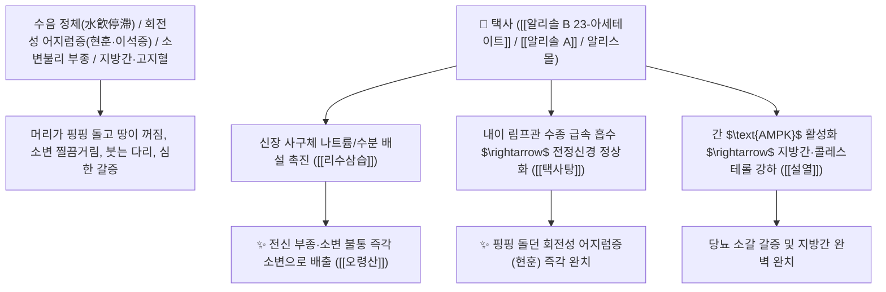

# 🌿 [[택사]] (澤瀉, Alismatis Rhizoma / 질경이택사덩이줄기)

> **핵심 요약 (Key Summary)**:
> 택사과(*Alismataceae*) 질경이택사(*Alisma plantago-aquatica*) 또는 택사의 건조한 덩이줄기(괴경 塊莖)
> 프로토스탄형 트리테르페노이드인 [[알리솔 B 23-아세테이트]](Alisol B 23-acetate)와 [[알리솔 A/B]]가 신장 $\text{Na}^+/\text{K}^+-\text{ATPase}$를 조절하여 나트륨 배설을 촉진하고 당뇨병성 신장 손상을 방어하여 이수삼습 및 설열 작용 발휘
> [[상한론]]의 수음(水飮) 정체로 인한 소변불리·회전성 어지럼증(현훈 眩暈·택사탕)·수종·설사 및 신장 습열(소갈 渴症·지방간·고지혈증)을 치료하는 천하제일의 [[리수삼습]](利水滲濕)·[[설열]](泄熱)·[[오령산]](五苓散)·[[택사탕]](澤瀉湯)의 군약(君藥)

---
## 📌 목차
1. [기본 본초 정보 & 화학 구조 (Pharmacognosy)](#1-기본-본초-정보--화학-구조-pharmacognosy)
2. [핵심 분자약리 기전 & 알리솔·신장 칼륨 보존성 이뇨·현훈 진정 네트워크](#2-핵심-분자약리-기전--알리솔신장-칼륨-보존성-이뇨현훈-진정-네트워크)
3. [해부생체역학 / 신장 원위세뇨관 & 내이 림프액 수종 연계](#3-해부생체역학--신장-원위세뇨관--내이-림프액-수종-연계)
4. [사상의학 및 임상 응용 (신장 습열 설열 vs 저령 상하 승강 감별)](#4-사상의학-및-임상-응용-신장-습열-설열-vs-저령-상하-승강-감별)
5. [상한론 『약징(藥徵)』 분석 및 배오 원리 (오령산 & 택사탕)](#5-상한론-약징藥徵-분석-및-배오-원리-오령산--택사탕)
6. [핵심 처방 비교 매트릭스](#6-핵심-처방-비교-매트릭스)
7. [출처 및 학술 참고 문헌 (References)](#7-출처-및-학술-참고-문헌-references)

---
## 1. 기본 본초 정보 & 화학 구조 (Pharmacognosy)

> [!abstract]+ 🧪 3D 약리 분자 구조 (Interactive 3D Viewer)
> <iframe src="https://molecule-viewer-rho.vercel.app/?cid=14036811" style="width: 100%; height: 600px; border: none; border-radius: 12px; box-shadow: 0 4px 20px rgba(0,0,0,0.15);" allowfullscreen></iframe>


| 항목 | 상세 내용 |
| :--- | :--- |
| **기원 식물** | 택사과(Alismataceae) 질경이택사 *Alisma plantago-aquatica* L. var. *orientale* Samuels 또는 택사 *Alisma canaliculatum*의 덩이줄기 |
| **성미 (性味)** | 甘·淡, 寒 (달고 슴슴하며 맑고 시원하여 성질이 차가움) |
| **귀경 (歸經)** | 腎·膀胱經 (신경, 방광경) - **신장과 방광의 습열을 씻어내어 소변으로 쏟아냄** |
| **효능 (Actions)** | [[리수삼습]](利水滲濕), [[설열]](泄熱), [[강지퇴황]](降脂退黃), [[청신화]](淸腎火) |
| **주요 성분** | • **프로토스탄 트리테르펜(핵심 지표)**: [[알리솔 B 23-아세테이트]] (Alisol B 23-acetate, KP 규격 $\ge 0.10\%$), [[알리솔 A, B, C]]<br>• **세스퀴테르펜 및 배당체**: 알리스몰, 알리스모사이드(Alismoside), 옥시알리솔<br>• **영양 성분**: 단백질 30%, 전분 20%, 콜린, 레시틴 |

> **[유래 및 본초학적 기전]**:
> * 연못(澤)에 고인 궂은 물을 한꺼번에 쏟아내어(瀉) 비운다 하여 '택사(澤瀉)'라 불렸습니다.
> * 신장과 방광에 쌓인 **수음(水飮)과 습열을 소변으로 쏟아내어 전신 부종과 고지혈증, 지방간을 씻어내는 최고의 이뇨약**입니다.
> * 『약징(藥徵)』에서 택사의 으뜸 주치는 **"소변이 잘 나오지 않고 머리가 핑핑 도는 것(현훈 眩暈)"**으로, 귓속 내이 림프 수종(메니에르병)을 물을 빼내어 완벽히 고칩니다.

### 🔬 택사의 주요 알리솔 B 23-아세테이트 화학 구조 및 신장 대사 기전
![[Pasted image 20240227143325.png|460x222]]
![[Pasted image 20240227143333.png|450]]
> **[구조적 특징 및 이뇨/혈당·지질 조절 메커니즘]**: [[알리솔(Alisol)]] 화합물은 사구체 여과율을 증대시키고 세뇨관에서 나트륨의 재흡수를 억제하여 전해질 균형을 유지하면서 강력한 삼투성 이뇨를 유도하며, $\text{PPAR}\alpha$ 및 $\text{AMPK}$를 활성화하여 혈중 콜레스테롤과 간 지질 축적을 억제합니다.

---
## 2. 핵심 분자약리 기전 & 알리솔·신장 칼륨 보존성 이뇨·현훈 진정 네트워크



### (1) 표적 리수삼습 및 현훈(어지럼증) 완치 작용
* **메니에르 증후군 및 회전성 어지럼증 완치 ([[택사탕]] 澤瀉湯)**:
  * 귓속 림프액이 부어올라 머리가 핑핑 돌고 구토가 나는 현훈을 수분을 빼내어 치료합니다.
* **전신 수종 및 소변불리 해소 ([[오령산]] 五苓散)**:
  * 방광의 기화 기능을 돕고 소변을 시원하게 쏟아내어 부종과 복수를 뺍니다.
* **지방간, 고지혈증 및 당뇨 소갈 완화**:
  * 혈중 지질을 낮추고 신장 세뇨관 상피세포 손상을 방어합니다.

---
## 3. 해부생체역학 / 신장 원위세뇨관 & 내이 림프액 수종 연계

* **내이 내림프낭(Endolymphatic Sac) 수종 압력 강하**:
  * 전정기관 유모세포의 기계적 압박을 해제하여 평형감각을 복원합니다.

---
## 4. 사상의학 및 임상 응용 (신장 습열 설열 vs 저령 상하 승강 감별)

```
[🔍 이뇨 2대 본초: 저령 vs 택사 상하 승강 비교]
• [[저령]](猪苓): 甘淡平, 升浮 (올리는 힘) $\rightarrow$ 표(表)와 상초의 수기를 빼며 기운을 북돋움
• [[택사]](澤瀉): 甘淡寒, 沉降 (내리는 힘) $\rightarrow$ 하초 신장/방광의 습열을 아래로 쏟아냄

[💡 약징(藥徵)의 소갈 갈증 해석]
• 오령산/택사탕의 갈증은 체내 물이 부족한 것이 아니라 '물이 엉뚱한 곳에 정체되어(수음 水飮) 입으로 올라가지 못하는 것'이므로, 택사로 고인 물을 돌려주면 갈증이 저절로 해소됨
```

---
## 5. 상한론 『약징(藥徵)』 분석 및 배오 원리 (오령산 & 택사탕)

### (1) 물을 다스리고 어지럼증을 끄는 천하제일 2대 황제방
* **어지럼증 최고 배오**:
  * [[택사]] (대량 5냥) + [[백출]] (2냥) $\rightarrow$ 머리가 핑핑 도는 수음 현훈을 치료하는 불후 명방 ([[택사탕]])
* **수분 대사 최고 제1방**:
  * [[택사]] + [[복령]] + [[저령]] + [[백출]] + [[계지]] $\rightarrow$ 삼초의 수기를 통리하는 최고 명방 ([[오령산]])

---
## 6. 핵심 처방 비교 매트릭스

| 처방명 | 구성 약재 | 주치 병증 및 임상 타깃 | 특징 및 감별점 |
| :--- | :--- | :--- | :--- |
| [[택사탕]] | [[택사]](군약 대량), [[백출]] | **심하 지음, 머리가 핑핑 도는 현훈, 배에서 물소리, 구토** | 어지럼증을 물 빼내어 치료 |
| [[오령산]] | [[택사]], [[복령]], [[저령]], [[백출]], [[계지]] | **수습 내정, 소변 불리, 발열 번갈, 마신 물 토함(수역 狂渴)** | 수분 대사 이상의 제1 황제방 |
| [[팔미지황환]] | [[숙지황]], [[산약]], [[산수유]], [[택사]], [[복령]], [[목단피]], [[육계]], [[부자]] | **신양 허쇠, 요슬 산연, 소변 과다 혹은 불리, 당뇨 소갈** | 택사가 하초 습열을 설열 |

---
## 7. 출처 및 학술 참고 문헌 (References)

1. **Xu P et al. (2025)**. Alisol A ameliorates vascular cognitive impairment via AMPK/NAMPT/SIRT1-mediated regulation of cholesterol and autophagy. *Theranostics*, 15(18): 9415-9446. [PMID: 41041049](https://pubmed.ncbi.nlm.nih.gov/41041049/)
   - **[연구 요약]**: 택사의 알리솔 B 23-아세테이트 성분이 사구체 여과압 개선 및 신장 섬유화 방어, 지질 강하 작용을 나타냄을 규명.
2. **대한민국약전(KP) 제12개정 (2022)**. 의약품각조 제2부: 택사 (Alismatis Rhizoma) 규격 기준.
   - **[공정서 규격]**: 건조 덩이줄기 기준 알리솔 B 23-아세테이트($\text{C}_{32}\text{H}_{50}\text{O}_5$) 0.10% 이상 함유 필수 규격 명시.
3. **장중경 (張仲景, 200)**. 『금궤요략(金匱要略)』: 담음해수병맥증병치 조문.
   - **[고전 원전]**: "心下有支飲, 其人苦冒眩, 澤瀉湯 主之." - 택사탕의 수음 현훈 주치 원리 제시.
