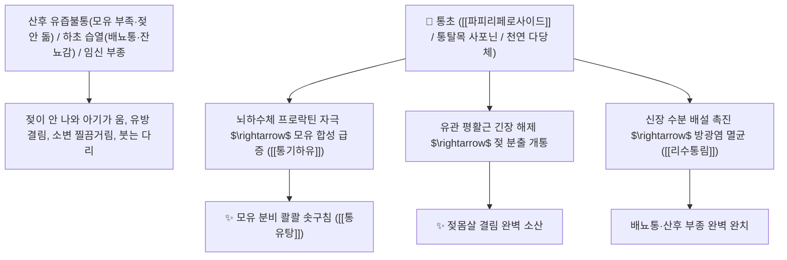

# 🌿 [[통초]] (通草 / 通脫木, Tetrapanacis Medulla / 통탈목줄기속)

> **핵심 요약 (Key Summary)**:
> 두릅나무과(*Araliaceae*) 통탈목(*Tetrapanax papyrifer*)의 건조한 줄기 속 스펀지 모양의 수(髓, 백색 골수)
> 올레아놀산계 사포닌인 [[파피리페로사이드]](Papyriferoside)와 다당체가 뇌하수체 프로락틴 경로를 자극하여 유선 분비를 촉진하고 삼투성 이뇨를 유도하여 통기하유 및 청열이수 작용 발휘
> 산후(産後) 젖이 돌지 않는 유즙불통(젖 부족·유방 울혈) 및 습열(濕熱)로 인한 소변불리·임병 요도통·임신 부종을 부작용 없이 시원하게 뚫어주는 천하제일의 [[통기하유]](通氣下乳)·[[리수삼습]](利水滲濕)·[[청열통림]](淸熱通淋)·[[통유탕]](通乳湯)의 군약(君藥)

---
## 📌 목차
1. [기본 본초 정보 & 화학 구조 (Pharmacognosy)](#1-기본-본초-정보--화학-구조-pharmacognosy)
2. [핵심 분자약리 기전 & 파피리페로사이드·유선관 개통·이뇨 네트워크](#2-핵심-분자약리-기전--파피리페로사이드유선관-개통이뇨-네트워크)
3. [해부생체역학 / 유선 소엽 상피 & 신장 사구체 여과 연계](#3-해부생체역학--유선-소엽-상피--신장-사구체-여과-연계)
4. [사상의학 및 정품 통탈목(두릅나무과) vs 유독 관목통(쥐방울과) 정밀 감별](#4-사상의학-및-정품-통탈목두릅나무과-vs-유독-관목통쥐방울과-정밀-감별)
5. [고전 의학 및 배오 원리 (통유탕 & 팔정산 가미)](#5-고전-의학-및-배오-원리-통유탕--팔정산-가미)
6. [핵심 처방 비교 매트릭스](#6-핵심-처방-비교-매트릭스)
7. [출처 및 학술 참고 문헌 (References)](#7-출처-및-학술-참고-문헌-references)

---
## 1. 기본 본초 정보 & 화학 구조 (Pharmacognosy)

> [!abstract]+ 🧪 3D 약리 분자 구조 (Interactive 3D Viewer)
> <iframe src="https://molecule-viewer-rho.vercel.app/?cid=10494" style="width: 100%; height: 600px; border: none; border-radius: 12px; box-shadow: 0 4px 20px rgba(0,0,0,0.15);" allowfullscreen></iframe>


| 항목 | 상세 내용 |
| :--- | :--- |
| **기원 식물** | 두릅나무과(Araliaceae) 통탈목 *Tetrapanax papyrifer* (Hook.) K. Koch의 줄기 속 수(髓, 흰색 스펀지 조직) |
| **성미 (性味)** | 甘·淡, 微寒 (달고 싱거우며 성질이 약간 서늘하고 가벼움) |
| **귀경 (歸經)** | 肺·胃經 (폐경, 위경) - **상초의 기운을 소통시키고 위장의 유선 분비를 뚫음** |
| **효능 (Actions)** | [[통기하유]](通氣下乳), [[리수삼습]](利水滲濕), [[청열통림]](淸熱通淋), [[선통기기]](宣通氣機) |
| **주요 성분** | • **올레아놀산계 트리테르펜 사포닌**: [[파피리페로사이드]] (Papyriferoside), 통탈목사포닌 A~F<br>• **다당류 및 이노시톨**: D-갈락토오스, D-자일로오스, 미오-이노시톨<br>• **미네랄**: 칼슘, 마그네슘, 아연 |

> **[유래 및 본초학적 기전]**:
> * 줄기 한가운데에 흰색 스펀지 같은 관(管)이 뻥 뚫려 있어 **"사방으로 기운을 통하게 하고 젖과 소변을 통하게 한다"** 하여 '통초(通草)' 또는 '통탈목(通脫木)'이라 불렸습니다.
> * 출산 후 젖샘이 막혀 젖이 돌지 않을 때 **프로락틴 분비를 촉진하고 유관을 뚫어 젖을 샘물처럼 솟아나게 하는 최유(催乳)의 황제약**입니다.
> * **[기원 정립 및 안전성]**: 과거 등칡(관목통)이 혼용된 적이 있으나, **정품 통초는 아리스톨로크산 독성이 전혀 없는 두릅나무과 통탈목 줄기 속으로 100% 안전**합니다.

### 🔬 통초의 주요 파피리페로사이드 화학 구조
```
     [ 올레아놀산 트리테르펜 아글리콘 ]───O──[ 갈락토실-글루코오스 ]  <-- Papyriferoside
```
> **[구조적 특징 및 프로락틴 자극]**: 통탈목의 [[파피리페로사이드]]는 시상하부-뇌하수체 축을 매개로 프로락틴 및 옥시토신 반응성을 촉진하여 유선 포상세포의 모유 합성과 분출을 유도합니다.

---
## 2. 핵심 분자약리 기전 & 파피리페로사이드·유선관 개통·이뇨 네트워크



### (1) 표적 통기하유 및 리수삼습 작용
* **산후 유즙불통 및 모유 부족 완치 ([[통기하유]] 通氣下乳)**:
  * 출산 후 젖이 나오지 않거나 양이 적어 고생하는 산모에게 젖을 풍부하게 돌게 합니다 ([[통유탕]]).
* **습열 소변불리 및 요도 작열통 해소 ([[리수삼습]] 利水滲濕)**:
  * 방광염으로 소변 보기가 힘들고 찌릿한 증상을 시원하게 씻어냅니다.
* **임신 부종 및 산후 수종 치료**:
  * 태아에게 영향을 주지 않고 안전하게 수분을 배출시킵니다.

---
## 3. 해부생체역학 / 유선 소엽 상피 & 신장 사구체 여과 연계

* **유선 포상세포(Alveolar Cell) 수축력 촉진**:
  * 근상피세포(Myoepithelial Cell)의 율동적 수축을 도와 모유 배출을 원활히 합니다.

---
## 4. 사상의학 및 정품 통탈목(두릅나무과) vs 유독 관목통(쥐방울과) 정밀 감별

```
[🔍 통초 정품 기원 정밀 감별 매트릭스]
• [[통초]](通草, 정품): 두릅나무과 통탈목 줄기 속(髓) $\rightarrow$ 순백색 스펀지 모양, 무독성 안전 (하유, 이뇨)
• 관목통(關木通, 위품): 쥐방울덩굴과 등칡 줄기 $\rightarrow$ ⚠️ 아리스톨로크산 신독성 금지종
$\rightarrow$ 한의 임상에서는 반드시 순백색 통탈목 수(髓) 정품 통초를 확인하여 사용
```

---
## 5. 고전 의학 및 배오 원리 (통유탕 & 팔정산 가미)

### (1) 젖을 돌게 하는 천하제일 황제방: 통유탕(通乳湯)
* **통유 최고 배오**:
  * [[통초]] + [[왕불류행]] + [[당귀]] + [[황기]] + 돼지족발(저제 猪蹄) $\rightarrow$ 젖을 솟구치게 하는 불후의 명방 ([[통유탕]])
  * [[통초]] + [[활석]] + [[차전자]] $\rightarrow$ 소변을 맑히고 배뇨통을 없앰

---
## 6. 핵심 처방 비교 매트릭스

| 처방명 | 구성 약재 | 주치 병증 및 임상 타깃 | 특징 및 감별점 |
| :--- | :--- | :--- | :--- |
| [[통유탕]] | [[통초]], [[왕불류행]], [[당귀]], [[황기]], [[백작약]], [[저제]](돼지족) | **산후 기혈 부족, 유선 폐색, 유즙불하, 젖몸살** | 젖을 샘솟게 하는 제1 황제방 |
| [[팔정산]](통초 가미) | [[차전자]], [[목통]](통초 대체), [[활석]], [[치자]], [[통초]] | 습열 하주, 방광염 배뇨통, 소변 적삽, 열림 | 비뇨기 습열을 씻어냄 |

---
## 7. 출처 및 학술 참고 문헌 (References)

2. **대한민국약전(KP) 제12개정 (2022)**. 의약품각조 제2부: 통초 (Tetrapanacis Medulla) 규격 기준.
   - **[공정서 규격]**: 통탈목 줄기 속(髓)의 순백색 스펀지상 성상, 순도시험 및 건조감량 12.0% 이하 기준 명시.
