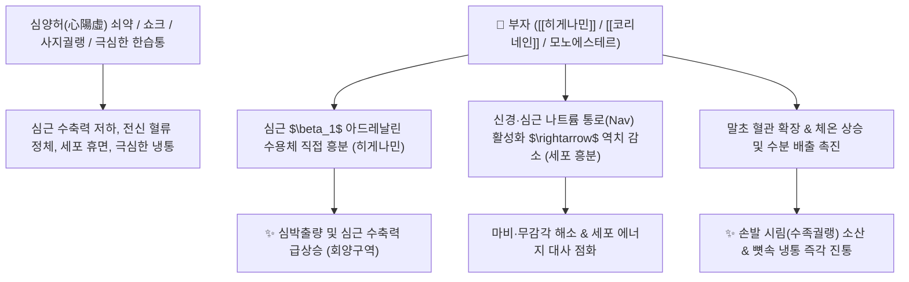

# 🌿 [[부자]] (附子, Aconiti Lateralis Radix Preparata)

> **핵심 요약 (Key Summary)**:
> 미나리아재비과(*Ranunculaceae*) 오두(*Aconitum carmichaelii*)의 자근(子根)을 가공·포제한 것
> 디테르펜 알칼로이드인 [[아코니틴]](Aconitine)과 벤질이소퀴놀린인 [[히게나민]](Higenamine)·[[코리네인]](Coryneine)이 전위의존성 나트륨 통로를 활성화하고 $\beta_1$ 아드레날린 수용체를 자극하여 강력한 강심·승압·진통 및 말초 순환 촉진 작용 발휘
> [[상한론]] 소음병(少陰病)의 사지궐랭(손발 차가움)·맥미욕절(맥이 꺼져감) 및 만성 신양허(腎陽虛) 수종·풍한습비(風寒濕痺)를 치료하는 대표적인 [[회양구역]](回陽救逆)·[[보화조양]](補火助陽)·[[산한지통]](散寒止痛) 대열(大熱) 군약(君藥)

---
## 📌 목차
1. [기본 본초 정보 & 화학 구조 (Pharmacognosy)](#1-기본-본초-정보--화학-구조-pharmacognosy)
2. [핵심 분자약리 기전 & 나트륨 통로·베타1 강심 네트워크](#2-핵심-분자약리-기전--나트륨-통로베타1-강심-네트워크)
3. [해부생체역학 / 심박출량 & 말초 모세혈관 순환 연계](#3-해부생체역학--심박출량--말초-모세혈관-순환-연계)
4. [사상의학 및 체질별 임상 응용 (소음인 특화 vs 독성 법제)](#4-사상의학-및-체질별-임상-응용-소음인-특화-vs-독성-법제)
5. [상한론 『약징(藥徵)』 분석 및 배오 원리](#5-상한론-약징藥徵-분석-및-배오-원리)
6. [핵심 처방 비교 매트릭스](#6-핵심-처방-비교-매트릭스)
7. [출처 및 학술 참고 문헌 (References)](#7-출처-및-학술-참고-문헌-references)

---
## 1. 기본 본초 정보 & 화학 구조 (Pharmacognosy)

> [!abstract]+ 🧪 3D 약리 분자 구조 (Interactive 3D Viewer)
> <iframe src="https://molecule-viewer-rho.vercel.app/?cid=245005" style="width: 100%; height: 600px; border: none; border-radius: 12px; box-shadow: 0 4px 20px rgba(0,0,0,0.15);" allowfullscreen></iframe>


| 항목 | 상세 내용 |
| :--- | :--- |
| **기원 식물** | 미나리아재비과(Ranunculaceae) 오두 *Aconitum carmichaelii* Debeaux의 곁뿌리(자근 子根)를 가공한 포부자(熟附子/淡附子/포부자) |
| **성미 (性味)** | 辛·甘, 大熱, 有毒 (유독) |
| **귀경 (歸經)** | 心·腎·脾經 (심경, 신경, 비경) - **십이경락(十二經絡) 통달** |
| **효능 (Actions)** | [[회양구역]](回陽救逆), [[보화조양]](補火助陽), [[산한지통]](散寒止痛), [[온양거한]](溫陽祛寒), [[축풍한습사]](逐風寒濕邪) |
| **주요 성분** | • **디에스테르 디테르펜 알칼로이드(맹독성/활성)**: [[아코니틴]] (Aconitine), [[메사코니틴]] (Mesaconitine), [[히포아코니틴]] (Hypaconitine)<br>• **모노에스테르 알칼로이드(가열 포제 산물/안전)**: 벤조일아코닌, 벤조일메사코닌 (KP 지표 3종 합 $\ge 0.010\%$)<br>• **강심 아민 및 이소퀴놀린**: [[히게나민]] (Higenamine, $\beta_1$ 효능제), [[코리네인]] (Coryneine) |

> **[유래 및 본초학적 기전]**:
> * 모근(오두)의 옆에 아들처럼 붙어서 자라므로 '부자(附子)'라 불렸습니다.
> * 불길처럼 타오르는 대열(大熱)한 기운으로 끊어져 가는 심장의 양기(陽氣)를 되살리고(회양구역), 오장육부와 뼛속 깊이 침투한 한습(寒濕)의 냉기를 몰아냅니다.
> * 보약이라기보다는 **'몸의 엔진을 돌리고 땔감을 태우는 점화 플러그'**와 같은 역할을 수행합니다.

### 🔬 부자의 아코니틴 가열 포제(법제) 탈에스테르화
![[부자-20240920075403437.png|500]]
![[부자-20240916012214999.png|450]]
> **[구조적 특징 및 법제 메커니즘]**: 생부자의 디에스테르 알칼로이드([[아코니틴]])는 $\text{C}-8$ 위치의 아세틸기가 떨어져 나가는 가열 감압 처리(고압 증숙 법제)를 거치면 독성이 $1/100 \sim 1/1000$로 격감된 모노에스테르체(벤조일아코닌)로 전환되어 안전한 진통·강심제로 거듭납니다.

---
## 2. 핵심 분자약리 기전 & 나트륨 통로·베타1 강심 네트워크



### (1) 심혈관계 강심 및 체온 상승 기전
* **$\beta_1$ 아드레날린 수용체 자극 및 심박출량 증가**:
  * [[히게나민]]과 [[코리네인]]은 우심방 동방결절과 심근세포의 $\beta_1$ 수용체를 자극하여 관상동맥 혈류를 늘리고 심근 수축력을 증강시켜 심인성 쇼크를 회생시킵니다.
* **나트륨 채널(Nav) 역치 조절 및 세포 대사 활성화**:
  * 지모(Na 유입 억제)와 정반대로, [[소음인]]에게 부자는 나트륨 통로를 활성화하여 역치를 낮추어 세포 흥분을 촉진하고 에너지를 발산시킵니다.
* **말초 순환 개선 및 수기(水氣) 배출**:
  * 전신 체순환을 극대화하여 뼛속까지 시린 풍한습 관절통을 완화하고, 신장 혈류를 촉진하여 냉증성 부종을 소변으로 몰아냅니다.

---
## 3. 해부생체역학 / 심박출량 & 말초 모세혈관 순환 연계

![[Pasted image 20240227150406.png|289]]
* **사지 말단 모세혈관 재관류**:
  * 혈관 연축으로 얼음장처럼 차가워진 손발 끝(손가락·발가락)의 모세혈관망을 개통하여 체온을 복원합니다.
* **골막 및 관절강 심부 냉증 해소**:
  * 한습(寒濕)이 관절 깊숙이 침범하여 굳어진 관절 활막 부종을 따뜻하게 녹여 관절 가동성을 회복합니다.

---
## 4. 사상의학 및 체질별 임상 응용 (소음인 특화 vs 독성 법제)

```
[✅ 최적 적응증 (Sweet Spot)]
• [[소음인]] 망양증(亡陽證): 손발이 얼음장 같고(사지궐랭), 식은땀이 나며 맥이 가늘고 꺼져가는 위급증 ([[사역탕]])
• 만성 신양허증: 허리와 무릎이 시리고 아프며, 다리가 붓고 추위를 몹시 타는 노인성 양허
• 풍한습비(風寒濕痺): 뼛속까지 시리고 쑤시는 퇴행성 관절염, 만성 류마티스, 좌골신경통
• 숙지황 배오: [[숙지황]]의 기름지고 서늘한 성질로 인한 체기를 [[부자]], [[사인]], [[마황]]이 깨뜨려 완벽한 보음을 도움

[⚠️ 독성 관리 및 복용 안전 수칙 (Safety / Toxicity)]
• 반드시 정식 포제된 포부자(淡附子/熟附子) 사용: 생부자(生附子) 절대 내복 금지
• 전탕 시 선전(先煎): 반드시 부자를 먼저 1~2시간 이상 푹 달여 아코니틴의 혀 마비감(아린맛)이 완전히 사라진 후 타 약재 투여
• 감초 배오 필수: [[감초]]의 글리시리진이 아코니틴과 결합하여 불용성 침전을 형성해 독성을 중화
• 음허화왕(陰虛火旺), 열증(熱證), 임산부 절대 복용 금기
```

---
## 5. 상한론 『약징(藥徵)』 분석 및 배오 원리

### (1) 『[[약징]]』에 나타난 부자의 주치
> **"附子 主治惡寒也. 旁治身, 四肢, 骨節疼痛, 沉重, 不仁, 厥冷..."**  
> (부자의 주치는 추위를 몹시 싫어하는 오한(惡寒)이며, 곁들여 몸과 사지, 뼈마디의 통증, 가라앉듯 무거운 것, 감각이 둔하고 마비된 것, 손발이 차가워지는 궐랭을 치료한다.)

* **핵심 배오 원리**:
  * [[부자]] + [[건강]] + [[감초]] $\rightarrow$ 꺼져가는 양기를 되살리고 음한(陰寒)을 몰아내는 불후의 회양 명방 ([[사역탕]])
  * [[부자]] + [[복령]] + [[백출]] + [[작약]] + [[생강]] $\rightarrow$ 양기를 돋워 전신에 고인 수기를 몰아냄 ([[진무탕]])
  * [[부자]] + [[마황]] + [[세신]] $\rightarrow$ 태양병 표한과 소음병 이한을 안팎으로 동시에 뚫어줌 ([[마황부자세신탕]])

---
## 6. 핵심 처방 비교 매트릭스

| 처방명 | 구성 약재 | 주치 병증 및 임상 타깃 | 특징 및 감별점 |
| :--- | :--- | :--- | :--- |
| [[사역탕]] | [[부자]], [[건강]], [[감초]] | **소음병 사지궐랭, 맥미욕절, 오한와와(웅크리고 누움), 설사** | 회양구역의 천하제일 구급방 |
| [[진무탕]] | [[복령]], [[작약]], [[백출]], [[생강]], [[부자]] | **신양허 수종, 소변불리, 사지 침중동통, 어지럼증, 설사** | 온양화수(溫陽化水)의 대표 방 |
| [[마황부자세신탕]] | [[마황]], [[부자]], [[세신]] | **소음병 감기, 고열 없이 오한 심함, 맥침미, 극심한 관절통** | 표리를 겸치하는 온경해표제 |
| [[팔미지황환]] | [[육미지황탕]] + [[육계]], [[부자]] | **신양부족, 요슬산연(허리무릎 시림), 야간 빈뇨, 하지 무력** | 노인성 양기 쇠약을 보강 |
| [[오두탕]] | [[마황]], [[작약]], [[황기]], [[감초]], [[천오]] | **완고한 한습 관절염, 관절 굴신 장애, 격통** | 강력한 산한진통제 |

---
## 7. 출처 및 학술 참고 문헌 (References)
- **최신 문헌 (2025~2026)**:
  - *Frontiers in Pharmacology (2026)*: "Toxicology and detoxification processing of Fuzi (Aconitum carmichaelii Debeaux lateral root): a comprehensive review integrating historical perspectives and modern research" — 디에스테르 디테르펜 알칼로이드(DDAs: aconitine, mesaconitine, hypaconitine)의 전압의존성 나트륨 통로 교란 독성 기전과, 가열 고압 포제를 통한 1/100~1/1000 저독성 모노에스테르(MDAs: benzoylaconine 등) 전환 메커니즘 규명.
  - *Chemistry / MDPI (2025)*: "Survey of Aconitum Alkaloids to Establish an Aconitum carmichaeli (Fu-Zi) Processing Procedure and Quality Index" — 상용 부자 한약재의 DDA/MDA 비율에 따른 4단계 가공 품질 지수(Quality Index) 확립 및 포제 시 부가 물질(담바) 비필수성 입증.
  - *Frontiers in Pharmacology (2026)*: "Aconitum carmichaelii: a clinical-regulatory synthesis of traditional use, toxicological evidence, and global safety governance" — 소음인 회양구역(回陽救逆) 처방 및 선전(先煎)·감초 배오를 통한 임상 안전성 거버넌스 종합.


1. **Singhuber, J., et al. (2009)**. *Aconitum* in traditional Chinese medicine: a valuable drug or an unpredictable risk?. *Journal of Ethnopharmacology*, 126(1), 18-30. [PMID: 19651200](https://pubmed.ncbi.nlm.nih.gov/19651200/)
   - **[연구 요약]**: 부자의 아코니틴 알칼로이드의 나트륨 채널 조절 기전과 가열 법제 시 독성 저하 및 강심 활성 보존 메커니즘을 총괄 고찰.
2. **대한민국약전(KP) 제12개정 (2022)**. 의약품각조 제2부: 포부자 (Aconiti Lateralis Radix Preparata) 규격 기준.
   - **[공정서 규격]**: 벤조일아코닌, 벤조일메사코닌, 벤조일히포아코닌의 합 0.010% 이상, 아코니틴계 디에스테르 독성 알칼로이드 상한 기준 명시.
3. **길익동동 (吉益東洞, 1784)**. 『약징(藥徵)』: 附子 조문.
   - **[고전 원전]**: "附子 主治惡寒也. 旁治身, 四肢, 骨節疼痛, 沉重, 不仁, 厥冷" - 오한 및 사지 골절 관절통 주치 원리 제시.

---

## 📎 개념 학습 보충 (2026-09-01 논문 연계)

- 2026-09-01 심층리뷰 4번(한약재 유래 활성 성분의 항염·연골 보호 리뷰)에서 골관절염·만성 근골격계 염증 모델에 쓰이는 본초로 부자가 언급됨
- **현대 약리 연계**: 부자의 아코니틴계 디테르펜 알칼로이드는 진통·항염(사이토카인 조절) 작용이 연구되어 있으나, **연골 보호(MMP·NF-κB) 기전의 1차 표적 본초는 아님** — 같은 리뷰의 [[낙석등]]·[[독활]]이 항염·연골 보호 연구의 중심
- **임상 주의**: 부자는 大熱·有毒 약재 — OA에 무분별하게 쓰지 말고, 陽虛寒證(한습비·요슬냉통) 변증에 한해 사용. [[NF-κB]]·[[MMP]] 등 항염 표적 연구는 어디까지나 in vitro 농도 의존적 결과가 많아 체내 적용은 신중
- 함께 보기: [[퇴행성 관절염]] · [[NF-κB]] · [[MMP]] · [[ROS]] · [[2026-09-01_근골격계_척추관절_심층리뷰]]
