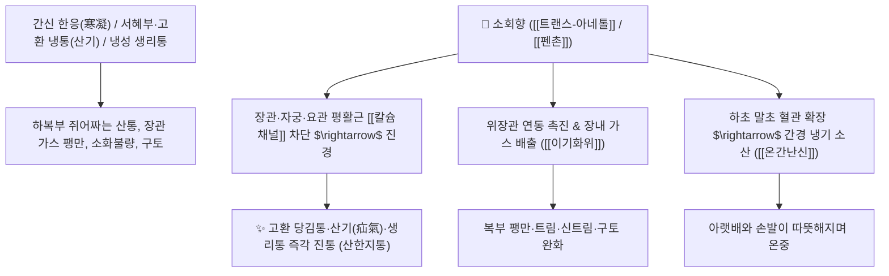

# 🌿 [[소회향]] (小茴香, Foeniculi Fructus / 펜넬)

> **핵심 요약 (Key Summary)**:
> 미나리과(*Apiaceae*) 회향(*Foeniculum vulgare*)의 건조한 성숙한 열매
> 방향성 페닐프로파노이드 정유인 [[트랜스-아네톨]](trans-Anethole)과 [[펜촌]](Fenchone)이 하초 평활근 경련을 이완시키고 위장관 가스 배출을 촉진하여 온간산한 및 진경 작용 발휘
> 간경(肝經) 한응(寒凝)으로 인한 고환 및 서혜부 냉통(산기 疝氣)·하복부 냉통·생리통 및 위한(胃寒) 구토·식욕부진을 치료하는 대표적인 [[산한지통]](散寒止痛)·[[온간난신]](溫肝暖腎)·[[이기화위]](理氣和胃) 약재

---
## 📌 목차
1. [기본 본초 정보 & 화학 구조 (Pharmacognosy)](#1-기본-본초-정보--화학-구조-pharmacognosy)
2. [핵심 분자약리 기전 & 아네톨·하초 평활근 진경 네트워크](#2-핵심-분자약리-기전--아네톨하초-평활근-진경-네트워크)
3. [해부생체역학 / 서혜관 & 자궁·장관 평활근 연계](#3-해부생체역학--서혜관--자궁장관-평활근-연계)
4. [사상의학 및 임상 응용 (산기 고환통 특화)](#4-사상의학-및-임상-응용-산기-고환통-특화)
5. [고전 의학 및 배오 원리 (난간전 배오)](#5-고전-의학-및-배오-원리-난간전-배오)
6. [핵심 처방 비교 매트릭스](#6-핵심-처방-비교-매트릭스)
7. [출처 및 학술 참고 문헌 (References)](#7-출처-및-학술-참고-문헌-references)

---
## 1. 기본 본초 정보 & 화학 구조 (Pharmacognosy)

> [!abstract]+ 🧪 3D 약리 분자 구조 (Interactive 3D Viewer)
> <iframe src="https://molecule-viewer-rho.vercel.app/?cid=637563" style="width: 100%; height: 600px; border: none; border-radius: 12px; box-shadow: 0 4px 20px rgba(0,0,0,0.15);" allowfullscreen></iframe>


| 항목 | 상세 내용 |
| :--- | :--- |
| **기원 식물** | 산형과 / 미나리과(Apiaceae / Umbelliferae) 회향 *Foeniculum vulgare* Mill.의 성숙한 열매 |
| **성미 (性味)** | 辛, 溫 |
| **귀경 (歸經)** | 肝·腎·脾·胃經 (간경, 신경, 비경, 위경) - **간경 하초(음낭, 서혜부) 특화** |
| **효능 (Actions)** | [[산한지통]](散寒止痛), [[온간난신]](溫肝暖腎), [[이기화위]](理氣和胃), [[온중지통]](溫中止痛) |
| **주요 성분** | • **정유 성분(3~6%)**: [[트랜스-아네톨]] (trans-Anethole, KP 규격 $\ge 1.4\%$), [[펜촌]] (Fenchone, KP 규격 $\ge 0.4\%$), 에스트라골<br>• **모노테르펜**: 리모넨, 알파-피넨, 캄펜<br>• **플라보노이드**: 루틴, 케르세틴 |

> **[유래 및 본초학적 기전]**:
> * 음식의 비린내를 없애고 원래의 향기를 되돌려준다(茴) 하여 '회향(茴香)'이라 불리며 서양의 '펜넬(Fennel)'입니다.
> * 찬 기운이 간경(肝經)을 따라 고환, 서혜부, 아랫배에 뭉쳐 쥐어뜯듯이 아픈 산기(疝氣)와 여성의 극심한 냉성 생리통을 덥혀서 풀어줍니다.
> * 소화관 내 이상 발효로 찬 가스를 분해하고 위액 분비를 도와 속을 따뜻하게 합니다.

### 🔬 소회향의 주요 지표물질 화학 구조
```
     H3CO───[ 벤젠 고리 ]───CH===CH──CH3  <-- 트랜스-아네톨 (trans-Anethole)
```
> **[구조적 특징 및 진경 활성]**: [[트랜스-아네톨]]은 장관 및 자궁 평활근의 과도한 콜린성 수축을 억제하고 혈관 내피 일산화질소([[NO]]) 방출을 유도하여 평활근 경련을 신속히 진정시킵니다.

---
## 2. 핵심 분자약리 기전 & 아네톨·하초 평활근 진경 네트워크



### (1) 표적 온간산한 및 진경 작용
* **산기(疝氣, 서혜부 탈장/고환 냉통) 치료**:
  * 찬 바람을 맞거나 몸이 차서 고환과 음낭이 붓고 당기며 아랫배가 쥐어짜듯 아픈 통증을 신속히 덥혀서 멎게 합니다.
* **냉성 생리통 및 하복냉통 완화**:
  * 자궁 평활근의 허혈성 연축을 풀어주어 손발이 차고 아랫배가 얼음장 같은 여성의 생리통을 치료합니다.
* **소화관 가스 배출 및 건위 작용**:
  * 장내 이상 발효 가스를 흡수 배출시켜 헛배부름과 복명(배에서 꼬르륵 소리 남)을 없앱니다.

---
## 3. 해부생체역학 / 서혜관 & 자궁·장관 평활근 연계

* **서혜관(Inguinal Canal) 및 정삭(Spermatic Cord) 혈류 개선**:
  * 정삭 주변 혈관 연축을 풀어 고환으로 가는 혈액순환을 정상화합니다.

---
## 4. 사상의학 및 임상 응용 (산기 고환통 특화)

```
[✅ 최적 적응증 (Sweet Spot)]
• 한산(寒疝) 및 고환통: 아랫배와 음낭이 차고 당기며 쥐어짜듯 아픈 경우 ([[난간전]], [[천태오약산]])
• 냉성 생리통: 생리 때가 되면 아랫배가 차갑고 묵직하게 아파 핫팩을 대야만 견디는 여성
• 위냉 구토: 찬 음식을 먹고 체해 헛구역질이 나고 명치가 싸늘하게 아픈 상태

[⚠️ 신중 투여]
• 음허화왕(陰虛火旺)으로 몸에 열이 많고 혀가 붉은 환자는 복용 주의
```

---
## 5. 고전 의학 및 배오 원리 (난간전 배오)

### (1) 간경 냉통을 덥히는 최고 명방: 난간전(暖肝煎)
* **하초 온간 3대 명약 배오**:
  * [[소회향]] + [[육계]] + [[오약]] $\rightarrow$ 간경의 찬 기운을 몰아내고 고환과 아랫배 통증을 멎게 함 ([[난간전]])
  * [[소회향]] + [[건강]] + [[목향]] $\rightarrow$ 위장을 덥히고 가스를 배출

---
## 6. 핵심 처방 비교 매트릭스

| 처방명 | 구성 약재 | 주치 병증 및 임상 타깃 | 특징 및 감별점 |
| :--- | :--- | :--- | :--- |
| [[난간전]] | [[육계]], [[당귀]], [[구기자]], [[복령]], [[소회향]], [[파고지]], [[오약]], [[생강]] | **간신음한, 소복냉통, 산기, 고환 종통, 하지 냉증** | 간을 덥혀 아랫배 통증을 다스림 |
| [[천태오약산]] | [[오약]], [[소회향]], [[목향]], [[청피]], [[양강]], [[빈랑]], [[천련자]] | **한응기체, 소장산기, 고환 편취(한쪽 고환 당김), 복통** | 산기 치료의 대표 행기산한방 |
| [[도기탕]] | [[소회향]], [[목향]], [[오약]], [[천련자]] | **산기 복통, 장관 가스 팽만, 배가 꼬이듯 아픔** | 기를 소통시켜 통증을 없앰 |

---
## 7. 출처 및 학술 참고 문헌 (References)

1. **Ostad, S. N., et al. (2001)**. The effect of fennel essential oil on uterine contraction as a model for dysmenorrhoea, pharmacology and toxicology study. *Journal of Ethnopharmacology*, 76(3), 299-304.
   - **[연구 요약]**: 소회향 정유(아네톨)가 옥시토신 및 프로스타글란딘 유도 자궁 수축을 유의하게 억제하여 생리통 완화 효과를 나타냄을 규명.
2. **대한민국약전(KP) 제12개정 (2022)**. 의약품각조 제2부: 소회향 (Foeniculi Fructus) 규격 기준.
   - **[공정서 규격]**: 건조물 기준 트랜스-아네톨 1.4% 이상, 펜촌 0.4% 이상 함유 필수 규격 명시.
