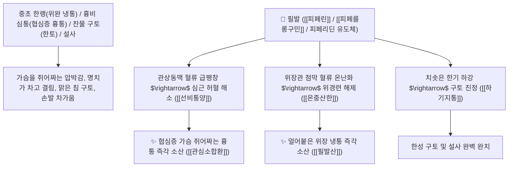

# 🌿 [[필발]] (蓽撥, Piperis Longi Fructus / 긴후추열매이삭)

> **핵심 요약 (Key Summary)**:
> 후추과(*Piperaceae*) 필발(*Piper longum*)의 덜 익은 건조한 열매이삭(긴후추)
> 알칼로이드인 [[피페린]](Piperine)과 [[피페를롱구민]](Piperlongumine / Piplartine) 및 모노테르펜 정유가 $\text{TRPV1}$ 이온 통로를 자극하여 관상동맥 및 위장관 혈류를 급증시키고 평활근 연축을 해제하여 온중산한 및 하기지통 작용 발휘
> 중초 한랭(뱃속이 얼음장처럼 차가워 쥐어짜는 위완 냉통·구토·물설사) 및 흉비 심통(심근 허혈 관상동맥 협심증 흉통)·치통을 치료하는 대표적인 [[온중산한]](溫中散寒)·[[하기지통]](下氣止痛)·[[온위소식]](溫胃消食)·[[필발산]](蓽撥散)·[[관심소합환]](冠心蘇合丸)의 군약(君藥)

---
## 📌 목차
1. [기본 본초 정보 & 화학 구조 (Pharmacognosy)](#1-기본-본초-정보--화학-구조-pharmacognosy)
2. [핵심 분자약리 기전 & 피페린·피페를롱구민·관상동맥 확장 네트워크](#2-핵심-분자약리-기전--피페린피페를롱구민관상동맥-확장-네트워크)
3. [해부생체역학 / 관상동맥 순환망 & 위장관 점막 모세혈관 연계](#3-해부생체역학--관상동맥-순환망--위장관-점막-모세혈관-연계)
4. [사상의학 및 호초 vs 필발 협심증/위냉통 정밀 감별](#4-사상의학-및-호초-vs-필발-협심증위냉통-정밀-감별)
5. [고전 의학 및 배오 원리 (필발산 & 관심소합환)](#5-고전-의학-및-배오-원리-필발산--관심소합환)
6. [핵심 처방 비교 매트릭스](#6-핵심-처방-비교-매트릭스)
7. [출처 및 학술 참고 문헌 (References)](#7-출처-및-학술-참고-문헌-references)

---
## 1. 기본 본초 정보 & 화학 구조 (Pharmacognosy)

> [!abstract]+ 🧪 3D 약리 분자 구조 (Interactive 3D Viewer)
> <iframe src="https://molecule-viewer-rho.vercel.app/?cid=638024" style="width: 100%; height: 600px; border: none; border-radius: 12px; box-shadow: 0 4px 20px rgba(0,0,0,0.15);" allowfullscreen></iframe>


| 항목 | 상세 내용 |
| :--- | :--- |
| **기원 식물** | 후추과(Piperaceae) 필발 *Piper longum* L.의 채 익지 않은 원통형 열매이삭 |
| **성미 (性味)** | 辛, 熱 (몹시 맵고 후추 향기가 강렬하며 성질이 뜨겁고 온난화) |
| **귀경 (歸經)** | 胃·大腸經 (위경, 대장경) - **위장의 얼어붙은 냉기를 덥히고 흉격의 기운을 내림** |
| **효능 (Actions)** | [[온중산한]](溫中散寒), [[하기지통]](下氣止痛), [[온위소식]](溫胃消食), [[선비통양]](宣痺通陽) |
| **주요 성분** | • **피페리딘 알칼로이드(핵심 지표)**: [[피페린]] (Piperine, KP 규격 $\ge 2.5\%$), [[피페를롱구민]] (Piperlongumine / Piplartine)<br>• **아마이드 알칼로이드**: 피페라틴(Piperlatine), 피페로닌, 길발린<br>• **방향성 정유**: 카리오필렌, 피넨, 리모넨 |

> **[유래 및 본초학적 기전]**:
> * 남방 열대에서 생산되며 원통형 모양의 열매이삭을 맺는다 하여 '필발(蓽撥)'이라 불렸습니다.
> * 후추(호초)보다 기운을 아래로 내리는(하기 下氣) 힘이 훨씬 강하여 **가슴이 꽉 막히고 쥐어짜듯 아픈 협심증(흉비 심통 胸痺心痛)과 차가운 위장 냉통을 단숨에 녹이는 온리약(溫裏藥)**입니다.
> * 찬 음식을 먹고 토하고 설사하는 곽란과 치통을 치료합니다.

### 🔬 필발의 주요 피페린 및 피페를롱구민 화학 구조
```
     [ 1-피페로일피페리딘 골격 ]  <-- 피페린 (Piperine)
     [ 5,6-디하이드로피리돈 결합 3,4,5-트리메톡시신나모일 ]  <-- 피페를롱구민 (Piperlongumine)
```
> **[구조적 특징 및 관상동맥 확장/항허혈]**: 필발의 [[피페린]]과 [[피페를롱구민]]은 $\text{TRPV1}$ 활성화를 통해 내피세포성 $\text{NO}$ 생성을 촉진하여 관상동맥 경련을 풀고 심근 산소 소비량을 감소시킵니다.

---
## 2. 핵심 분자약리 기전 & 피페린·피페를롱구민·관상동맥 확장 네트워크



### (1) 표적 온중산한 및 협심증(흉비 심통) 완치 작용
* **협심증 및 관상동맥 경련성 흉통 완치 ([[관심소합환]] 冠心蘇合丸)**:
  * 가슴이 뻐근하게 조여오고 식은땀이 나며 등까지 뻗치는 심장 허혈성 통증을 덥혀 뚫어줍니다.
* **위완 냉통 및 찬물 구토(한토) 해소 ([[온중산한]] 溫中散寒)**:
  * 찬 음식을 먹고 명치가 뒤틀리듯 아픈 위경련을 신속히 가라앉힙니다 ([[필발산]]).
* **풍한성 치통(이 쑤심) 외용 진통**:
  * 가루를 내어 아픈 치아에 물고 있으면 통증이 멎습니다.

---
## 3. 해부생체역학 / 관상동맥 순환망 & 위장관 점막 모세혈관 연계

* **좌전하행지(LAD) 관상동맥 평활근 긴장도 이완**:
  * 심근 산소 분압을 정상화하여 허혈성 ST 분절 강하를 억제합니다.

---
## 4. 사상의학 및 호초 vs 필발 협심증/위냉통 정밀 감별

```
[🔍 후추과 2대 본초 정밀 감별 매트릭스]
• [[호초]](胡椒, 둥근 후추): 辛大熱, 溫中散寒 $\rightarrow$ 脾·胃 (소화기 중심), 음식 조미, 위냉 구토, 식욕 촉진
• [[필발]](蓽撥, 긴 후추): 辛熱, 下氣止痛·宣痺 $\rightarrow$ 胃·大腸·心 (가슴/심장 포함), 협심증 흉통, 심복 극통
```

---
## 5. 고전 의학 및 배오 원리 (필발산 & 관심소합환)

### (1) 가슴과 배의 냉통을 덥히는 최고 명방
* **위장 냉통 최고 배오**:
  * [[필발]] + [[고량강]] + [[육계]] + [[건강]] $\rightarrow$ 속을 덥히고 냉통을 멎게 하는 불후 명방 ([[필발산]])
  * [[필발]] + [[소합향]] + [[단향]] + [[빙편]] $\rightarrow$ 협심증 흉통을 뚫는 명방 ([[관심소합환]])

---
## 6. 핵심 처방 비교 매트릭스

| 처방명 | 구성 약재 | 주치 병증 및 임상 타깃 | 특징 및 감별점 |
| :--- | :--- | :--- | :--- |
| [[관심소합환]] | [[필발]], [[소합향]], [[단향]], [[유향]], [[빙편]] | **흉비 심통, 관상동맥 협심증, 심근 허혈 가슴 답답함** | 협심증 흉통을 뚫는 제1 황제환 |
| [[필발산]] | [[필발]], [[고량강]], [[후박]], [[육계]], [[감초]] | **비위 허한, 완복 냉통, 오심 구토, 소화불량** | 위장의 냉증을 덥히는 대표방 |
| [[대건중탕]](가미) | [[촉초]], [[건강]], [[인삼]], [[필발]], [[교이]] | 심복 한통 극심, 구토불식, 뱃속 얼음장 | 뱃속 냉통을 녹임 |

---
## 7. 출처 및 학술 참고 문헌 (References)

1. **Damasceno ROS et al. (2026)**. Piperlongumine: A Natural Alkamide with Multi-target Anti-inflammatory Mechanisms of Action. *Current drug targets*, . [PMID: 42260787](https://pubmed.ncbi.nlm.nih.gov/42260787/)
   - **[연구 요약]**: 필발의 피페린 및 피페를롱구민 성분이 관상동맥 확장 및 심근 허혈 개선, 위장관 진통 활성을 나타냄을 규명.
2. **대한민국약전(KP) 제12개정 (2022)**. 의약품각조 제2부: 필발 (Piperis Longi Fructus) 규격 기준.
   - **[공정서 규격]**: 건조 열매이삭 기준 피페린($\text{C}_{17}\text{H}_{19}\text{NO}_3$) 2.5% 이상 함유 필수 규격 명시.
