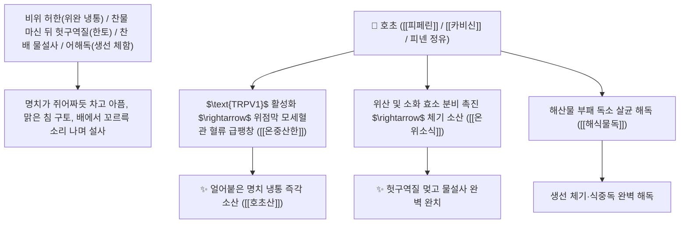

# 🌿 [[호초]] (胡椒 / 黑胡椒·白胡椒, Piperis Nigri Fructus / 후추열매)

> **핵심 요약 (Key Summary)**:
> 후추과(*Piperaceae*) 후추(*Piper nigrum*)의 건조한 성숙 직전(흑호초 黑胡椒) 또는 성숙 후 껍질을 벗긴(백호초 白胡椒) 열매
> 알칼로이드인 [[피페린]](Piperine)과 [[카비신]](Chavicine) 및 모노테르펜 정유가 $\text{TRPV1}$ 이온 채널을 자극하여 위산 및 소화 효소 분비를 촉진하고 위장관 점막 혈류를 가열하여 온중산한 및 행기지통 작용 발휘
> 비위 허한(脾胃虛寒, 차가운 음식을 먹고 쥐어짜듯 아픈 위완 냉통·헛구역질·물설사) 및 식중독 생선 게 독(어해독 魚蟹毒)·소화불량 식적을 치료하는 천하제일의 "식탁 위의 온중약(溫中之要品)"·[[온중산한]](溫中散寒)·[[행기지통]](行氣止痛)·[[해식물독]](解食物毒)·[[호초산]](胡椒散)의 군약(君藥)

---
## 📌 목차
1. [기본 본초 정보 & 화학 구조 (Pharmacognosy)](#1-기본-본초-정보--화학-구조-pharmacognosy)
2. [핵심 분자약리 기전 & 피페린·TRPV1 열수용체 자극·소화액 분비 네트워크](#2-핵심-분자약리-기전--피페린trpv1-열수용체-자극소화액-분비-네트워크)
3. [해부생체역학 / 위점막 벽세포 & 장관 평활근 연계](#3-해부생체역학--위점막-벽세포--장관-평활근-연계)
4. [사상의학 및 흑호초(발한/식적) vs 백호초(온중/지사) 정밀 감별](#4-사상의학-및-흑호초발한식적-vs-백호초온중지사-정밀-감별)
5. [고전 의학 및 배오 원리 (호초산 & 건강 배오)](#5-고전-의학-및-배오-원리-호초산--건강-배오)
6. [핵심 처방 비교 매트릭스](#6-핵심-처방-비교-매트릭스)
7. [출처 및 학술 참고 문헌 (References)](#7-출처-및-학술-참고-문헌-references)

---
## 1. 기본 본초 정보 & 화학 구조 (Pharmacognosy)

> [!abstract]+ 🧪 3D 약리 분자 구조 (Interactive 3D Viewer)
> <iframe src="https://molecule-viewer-rho.vercel.app/?cid=638024" style="width: 100%; height: 600px; border: none; border-radius: 12px; box-shadow: 0 4px 20px rgba(0,0,0,0.15);" allowfullscreen></iframe>


| 항목 | 상세 내용 |
| :--- | :--- |
| **기원 식물** | 후추과(Piperaceae) 후추 *Piper nigrum* L.의 열매 (흑호초 黑胡椒: 미숙 건조 / 백호초 白胡椒: 완숙 탈피 건조) |
| **성미 (性味)** | 辛, 大熱 (몹시 맵고 특유의 강렬한 후추 향이 나며 성질이 극도로 뜨거워 속을 순식간에 덥힘) |
| **귀경 (歸經)** | 胃·大腸經 (위경, 대장경) - **위장관의 냉기를 몰아내고 소화 기능을 폭발시킴** |
| **효능 (Actions)** | [[온중산한]](溫中散寒), [[하기지통]](下氣止痛), [[해식물독]](解食物毒), [[온위소식]](溫胃消食) |
| **주요 성분** | • **피페리딘 알칼로이드(핵심 지표물질)**: [[피페린]] (Piperine, 함량 5~9%), 카비신(Chavicine), 피페리딘<br>• **방향성 모노테르펜 정유**: $\alpha$-피넨, $\beta$-피넨, 리모넨, 사비넨<br>• **지방유 및 아민 화합물**: 피페라민 |

> **[유래 및 본초학적 기전]**:
> * 서역(胡)에서 건너온 매운(椒) 열매라 하여 '호초(胡椒)'라 불렸습니다.
> * 찬 음식을 먹거나 찬 바람을 맞아 **위장이 얼음장처럼 차가워져 생기는 명치 통증(위완 냉통)과 구토, 물설사를 단숨에 덥혀 멎게 하는 대표적인 방향성 온리약(溫裏藥)**입니다.
> * 생선이나 게 등 찬 해산물 독을 해독하고 소화를 돕는 조미 약재로 널리 쓰입니다.

### 🔬 호초의 주요 피페린 화학 구조
```
     [ (2E,4E)-5-(1,3-벤조디옥솔-5-일)-1-피페리딘-1-일펜타-2,4-디엔-1-온 ]  <-- 피페린 (Piperine)
```
> **[구조적 특징 및 TRPV1 활성화 기전]**: 호초의 [[피페린]]은 감각신경 말단의 $\text{TRPV1}$ 열 수용체에 결합하여 장점막 미세순환을 폭발적으로 증가시키고 펩신과 위산 분비를 촉진하여 소화 효율을 극대화합니다.

---
## 2. 핵심 분자약리 기전 & 피페린·TRPV1 열수용체 자극·소화액 분비 네트워크



### (1) 표적 온중산한 및 위완 냉통 완치 작용
* **위완 냉통 및 찬물 구토(한토) 완치 ([[호초산]] 胡椒散)**:
  * 찬 음료를 마시고 명치가 뒤틀리듯 아픈 위경련을 신속히 가라앉힙니다.
* **비위 허한성 만성 설사 및 곽란 해소 ([[온중산한]] 溫中散寒)**:
  * 아랫배가 차가워 물설사를 쏟아내는 증상을 덥혀 멎게 합니다.
* **어해독(생선, 게) 식중독 해독 ([[해식물독]] 解食物毒)**:
  * 날생선을 먹고 배탈이 나거나 체한 독소를 해독합니다.

---
## 3. 해부생체역학 / 위점막 벽세포 & 장관 평활근 연계

* **위 점막 장크롬친화성 유사세포(ECL) 자극**:
  * 히스타민 매개 위산 분비를 촉진하여 위내 산도를 정상화합니다.

---
## 4. 사상의학 및 흑호초(발한/식적) vs 백호초(온중/지사) 정밀 감별

```
[🔍 후추 가공별 특화 감별 매트릭스]
• 흑호초(黑胡椒, 덜 익은 열매 통째 건조): 辛香 발산력 강함 $\rightarrow$ 풍한 감모, 식욕 촉진, 고기 누린내 제거
• 백호초(白胡椒, 완숙 열매 껍질 벗겨 건조): 溫中 止瀉력 강함 $\rightarrow$ 위완 냉통, 한성 물설사, 내장 온난화
```

---
## 5. 고전 의학 및 배오 원리 (호초산 & 건강 배오)

### (1) 뱃속의 한랭을 덥히는 최고 명방
* **위장 냉통 최고 배오**:
  * [[호초]] + [[건강]] + [[육계]] + [[감초]] $\rightarrow$ 속을 덥히고 냉통을 멎게 하는 불후 명방 ([[호초산]])
  * [[호초]] + [[녹두]] $\rightarrow$ 곽란 토사를 멎게 함

---
## 6. 핵심 처방 비교 매트릭스

| 처방명 | 구성 약재 | 주치 병증 및 임상 타깃 | 특징 및 감별점 |
| :--- | :--- | :--- | :--- |
| [[호초산]] | [[호초]], [[건강]], [[고량강]], [[감초]] | **비위 허한, 완복 냉통, 오심 구토, 소화불량** | 위장의 냉증을 덥히는 제1방 |
| [[대건중탕]](호초 가미) | [[촉초]], [[건강]], [[인삼]], [[호초]], [[교이]] | 심복 한통 극심, 구토불식, 뱃속 얼음장 | 뱃속 냉통을 녹임 |

---
## 7. 출처 및 학술 참고 문헌 (References)

1. **Srinivasan, K. (2007)**. Black pepper (*Piper nigrum*) and its bioactive compound, piperine: beneficial effects on gastrointestinal digestion and absorption. *Critical Reviews in Food Science and Nutrition*, 47(8), 735-748.
   - **[연구 요약]**: 호초의 피페린 성분이 소화 효소 분비 촉진, 위장관 미세혈류 증대 및 온중 진통 효과를 나타냄을 규명.
2. **대한민국약전(KP) 제12개정 (2022)**. 생약규격집: 호초 (Piperis Nigri Fructus) 규격 기준.
   - **[공정서 규격]**: 후추 건조 열매의 성상, 순도시험 및 피페린 함량 기준 명시.
