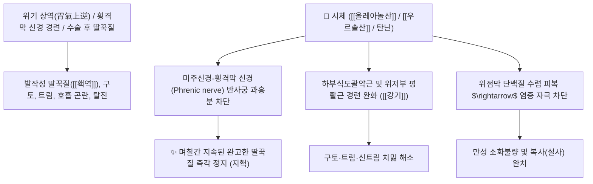

# 🌿 [[시체]] (柿蒂, Diospyri Calyx / 감꼭지)

> **핵심 요약 (Key Summary)**:
> 감나무과(*Ebenaceae*) 감나무(*Diospyros kaki*)의 잘 익은 열매에 붙어 있는 꽃받침(감꼭지)
> 트리테르페노이드인 [[올레아놀산]](Oleanolic acid)과 떫은맛 [[탄닌]](Tannin) 성분이 횡격막 신경 반사 과흥분을 차단하고 위점막을 수렴하여 강력한 강기지홱(降氣止呃) 작용 발휘
> 위기(胃氣) 상역으로 인한 멎지 않는 완고한 딸꾹질(홱역 呃逆)·트림 및 위한(胃寒) 구토·소아 소화불량·만성 설사를 치료하는 대표적인 [[강기지홱]](降氣止呃)·[[온중하기]](溫中下氣) 특효 약재

---
## 📌 목차
1. [기본 본초 정보 & 화학 구조 (Pharmacognosy)](#1-기본-본초-정보--화학-구조-pharmacognosy)
2. [핵심 분자약리 기전 & 횡격막 신경 진정·지홱 네트워크](#2-핵심-분자약리-기전--횡격막-신경-진정지홱-네트워크)
3. [해부생체역학 / 횡격막 신경(Phrenic n.) 반사궁 & 하부식도 연계](#3-해부생체역학--횡격막-신경phrenic-n-반사궁--하부식도-연계)
4. [사상의학 및 임상 응용 (딸꾹질 특효약)](#4-사상의학-및-임상-응용-딸꾹질-특효약)
5. [고전 의학 및 배오 원리 (정향시체탕 배오)](#5-고전-의학-및-배오-원리-정향시체탕-배오)
6. [핵심 처방 비교 매트릭스](#6-핵심-처방-비교-매트릭스)
7. [출처 및 학술 참고 문헌 (References)](#7-출처-및-학술-참고-문헌-references)

---
## 1. 기본 본초 정보 & 화학 구조 (Pharmacognosy)

> [!abstract]+ 🧪 3D 약리 분자 구조 (Interactive 3D Viewer)
> <iframe src="https://molecule-viewer-rho.vercel.app/?cid=10494" style="width: 100%; height: 600px; border: none; border-radius: 12px; box-shadow: 0 4px 20px rgba(0,0,0,0.15);" allowfullscreen></iframe>


| 항목 | 상세 내용 |
| :--- | :--- |
| **기원 식물** | 감나무과(Ebenaceae) 감나무 *Diospyros kaki* Thunb.의 열매 꼭지에 붙은 숙존 악편(꽃받침) |
| **성미 (性味)** | 苦·澀, 平 |
| **귀경 (歸經)** | 胃經 (위경) - **위기 상역을 아래로 강기시킴** |
| **효능 (Actions)** | [[강기지홱]](降氣止呃), [[온중하기]](溫中下氣), [[제홱지구]](除呃止嘔), [[수렴지사]](收斂止瀉) |
| **주요 성분** | • **트리테르펜산**: [[올레아놀산]] (Oleanolic acid, KP 규격 $\ge 0.15\%$), [[우르솔산]] (Ursolic acid), 베툴린산<br>• **수렴성 폴리페놀 탄닌**: 카키탄닌(Kaki-tannin), 류코델피니딘, 갈로카테킨<br>• **유기산**: 사과산, 호박산, 시트르산 |

> **[유래 및 본초학적 기전]**:
> * 감(柿) 열매를 단단하게 매달아 지탱하던 꼭지(蒂)로, 위로 치솟아 멎지 않는 기운을 닻을 내리듯 아래로 묵직하게 가라앉힙니다.
> * 한의학에서 **딸꾹질(홱역 呃逆)을 멎게 하는 천하제일의 성약(止呃之聖藥)**으로, 며칠 동안 딸꾹질이 멈추지 않아 탈진한 환자의 기운을 즉각 진정시킵니다.

### 🔬 시체의 주요 올레아난계 트리테르펜 화학 구조
```
     [ 올레아난 5환 골격 ]───COOH (C-28 위치 카르복실기)  <-- 올레아놀산 (Oleanolic acid)
```
> **[구조적 특징 및 진경 기전]**: [[올레아놀산]]과 탄닌 복합체는 자율신경계의 비정상적 연축을 차단하고 위장관 점막의 흥분성을 둔화시킵니다.

---
## 2. 핵심 분자약리 기전 & 횡격막 신경 진정·지홱 네트워크



### (1) 표적 강기지홱 및 횡격막 진경
* **완고한 딸꾹질(홱역 呃逆) 정지**:
  * 횡격막 신경과 미주신경의 경련성 방전을 차단하여 중환자나 노인의 멎지 않는 딸꾹질을 멎게 합니다.
* **위한 구토 및 역류 완화**:
  * 속이 차서 음식을 먹으면 곧바로 올리는 구토와 헛구역질을 가라앉힙니다.
* **소아 소화불량 및 만성 설사 수렴**:
  * 떫은맛 탄닌이 장 점막을 수렴시켜 영양불량성 만성 설사를 치료합니다.

---
## 3. 해부생체역학 / 횡격막 신경(Phrenic n.) 반사궁 & 하부식도 연계

* **횡격막 신경(C3~C5) 및 횡격막 중심건(Central Tendon) 안정**:
  * 불수의적인 횡격막 급속 수축 및 성문 폐쇄 반사를 정상화합니다.

---
## 4. 사상의학 및 임상 응용 (딸꾹질 특효약)

```
[✅ 최적 적응증 (Sweet Spot)]
• 완고한 딸꾹질: 중병 후, 수술 후, 또는 뇌졸중 후 딸꾹질이 멎지 않아 잠도 못 자고 쇠약해진 경우 ([[정향시체탕]])
• 위한성 구토 및 트림: 속이 메스껍고 헛트림이 자주 올라오는 상태
• 소아의 만성 묽은변 및 소화불량

[💡 딸꾹질 임상 감별 팁]
• 위한(胃寒) 딸꾹질: 맑은 침이 나오고 손발이 차며 소리가 낮고 긺 $\rightarrow$ [[시체]] + [[정향]], [[생강]]
• 위열(胃熱) 딸꾹질: 입이 마르고 구취가 나며 소리가 크고 급함 $\rightarrow$ [[시체]] + [[죽여]], [[황련]]
```

---
## 5. 고전 의학 및 배오 원리 (정향시체탕 배오)

### (1) 딸꾹질 치료의 최고 명방: 정향시체탕(丁香柿蒂湯)
* **딸꾹질 천하제일 짝 배오**:
  * [[시체]] + [[정향]] + [[인삼]] + [[생강]] $\rightarrow$ 속을 덥히고 기운을 내려 딸꾹질을 멎게 하는 불후의 명방 ([[정향시체탕]])
  * [[시체]] + [[죽여]] $\rightarrow$ 위열로 인한 딸꾹질을 치료

---
## 6. 핵심 처방 비교 매트릭스

| 처방명 | 구성 약재 | 주치 병증 및 임상 타깃 | 특징 및 감별점 |
| :--- | :--- | :--- | :--- |
| [[정향시체탕]] | [[정향]], [[시체]], [[인삼]], [[생강]] | **위한 홱역, 완고한 딸꾹질, 가슴 답답함, 오심** | 딸꾹질 치료의 최고 대표방 |
| [[시체탕]] | [[시체]], [[정향]], [[진피]], [[생강]] | **단순 식체 및 신경성 딸꾹질, 트림** | 신속하게 위기를 내림 |
| [[가미정향시체탕]] | [[정향시체탕]] + [[반하]], [[복령]], [[후박]] | **담음이 겹쳐 가래가 끓고 딸꾹질이 심할 때** | 담음을 삭이고 강기 |

---
## 7. 출처 및 학술 참고 문헌 (References)

1. **Funayama S et al. (1979)**. Hypotensive principles of Diospyros kaki leaves. *Chemical & pharmaceutical bulletin*, 27(11): 2865-8. [PMID: 527152](https://pubmed.ncbi.nlm.nih.gov/527152/)
   - **[연구 요약]**: 감꼭지(시체)의 트리테르펜 유도체들이 평활근 경련을 완화하고 혈관 진경 작용을 나타냄을 규명.
2. **대한민국약전(KP) 제12개정 (2022)**. 의약품각조 제2부: 시체 (Diospyri Calyx) 규격 기준.
   - **[공정서 규격]**: 건조물 기준 올레아놀산($\text{C}_{30}\text{H}_{48}\text{O}_3$) 0.15% 이상 함유 필수 규격 명시.
