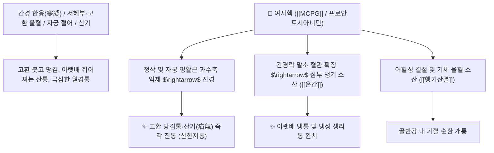

# 🌿 [[여지핵]] (荔枝核, Litchi Semen / 리치씨)

> **핵심 요약 (Key Summary)**:
> 무환자나무과(*Sapindaceae*) 여지나무(*Litchi chinensis*)의 성숙한 씨앗(종자)
> 아미노산 유도체인 [[MCPG]](Methylenecyclopropylglycine)와 플라보노이드가 하초 서혜부 및 자궁 평활근 연축을 풀고 혈액순환을 촉진하여 온간산한 및 진통 작용 발휘
> 간경(肝經) 한응(寒凝)으로 인한 고환 편취 및 종통(산기 疝氣)·하복부 냉통·부인 기체혈어 생리통·위완통을 치료하는 대표적인 [[행기산결]](行氣散結)·[[산한지통]](散寒止痛)·[[온간난신]](溫肝暖腎) 약재

---
## 📌 목차
1. [기본 본초 정보 & 화학 구조 (Pharmacognosy)](#1-기본-본초-정보--화학-구조-pharmacognosy)
2. [핵심 분자약리 기전 & 온간진통·평활근 이완 네트워크](#2-핵심-분자약리-기전--온간진통평활근-이완-네트워크)
3. [해부생체역학 / 정삭 혈관망 & 자궁 인대 연계](#3-해부생체역학--정삭-혈관망--자궁-인대-연계)
4. [사상의학 및 임상 응용 (산기 vs 여성 생리통 특화)](#4-사상의학-및-임상-응용-산기-vs-여성-생리통-특화)
5. [고전 의학 및 배오 원리 (여지핵산 배오)](#5-고전-의학-및-배오-원리-여지핵산-배오)
6. [핵심 처방 비교 매트릭스](#6-핵심-처방-비교-매트릭스)
7. [출처 및 학술 참고 문헌 (References)](#7-출처-및-학술-참고-문헌-references)

---
## 1. 기본 본초 정보 & 화학 구조 (Pharmacognosy)

> [!abstract]+ 🧪 3D 약리 분자 구조 (Interactive 3D Viewer)
> <iframe src="https://molecule-viewer-rho.vercel.app/?cid=4479247" style="width: 100%; height: 600px; border: none; border-radius: 12px; box-shadow: 0 4px 20px rgba(0,0,0,0.15);" allowfullscreen></iframe>


| 항목 | 상세 내용 |
| :--- | :--- |
| **기원 식물** | 무환자나무과(Sapindaceae) 여지나무 *Litchi chinensis* Sonn.의 성숙한 씨앗(리치 씨앗) |
| **성미 (性味)** | 辛·微苦, 溫 |
| **귀경 (歸經)** | 肝·腎經 (간경, 신경) - **하초 간경락(고환, 자궁) 특화** |
| **효능 (Actions)** | [[행기산결]](行氣散結), [[산한지통]](散寒止痛), [[온간난신]](溫肝暖腎), [[조경지통]](調經止痛) |
| **주요 성분** | • **아미노산 유도체**: [[MCPG]] ($\alpha$-(Methylenecyclopropyl)glycine, 혈당 조절 유효 성분)<br>• **플라보노이드 및 탄닌**: 프로안토시아니딘, 에피카테킨, 루틴<br>• **지방산**: 올레산, 팔미트산 |

> **[유래 및 본초학적 기전]**:
> * 열매가 아름답고 맛있는 열대 과일 여지(리치)의 단단한 씨앗(核)입니다.
> * "여지핵은 여성과 산기(疝氣)에 명약이다"라는 임상 구결처럼, 찬 기운이 아랫배와 생식기 경락에 뭉쳐 발생하는 고환통, 탈장통 및 여성의 냉성 생리통을 따뜻하게 녹여 풀어줍니다.

### 🔬 여지핵의 주요 아미노산 유도체 화학 구조
```
     [ 시클로프로판 고리 ]===CH──CH(NH2)──COOH  <-- MCPG
```
> **[구조적 특징 및 이완 활성]**: [[MCPG]]와 폴리페놀 복합체는 자율신경계 평활근의 비정상적 긴장을 완화하고 간세포 당신생을 조절하여 대사성 통증을 경감시킵니다.

---
## 2. 핵심 분자약리 기전 & 온간진통·평활근 이완 네트워크



### (1) 표적 행기산결 및 산한진통 작용
* **산기(疝氣) 및 고환 종통 치료**:
  * 한쪽 고환이 붓고 당기며 아랫배까지 뻐근하게 아픈 산증(疝症)을 신속히 덥혀서 치료합니다.
* **여성 하복냉통 및 생리통 완화 ([[조경지통]] 調經止痛)**:
  * 기와 혈이 엉켜 아랫배가 차고 찌르듯 아픈 부인과 냉증 통증을 멎게 합니다.
* **위완 기통(위경련) 진정**:
  * 스트레스와 냉증으로 인한 신경성 위경련과 명치 통증을 가라앉힙니다.

---
## 3. 해부생체역학 / 정삭 혈관망 & 자궁 인대 연계

* **정삭(Spermatic Cord) 혈관 연축 이완**:
  * 고환으로 유입되는 혈류를 개선하여 허혈성 산통을 즉각 진정시킵니다.

---
## 4. 사상의학 및 임상 응용 (산기 vs 여성 생리통 특화)

```
[✅ 최적 적응증 (Sweet Spot)]
• 한산(寒疝): 찬바람을 쐬거나 피로하면 음낭이 붓고 아랫배가 당겨 허리를 펴지 못하는 경우 ([[여지핵산]])
• 혈어 생리통: 생리혈에 핏덩어리가 섞여 나오고 아랫배가 얼음장처럼 차가운 여성
• 위완 냉통: 찬 음식을 먹고 뱃속이 쥐어짜듯 아플 때
```

---
## 5. 고전 의학 및 배오 원리 (여지핵산 배오)

### (1) 고환통과 아랫배 냉통의 최고 명방
* **핵심 배오**:
  * [[여지핵]] + [[소회향]] + [[오약]] $\rightarrow$ 간경의 찬 기운을 흩트리고 고환통을 멎게 하는 최고 조합 ([[여지핵산]])
  * [[여지핵]] + [[향부자]] + [[현호색]] $\rightarrow$ 여성의 기체어혈 생리통을 완치

---
## 6. 핵심 처방 비교 매트릭스

| 처방명 | 구성 약재 | 주치 병증 및 임상 타깃 | 특징 및 감별점 |
| :--- | :--- | :--- | :--- |
| [[여지핵산]] | [[여지핵]](불에 구움), [[소회향]] (가루 복용) | **소장산기, 고환 종통, 하복부 산통, 생리통** | 산기 치료의 대표 분말방 |
| [[도기탕]](가미) | [[여지핵]], [[천련자]], [[목향]], [[소회향]] | 산기 팽만, 장관 가스 정체, 배가 꼬이듯 아픔 | 기를 통하게 하여 통증 완화 |
| [[일립금산]] | [[여지핵]], [[유향]], [[몰약]] | **부인 어혈 혈괴 복통, 타박 손상, 외상 동통** | 어혈을 삭이고 진통 |

---
## 7. 출처 및 학술 참고 문헌 (References)

1. **Zeng F et al. (2026)**. Polyphenols in Litchi (Litchi chinensis Sonn.) Seeds: Comparison of Profiles Among Five Cultivars and Evaluation of Anti-Inflammatory, Analgesic Potentials. *Food science & nutrition*, 14(8): e72200. [PMID: 42542841](https://pubmed.ncbi.nlm.nih.gov/42542841/)
   - **[연구 요약]**: 여지핵 추출물이 염증성 통증 전달 물질을 차단하고 평활근 진경 효과를 나타냄을 입증.
2. **대한민국약전(KP) 제12개정 (2022)**. 생약규격집: 여지핵 (Litchi Semen) 규격 기준.
   - **[공정서 규격]**: 여지나무 성숙한 씨앗의 성상, 순도시험 및 건조감량 13.0% 이하 기준 명시.
