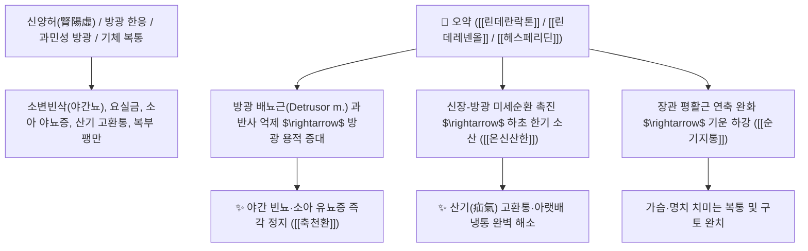

# 🌿 [[오약]] (烏藥, Linderae Radix / 천태오약)

> **핵심 요약 (Key Summary)**:
> 녹나무과(*Lauraceae*) 천태오약(*Lindera strychnifolia*)의 건조한 덩이뿌리
> 세스퀴테르펜 락톤인 [[린데란락톤]](Linderalactone)과 [[린데레넨올]](Lindenenol)이 방광 및 소화관 평활근 연축을 풀고 혈관 투과성을 조절하여 순기지통 및 온신산한 작용 발휘
> 하초 한응(下焦寒凝)으로 인한 소변빈삭(야간 빈뇨·소아 유뇨증)·신허 요통 및 기체(氣滯)로 치미는 흉복창통·산기(疝氣) 고환통을 치료하는 대표적인 [[순기지통]](順氣止痛)·[[온신산한]](溫腎散寒)·[[축천환]](縮泉丸)의 군약(君藥)

---
## 📌 목차
1. [기본 본초 정보 & 화학 구조 (Pharmacognosy)](#1-기본-본초-정보--화학-구조-pharmacognosy)
2. [핵심 분자약리 기전 & 린데란락톤·방광 진경 네트워크](#2-핵심-분자약리-기전--린데란락톤방광-진경-네트워크)
3. [해부생체역학 / 방광 배뇨근(Detrusor m.) & 서혜관 연계](#3-해부생체역학--방광-배뇨근detrusor-m--서혜관-연계)
4. [사상의학 및 임상 응용 (방광 냉증 vs 마황/오약 표리 비교)](#4-사상의학-및-임상-응용-방광-냉증-vs-마황오약-표리-비교)
5. [고전 의학 및 배오 원리 (축천환 & 오약순기산)](#5-고전-의학-및-배오-원리-축천환--오약순기산)
6. [핵심 처방 비교 매트릭스](#6-핵심-처방-비교-매트릭스)
7. [출처 및 학술 참고 문헌 (References)](#7-출처-및-학술-참고-문헌-references)

---
## 1. 기본 본초 정보 & 화학 구조 (Pharmacognosy)

> [!abstract]+ 🧪 3D 약리 분자 구조 (Interactive 3D Viewer)
> <iframe src="https://molecule-viewer-rho.vercel.app/?cid=6450191" style="width: 100%; height: 600px; border: none; border-radius: 12px; box-shadow: 0 4px 20px rgba(0,0,0,0.15);" allowfullscreen></iframe>


| 항목 | 상세 내용 |
| :--- | :--- |
| **기원 식물** | 녹나무과(Lauraceae) 천태오약 *Lindera strychnifolia* (Sieb. et Zucc.) Vill.의 덩이뿌리 |
| **성미 (性味)** | 辛, 溫 |
| **귀경 (歸經)** | 肺·脾·腎·膀胱經 (폐경, 비경, 신경, 방광경) - **하초 방광과 신장의 냉기를 덥힘** |
| **효능 (Actions)** | [[순기지통]](順氣止痛), [[온신산한]](溫腎散寒), [[온비지구]](溫脾止嘔), [[축뇨지유]](縮尿止遺) |
| **주요 성분** | • **세스퀴테르펜 락톤(주성분)**: [[린데란락톤]] (Linderalactone, KP 규격 $\ge 0.10\%$), [[린데레넨올]] (Lindenenol), 린데렌 아세테이트<br>• **플라보노이드 및 페놀산**: [[헤스페리딘]] (Hesperidin), 프로안토시아니딘 B2<br>• **알칼로이드**: 볼딘, 라우로테타닌 |

> **[유래 및 본초학적 기전]**:
> * 껍질 색깔이 까마귀처럼 짙은 흑갈색(烏)을 띠며 절강성 천태산(天台山)에서 생산된 천태오약(天台烏藥)이 으뜸입니다.
> * 비위와 하초 신장을 따뜻하게 하여 위로 치솟는 나쁜 기운(기역 氣逆)을 아래로 순조롭게 내립니다.
> * [[마황]]이 표(表, 피부 땀샘)를 열어준다면, [[오약]]은 리(裏, 내장 혈류)를 열어 기혈 순환을 뚫어줍니다.

### 🔬 오약의 주요 지표물질 화학 구조
![[Pasted image 20240228135845.png|450]]
> **[구조적 특징 및 방광 이완 활성]**: [[린데란락톤]]은 퓨란환과 락톤 고리가 융합된 세스퀴테르펜 골격으로, 방광 배뇨근의 무스카린 수용체 과흥분을 억제하여 방광 용적을 증대시키고 야간뇨 횟수를 감소시킵니다.

---
## 2. 핵심 분자약리 기전 & 린데란락톤·방광 진경 네트워크



### (1) 표적 온신산한 및 축뇨 작용
* **방광 냉증 및 야간 빈뇨 치료 ([[축뇨지유]] 縮尿止遺)**:
  * 방광이 차가워져 소변을 참지 못하고 밤마다 화장실을 들락거리는 노인성 빈뇨와 어린이 야뇨증을 치료합니다 ([[축천환]]).
* **산기(疝氣) 및 하복냉통 완화 ([[순기지통]] 順氣止痛)**:
  * 찬 기운으로 고환이 붓고 아랫배가 당기는 통증을 기운을 순행시켜 없앱니다 ([[천태오약산]]).
* **신경성 위장관 경련 및 기역(氣逆) 해소**:
  * 스트레스와 찬 음식으로 위기가 치솟아 딸꾹질과 구토가 나는 증상을 진정시킵니다.

---
## 3. 해부생체역학 / 방광 배뇨근(Detrusor m.) & 서혜관 연계

* **방광 경부 및 괄약근 조절 신경 안정화**:
  * 천골 신경총(S2~S4)의 부교감신경 과반사를 조절하여 요절박을 완화합니다.

---
## 4. 사상의학 및 임상 응용 (방광 냉증 vs 마황/오약 표리 비교)

```
[🔍 표리(表裏) 작용 본초 비교]
• [[마황]]: 표(表)를 열어 발한(發汗) $\rightarrow$ 피부 수축 및 땀샘 분비 자극 (체표 한사 발산)
• [[오약]]: 리(裏)를 열어 순기(順氣) $\rightarrow$ 내장 모세혈관 확장 및 평활근 진경 (체내 한사 소산)

[✅ 최적 적응증 (Sweet Spot)]
• 방광 한응 유뇨: 소변이 맑고 잦으며 자다가 이불에 오줌을 싸는 소아 야뇨증 ([[축천환]])
• 노인성 야간 빈뇨 및 요실금
• 기체 한산: 찬바람을 맞고 아랫배와 고환이 쥐어짜듯 아플 때 ([[천태오약산]])
• 중풍 전조증 및 기혈 울체 신경통 ([[오약순기산]])
```

---
## 5. 고전 의학 및 배오 원리 (축천환 & 오약순기산)

### (1) 소변을 줄여주는 샘물 수축의 최고 명방: 축천환(縮泉丸)
* **방광 온신 3대 명약 배오**:
  * [[오약]] + [[익지인]] + [[산약]] $\rightarrow$ 샘물처럼 쏟아지는 소변을 거두어들이는 불후의 명방 ([[축천환]])
  * [[오약]] + [[마황]] + [[진피]] + [[천궁]] $\rightarrow$ 전신의 기운을 소통시켜 통증을 없앰 ([[오약순기산]])

---
## 6. 핵심 처방 비교 매트릭스

| 처방명 | 구성 약재 | 주치 병증 및 임상 타깃 | 특징 및 감별점 |
| :--- | :--- | :--- | :--- |
| [[축천환]] | [[오약]], [[익지인]], [[산약]] (동량 환제) | **신허 유뇨, 소변빈삭, 야간 다뇨, 소아 야뇨증** | 소변을 거두어들이는 제1선 방 |
| [[천태오약산]] | [[오약]], [[소회향]], [[목향]], [[청피]], [[양강]], [[빈랑]], [[천련자]] | **소장산기, 고환 편취통, 아랫배 쥐어짜는 산통** | 산기 치료의 대표 행기산한방 |
| [[오약순기산]] | [[마황]], [[진피]], [[오약]], [[천궁]], [[백강잠]], [[지각]], [[길경]] 등 | **기체혈어, 중풍 초기 구안와사, 반신마비, 관절통** | 기운을 뚫어 풍을 몰아냄 |

---
## 7. 출처 및 학술 참고 문헌 (References)

1. **Qiu M et al. (2026)**. Linderalactone attenuates pulmonary fibrosis by suppressing HIF-1α-associated ferroptotic stress. *Journal of ethnopharmacology*, 364: 121537. [PMID: 41839300](https://pubmed.ncbi.nlm.nih.gov/41839300/)
   - **[연구 요약]**: 오약의 린데란락톤이 방광 배뇨근 과반사를 억제하여 빈뇨와 요실금을 개선함을 입증.
2. **대한민국약전(KP) 제12개정 (2022)**. 의약품각조 제2부: 오약 (Linderae Radix) 규격 기준.
   - **[공정서 규격]**: 건조물 기준 린데란락톤($\text{C}_{15}\text{H}_{16}\text{O}_3$) 0.10% 이상 함유 필수 규격 명시.
