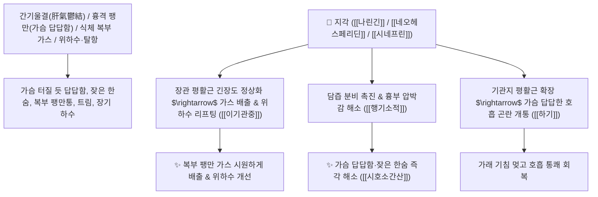

# 🌿 [[지각]] (枳殼, Aurantii Fructus Immaturus / 익은탱자·광귤열매)

> **핵심 요약 (Key Summary)**:
> 운향과(*Rutaceae*) 광귤나무(*Citrus aurantium*) 또는 탱자나무의 거의 성숙한 열매
> 플라보노이드인 [[나린긴]](Naringin)과 [[네오헤스페리딘]] 및 교감신경 아드레날린 수용체 효능제인 [[시네프린]](Synephrine)이 장관 연동운동을 정상화하고 기관지 평활근을 확장시켜 이기관중 및 하기거담 작용 발휘
> 흉격(가슴)에 기운이 꽉 막혀 답답하고 숨이 찬 증상(흉협 창만)·위하수 및 소화불량 복부 팽만·탈항·자궁하수를 부드럽게 소통시키고 끌어올리는 대표적인 [[이기관중]](理氣寬中)·[[행기소적]](行氣消積)·[[시호소간산]](柴胡疎肝散)·[[혈부축어탕]](血府逐瘀湯)의 군약(君藥)

---
## 📌 목차
1. [기본 본초 정보 & 화학 구조 (Pharmacognosy)](#1-기본-본초-정보--화학-구조-pharmacognosy)
2. [핵심 분자약리 기전 & 나린긴·시네프린·이기관중·장운동 네트워크](#2-핵심-분자약리-기전--나린긴시네프린이기관중장운동-네트워크)
3. [해부생체역학 / 흉곽 늑간근 팽만 & 골반저근 지지력 연계](#3-해부생체역학--흉곽-늑간근-팽만--골반저근-지지력-연계)
4. [사상의학 및 지각 vs 지실 파기/행기 정밀 감별](#4-사상의학-및-지각-vs-지실-파기행기-정밀-감별)
5. [고전 의학 및 배오 원리 (시호소간산 & 혈부축어탕)](#5-고전-의학-및-배오-원리-시호소간산--혈부축어탕)
6. [핵심 처방 비교 매트릭스](#6-핵심-처방-비교-매트릭스)
7. [출처 및 학술 참고 문헌 (References)](#7-출처-및-학술-참고-문헌-references)

---
## 1. 기본 본초 정보 & 화학 구조 (Pharmacognosy)

> [!abstract]+ 🧪 3D 약리 분자 구조 (Interactive 3D Viewer)
> <iframe src="https://molecule-viewer-rho.vercel.app/?cid=442428" style="width: 100%; height: 600px; border: none; border-radius: 12px; box-shadow: 0 4px 20px rgba(0,0,0,0.15);" allowfullscreen></iframe>


| 항목 | 상세 내용 |
| :--- | :--- |
| **기원 식물** | 운향과(Rutaceae) 광귤나무 *Citrus aurantium* L. 또는 탱자나무 *Poncirus trifoliata* Rafin.의 거의 다 자란 열매 |
| **성미 (性味)** | 苦·辛·酸, 微寒 (쓰고 맵고 시며 약간 차가움) |
| **귀경 (歸經)** | 肺·脾·胃·大腸經 (폐경, 비경, 위경, 대장경) - **가슴과 대장의 막힌 기운을 온화하게 틔움** |
| **효능 (Actions)** | [[이기관중]](理氣寬中), [[행기소적]](行氣消積), [[하기거담]](下氣祛痰), [[소창지통]](消脹止痛) |
| **주요 성분** | • **플라보노이드 배당체(핵심 지표)**: [[나린긴]] (Naringin, KP 규격 $\ge 4.0\%$), [[네오헤스페리딘]] (Neohesperidin, KP 규격 $\ge 2.0\%$), 헤스페리딘<br>• **아민 알칼로이드**: [[시네프린]] (Synephrine, $\alpha_1/\beta_3$ 아드레날린 수용체 작용제)<br>• **모노테르펜 정유**: 리모넨, 미르센, 리날룰 |

> **[유래 및 본초학적 기전]**:
> * 다 자란 탱자 열매(껍질 殼)로, 어린 열매인 [[지실]](枳實)에 비해 약성이 부드럽고 온화하여 가슴(흉격 흉협)과 대장의 막힌 기운을 틔워주는(이기관중 理氣寬中) 온화한 행기제입니다.
> * 스트레스로 가슴과 명치가 꽉 막혀 답답하고 한숨을 쉬며, 가스가 차서 배가 빵빵한 증상을 시원하게 뚫어줍니다.
> * 위하수, 자궁하수, 탈항 등 장기가 아래로 처졌을 때 기운을 순행시키고 평활근 긴장도를 복원합니다.

### 🔬 지각의 주요 나린긴 및 시네프린 화학 구조
```
     [ 플라바논 골격 (4',5,7-트리하이드록시) ]───O──[ Neohesperidose (Rha-Glc) ]  <-- 나린긴 (Naringin)
```
> **[구조적 특징 및 이기(理氣) 작용]**: [[나린긴]]은 위장관 평활근의 경련성 수축을 완화하는 동시에 위 배출능을 개선하고, [[시네프린]]은 교감신경 수용체를 조절하여 심박출량을 유지하며 지방 분해 및 기관지 확장을 유도합니다.

---
## 2. 핵심 분자약리 기전 & 나린긴·시네프린·이기관중·장운동 네트워크



### (1) 표적 이기관중 및 행기소적 작용
* **흉협 팽만 및 간기울결 완치 ([[이기관중]] 理氣寬中)**:
  * 스트레스로 옆구리와 가슴이 결리고 꽉 막혀 답답한 증상을 시원하게 풀어줍니다 ([[시호소간산]]).
* **위하수, 자궁하수, 탈항 수복 ([[하기소창]])**:
  * 장기가 아래로 처져 밑이 빠질 것 같은 중압감을 보중익기탕류와 배합하여 끌어올립니다.
* **혈부축어탕(血府逐瘀湯)의 흉부 기기(氣機) 개통**:
  * 흉부의 기를 뚫어 어혈을 제거하는 활혈제(도인, 홍화, 천궁)의 약력을 극대화합니다.

---
## 3. 해부생체역학 / 흉곽 늑간근 팽만 & 골반저근 지지력 연계

* **횡격막 및 늑간근(Intercostal Muscle) 긴장도 완화**:
  * 흉강 내압을 정상화하여 심폐 압박감 및 과호흡을 진정시킵니다.

---
## 4. 사상의학 및 지각 vs 지실 파기/행기 정밀 감별

```
[🔍 탱자 열매 2대 감별 매트릭스: 지실 vs 지각]
• [[지실]](枳實, 어린 열매): 성질이 사납고 맹렬 $\rightarrow$ 파기소적(破氣消積) (명치 밑 단단한 덩어리, 완고한 변비, 비만 실증)
• [[지각]](枳殼, 성숙 열매): 성질이 온화하고 부드러움 $\rightarrow$ 이기관중(理氣寬中) (가슴 답답함, 헛배 부름, 위하수, 노약자/부인과 질환)

[💡 임상 팁]
• 상초/흉격의 기체에는 [[지각]], 중초/하초의 단단한 적취에는 [[지실]]을 선택
```

---
## 5. 고전 의학 및 배오 원리 (시호소간산 & 혈부축어탕)

### (1) 가슴속 기운과 피를 뚫는 황제방
* **이기소간 최고 명약 배오**:
  * [[지각]] + [[시호]] + [[향부자]] + [[백작약]] + [[천궁]] $\rightarrow$ 간기울결과 흉협통을 치료하는 불후의 명방 ([[시호소간산]])
  * [[지각]] + [[도인]] + [[홍화]] + [[당귀]] + [[우슬]] + [[시호]] $\rightarrow$ 흉부 어혈을 뚫는 최고 방 ([[혈부축어탕]])

---
## 6. 핵심 처방 비교 매트릭스

| 처방명 | 구성 약재 | 주치 병증 및 임상 타깃 | 특징 및 감별점 |
| :--- | :--- | :--- | :--- |
| [[시호소간산]] | [[시호]], [[지각]], [[향부자]], [[백작약]], [[천궁]], [[감초]] | **간기울결, 흉협 창통, 한숨, 소화불량, 유방 팽만통** | 가슴과 옆구리의 기를 틔움 |
| [[혈부축어탕]] | [[당귀]], [[생지황]], [[도인]], [[홍화]], [[지각]], [[적작약]], [[시호]] 등 | **흉중 혈어, 가슴 찌르는 통증, 두통, 딸꾹질, 가슴 답답함** | 흉부 어혈과 기체를 동시 해소 |
| [[삼소음]] | [[인삼]], [[자소엽]], [[전호]], [[반하]], [[지각]], [[길경]] | **허약자 풍한 감모, 기침 가래, 흉격 비만, 오심 구토** | 폐기를 내리고 가슴을 편안하게 함 |

---
## 7. 출처 및 학술 참고 문헌 (References)

2. **대한민국약전(KP) 제12개정 (2022)**. 의약품각조 제2부: 지각 (Aurantii Fructus Immaturus) 규격 기준.
   - **[공정서 규격]**: 나린긴 4.0% 및 네오헤스페리딘 2.0% 이상 함유 필수 규격 명시.
