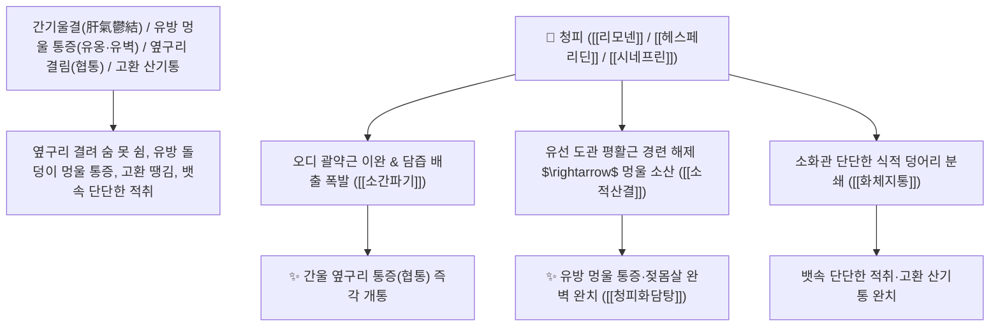

# 🌿 [[청피]] (靑皮 / 四靑皮, Citri Reticulatae Pericarpium Viride / 어린귤껍질)

> **핵심 요약 (Key Summary)**:
> 운향과(*Rutaceae*) 귤나무(*Citrus unshiu*)의 덜 익은 어린 푸른 과피(미성숙 귤껍질)
> 모노테르펜 정유인 [[리모넨]](d-Limonene)과 플라보노이드 [[헤스페리딘]](Hesperidin) 및 알칼로이드 [[시네프린]](Synephrine)이 담즙 분비를 폭발적으로 촉진하고 간담 평활근 울혈을 뚫어 소간파기 및 소적산결 작용 발휘
> 간기울결(肝氣鬱結)로 인한 옆구리 결림(협통 脇痛)·유방 멍울 통증(유옹·유벽)·고환 산기통(疝氣) 및 완고한 식적 덩어리(적취)를 맹렬히 부숴 뚫어주는 천하제일의 [[소간파기]](疏肝破氣)·[[소적산결]](消積散結)·[[화체지통]](化滯止痛)·[[청피화담탕]](靑皮化痰湯)의 군약(君藥)

---
## 📌 목차
1. [기본 본초 정보 & 화학 구조 (Pharmacognosy)](#1-기본-본초-정보--화학-구조-pharmacognosy)
2. [핵심 분자약리 기전 & 리모넨·시네프린·소간파기·산결 네트워크](#2-핵심-분자약리-기전--리모넨시네프린소간파기산결-네트워크)
3. [해부생체역학 / 오디 괄약근 & 유선 도관 평활근 연계](#3-해부생체역학--오디-괄약근--유선-도관-평활근-연계)
4. [사상의학 및 청피 vs 진피 상하 승강/파기 정밀 감별](#4-사상의학-및-청피-vs-진피-상하-승강파기-정밀-감별)
5. [고전 의학 및 배오 원리 (청피화담탕 & 금령자산 배오)](#5-고전-의학-및-배오-원리-청피화담탕--금령자산-배오)
6. [핵심 처방 비교 매트릭스](#6-핵심-처방-비교-매트릭스)
7. [출처 및 학술 참고 문헌 (References)](#7-출처-및-학술-참고-문헌-references)

---
## 1. 기본 본초 정보 & 화학 구조 (Pharmacognosy)

> [!abstract]+ 🧪 3D 약리 분자 구조 (Interactive 3D Viewer)
> <iframe src="https://molecule-viewer-rho.vercel.app/?cid=22311" style="width: 100%; height: 600px; border: none; border-radius: 12px; box-shadow: 0 4px 20px rgba(0,0,0,0.15);" allowfullscreen></iframe>


| 항목 | 상세 내용 |
| :--- | :--- |
| **기원 식물** | 운향과(Rutaceae) 귤 *Citrus unshiu* Markovich 또는 동속 근연식물의 5~6월에 채취한 덜 익은 푸른 과피 |
| **성미 (性味)** | 苦·辛, 溫 (쓰고 매우며 향기가 톡 쏘듯 강렬하고 따뜻함) |
| **귀경 (歸經)** | 肝·膽·胃經 (간경, 담경, 위경) - **간담의 막힌 기운을 뚫고 아랫배 덩어리를 깸** |
| **효능 (Actions)** | [[소간파기]](疏肝破氣), [[소적산결]](消積散結), [[화체지통]](化滯止痛), [[산한통산]](散寒通疝) |
| **주요 성분** | • **모노테르펜 정유(함량 2~3%로 진피보다 농축)**: [[리모넨]] (d-Limonene, 70~85%), 테르피넨, 시트랄<br>• **플라보노이드 배당체**: [[헤스페리딘]] (Hesperidin, KP 규격 $\ge 5.0\%$), [[노빌레틴]], 탄게레틴<br>• **아민 알칼로이드**: [[시네프린]] (Synephrine, 교감신경 자극 및 평활근 이완) |

> **[유래 및 본초학적 기전]**:
> * 다 익지 않아 껍질이 푸른(靑) 귤껍질로, 묵은 귤껍질인 진피(陳皮)보다 맛이 훨씬 맵고 강렬하여 **'기를 부수는 약(파기지제 破氣之劑)'**이라 불렸습니다.
> * [[진피]](陳皮)**가 비폐(脾肺, 상초/중초)로 들어가 부드럽게 기운을 돌리고 가래를 삭인다면, [[청피]](靑皮)**는 간담(肝膽, 하초/옆구리)으로 직행하여 뭉친 간기(肝氣)와 유방 멍울, 고환 통증, 뱃속 단단한 덩어리를 깨부숩니다.

### 🔬 청피의 고농도 리모넨 및 헤스페리딘 화학 구조
```
     [ 모노테르펜 고리 골격 ]  <-- 리모넨 (d-Limonene, 담낭 수축 및 파기 작용)
```
> **[구조적 특징 및 담즙 배설/소간 작용]**: 청피의 농축된 [[리모넨]]과 [[시네프린]]은 담낭관 및 오디(Oddi) 괄약근의 경련을 이완시키고 담즙 배출 압력을 높여 간담 울혈성 통증을 신속히 해소합니다.

---
## 2. 핵심 분자약리 기전 & 리모넨·시네프린·소간파기·산결 네트워크



### (1) 표적 소간파기 및 유방 멍울 소산 작용
* **유방 멍울(유선증, 유벽) 및 젖몸살 완치 ([[소적산결]] 消積散結)**:
  * 스트레스로 유방에 멍울이 잡히고 스치기만 해도 아픈 증상을 삭여냅니다.
* **간기울결 늑간신경통 및 협통 해소 ([[소간파기]] 疏肝破氣)**:
  * 가슴과 옆구리가 꽉 막혀 한숨을 쉬어야 편해지는 간울증을 뚫어줍니다.
* **고환 부종 산기통 및 완고한 식체 적취 분쇄**:
  * 아랫배와 고환이 당겨 아픈 산기 질환을 다스립니다.

---
## 3. 해부생체역학 / 오디 괄약근 & 유선 도관 평활근 연계

* **바터 팽대부 오디 괄약근(Sphincter of Oddi) 이완**:
  * 담즙 울체를 해소하여 십이지장 소화 효소 분비를 정상화합니다.

---
## 4. 사상의학 및 청피 vs 진피 상하 승강/파기 정밀 감별

```
[🔍 귤껍질 2대 본초 정밀 비교 매트릭스]
• [[진피]](陳皮, 성숙 과피): 辛溫, 理氣和中 $\rightarrow$ 肺·脾 (상초/중초), 소화불량, 가래 기침, 기운을 부드럽게 조화
• [[청피]](靑皮, 미성숙 과피): 苦辛溫, 疏肝破氣 $\rightarrow$ 肝·膽 (하초), 옆구리 통증, 유방 멍울, 산기통, 기운을 맹렬히 깸

[⚠️ 복용 주의사항 (Safety)]
• 파기(破氣) 작용이 강하므로 기운이 허약한 자에게 단독 다량 투여를 금하며, 보기약과 배오
```

---
## 5. 고전 의학 및 배오 원리 (청피화담탕 & 금령자산 배오)

### (1) 멍울과 간기울결을 깨는 최고 명방
* **유방 멍울 최고 배오**:
  * [[청피]] + [[시호]] + [[향부자]] + [[반하]] + [[패모]] $\rightarrow$ 유방과 목 멍울을 삭이는 불후의 명방 ([[청피화담탕]])
  * [[청피]] + [[천련자]] + [[소회향]] $\rightarrow$ 고환 산기통을 멎게 함

---
## 6. 핵심 처방 비교 매트릭스

| 처방명 | 구성 약재 | 주치 병증 및 임상 타깃 | 특징 및 감별점 |
| :--- | :--- | :--- | :--- |
| [[청피화담탕]] | [[청피]], [[반하]], [[진피]], [[복령]], [[패모]], [[시호]], [[백작약]] | **간울 담탁, 흉협 창만, 유방 멍울 통증, 기침 가래** | 간기를 틔우고 멍울을 삭임 |
| [[시호소간산]](가미) | [[시호]], [[향부자]], [[천궁]], [[지각]], [[청피]], [[작약]] | 간기울결, 흉협 협통, 완복 창만, 트림, 감정 우울 | 옆구리 통증을 뚫는 제1방 |
| [[천태오약산]](가미) | [[오약]], [[약목향]], [[소회향]], [[청피]], [[천련자]] | 소장 산기, 고환 편폐 종통, 소복 연급통 | 하초 산기를 흩어버림 |

---
## 7. 출처 및 학술 참고 문헌 (References)

2. **대한민국약전(KP) 제12개정 (2022)**. 의약품각조 제2부: 청피 (Citri Reticulatae Pericarpium Viride) 규격 기준.
   - **[공정서 규격]**: 건조 미성숙 과피 기준 헤스페리딘($\text{C}_{28}\text{H}_{34}\text{O}_{15}$) 5.0% 이상 함유 필수 규격 명시.
