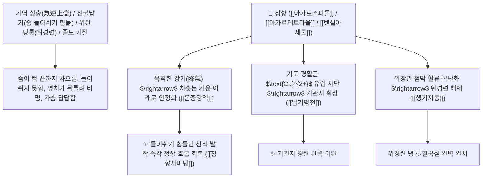

# 🌿 [[침향]] (沈香, Aquilariae Lignum Resinatum / 침향나무수지목재)

> **핵심 요약 (Key Summary)**:
> 팥꽃나무과(*Thymelaeaceae*) 침향나무(*Aquilaria agallocha*)의 상처 부위에 수지가 농축되어 물에 가라앉는 심재(목재)
> 세스퀴테르페노이드인 [[아가로스피롤]](Agarospirol)과 [[아가로푸란]](Agarofuran) 및 페닐에틸크로몬이 중추신경을 진정시키고 기관지 평활근을 이완하여 행기지통 및 온신납기 작용 발휘
> 기운이 위로 치솟아 발생하는 호흡곤란 천식(신불납기 腎不納氣)·위완 냉통(차서 쥐어짜는 위경련)·구토 딸꾹질 및 뇌졸중 기절 구급을 치료하는 천하제일의 [[행기지통]](行氣止痛)·[[온중강역]](溫中降逆)·[[납기평천]](納氣平喘)·[[침향사마탕]](沈香四磨湯)·[[소합향원]](蘇合香丸)의 군약(君藥)

---
## 📌 목차
1. [기본 본초 정보 & 화학 구조 (Pharmacognosy)](#1-기본-본초-정보--화학-구조-pharmacognosy)
2. [핵심 분자약리 기전 & 아가로스피롤·크로몬·기관지 이완 및 진정 네트워크](#2-핵심-분자약리-기전--아가로스피롤크로몬기관지-이완-및-진정-네트워크)
3. [해부생체역학 / 횡격막 호흡근 & 장관 평활근 미주신경망 연계](#3-해부생체역학--횡격막-호흡근--장관-평활근-미주신경망-연계)
4. [사상의학 및 임상 응용 (기체 역상 vs 신허 호흡곤란 특화)](#4-사상의학-및-임상-응용-기체-역상-vs-신허-호흡곤란-특화)
5. [고전 의학 및 배오 원리 (침향사마탕 & 소합향원)](#5-고전-의학-및-배오-원리-침향사마탕--소합향원)
6. [핵심 처방 비교 매트릭스](#6-핵심-처방-비교-매트릭스)
7. [출처 및 학술 참고 문헌 (References)](#7-출처-및-학술-참고-문헌-references)

---
## 1. 기본 본초 정보 & 화학 구조 (Pharmacognosy)

> [!abstract]+ 🧪 3D 약리 분자 구조 (Interactive 3D Viewer)
> <iframe src="https://molecule-viewer-rho.vercel.app/?cid=21675005" style="width: 100%; height: 600px; border: none; border-radius: 12px; box-shadow: 0 4px 20px rgba(0,0,0,0.15);" allowfullscreen></iframe>


| 항목 | 상세 내용 |
| :--- | :--- |
| **기원 식물** | 팥꽃나무과(Thymelaeaceae) 침향나무 *Aquilaria agallocha* Roxb. 또는 백목향 *Aquilaria sinensis*의 수지가 스며든 목재 |
| **성미 (性味)** | 辛·苦, 微溫 (맵고 쓰며 성질이 따뜻하고 묵직하게 가라앉음) |
| **귀경 (歸經)** | 脾·胃·腎經 (비경, 위경, 신경) - **거슬러 오른 기운을 아래로 내리고 신장의 뿌리를 덥힘** |
| **효능 (Actions)** | [[행기지통]](行氣止痛), [[온중강역]](溫中降逆), [[납기평천]](納氣平喘), [[온신조양]](溫腎助陽) |
| **주요 성분** | • **세스퀴테르펜 정유(핵심 향기 성분)**: [[아가로스피롤]] (Agarospirol), $\alpha$-아가로푸란, 구아이엔, 발렌센<br>• **페닐에틸크로몬 유도체(지표물질)**: [[아가로테트라올]] (Agarotetrol, KP 규격 $\ge 0.10\%$), 플라보노이드<br>• **방향성 에스테르**: 벤질아세톤 |

> **[유래 및 본초학적 기전]**:
> * 나무가 상처를 입었을 때 스스로를 보호하기 위해 분비한 수지(樹脂)가 오랜 세월 응결되어 비중이 물보다 무거워져 **물에 가라앉는다(沈) 하여 '침향(沈香)'**이라 불렸습니다.
> * 대부분의 향기 약재(목향, 향부자, 정향)가 위로 뜨는 성질이 있는 반면, **침향은 향기가 깊고 묵직하여 거슬러 치솟는 기운을 아래로 꾹 눌러 내리는(강기 降氣) 한의학 최고의 이기약**입니다.
> * 숨을 들이쉬지 못해 헐떡이는 신허(腎虛) 천식과 차가운 위장 냉통을 단숨에 평정합니다.

### 🔬 침향의 주요 아가로스피롤 및 아가로테트라올 구조
```
     [ 유데스만 세스퀴테르펜 알코올 골격 ]  <-- 아가로스피롤 (Agarospirol)
     [ 2-(2-페닐에틸)크로몬 테트라올 골격 ]  <-- 아가로테트라올 (Agarotetrol)
```
> **[구조적 특징 및 기관지 평활근 이완]**: 침향의 [[아가로스피롤]]과 크로몬 분획은 중추 $\text{GABA}_\text{A}$ 수용체 복합체를 활성화하여 심신을 안정시키고, 기도 평활근의 칼슘 유입을 억제하여 천식 발작을 진정시킵니다.

---
## 2. 핵심 분자약리 기전 & 아가로스피롤·크로몬·기관지 이완 및 진정 네트워크



### (1) 표적 납기평천 및 온중강역 작용
* **신불납기(腎不納氣) 천식 및 호흡곤란 완치 ([[납기평천]] 納氣平喘)**:
  * 숨을 내쉬기는 쉬우나 들이쉬기가 힘들어 가슴이 답답하고 헐떡이는 천식을 치료합니다 ([[침향사마탕]]).
* **위한성 위경련 및 완복 냉통 해소 ([[행기지통]] 行氣止痛)**:
  * 배가 얼음처럼 차가워 쥐어짜듯 아프고 구토와 딸꾹질이 멎지 않는 증상을 다스립니다.
* **급성 졸도 및 기궐(氣厥) 구급 개규 ([[소합향원]] 蘇合香丸)**:
  * 극심한 스트레스로 기운이 막혀 쓰러진 혼수를 깨웁니다.

---
## 3. 해부생체역학 / 횡격막 호흡근 & 장관 평활근 미주신경망 연계

* **횡격막 수축능 및 폐 용적(TLC) 개선**:
  * 심호흡 시 흉곽 하부 확장을 도와 환기 효율을 극대화합니다.

---
## 4. 사상의학 및 임상 응용 (기체 역상 vs 신허 호흡곤란 특화)

```
[✅ 최적 적응증 (Sweet Spot)]
• 만성 폐쇄성 폐질환(COPD) 및 신허성 노인 천식 (흡기 곤란)
• 극심한 신경성 위경련, 딸꾹질, 찬 음식 후 구토
• 심신 불안, 공황장애로 인한 가슴 답답함과 호흡 곤란

[⚠️ 복용 및 전탕 수칙]
• 고귀한 정유 성분이 날아가지 않도록 달이지 않고 가루 내어 갈아 마시거나(충복 沖服), 탕약 완성 직전 후하(後下)
```

---
## 5. 고전 의학 및 배오 원리 (침향사마탕 & 소합향원)

### (1) 기운을 내리고 천식을 멎게 하는 천하제일 명방
* **강기평천 최고 배오**:
  * [[침향]] + [[빈랑]] + [[지각]] + [[오약]] $\rightarrow$ 치솟은 기운을 내리고 천식을 멎게 하는 불후 명방 ([[침향사마탕]])
  * [[침향]] + [[사향]] + [[소합향]] + [[단향]] $\rightarrow$ 기절 혼수를 깨우는 명방 ([[소합향원]])

---
## 6. 핵심 처방 비교 매트릭스

| 처방명 | 구성 약재 | 주치 병증 및 임상 타깃 | 특징 및 감별점 |
| :--- | :--- | :--- | :--- |
| [[침향사마탕]] | [[침향]], [[빈랑]], [[지각]], [[오약]] (마즙) | **칠정 울결, 상기 천급, 흉협 창만, 대소변 불통** | 기운을 아래로 내리는 제1방 |
| [[소합향원]] | [[소합향]], [[침향]], [[사향]], [[단향]], [[정향]], [[빙편]] | **중풍 기궐, 한사 혼미, 심통, 졸도 구급** | 방향 개규의 최고 황제환 |
| [[침향강기산]] | [[침향]], [[사인의]], [[향부자]], [[감초]] | **위한 기체, 흉비 심통, 구토, 완복 창통** | 위장의 기운을 편안히 다스림 |

---
## 7. 출처 및 학술 참고 문헌 (References)

2. **대한민국약전(KP) 제12개정 (2022)**. 의약품각조 제2부: 침향 (Aquilariae Lignum Resinatum) 규격 기준.
   - **[공정서 규격]**: 수지 목재 기준 아가로테트라올($\text{C}_{17}\text{H}_{18}\text{O}_6$) 0.10% 이상 함유 필수 규격 명시.
