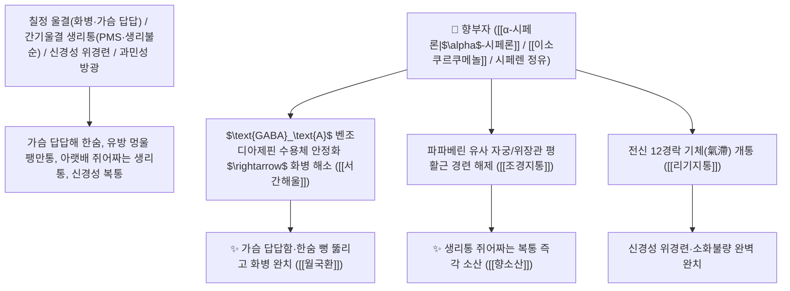

# 🌿 [[향부자]] (香附子 / 香附, Cyperi Rhizoma / 향부자뿌리줄기)

> **핵심 요약 (Key Summary)**:
> 사초과(*Cyperaceae*) 향부자(*Cyperus rotundus*)의 털을 불로 그슬려 제거한 건조한 뿌리줄기(사초근 莎草根)
> 세스퀴테르펜 정유인 [[α-시페론|$\alpha$-시페론]]($\alpha$-Cyperone)과 [[이소쿠르쿠메놀]](Isocurcumenol) 및 시페렌이 벤조디아제핀 수용체와 $\text{GABA}_\text{A}$ 신경망을 조절하고 자궁·위장관 평활근 경련을 이완시켜 서간해울 및 조경지통 작용 발휘
> 칠정 울결(七情鬱結, 스트레스 화병·가슴 답답함·한숨) 및 간기울결 생리통(월경불순·유방 팽만통·생리전 증후군 PMS)·신경성 위경련을 치료하는 천하제일의 "부인과 통증의 주약(婦人之主藥)"·[[서간해울]](舒肝解鬱)·[[조경지통]](調經止痛)·[[리기지통]](理氣止痛)·[[월국환]](越鞠丸)·[[향소산]](香蘇散)의 군약(君藥)

---
## 📌 목차
1. [기본 본초 정보 & 화학 구조 (Pharmacognosy)](#1-기본-본초-정보--화학-구조-pharmacognosy)
2. [핵심 분자약리 기전 & $\alpha$-시페론·이소쿠르쿠메놀·파파베린 유사 평활근 이완 네트워크](#2-핵심-분자약리-기전--alpha-시페론이소쿠르쿠메놀파파베린-유사-평활근-이완-네트워크)
3. [해부생체역학 / 자궁 근층 긴장도 & 시상하부-변연계 정서 회로 연계](#3-해부생체역학--자궁-근층-긴장도--시상하부-변연계-정서-회로-연계)
4. [사상의학 및 육울(六鬱)의 총사령관 vs 향부자·목향 상하 감별](#4-사상의학-및-육울六鬱의-총사령관-vs-향부자목향-상하-감별)
5. [고전 의학 및 배오 원리 (월국환 & 향소산 배오)](#5-고전-의학-및-배오-원리-월국환--향소산-배오)
6. [핵심 처방 비교 매트릭스](#6-핵심-처방-비교-매트릭스)
7. [출처 및 학술 참고 문헌 (References)](#7-출처-및-학술-참고-문헌-references)

---
## 1. 기본 본초 정보 & 화학 구조 (Pharmacognosy)

> [!abstract]+ 🧪 3D 약리 분자 구조 (Interactive 3D Viewer)
> <iframe src="https://molecule-viewer-rho.vercel.app/?cid=12308843" style="width: 100%; height: 600px; border: none; border-radius: 12px; box-shadow: 0 4px 20px rgba(0,0,0,0.15);" allowfullscreen></iframe>


| 항목 | 상세 내용 |
| :--- | :--- |
| **기원 식물** | 사초과(Cyperaceae) 향부자 *Cyperus rotundus* L.의 뿌리줄기 (수염뿌리를 불로 태워 없앤 제향부 製香附) |
| **성미 (性味)** | 辛·微苦·微甘, 平 (맵고 약간 쓰며 달고 향기가 맑으며 성질이 평이하여 기운을 자유자재로 틔움) |
| **귀경 (歸經)** | 肝·脾·三焦經 (간경, 비경, 삼초경) - **간기(肝氣)의 울화를 풀고 온몸 12경락의 막힌 기운을 뚫음** |
| **효능 (Actions)** | [[서간해울]](舒肝解鬱), [[조경지통]](調經止痛), [[리기지통]](理氣止痛), [[관중소식]](寬中消食) |
| **주요 성분** | • **세스퀴테르펜 정유(핵심 지표물질)**: [[α-시페론|$\alpha$-시페론]] ($\alpha$-Cyperone, KP 규격 $\ge 0.10\%$), 시페렌(Cyperene), 시페롤<br>• **진정/진통 테르페노이드**: [[이소쿠르쿠메놀]] (Isocurcumenol, 벤조디아제핀 수용체 조절), 수게놀<br>• **플라보노이드 및 패치올레논**: 루테올린, 아피게닌 |

> **[유래 및 본초학적 기전]**:
> * 덩이뿌리 모양이 부자(附子)처럼 생겼는데 맑고 그윽한 향기(香)가 난다 하여 '향부자(香附子)'라 불렸습니다.
> * 한의학에서 **"모든 기병을 다스리는 총사령관이자, 부인과 질환의 성약(기병지총 氣病之總, 부인지주 婦人之主)"**으로 불리며, 여성의 화병, 가슴 답답함, 생리통을 풀어내는 최고의 이기약입니다.
> * 주단계의 육울(六鬱: 기·혈·습·열·담·식) 치료에서 **기울(氣鬱)을 풀어 나머지 5가지 울체를 연쇄적으로 해소시키는 월국환(越鞠丸)의 주약**입니다.

### 🔬 향부자의 주요 알파-시페론 및 이소쿠르쿠메놀 화학 구조
```
     [ 유데스만 세스퀴테르펜 에논 골격 ]  <-- $\alpha$-시페론 ($\alpha$-Cyperone)
     [ 구아이안 세스퀴테르펜 알코올 ]  <-- 이소쿠르쿠메놀 (Isocurcumenol)
```
> **[구조적 특징 및 GABA/평활근 이완 기전]**: 향부자의 [[이소쿠르쿠메놀]]은 중추 $\text{GABA}_\text{A}$ 벤조디아제핀 결합 부위를 조절하여 스트레스성 불안을 진정시키며, [[α-시페론|$\alpha$-시페론]]은 파파베린(Papaverine)과 유사하게 $\text{PDE}$(포스포디에스테라아제)를 억제하여 자궁, 위장관, 방광 평활근의 경련을 즉각 이완시킵니다.

---
## 2. 핵심 분자약리 기전 & $\alpha$-시페론·이소쿠르쿠메놀·파파베린 유사 평활근 이완 네트워크



### (1) 표적 서간해울 및 부인과 생리통 완치 작용
* **화병, 스트레스성 가슴 답답함 및 한숨 완치 ([[서간해울]] 舒肝解鬱)**:
  * 억울한 감정으로 가슴과 옆구리가 결리고 습관적으로 한숨을 쉬는 증상을 뚫어줍니다 ([[월국환]]).
* **생리통, 월경전 증후군(PMS) 및 유방 창만통 완치 ([[조경지통]] 調經止痛)**:
  * 생리 전 유방이 붓고 스치기만 해도 아프며 아랫배가 뒤틀리는 생리통을 완벽히 멎게 합니다.
* **신경성 위경련 및 과민성 장 증후군 복통 해소**:
  * 스트레스만 받으면 체하고 배가 아프며 설사하는 증상을 다스립니다 ([[향소산]]).

---
## 3. 해부생체역학 / 자궁 근층 긴장도 & 시상하부-변연계 정서 회로 연계

* **변연계 편도체 과민성 억제**:
  * 교감신경의 과도한 혈관 수축 반사를 억제하여 골반강 혈류를 정상화합니다.

---
## 4. 사상의학 및 육울(六鬱)의 총사령관 vs 향부자·목향 상하 감별

```
[🔍 주단계의 육울(六鬱) 해결 매트릭스]
• 氣鬱: [[향부자]] (총사령관) $\rightarrow$ 기가 돌면 나머지 모든 울체가 풀림!
• 濕鬱: [[창출]], 火鬱: [[치자]], 血鬱: [[천궁]], 食鬱: [[신곡]], 痰鬱: [[반하]]
$\rightarrow$ 육울을 한 방에 날리는 처방 = [[월국환]](越鞠丸)

[🔍 향부자 vs 목향 정밀 감별]
• [[향부자]](香附子): 疏肝解鬱, 調經 $\rightarrow$ 흉협부, 간담, 자궁, 정서적 스트레스 화병
• [[목향]](木香): 行氣止痛, 健脾 $\rightarrow$ 중초 비위, 대장, 소화기 실질 식체, 이질 설사
```

---
## 5. 고전 의학 및 배오 원리 (월국환 & 향소산 배오)

### (1) 울화를 풀고 생리를 고르게 하는 천하제일 황제방
* **육울 해소 최고 배오**:
  * [[향부자]] (군약) + [[창출]] + [[천궁]] + [[치자]] + [[신곡]] $\rightarrow$ 모든 울화를 날리는 불후 명방 ([[월국환]])
* **풍한 기체 최고 배오**:
  * [[향부자]] + [[자소엽]] + [[진피]] + [[감초]] $\rightarrow$ 가슴 답답한 감기와 소화불량을 치료 ([[향소산]])

---
## 6. 핵심 처방 비교 매트릭스

| 처방명 | 구성 약재 | 주치 병증 및 임상 타깃 | 특징 및 감별점 |
| :--- | :--- | :--- | :--- |
| [[월국환]] | [[향부자]], [[창출]], [[천궁]], [[산치자]], [[신곡]] | **육울증, 흉비 비만, 완복 창통, 탄산 토고, 소화불량** | 울체된 모든 기운을 틔우는 제1방 |
| [[향소산]] | [[향부자]], [[자소엽]], [[진피]], [[백지]], [[감초]] | **외감 풍한, 내상 기체, 두통 오한, 가슴 답답함, 식욕 부진** | 스트레스성 감기와 소화장애 치료 |
| [[시호소간산]](가미) | [[시호]], [[향부자]], [[천궁]], [[지각]], [[작약]] | 간기울결, 흉협 창만통, 유방 멍울, 한숨, 생리통 | 간의 기운을 소통시키는 대표방 |

---
## 7. 출처 및 학술 참고 문헌 (References)

1. **Ha JH et al. (2002)**. Modulation of radioligand binding to the GABA(A)-benzodiazepine receptor complex by a new component from Cyperus rotundus. *Biological & pharmaceutical bulletin*, 25(1): 128-30. [PMID: 11824542](https://pubmed.ncbi.nlm.nih.gov/11824542/)
   - **[연구 요약]**: 향부자의 이소쿠르쿠메놀 성분이 $\text{GABA}_\text{A}$ 벤조디아제핀 수용체 조절을 통해 항불안, 진정 및 평활근 경련 이완 활성을 발휘함을 규명.
2. **대한민국약전(KP) 제12개정 (2022)**. 의약품각조 제2부: 향부자 (Cyperi Rhizoma) 규격 기준.
   - **[공정서 규격]**: 건조 뿌리줄기 기준 $\alpha$-시페론($\text{C}_{15}\text{H}_{22}\text{O}$) 0.10% 이상 함유 필수 규격 명시.
