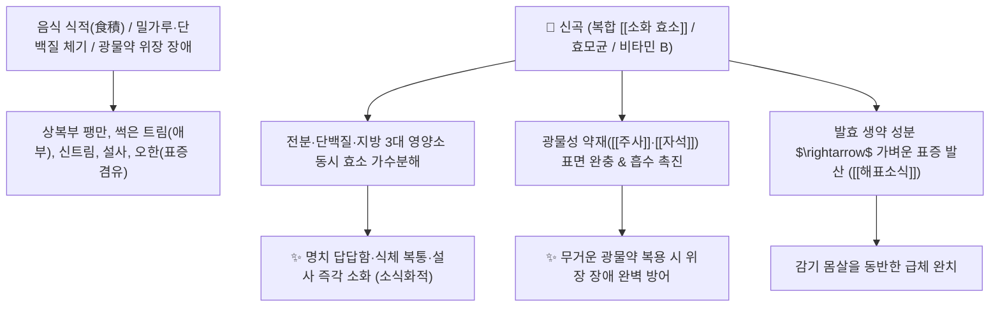

# 🌿 [[신곡]] (神麴 / 六神曲, Massa Medicata Fermentata / 누룩)

> **핵심 요약 (Key Summary)**:
> 밀가루·적소두·행인·청호·창이자·자소 등을 반죽하여 발효시킨 복합 효모 발효 누룩
> 아밀라아제·프로테아제·[[소화 효소]] 및 비타민 B 복합체가 탄수화물과 지방·단백질 음식 정체를 분해하고 광물성 약재의 위장 흡수를 촉진
> 음식 식적(食積)으로 인한 소화불량·복부 팽만·트림·설사 및 표증(감기 기운)을 겸한 체기, [[주사]]·[[자석]] 등 광물성 약재의 소화 보조를 치료하는 대표적인 [[소식화적]](消食化積)·[[건비화위]](健脾和胃)·[[조화광석약]](助化鑛石藥) 약재

---
## 📌 목차
1. [기본 본초 정보 & 화학 구조 (Pharmacognosy)](#1-기본-본초-정보--화학-구조-pharmacognosy)
2. [핵심 분자약리 기전 & 복합 소화 효소·광물약 킬레이션 네트워크](#2-핵심-분자약리-기전--복합-소화-효소광물약-킬레이션-네트워크)
3. [해부생체역학 / 위장관 점막 효소 활성 & 장내 미생물총 연계](#3-해부생체역학--위장관-점막-효소-활성--장내-미생물총-연계)
4. [사상의학 및 임상 응용 (생신곡 vs 초신곡 법제)](#4-사상의학-및-임상-응용-생신곡-vs-초신곡-법제)
5. [고전 의학 및 배오 원리 (보화환 배오)](#5-고전-의학-및-배오-원리-보화환-배오)
6. [핵심 처방 비교 매트릭스](#6-핵심-처방-비교-매트릭스)
7. [출처 및 학술 참고 문헌 (References)](#7-출처-및-학술-참고-문헌-references)

---
## 1. 기본 본초 정보 & 화학 구조 (Pharmacognosy)

> [!abstract]+ 🧪 3D 약리 분자 구조 (Interactive 3D Viewer)
> <iframe src="https://molecule-viewer-rho.vercel.app/?cid=71475145" style="width: 100%; height: 600px; border: none; border-radius: 12px; box-shadow: 0 4px 20px rgba(0,0,0,0.15);" allowfullscreen></iframe>


| 항목 | 상세 내용 |
| :--- | :--- |
| **제조 기원** | 밀가루, 팥(적소두), 살구씨(행인), 제비쑥(청호), 도꼬마리(창이자), 들여귀즙 등을 반죽하여 누룩곰팡이로 발효시킨 가공물 (육신곡 六神曲) |
| **성미 (性味)** | 甘·辛, 溫 |
| **귀경 (歸經)** | 脾·胃經 (비경, 위경) - **비위를 덥히고 음식물을 분해** |
| **효능 (Actions)** | [[소식화적]](消食化積), [[건비화위]](健脾和胃), [[조화광석약]](助化鑛石藥), [[하기소비]](下氣消痞) |
| **주요 성분** | • **복합 소화 효소군**: [[아밀라아제]] ($\alpha$-Amylase), [[프로테아제]] (Protease), [[리파아제]] (Lipase)<br>• **발효 대사산물**: 효모균(Saccharomyces), 비타민 B 복합체, 에르고스테롤<br>• **정유 및 플라보노이드**: 청호 및 창이자 유래 발효 성분 |

> **[유래 및 본초학적 기전]**:
> * 신령스러운(神) 효능을 지닌 누룩(麴)으로, 6가지 약재를 혼합하여 발효시켰다 하여 '육신곡(六神曲)'이라 불립니다.
> * 밥, 고기, 밀가루 음식이 얹혀 썩어가는 식적(食積)을 효소의 힘으로 즉각 녹여내고, 단단하여 위를 깎아먹기 쉬운 광물성 약재([[주사]], [[자석]], [[용골]])를 감싸 소화 흡수를 돕습니다.
> * 발효 원료인 청호와 창이자의 약성이 살아 있어, 감기 몸살 기운(표증)을 겸한 체기에 뛰어난 해표소식 효과를 냅니다.

### 🔬 신곡의 발효 효소 및 대사 메커니즘
```
     [ 전분 / 단백질 / 지질 기질 ] ───( 아밀라아제 / 프로테아제 / 리파아제 )───> [ 포도당 / 아미노산 / 지방산 분해 ]
```
> **[구조적 특징 및 활성]**: 누룩 발효 과정에서 생성된 [[아밀라아제]]와 프로테아제는 위내 pH 환경에서도 안정적으로 음식물을 가수분해하고, 장내 유익균 총을 증식시켜 팽만감을 해소합니다.

---
## 2. 핵심 분자약리 기전 & 복합 소화 효소·광물약 킬레이션 네트워크



### (1) 표적 소식화적 및 건비 작용
* **3대 영양소 분해 및 식체 소탕**:
  * 밥, 떡, 빵, 육류가 체하여 발생하는 명치 답답함, 신트림, 썩은 트림, 설사를 효소 작용으로 신속히 소화시킵니다.
* **광물성 및 고형 약재의 소화 흡수 보조 ([[조화광석약]])**:
  * 비중이 무겁고 소화가 안 되는 자석, 주사, 용골, 굴껍질(모려) 등의 약재를 반죽하거나 함께 써서 위장 점막 손상을 막습니다.
* **감기를 겸한 체기 치료 (해표소식)**:
  * 으슬으슬 춥고 열이 나면서 얹힌 감기몸살성 급체를 안전하게 풀어줍니다.

---
## 3. 해부생체역학 / 위장관 점막 효소 활성 & 장내 미생물총 연계

* **십이지장 췌장액 분비 보조**:
  * 내인성 췌장 소화 효소 분비를 촉진하고 장관 내 유해가스 발생을 차단합니다.

---
## 4. 사상의학 및 임상 응용 (생신곡 vs 초신곡 법제)

```
[✅ 법제에 따른 효능 감별]
• 생신곡(生神麴): 소식건비(消食健脾) 및 발산해표(發散解表) $\rightarrow$ 표증을 겸한 감기 식체
• 초신곡(炒神麴, 노랗게 볶은 것): 소식지사(消食止瀉) $\rightarrow$ 소화불량으로 인한 묽은 변, 설사, 소아 식적
• 초초신곡(焦神麴, 거멓게 태운 것): 지사지혈(止瀉止血) $\rightarrow$ 식적으로 인한 출혈성 복사

[✅ 최적 적응증 (Sweet Spot)]
• 식체 복통: 과식 후 명치가 그득하고 트림에서 썩은 냄새가 나며 설사하는 경우 ([[보화환]])
• 무거운 보약 복용 시 체기 방지: 사향, 녹용, 주사 제제 복용 시 소화 보조
```

---
## 5. 고전 의학 및 배오 원리 (보화환 배오)

### (1) 모든 식적을 녹여내는 천하 명방: 보화환(保和丸)
* **식적 치료 3대 본초 배오**:
  * [[산사]] $\rightarrow$ **육류(고기)와 기름진 음식 식적 분해**
  * [[맥아]] $\rightarrow$ **밀가루, 면, 쌀밥 탄수화물 식적 분해**
  * [[신곡]] $\rightarrow$ **묵은 곡류, 단백질 및 제반 식적 발효 분해**
* **시너지**: 세 약재가 결합하여 인체의 모든 식적을 완벽히 소화시키는 [[보화환]]을 구성.

---
## 6. 핵심 처방 비교 매트릭스

| 처방명 | 구성 약재 | 주치 병증 및 임상 타깃 | 특징 및 감별점 |
| :--- | :--- | :--- | :--- |
| [[보화환]] | [[산사]], [[신곡]], [[반하]], [[복령]], [[진피]], [[연교]], [[라복자]] | **일체 식적, 완복창만, 애부탄산(신트림), 오심, 설사** | 식적 치료의 천하제일 대표방 |
| [[자석양신환]] | [[자석]], [[신곡]], [[육미지황탕]] 구성 약재 | **신허 이명, 청력 감퇴, 어지럼증 (광물 자석 흡수 보조)** | 광물약의 소화를 돕는 명방 |
| [[비아환]] | [[신곡]], [[맥아]], [[사군자]], [[황련]], [[육두구]] | **소아 감적, 복부 팽만, 영양불량, 만성 설사, 기생충** | 소아 소화 기능 복원 |

---
## 7. 출처 및 학술 참고 문헌 (References)

1. **Liang X et al. (2024)**. Study on the effects of Massa Medicata Fermentata with different formulations on the intestinal microbiota and enzyme activities in mice with spleen deficiency constipation. *Frontiers in cellular and infection microbiology*, 14: 1524327. [PMID: 39844840](https://pubmed.ncbi.nlm.nih.gov/39844840/)
   - **[연구 요약]**: 신곡의 발효 과정에서 아밀라아제, 프로테아제 및 유기산 농도가 유의하게 증가하여 소화 촉진 및 장내 환경 개선 효과를 나타냄을 입증.
2. **대한민국약전(KP) 제12개정 (2022)**. 의약품각조 제2부: 신곡 (Massa Medicata Fermentata) 규격 기준.
   - **[공정서 규격]**: 발효 누룩의 성상, 순도시험, 회분(8.0% 이하) 및 전분 분해 효소 역가 기준 명시.
