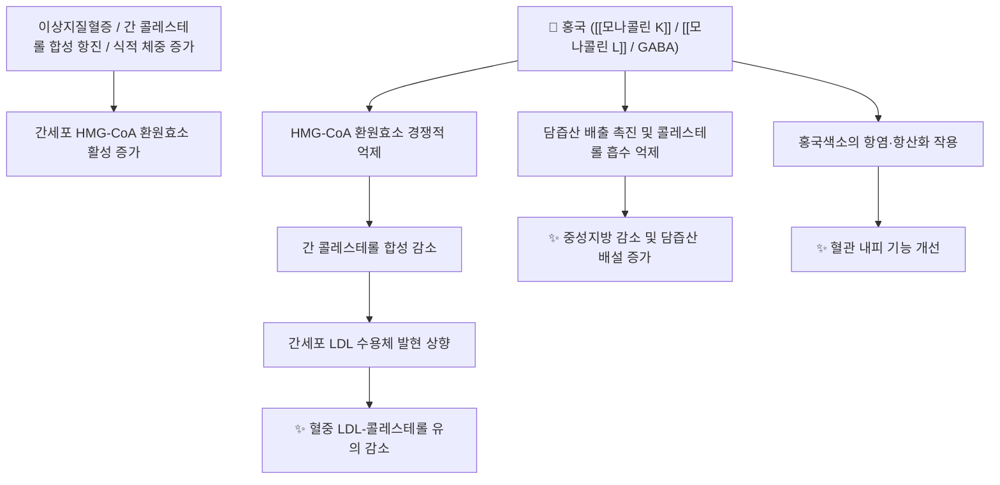

# 🌿 [[홍국]] (紅麴, Red Yeast Rice, Monascus purpureus 발효미)

> **핵심 요약 (Key Summary)**:
> 자낭균류 홍국균(*Monascus purpureus*)을 쌀에 접종하여 발효시킨 전통 발효물로, 한의학에서는 활혈화어(活血化瘀)·건비소식(健脾消食)의 효능으로 쓴다.
> 핵심 활성 성분인 [[모나콜린 K]]가 HMG-CoA 환원효소를 억제하는데, 이 분자는 스타틴계 약물 [[로바스타틴]]과 화학적으로 동일한 물질이다.
> 이상지질혈증에서 총콜레스테롤·LDL-콜레스테롤·중성지방을 유의하게 낮추는 근거가 축적되어 있으며, 메타분석상 효과 크기가 스타틴과 유사한 수준으로 보고되었다.
> ⚠️ 주의사항: 마이코톡신 시트리닌 오염이 실측 조사에서 확인되었고, 유럽식품안전청은 모나콜린 K 3 mg/일 미만으로 사용을 제한하였으므로 출처가 검증된 규격품만 사용해야 한다.

---

## 📌 목차
1. [기본 본초 정보 & 화학 구조 (Pharmacognosy)](#1-기본-본초-정보--화학-구조-pharmacognosy)
2. [핵심 분자약리 기전 & 대사 네트워크](#2-핵심-분자약리-기전--대사-네트워크)
3. [해부생체역학 / 근육·신경 대사 연계](#3-해부생체역학--근육신경-대사-연계)
4. [사상의학 및 체질별 임상 응용 (적응증 vs 금기)](#4-사상의학-및-체질별-임상-응용-적응증-vs-금기)
5. [한의학적 고찰 및 배오 원리](#5-한의학적-고찰-및-배오-원리)
6. [핵심 처방 비교 매트릭스](#6-핵심-처방-비교-매트릭스)
7. [출처 및 학술 참고 문헌 (References)](#7-출처-및-학술-참고-문헌-references)

---

## 1. 기본 본초 정보 & 화학 구조 (Pharmacognosy)

> [!abstract]+ 🧪 핵심 지표성분 3D 분자 구조 (Interactive 3D Viewer)
> <iframe src="https://molecule-viewer-rho.vercel.app/?cid=53232" style="width: 100%; height: 600px; border: none; border-radius: 12px; box-shadow: 0 4px 20px rgba(0,0,0,0.15);" allowfullscreen></iframe>

| 항목 | 상세 내용 |
| :--- | :--- |
| **기원** | 자낭균류 홍국균(*Monascus purpureus*)을 쌀(주로 秈米)에 접종하여 발효·건조한 것 |
| **성미 (性味)** | 감(甘), 온(溫) |
| **귀경 (歸經)** | 간(肝), 비(脾), 대장(大腸) |
| **효능 (Actions)** | 활혈화어(活血化瘀), 건비소식(健脾消食) |
| **주요 성분** | • 지표 성분: [[모나콜린 K]] (monacolin K, 로바스타틴과 동일 분자) • 유효 활성 성분군: [[모나콜린 L]], [[모나콜린 J]], [[모나콜린 M]], 감마아미노낙산(GABA), [[에르고스테롤]], 홍국색소([[모나스신]], [[안카플라빈]]) |
| **PubChem CID** | [53232](https://pubchem.ncbi.nlm.nih.gov/compound/53232) (모나콜린 K = 로바스타틴) |
| **안전성 핵심** | 마이코톡신 시트리닌 오염 위험, 모나콜린 K의 스타틴 동일 분자로서의 근육·간 독성 |

### 🔬 주요 지표물질 화학 구조

모나콜린 K는 헥사히드로나프탈렌 골격에 메틸뷰티릴 곁사슬이 결합한 구조로, HMG-CoA 환원효소의 촉매 부위에 경쟁적으로 결합한다. 이 구조는 로바스타틴과 완전히 동일하며, 락톤 형태로 존재하다 체내에서 활성형 하이드록시산으로 가수분해된다.

> **[구조적 특징 및 활성]**: 모나콜린 K의 곁사슬 3-하이드록시-3-메틸글루타릴 부위가 HMG-CoA 기질과 유사하여 효소 친화도가 높다. 계열 성분인 모나콜린 L·J·M은 곁사슬 구조가 달라 억제 활성이 모나콜린 K보다 낮다.

---

## 2. 핵심 분자약리 기전 & 대사 네트워크

### (1) 표적 효소 및 신호전달 경로

* HMG-CoA 환원효소 억제 (주 기전):
  * 모나콜린 K가 간세포의 HMG-CoA 환원효소를 경쟁적으로 억제하여 콜레스테롤 신합성을 줄인다.
  * 간내 콜레스테롤 농도가 낮아지면 [[LDL 수용체]] 발현이 상향 조절되어 혈중 LDL-콜레스테롤 청소율이 증가한다.
* 담즙산 대사 조절:
  * 콜레스테롤의 담즙산 전환·배설이 촉진되어 체내 콜레스테롤 풀이 감소한다.
* 홍국색소의 부가 작용:
  * [[모나스신]]·[[안카플라빈]]이 항염 및 대사 조절 경로에 관여한다는 전임상 보고가 있다.

### (2) 인체 임상 근거 (검증된 수치)

* 24개 무작위 대조 시험 메타분석: 홍국 보충은 총콜레스테롤을 −33.16 mg/dL, LDL-콜레스테롤을 −28.94 mg/dL, 중성지방을 −23.36 mg/dL 낮추고 HDL-콜레스테롤을 +2.49 mg/dL 높였다(모두 P<0.001). 1,200 mg 미만 용량, 12주 미만 기간이 이상지질혈증 환자에서 더 효과적이었다 (PMID 36259545).
* 93개 무작위 시험, 9,625명 메타분석: 총콜레스테롤 −0.91 mmol/L, 중성지방 −0.41 mmol/L, LDL-콜레스테롤 −0.73 mmol/L, HDL-콜레스테롤 +0.15 mmol/L. 지질 개선 효과가 프라바스타틴·심바스타틴·로바스타틴·아토르바스타틴·플루바스타틴과 유사한 수준으로 나타났다 (PMID 17302963).
* 13개 위약대조 시험, 804명 메타분석: 총콜레스테롤 −0.97 mmol/L, 중성지방 −0.23 mmol/L, LDL-콜레스테롤 −0.87 mmol/L(모두 P<0.001)를 낮췄으나 HDL-콜레스테롤은 유의하게 증가하지 않았다(P=0.11) (PMID 24897342).
* 일본 다기관 무작위 시험, 18명, 8주: 저용량 홍국 200 mg/일(모나콜린 K 2 mg) 투여군에서 LDL-콜레스테롤이 −0.96 mmol/L 감소해 식이요법 단독군 −0.20 mmol/L보다 유의하게 컸다(P=0.030). 총콜레스테롤·아포지단백 B·혈압도 감소했고 근육·간·신장 관련 중대한 이상반응은 없었다 (PMID 34587702).

---

## 3. 해부생체역학 / 근육·신경 대사 연계

* 골격근 대사와의 연계:
  * 모나콜린 K는 스타틴과 동일 분자이므로, 스타틴 계열에서 보고되는 근육 관련 이상반응(근육통·근육경련·크레아틴키나아제 상승)이 이론적으로 동일하게 나타날 수 있다.
  * 다만 홍국 임상시험 메타분석에서는 위약 대비 근육 증상 발생이 유의하게 증가하지 않았다 (PMID 38337728).
* 신경 대사 연계:
  * 발효 과정에서 생성되는 감마아미노낙산(GABA)이 신경 억제성 전달물질로 작용하여 혈압 조절에 부가적으로 관여한다는 보고가 있다.

---

## 4. 사상의학 및 체질별 임상 응용 (적응증 vs 금기)

* 최적 적응증 (Sweet Spot):
  * 어혈(瘀血)이 겸한 이상지질혈증으로 총콜레스테롤·LDL-콜레스테롤이 상승한 경우.
  * 소화 기능이 저하되고 식적(食積)이 잦으면서 지질 수치가 높은 중년 이후 환자.
  * 스타틴을 복용 중이거나 복용을 원하지만 약물 순응도가 낮아 대안이 필요한 경증 환자(반드시 처방의와 상의).
* 금기 및 신중 투여:
  * 간기능 저하 환자 및 간독성 약물 병용 환자.
  * 임신·수유부.
  * 스타틴 또는 피브레이트 계열 약물 복용 중인 환자(중복 투여 시 근육 독성 위험 증가).
  * 자몽주스 등 CYP3A4 억제 물질 섭취 환자(모나콜린 K 혈중 농도 상승).
  * 조절되지 않는 갑상선 질환, 신기능 장애 환자.

---

## 5. 한의학적 고찰 및 배오 원리

* 전통적 인식:
  * 홍국은 원래 식품 착색·보존 목적으로 쓰인 발효물이었으나, 한의학에서는 어혈(瘀血)과 식적(食積)을 함께 다스리는 약재로 인식되어 왔다. 오래된 본초 문헌에도 소화 촉진과 혈액 순환 개선 효능이 기재되어 있다.
* 현대적 재해석:
  * 전통 효능인 활혈화어(活血化瘀)와 건비소식(健脾消食)은 현대 약리로 보면 각각 지질 대사 개선 및 소화·대사 기능 조절에 대응한다.
  * 다만 홍국의 지질 강하 효과는 전통 변증 논리에 따른 것이 아니라 모나콜린 K의 HMG-CoA 환원효소 억제라는 단일 분자 기전에서 비롯된다는 점이 다른 본초와 구별되는 특징이다. 즉 홍국은 변증 기반 본초라기보다 특정 분자를 함유한 기능성 원료에 가깝다.
* 배오 원리:
  * 지질 관리 목적: 홍국 + [[결명자]] + [[산사]] — 결명자는 지질 대사·윤장, 산사는 소식화적(消食化積)을 담당.
  * 어혈 겸증: 홍국 + [[단삼]] + [[홍화]] — 활혈화어 방향을 강화.
  * 담습 겸증: 홍국 + [[택사]] + [[백출]] — 비위 담습을 다스리며 지질 관리.
  * 주의: 스타틴성분 약물과의 병용은 반드시 조정이 필요하다.

---

## 6. 핵심 처방 비교 매트릭스

| 처방명·제제 | 구성 | 주치 및 임상 타깃 | 특징 및 감안점 |
| :--- | :--- | :--- | :--- |
| 혈지강 캡슐 | 홍국 단일(특정 균주 발효) | 이상지질혈증, 관상동맥질환 이차예방 | 중국에서 개발된 중성약. 93개 시험 메타분석에 포함된 대표 제제 |
| 지필타 캡슐 | 홍국 단일 | 이상지질혈증, 고점도혈증 | 메타분석에서 혈지강과 지질 개선 효과 차이가 유의하지 않았다 |
| 자제 배합(지질 관리) | 홍국 + 결명자 + 산사 | 경증 이상지질혈증, 소화 기능 저하 동반 | 한의원에서 활용 가능한 배오 조합. 간기능 추적 필요 |
| 자제 배합(어혈 겸증) | 홍국 + 단삼 + 홍화 | 어혈 겸 이상지질혈증, 혈전 위험 | 활혈화어 방향 강화. 항응고제 병용 시 출혈 위험 확인 |

---

## 7. 출처 및 학술 참고 문헌 (References)

### ① 지질 강하 효과 (메타분석·임상시험)
1. Rahmani P, Melekoglu E, Tavakoli S, et al. (2023). Impact of red yeast rice supplementation on lipid profile: a systematic review and meta-analysis of randomized-controlled trials. *Expert Review of Clinical Pharmacology*, 16(1), 73-81. PMID 36259545.
   * https://pubmed.ncbi.nlm.nih.gov/36259545/
   * [연구 요약] 24개 시험. 총콜레스테롤 −33.16 mg/dL, LDL-콜레스테롤 −28.94 mg/dL, 중성지방 −23.36 mg/dL, HDL-콜레스테롤 +2.49 mg/dL.
2. Liu J, Zhang J, Shi Y, et al. (2006). Chinese red yeast rice (*Monascus purpureus*) for primary hyperlipidemia: a meta-analysis of randomized controlled trials. *Chinese Medicine*, 1, 4. PMID 17302963.
   * https://pubmed.ncbi.nlm.nih.gov/17302963/
   * [연구 요약] 93개 시험, 9,625명. 총콜레스테롤 −0.91 mmol/L, LDL-콜레스테롤 −0.73 mmol/L. 스타틴과 유사한 효과 크기.
3. Li Y, Jiang L, Jia Z, et al. (2014). A meta-analysis of red yeast rice: an effective and relatively safe alternative approach for dyslipidemia. *PLoS One*, 9(6), e98611. PMID 24897342.
   * https://pubmed.ncbi.nlm.nih.gov/24897342/
   * [연구 요약] 13개 위약대조 시험, 804명. HDL-콜레스테롤은 유의하게 증가하지 않음.
4. Minamizuka T, Koshizaka M, Shoji M, et al. (2021). Low dose red yeast rice with monacolin K lowers LDL cholesterol and blood pressure in Japanese with mild dyslipidemia: A multicenter, randomized trial. *Asia Pacific Journal of Clinical Nutrition*, 30(3), 424-435. PMID 34587702.
   * https://pubmed.ncbi.nlm.nih.gov/34587702/
   * [연구 요약] 18명 8주. 홍국 200 mg/일(모나콜린 K 2 mg)로 LDL-콜레스테롤 −0.96 mmol/L.

### ② 안전성 — 시트리닌 오염
5. Righetti L, Dall'Asta C, Bruni R, et al. (2021). Risk Assessment of RYR Food Supplements: Perception vs. Reality. *Frontiers in Nutrition*, 8, 792529. PMID 34950692.
   * https://pubmed.ncbi.nlm.nih.gov/34950692/
   * [연구 요약] EU 시장 홍국 보충제 37개 스크리닝. 시트리닌이 전 제품에서 검출(100~25,100 μg/kg)되었고 100 μg/kg 기준을 충족한 제품은 1개뿐이었다. "citrinin free" 표기 제품에서도 검출. 모나콜린 K 함량이 표기와 크게 다른 제품이 다수였다.

### ③ 안전성 — 근육·간 이상반응
6. Norata GD, Banach M, et al. (2024). The Impact of Red Yeast Rice Extract Use on the Occurrence of Muscle Symptoms and Liver Dysfunction: An Update from the Adverse Event Reporting Systems and Available Meta-Analyses. *Nutrients*, 16(3). PMID 38337728.
   * https://pubmed.ncbi.nlm.nih.gov/38337728/
   * [연구 요약] FAERS·CAERS 데이터베이스 분석. 홍국 관련 근골격계 사례는 전체의 0.008%, 간담도 사례는 0.01%로 낮았고, 무작위 시험 메타분석에서도 근육·간 이상반응 증가가 확인되지 않았다. 다만 유럽식품안전청은 모나콜린 K 3 mg/일 수준에서도 안전성 경고를 제기하고 2023년 6월 3 mg/일 미만으로 사용을 승인하였다.
7. Mazzanti G, Moro PA, Raschi E, et al. (2017). Adverse reactions to dietary supplements containing red yeast rice: assessment of cases from the Italian surveillance system. *British Journal of Clinical Pharmacology*, 83(4), 894-908. PMID 28093797.
   * https://pubmed.ncbi.nlm.nih.gov/28093797/

### ④ 종합 리뷰
8. Cicero AFG, Fogacci F, Banach M. (2019). Red Yeast Rice for Hypercholesterolemia. *Methodist DeBakey Cardiovascular Journal*, 15(3), 192-199. PMID 31687098.
   * https://pubmed.ncbi.nlm.nih.gov/31687098/
9. Cicero AFG, Fogacci F, Stoian AP, et al. (2023). Red Yeast Rice for the Improvement of Lipid Profiles in Mild-to-Moderate Hypercholesterolemia: A Narrative Review. *Nutrients*, 15(10). PMID 37242171.
   * https://pubmed.ncbi.nlm.nih.gov/37242171/

<!-- 신규 작성 2026-10-03. 모든 인용은 PubMed 실존 확인(PMID 대조) 완료. -->

> 검증 메모 (2026-10-03): 9건의 PMID(17302963, 24897342, 28093797, 31687098, 34587702, 34950692, 36259545, 37242171, 38337728) 전부 PubMed 실존 및 서지 일치를 확인하였다. [연구 요약]의 정량 수치(예: TC −33.16 mg/dL, −0.91 mmol/L; 13개 시험 804명; FAERS 근골격계 0.008%·간담도 0.01%)는 각 실제 초록과 부합한다.
