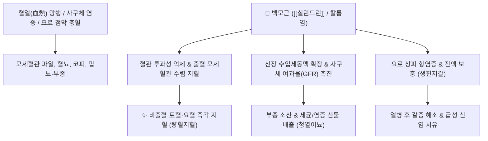

---
aliases:
  - 白茅根
  - 茅根
  - Imperatae Rhizoma
  - 모근
tags:
  - 본초
  - 지혈약
---

# 🌿 [[백모근]] (白茅根, Imperatae Rhizoma)

> **핵심 요약 (Key Summary)**:
> 벼과(*Poaceae*) 띠(*Imperata cylindrica*)의 뿌리줄기
> 트리테르페노이드인 [[실린드린]](Cylindrin)과 [[아룬도인]](Arundoin) 및 풍부한 칼륨염이 모세혈관 투과성을 낮추고 신장 사구체 여과율을 촉진하여 지혈 및 이뇨 작용 발휘
> 혈열(血熱)로 인한 코피(비출혈)·혈뇨·토혈 및 급성 신우신염·방광염·소갈을 치료하는 대표적인 [[량혈지혈]](凉血止血)·[[청열이뇨]](淸熱利尿) 약재

---
## 📌 목차
1. [기본 본초 정보 & 화학 구조 (Pharmacognosy)](#1-기본-본초-정보--화학-구조-pharmacognosy)
2. [핵심 분자약리 기전 & 지혈·신장이뇨 네트워크](#2-핵심-분자약리-기전--지혈신장이뇨-네트워크)
3. [해부생체역학 / 사구체 여과 & 요로 점막 연계](#3-해부생체역학--사구체-여과--요로-점막-연계)
4. [사상의학 및 임상 응용 (적응증 vs 금기)](#4-사상의학-및-임상-응용-적응증-vs-금기)
5. [고전 의학 및 배오 원리](#5-고전-의학-및-배오-원리)
6. [핵심 처방 비교 매트릭스](#6-핵심-처방-비교-매트릭스)
7. [출처 및 학술 참고 문헌 (References)](#7-출처-및-학술-참고-문헌-references)

---
## 1. 기본 본초 정보 & 화학 구조 (Pharmacognosy)

> [!abstract]+ 🧪 3D 약리 분자 구조 (Interactive 3D Viewer)
> <iframe src="https://molecule-viewer-rho.vercel.app/?cid=189045" style="width: 100%; height: 600px; border: none; border-radius: 12px; box-shadow: 0 4px 20px rgba(0,0,0,0.15);" allowfullscreen></iframe>


| 항목 | 상세 내용 |
| :--- | :--- |
| **기원 식물** | 벼과(Gramineae / Poaceae) 띠 *Imperata cylindrica* Beauv. var. *koenigii* Durand et Schinz의 뿌리줄기(근경) |
| **성미 (性味)** | 甘, 寒 |
| **귀경 (歸經)** | 肺·胃·膀胱經 (폐경, 위경, 방광경) |
| **효능 (Actions)** | [[량혈지혈]](凉血止血), [[청열이뇨]](淸熱利尿), [[생진지갈]](生津止渴), [[이습퇴황]](利濕退黃) |
| **주요 성분** | • **트리테르페노이드**: [[실린드린]] (Cylindrin), [[아룬도인]] (Arundoin), Fernenol, Simiarenol<br>• **유기산 및 당류**: 포도당, 자당, 말산, 시트르산, 포타슘(칼륨) 염류<br>• **페놀성 물질**: Imperanene (혈소판 응집 억제 조절자), Graminone |

> **[유래 및 본초학적 기전]**:
> * 백 개의 흰 마디가 촘촘히 엮인 소 여물처럼 생겨 '백모근(白茅根)'이라 불렸습니다.
> * 맛이 달고 성질이 시원하여 혈분(血分)의 열을 식히고 진액을 손상시키지 않으면서 소변을 시원하게 통하게 합니다.
> * 코피(비출혈), 토혈, 혈뇨, 자궁출혈, 부종, 황달, 당뇨(소갈) 및 급성 신염을 다스립니다.

### 🔬 백모근의 주요 지표물질 화학 구조
```
     CH3  CH3
       \ /
      [고리 골격]
     /           \
   H3CO           CH3  <-- 실린드린 (Cylindrin)
```
> **[구조적 특징 및 이뇨 특성]**: 백모근의 메톡시 치환 트리테르페노이드와 고농도 천연 칼륨염은 신장 세뇨관의 삼투성 수분 배출을 유도하면서도 혈관벽 탄력을 강화하여 혈뇨를 멈추게 합니다.

---
## 2. 핵심 분자약리 기전 & 지혈·신장이뇨 네트워크



### (1) 표적 지혈 및 이뇨 작용
* **냉각 수렴성 지혈 ([[량혈지혈]] 凉血止血)**:
  * 모세혈관의 취약성을 개선하고 혈액 응고 인자 활성화를 보조하여 혈열로 인한 코피, 각혈, 혈뇨를 신속히 멈춥니다.
* **신장 보호 및 삼투성 이뇨**:
  * 사구체 여과 기능을 촉진하고 체내 잉여 수분과 나트륨을 배출시켜 급성 신염, 수종, 황달을 완화합니다.
* **진액 보존 (생진지갈 生津止渴)**:
  * 다른 이뇨제와 달리 단맛(甘味)으로 진액을 보충하므로, 열병 후 갈증과 소갈증(당뇨)에 안전하게 사용할 수 있습니다.

---
## 3. 해부생체역학 / 사구체 여과 & 요로 점막 연계

* **사구체 기저막(GBM) 보호**:
  * 급성 신장염 환자에서 사구체 모세혈관의 염증성 손상을 줄여 단백뇨와 혈뇨를 경감합니다.
* **방광 삼각부 점막 진정**:
  * 요로 감염으로 인한 배뇨통과 찌릿한 요도 자극감을 완화합니다.

---
## 4. 사상의학 및 임상 응용 (적응증 vs 금기)

```
[✅ 최적 적응증 (Sweet Spot)]
• 비출혈(코피): 어린이 및 청소년의 열성 코피, 비점막 모세혈관 확장성 출혈
• 비뇨기 출혈: 급성 방광염, 요도염, 신장염으로 인한 혈뇨(尿血) 및 배뇨통
• 열병 후기 구갈: 고열을 앓고 난 뒤 진액이 말라 입안이 마르고 소변이 붉고 적은 경우
• 황달 및 급성 간염: 습열성 황달의 보조 해독제

[⚠️ 신중 투여 및 금기 (Caution / Contraindication)]
• 비위허한(脾胃虛寒): 평소 몸이 차고 소화가 잘 안 되며 묽은 변을 보는 환자
• 한성 출혈: 몸이 차서 혈관이 약해져 생기는 만성 출혈 환자
```

---
## 5. 고전 의학 및 배오 원리

### (1) 고전 본초학적 배오
* **핵심 배오**:
  * [[백모근]] + [[소계]] + [[포황]] $\rightarrow$ 하초 요로계의 혈열을 식히고 혈뇨를 멈추는 황금 짝 ([[소계음자]])
  * [[백모근]] + [[생지황]] + [[연근]](우절)` $\rightarrow$ 상초 비출혈 및 토혈을 맑히는 대표 량혈지혈 조합

---
## 6. 핵심 처방 비교 매트릭스

| 처방명 | 구성 약재 | 주치 병증 및 임상 타깃 | 특징 및 감별점 |
| :--- | :--- | :--- | :--- |
| [[소계음자]] | [[소계]], [[백모근]], [[생지황]], [[활석]], [[포황]], [[치자]] 등 | **하초 습열, 급성 방광염, 혈뇨, 배뇨통, 요도 작열감** | 혈뇨와 요로 통증 치료의 명방 |
| [[모근탕]] | [[백모근]], [[갈근]], [[죽여]], [[맥문동]] | **온열병 후 갈증, 번조, 토혈, 코피** | 열을 내리고 진액을 보충하며 지혈 |
| [[모근음]] | [[백모근]], [[생강]] | **임신부 소변불리, 임신 부종, 황달** | 순하게 수분을 소통시키는 안전 처방 |

---
## 7. 출처 및 학술 참고 문헌 (References)

1. **Matsunaga, K., et al. (1994)**. Imperanene, a novel phenolic compound with platelet aggregation inhibitory activity from *Imperata cylindrica*. *Journal of Natural Products*, 57(9), 1290-1293.
   - **[연구 요약]**: 백모근에서 분리한 임페라넨이 혈관 내피 보호 및 지혈·혈류 조절 활성을 복합적으로 나타냄을 규명.
2. **대한민국약전(KP) 제12개정 (2022)**. 의약품각조 제2부: 백모근 (Imperatae Rhizoma) 규격 기준.
   - **[공정서 규격]**: 건조물 기준 순도시험(이물 2.0% 이하, 중금속, 비소) 및 산불용성회분 3.0% 이하 기준 명시.
