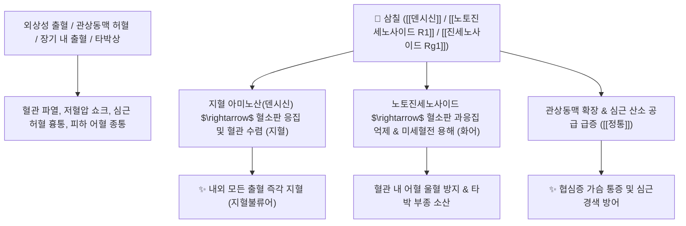

# 🌿 [[삼칠]] (三七, Notoginseng Radix / 田七)

> **핵심 요약 (Key Summary)**:
> 두릅나무과(*Araliaceae*) 삼칠(*Panax notoginseng*)의 뿌리 (전칠근 田七根)
> 지혈 아미노산인 [[덴시신]](Dencichine)과 담마란계 사포닌인 [[노토진세노사이드 R1]](Notoginsenoside R1) 및 [[진세노사이드 Rg1]]이 출혈을 즉시 멎게 하면서도 미세혈전을 남기지 않고 혈관 내피 보호 작용 발휘
> 내외 전신의 모든 외상 출혈·토혈·혈뇨·산후 출혈 및 관상동맥경화증·협심증·타박상 격통을 치료하는 천하제일의 [[화어지혈]](化瘀止血)·[[소종지통]](消腫止痛) 군약(君藥)

---
## 📌 목차
1. [기본 본초 정보 & 화학 구조 (Pharmacognosy)](#1-기본-본초-정보--화학-구조-pharmacognosy)
2. [핵심 분자약리 기전 & 지혈불류어·관상동맥 네트워크](#2-핵심-분자약리-기전--지혈불류어관상동맥-네트워크)
3. [해부생체역학 / 미세혈관 지혈 & 심근 모세혈관 연계](#3-해부생체역학--미세혈관-지혈--심근-모세혈관-연계)
4. [사상의학 및 임상 응용 (생용 활혈지혈 vs 숙용 보혈)](#4-사상의학-및-임상-응용-생용-활혈지혈-vs-숙용-보혈)
5. [고전 의학 및 배오 원리 (운남백약의 주원료)](#5-고전-의학-및-배오-원리-운남백약의-주원료)
6. [핵심 처방 비교 매트릭스](#6-핵심-처방-비교-매트릭스)
7. [출처 및 학술 참고 문헌 (References)](#7-출처-및-학술-참고-문헌-references)

---
## 1. 기본 본초 정보 & 화학 구조 (Pharmacognosy)

> [!abstract]+ 🧪 3D 약리 분자 구조 (Interactive 3D Viewer)
> <iframe src="https://molecule-viewer-rho.vercel.app/?cid=441934" style="width: 100%; height: 600px; border: none; border-radius: 12px; box-shadow: 0 4px 20px rgba(0,0,0,0.15);" allowfullscreen></iframe>


| 항목 | 상세 내용 |
| :--- | :--- |
| **기원 식물** | 두릅나무과(Araliaceae) 삼칠 *Panax notoginseng* (Burkill) F. H. Chen의 뿌리 |
| **성미 (性味)** | 甘·微苦, 溫 |
| **귀경 (歸經)** | 肝·胃經 (간경, 위경) - **혈분(血分)의 약** |
| **효능 (Actions)** | [[화어지혈]](化瘀止血), [[활혈정통]](活血定痛), [[소종생기]](消腫生肌), [[보혈양음]](補血養陰) |
| **주요 성분** | • **삼칠 특이적 사포닌**: [[노토진세노사이드 R1]] (Notoginsenoside R1, KP 규격 $\ge 0.50\%$)<br>• **진세노사이드**: [[진세노사이드 Rg1]] (KP 규격 $\ge 2.7\%$), [[진세노사이드 Rb1]] (KP 규격 $\ge 2.2\%$), Rd, Re<br>• **특이적 지혈 아미노산**: [[덴시신]] (Dencichine / $\beta$-N-옥살릴-L-$\alpha,\beta$-디아미노프로피온산) |

> **[유래 및 본초학적 기전]**:
> * 잎이 좌측에 3개, 우측에 4개씩 달려 합이 7개라 '삼칠(三七)'이라 불렸으며, 옻(漆)처럼 상처 난 혈관을 단단히 붙여준다 하여 '산칠(山漆)'로도 불렸습니다.
> * 지혈제의 가장 큰 부작용인 어혈(혈전) 발생을 완벽히 차단하는 **'지혈불류어(止血不留瘀 - 피는 멎게 하되 어혈은 남기지 않음)'**의 유일무이한 특성을 지닙니다.
> * 중국의 전설적인 지혈 상처치료제인 [[운남백약]](雲南白藥)의 핵심 주원료입니다.

### 🔬 삼칠의 주요 지표물질 화학 구조
```
     [ 담마란 4환 프로토파낙사디올/트리올 골격 ]───O──[ 당사슬 복합체 ]
                         │
     노토진세노사이드 R1 (Notoginsenoside R1) & 진세노사이드 Rg1 / Rb1
```
> **[구조적 특징 및 이중 조절 기전]**: 지혈 성분인 [[덴시신]]이 혈소판 수를 늘리고 응고 시간을 단축시키는 동시에, [[노토진세노사이드]]와 [[진세노사이드 Rg1]]이 혈관 내피세포의 $\text{NO}$ 방출을 촉진하고 관상동맥을 확장하여 미세순환을 보존합니다.

---
## 2. 핵심 분자약리 기전 & 지혈불류어·관상동맥 네트워크



### (1) 지혈불류어 및 순환계 조절
* **완벽한 지혈 작용 ([[화어지혈]] 化瘀止血)**:
  * 외상 출혈, 각혈, 토혈, 혈변, 붕루, 뇌출혈 후 혈종 등 모든 출혈을 신속히 지혈하며, 피가 굳어 생기는 2차 혈전증을 유발하지 않습니다.
* **관상동맥 확장 및 심장 보호 (정통 定痛)**:
  * 심근 경색 및 협심증 환자의 관상동맥 연축을 풀고 혈관 저항을 낮추어 심장 통증을 멎게 합니다.
* **외상성 부종 소산 및 상처 치유 ([[소종생기]] 消腫生肌)**:
  * 타박상, 골절, 수술 후 상처의 부종과 멍을 신속히 흡수시키고 새살이 돋게 합니다.

---
## 3. 해부생체역학 / 미세혈관 지혈 & 심근 모세혈관 연계

* **손상 모세혈관의 혈관내피 피복**:
  * 출혈 부위의 혈관 기저막에 신속한 혈소판 마개를 형성합니다.
* **심근 벽내 관류압 유지**:
  * 심근 허혈 부위의 측부 순환망을 활성화하여 심근 세포 괴사를 방어합니다.

---
## 4. 사상의학 및 임상 응용 (생용 활혈지혈 vs 숙용 보혈)

```
[✅ 복용법(생용 vs 숙용)에 따른 임상 응용]
• 생삼칠(生三七, 가루 내어 생복용): 지혈(止血), 어혈 제거(散瘀), 부종과 통증 소산(消腫定痛)에 특화 $\rightarrow$ 출혈, 타박상, 협심증
• 숙삼칠(熟三七, 기름에 튀기거나 닭과 함께 푹 고아 복용): 조혈(造血) 및 기혈 보강(補血養陰)에 특화 $\rightarrow$ 수술 후 빈혈, 산후 허약, 노인 보약

[✅ 최적 적응증 (Sweet Spot)]
• 모든 출혈성 질환: 외상 출혈, 위장관 출혈(토혈/변혈), 호흡기 각혈, 비출혈, 부정자궁출혈
• 심혈관계 질환: 협심증, 심근경색, 관상동맥 협착, 고혈압성 두통
• 외과 및 정형외과: 타박상, 염좌, 골절 후 멍과 극심한 부종, 수술 후 회복

[⚠️ 신중 투여 (Caution)]
• 임산부 신중 투여 (활혈 작용)
```

---
## 5. 고전 의학 및 배오 원리 (운남백약의 주원료)

### (1) 출혈과 통증의 천하 명약
* **핵심 배오**:
  * [[삼칠]] + [[백급]] $\rightarrow$ 소화관 및 폐 점막 출혈을 지혈하고 궤양을 봉합
  * [[삼칠]] + [[단삼]] + [[산사]] $\rightarrow$ 관상동맥 어혈을 뚫고 협심증을 예방 ([[관심이호]])

---
## 6. 핵심 처방 비교 매트릭스

| 처방명 | 구성 약재 | 주치 병증 및 임상 타깃 | 특징 및 감별점 |
| :--- | :--- | :--- | :--- |
| [[운남백약]] | [[삼칠]](주원료), [[단삼]], [[빙편]] 등 비방 | **총상(외상), 내장 출혈, 골절 타박상, 멍, 극심한 동통** | 세계적으로 유명한 외상 출혈의 특효약 |
| [[화혈단]] | [[삼칠]], [[화분]], [[생지황]], [[백모근]] | **토혈, 비출혈, 혈뇨, 자궁출혈** | 피를 맑히며 출혈을 지혈 |
| [[삼칠분]](단방) | [[삼칠]](초미세 분말 1~3g 온수 복용) | 협심증 심통, 관상동맥 질환, 급성 위출혈 | 단방으로도 강력한 강심 및 지혈 작용 |

---
## 7. 출처 및 학술 참고 문헌 (References)

1. **Wu Q et al. (2026)**. From raw to steamed Panax notoginseng: A systematic review of saponin transformations and their functional consequences. *Pakistan journal of pharmaceutical sciences*, 39(9): 2777-2803. [PMID: 42436634](https://pubmed.ncbi.nlm.nih.gov/42436634/)
   - **[연구 요약]**: 삼칠의 노토진세노사이드 R1 및 덴시신 성분의 지혈불류어 기전과 심근경색 보호, 항염증 및 지질 대사 개선 효능을 총괄 고찰.
2. **대한민국약전(KP) 제12개정 (2022)**. 의약품각조 제2부: 삼칠 (Notoginseng Radix) 규격 기준.
   - **[공정서 규격]**: 건조물 기준 노토진세노사이드 R1 0.50% 이상, 진세노사이드 Rg1 2.7% 이상, 진세노사이드 Rb1 2.2% 이상 함유 필수 규격 명시.
