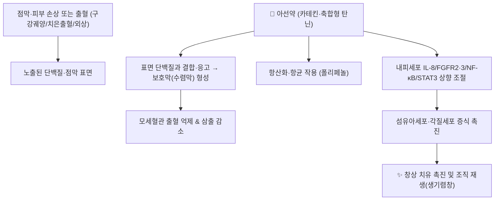

# 🌿 [[아선약]] (兒茶/阿仙藥, Catechu)

> **핵심 요약 (Key Summary)**:
> 콩과(Leguminosae) 아선(兒茶, *Acacia catechu* (L.f.) Willd.)의 심재(心材) 전즙 건조물(흑아선, black catechu) **또는** 꼭두서니과(Rubiaceae) 구등속 *Uncaria gambir* (Hunter) Roxb.의 잎·어린가지 전즙 건조물(방기아선/감비어, pale catechu·gambir)
> 핵심 지표 성분인 [[카테킨]](Catechin)·에피카테킨 및 축합형 탄닌(카테쿠탄닌산)이 점막·창면 단백질을 응고시켜 보호막을 형성하고(수렴 기전), 항산화·항균·혈관신생 촉진 작용으로 조직 재생을 돕는 분자약리 효과 발휘
> [[상한론]] 계열은 아니며 후세방·외용방 전통에서 구강궤양·치은출혈·외상 출혈·습진 피부궤양을 치료하는 대표적인 [[수렴지혈]](收斂止血)·[[생기렴창]](生肌斂瘡)·[[청열화담]](淸熱化痰) 좌약(佐藥)

---
## 📌 목차
1. [기본 본초 정보 & 화학 구조 (Pharmacognosy)](#1-기본-본초-정보--화학-구조-pharmacognosy)
2. [핵심 분자약리 기전 & 대사 네트워크](#2-핵심-분자약리-기전--대사-네트워크)
3. [해부생체역학 / 근육·신경 대사 연계](#3-해부생체역학--근육신경-대사-연계)
4. [사상의학 및 체질별 임상 응용 (적응증 vs 금기)](#4-사상의학-및-체질별-임상-응용-적응증-vs-금기)
5. [배오 원리 및 처방 내 역할](#5-배오-원리-및-처방-내-역할)
6. [핵심 처방 비교 매트릭스](#6-핵심-처방-비교-매트릭스)
7. [출처 및 학술 참고 문헌 (References)](#7-출처-및-학술-참고-문헌-references)

---
## 1. 기본 본초 정보 & 화학 구조 (Pharmacognosy)
> [!abstract]+ 🧪 핵심 지표성분 3D 분자 구조 (Interactive 3D Viewer)
> <iframe src="https://molecule-viewer-rho.vercel.app/?cid=9064" width="100%" height="450px" frameborder="0" allow="webgl" style="border-radius: 8px;"></iframe>

| 항목 | 상세 내용 |
| :--- | :--- |
| **기원** | **두 기원이 공존**: ①콩과 *Acacia catechu* 심재의 전즙 건조물(흑아선/오리지널 공정서 기원) ②꼭두서니과 *Uncaria gambir* 잎·어린가지 전즙 건조물(방기아선·감비어 — 현재 국제 유통량이 더 많음). 두 기원 모두 '아선약' 명칭으로 쓰이므로 **기원 감별이 임상 규격의 핵심 포인트** |
| **성미 (性味)** | 苦·澁, 凉 (고삽, 서늘함) |
| **귀경 (歸經)** | 肺·脾·胃·大腸經 |
| **효능 (Actions)** | 收澀生肌(수삽생기), 止血(지혈), 淸熱化痰(청열화담) |
| **주요 성분** | • **지표 성분**: [[카테킨]](Catechin, PubChem CID 9064), 에피카테킨(Epicatechin)<br>• **유효 활성 성분군**: 축합형 탄닌(카테쿠탄닌산 catechutannic acid, 22~50%, 감비어 기준), 카테쿠레드(catechu red), 쿼세틴(Quercetin) |
| **PubChem CID** | [9064](https://pubchem.ncbi.nlm.nih.gov/compound/9064) (Catechin, C₁₅H₁₄O₆, MW 290.27) |

> **[기원 감별 및 조성 비교]**: ScienceDirect 본초학 개관에 따르면 감비어(*Uncaria gambir*)는 카테킨 약 7.33%·카테쿠탄닌산 22~50%·쿼세틴·카테쿠플루오레신을 함유하고, 흑아선(*Acacia catechu*)은 카테킨 2~12%·플로바탄닌(phlobatannin) 25~33%·검질(gummy matter) 20~30%로 조성이 다르다. 두 기원 모두 열수·알코올에 녹는 백색 침상 결정(카테킨)을 공통 지표로 삼는다.
> 🖼️ **이미지**: 기원 식물(흑아선/감비어 원물) 및 카테킨 구조식 이미지는 아직 확보하지 못했다(Wikimedia Commons 공인 라이선스 이미지 확보 실패 — 출처 가이드 제4원칙에 따라 '임의 가공 없이 생략', 추후 보강 필요).

---
## 2. 핵심 분자약리 기전 & 대사 네트워크



### (1) 수렴(收澀) 및 지혈 기전
* **단백질 응고·수렴막 형성**: 축합형 탄닌(카테쿠탄닌산)이 점막·창면의 노출 단백질과 결합해 불용성 복합체(보호막)를 형성, 삼출·출혈을 기계적으로 차단한다(전통 '수삽생기' 효능의 현대적 해석).
* **항염·항균**: 폴리페놀(카테킨·에피카테킨)이 항산화 활성과 함께 구강·피부 상재균에 대한 항균 작용을 보여, 감염 동반 궤양·출혈 병변에 보조적 역할을 한다.

### (2) 창상 치유·혈관신생 촉진 기전 (2023년 당뇨병성 창상 연구)
* Ho TJ 등(2023, *Pharmaceuticals*)의 제브라피시·내피세포(HMEC-1) 실험에서, 감비어 추출물(카테킨 28.5%·에피카테킨 1.4% 함유 시료, 300 μg/mL)이 장간막 하정맥(sub-intestinal vein)에 추가 혈관 발아(sprouting)를 유도했다.
* 내피세포에서 1시간 내 **IL-8 유전자 발현**이 유도되고, **FGFR2·FGFR3·NF-κB·STAT3·비멘틴(vimentin)**의 상향 조절이 24시간까지 지속되어 내피세포 증식·이동을 촉진했다.
* 최적 농도(3.5 μg/mL)에서 WS1 섬유아세포 증식이 약 60%, HaCaT 각질세포 증식이 약 40% 증가했다(24시간 기준). 반면 동일 조건에서 HaCaT 각질세포의 **이동(migration)은 85~90% 억제**되어, 창상 치유 초기 단계에서는 내피세포 이동·증식이 선택적으로 우선 촉진되는 양상이 관찰되었다(기전적 해석이 더 필요한 소견).

---
## 3. 해부생체역학 / 근육·신경 대사 연계

> 아선약은 전신 대사·근신경계보다는 **국소 점막·피부 창면 보호**에 작용이 집중되는 본초다. 이 항목은 확인된 근거 범위 내에서 간략히 기재한다.

* **말초 미세순환 및 창상 미세혈관**:
  * 위 2) 기전과 같이 내피세포 신호(IL-8/FGFR/NF-κB/STAT3)를 통해 국소 모세혈관 신생을 촉진하여 만성 창상(당뇨병성 족부궤양 등)의 국소 혈류·산소 공급 개선에 기여할 수 있다는 실험적 근거가 있다.
* **근육·중추신경 대사 연계**: 현재까지 확인된 PubMed·TCMSP 자료 범위에서 아선약 단독의 근육 대사·중추신경 작용에 대한 직접 근거는 확인하지 못했다(**출처 확인 불가** — 추측 서술 금지 원칙에 따라 생략).

---
## 4. 사상의학 및 체질별 임상 응용 (적응증 vs 금기)

```
[✅ 최적 적응증 (Sweet Spot)]
• 구강점막 궤양·치은 출혈(음식물 섭취 시 시림·출혈)
• 외상성 피부 열상·좌상 후 삼출이 지속되는 창면(칠리산 등 외용 배합)
• 설사·이질 동반 시 수렴 지사 보조(수렴고삽약 계열과 병용)

[⚠️ 신중 투여 및 금기 (Caution / Contraindication)]
• 어혈·화농이 왕성하여 '사기를 배출'해야 하는 초기 실열증(수렴 작용이 사기 배출을 막을 우려)
• 변비 경향 환자의 장기 내복(탄닌 수렴 작용으로 변비 악화 가능)
```

> **사상의학 체질별 전문 기재**: KMCRIC·동의수세보원 등에서 아선약 단독의 체질별(태음인/소음인/소양인) 전문 조문을 확인하지 못했다. 임의로 체질을 배정하지 않고 **출처 확인 불가**로 남긴다(제1원칙 준수).

---
## 5. 배오 원리 및 처방 내 역할

> 🛡️ **Melt-In 원칙**: 볼트 내 기존 노트([[탄닌]]·[[드라코로딘]]·[[칠리산]]·[[성대결절]])에 이미 기재된 배오 사례를 교차 인용하여 중복 서술을 피한다.

* **[[칠리산]] 내 좌약(佐藥) 역할**: [[혈갈]]·[[유향]]·[[몰약]]·홍화·아선약·사향·빙편으로 구성된 외상 어혈 처방에서, 아선약은 **生肌斂瘡(생기렴창)·수렴지혈**을 담당하며 혈갈의 드라코로딘(Dracorhodin)과 아선약의 카테킨이 섬유아세포 증식·육아조직 형성을 함께 촉진하는 것으로 기재되어 있다([[칠리산]] 노트 §).
* **인후·성대 질환 배오**: [[성대결절]] 노트에 기재된 한 처방(박하·연교·길경·백강잠·천궁·사인·가자·**아선약**·대황·감초)에서는 백강잠·가자와 함께 성대 점막의 미세 섬유성 결절을 '산결소종'하는 역할로 쓰인다.
* **수렴약 배오 원리**: 아선약 + [[가자]] → 구강·인후 점막 수렴 상승(相須) 배오. 아선약 + [[오배자]] → 탄닌 함량이 겹쳐 강한 수렴·지사 효과를 내므로 과량 병용 시 변비·소화장애 주의.

---
## 6. 핵심 처방 비교 매트릭스

| 처방명 | 구성 약재 | 주치 병증 및 임상 타깃 | 특징 및 감별점 |
| :--- | :--- | :--- | :--- |
| **[[칠리산]]** | 혈갈, 유향, 몰약, 홍화, **아선약**, 사향, 빙편 | 외상 타박·어혈 동통, 연부조직 열상 | 아선약은 수렴지혈·생기렴창(국소 지혈·재생) 전담 |
| **[[성대결절]] 인후 처방** | 박하, 연교, 길경, 백강잠, 천궁, 사인, 가자, **아선약**, 대황, 감초 | 성대결절·구음 변화 | 가자와 함께 점막 수렴·소결 담당 |

> ⚠️ 표 내부 파이프(`|`) 파괴 방지를 위해 순수 [[처방명]] 단독 형태로만 작성(프론트매터 표준 준수).

---
* **양약 상호작용 (Herb–Drug Interaction)**:
  * **철분제 흡수 저해**: 탄닌 성분이 철분·일부 알칼로이드계 약물과 결합해 흡수를 저해할 수 있어, 철분 보충제·일부 경구약과는 **2시간 이상 복용 간격**을 권고한다(탄닌-철 결합의 일반 약리 원리에 근거한 통상적 권고이며, 아선약 특이적 임상시험 근거는 확인하지 못했다).
  * **CYP 효소·출혈 위험**: 아선약 단독의 CYP450 간섭이나 항응고제 상호작용에 대한 임상 근거는 현재 확인하지 못했다(**근거 미확인**).

## 7. 출처 및 학술 참고 문헌 (References)

1. **Ho TJ, Tsai PH, Hsieh CH, et al. (2023)**. Role of Herbal Extracts of Catechu from Uncaria gambir in the Treatment of Chronic Diabetic Wounds. *Pharmaceuticals (Basel)*. 2022 Dec 31;16(1):66. doi:10.3390/ph16010066. PMID 36678562.
  * https://pubmed.ncbi.nlm.nih.gov/36678562/
   - **[연구 요약]**: 제브라피시 배아·HMEC-1 내피세포 혈관형성 모델에서 감비어(*Uncaria gambir*) 추출물(카테킨+에피카테킨 함량 21% 이상)이 혈관신생을 촉진하고, HMEC-1에서 IL-8(1시간)·FGFR2·FGFR3·NF-κB·STAT3·비멘틴(24시간)의 발현을 상향 조절함을 보고. HaCaT 각질세포 이동은 억제됨.
2. **ScienceDirect Topics**. *Catechu — an overview*. [sciencedirect.com/topics/medicine-and-dentistry/catechu](https://www.sciencedirect.com/topics/medicine-and-dentistry/catechu)
   - **[참고 자료]**: 흑아선(Acacia catechu)·감비어(Uncaria gambir) 두 기원의 식물학적 출처 및 화학 조성(카테킨·탄닌 함량) 비교 요약. (PubMed 검증 대상 아님)
3. **PubChem CID 9064 (Catechin)**. [pubchem.ncbi.nlm.nih.gov/compound/9064](https://pubchem.ncbi.nlm.nih.gov/compound/9064)
   - **[공정 데이터]**: 분자식 C₁₅H₁₄O₆, 분자량 290.27 g/mol. (PubMed 검증 대상 아님)
4. 볼트 내 교차 참조: [[탄닌]] · [[드라코로딘]] · [[칠리산]] · [[성대결절]] (기존 노트의 아선약 배오·역할 기술 인용)

> 검증 메모 (2026-10-03): 1번 인용은 PMID 36678562로 실존 확인되며 서지(저널·권·호·페이지·DOI)는 정확하나 저자 표기가 'Ho TJ, Chan HH, Hsieh SC, et al.'로 잘못되어 실제 저자(Ho TJ, Tsai PH, Hsieh CH, et al.)로 교정하고 PMID·링크를 추가함. [연구 요약]은 초록에서 확인 가능한 범위(카테킨+에피카테킨 ≥21%, IL-8/FGFR2·3/NF-κB/STAT3/비멘틴, HaCaT 이동 억제)로 정합화함. 2·3번은 웹/PubChem 자료로 PubMed 검증 대상 아님.
