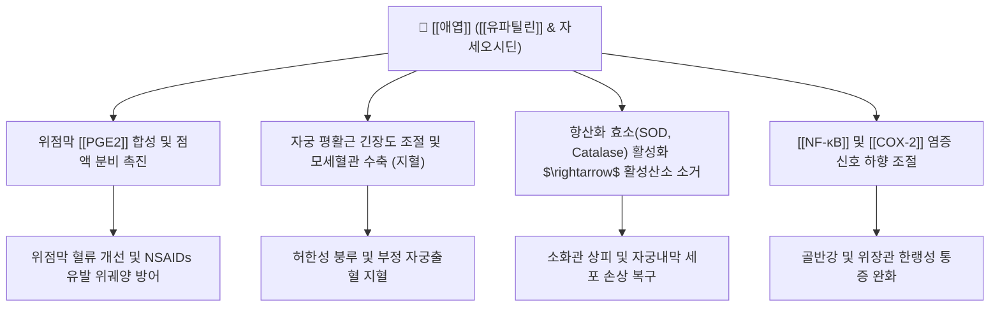

---
aliases:
  - 애엽
  - 艾葉
  - 쑥
  - Artemisiae Argyi Folium
tags:
  - 본초
  - 지혈약
  - 온경지혈
  - 산한지통
  - 안태
  - 유파틸린
---
# 🌿 [[애엽]] (艾葉, Artemisiae Argyi Folium, 쑥)

> **핵심 요약 (Key Summary)**:
> 국화과(Asteraceae) 식물인 황해쑥(*Artemisia argyi*) 및 쑥의 건조 잎
> 플라보노이드 지표 성분인 [[유파틸린]](Eupatilin)과 자세오시딘이 [[PGE2]] 합성 촉진 및 [[NF-κB]] 억제를 통해 위점막 방어와 혈관 수축·지혈 유도
> 하초허한(下焦虛寒)으로 인한 월경과다·부정출혈·임신복통 및 허한성 복통을 온경지통(溫經止痛)으로 다스리고 뜸(구법)의 원료가 되는 요약

---

> [!abstract]+ 🧪 3D 약리 분자 구조 (Interactive 3D Viewer)
> <iframe src="https://molecule-viewer-rho.vercel.app/?cid=5273755" style="width: 100%; height: 600px; border: none; border-radius: 12px; box-shadow: 0 4px 20px rgba(0,0,0,0.15);" allowfullscreen></iframe>

## 📌 목차
1. [기본 본초 정보 & 화학 성분 (Pharmacognosy)](#1-기본-본초-정보--화학-성분-pharmacognosy)
2. [핵심 분자약리 기전 & 대사 네트워크](#2-핵심-분자약리-기전--대사-네트워크)
3. [주요 약리학적 효능 (위점막 보호 & 온경지혈)](#3-주요-약리학적-효능-위점막-보호--온경지혈)
4. [임상 응용 및 부인과 안태 요법](#4-임상-응용-및-부인과-안태-요법)
5. [배합 처방 매트릭스](#5-배합-처방-매트릭스)
6. [출처 및 학술 참고 문헌 (References)](#6-출처-및-학술-참고-문헌-references)

---

## 1. 기본 본초 정보 & 화학 성분 (Pharmacognosy)

| 항목 | 상세 내용 |
| :--- | :--- |
| **기원 식물** | 국화과(Asteraceae) 황해쑥(*Artemisia argyi* Levl. et Vant.) 또는 쑥의 잎 |
| **성미 (性味)** | 신(辛), 고(苦), 온(溫) |
| **귀경 (歸經)** | 간경(肝經), 비경(脾經), 신경(腎經) |
| **효능 (Actions)** | 온경지혈(溫經止血), 산한지통(散寒止痛), 안태(安胎), 조습살충(燥濕殺蟲) |
| **주요 성분** | • **플라보노이드정유 성분**: [[1,8-시네올]](1,8-Cineole), 튜존, 보르네올 |

---

## 2. 핵심 분자약리 기전 & 대사 네트워크

* **위점막 방어 인자 증강 (스티렌정의 약리 기전)**:
  * 유파틸린은 천연물 유래 위염 치료제(스티렌)의 핵심 유효 성분으로, 위벽 점막 혈류를 늘리고 점액 분비를 유도하여 에탄올이나 NSAIDs에 의한 위출혈과 궤양을 강력히 차단.
* **온경지혈(溫經止血)의 약리**:
  * 한량(寒凉)한 지혈제와 달리, 온열한 성미로 혈관의 과도한 이완을 막고 응고 경로를 정상화하여 차가워서 생기는 허한성 출혈을 멎게 함.

---

## 3. 주요 약리학적 효능 (위점막 보호 & 온경지혈)

* **급만성 위염 및 소화성 궤양 치유**:
  * 방어인자 증강 및 점막 재생 촉진.
* **항염증 및 항알레르기 활성**:
  * 류코트리엔 생성을 억제하여 알레르기 염증 완화.
* **뜸(Moxibustion, 灸法)의 약리적 매개체**:
  * 애엽을 정제한 애융(艾絨)은 연소 시 발생하는 원적외선 파장과 정유 성분의 피부 침투를 통해 경락 순환을 가온 촉진.

---

## 4. 임상 응용 및 부인과 안태 요법

* **부인과 허한성 출혈 및 월경통**:
  * 아랫배가 차고 아프며 월경혈이 어둡고 덩어리지며 생리가 끊이지 않는 증상(붕루, 누하)에 필수.
* **임신 복통 및 절박유산(태동불안)**:
  * 자궁의 냉감을 제거하고 비신(脾腎)을 온보하여 유산을 방지(안태).
* **외용 좌훈 및 소양증**:
  * 달인 물로 좌욕하여 외음부 소양증, 냉대하 해소.

---

## 5. 배합 처방 매트릭스

| 처방명 | 배합 특징 | 임상 주치 |
| :--- | :--- | :--- |
| [[궁귀교애탕]] | 애엽, 아교, 당귀, 천궁, 숙지황, 작약 | 허한성 자궁출혈, 임신 하혈, 산후 출혈 |
| [[애부이비환]] | 애엽, 향부자, 당귀, 백작약, 천궁 | 자궁허한성 불임, 하복냉통, 월경불순 |
| 조경종옥탕 가미 | 당귀, 숙지황, 백작약, 애엽, 오수유 | 수족냉증, 하복부 냉랭, 생리통 |

---

## 6. 출처 및 학술 참고 문헌 (References)
* Kim DH, et al. Eupatilin, a pharmacologically active flavone derived from Artemisia plants, induces apoptosis in human gastric cancer cells. *Food Chem Toxicol*. 2013;51:196-204.
  * `[연구 요약]`: 애엽 유래 유파틸린의 위점막 세포 보호, 항염증 및 암세포 사멸 유도 기전.
* State Pharmacopoeia Commission of PRC. *Pharmacopoeia of the People's Republic of China*. 2020: 89-90.
  * `[연구 요약]`: 애엽의 규격 기준, 유파틸린 및 자세오시딘 함량 기준 분석.
