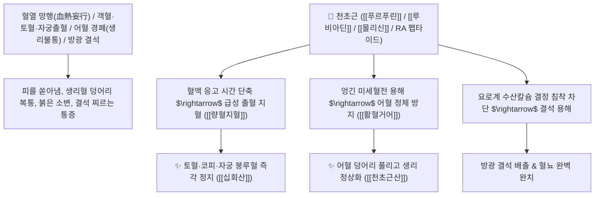

# 🌿 [[천초근]] (茜草根 / 茜草, Rubiae Radix et Rhizoma / 꼭두서니뿌리)

> **핵심 요약 (Key Summary)**:
> 꼭두서니과(*Rubiaceae*) 꼭두서니(*Rubia akane*) 또는 천초의 건조한 뿌리 및 뿌리줄기(혈견수 血見愁)
> 안트라퀴논계인 [[푸르푸린]](Purpurin)과 [[루비아딘]](Rubiadin) 및 [[몰리신]](Mollugin)이 혈액 응고 시간을 단축하면서도 미세혈전 생성을 막아 양혈지혈 및 활혈거어 양방향 작용 발휘
> 혈열(血熱)로 인한 모든 출혈(토혈·코피·혈변·자궁 붕루) 및 어혈 정체로 인한 무월경·관절통·방광 결석·습열 황달을 치료하며 피를 멎게 하되 어혈을 남기지 않는(止血而不留瘀) 대표적인 [[량혈지혈]](凉血止血)·[[활혈거어]](活血祛瘀)·[[십회산]](十灰散)의 군약(君藥)

---
## 📌 목차
1. [기본 본초 정보 & 화학 구조 (Pharmacognosy)](#1-기본-본초-정보--화학-구조-pharmacognosy)
2. [핵심 분자약리 기전 & 푸르푸린·지혈이부류어·항종양 네트워크](#2-핵심-분자약리-기전--푸르푸린지혈이부류어항종양-네트워크)
3. [해부생체역학 / 혈관 내피세포 & 방광 점막 결석 억제 연계](#3-해부생체역학--혈관-내피세포--방광-점막-결석-억제-연계)
4. [사상의학 및 임상 응용 (출혈 vs 어혈 동시 해결 특화)](#4-사상의학-및-임상-응용-출혈-vs-어혈-동시-해결-특화)
5. [고전 의학 및 배오 원리 (십회산 & 천초근산)](#5-고전-의학-및-배오-원리-십회산--천초근산)
6. [핵심 처방 비교 매트릭스](#6-핵심-처방-비교-매트릭스)
7. [출처 및 학술 참고 문헌 (References)](#7-출처-및-학술-참고-문헌-references)

---
## 1. 기본 본초 정보 & 화학 구조 (Pharmacognosy)

> [!abstract]+ 🧪 3D 약리 분자 구조 (Interactive 3D Viewer)
> <iframe src="https://molecule-viewer-rho.vercel.app/?cid=6683" style="width: 100%; height: 600px; border: none; border-radius: 12px; box-shadow: 0 4px 20px rgba(0,0,0,0.15);" allowfullscreen></iframe>


| 항목 | 상세 내용 |
| :--- | :--- |
| **기원 식물** | 꼭두서니과(Rubiaceae) 꼭두서니 *Rubia akane* Nakai 또는 천초 *Rubia cordifolia* L.의 뿌리 및 뿌리줄기 |
| **성미 (性味)** | 苦, 寒 (쓰고 차가우며 붉은색 색소를 함유함) |
| **귀경 (歸經)** | 肝·心·心包經 (간경, 심경, 심포경) - **피의 열을 식히고 막힌 혈맥을 뚫음** |
| **효능 (Actions)** | [[량혈지혈]](凉血止血), [[활혈거어]](活血祛瘀), [[소풍통락]](疏風通絡), [[통경소적]](通經消積), [[퇴황]](退黃) |
| **주요 성분** | • **안트라퀴논계 색소 화합물(지표물질)**: [[푸르푸린]] (Purpurin), [[루비아딘]] (Rubiadin), 알리자린, [[몰리신]] (Mollugin)<br>• **나프토퀴논 및 바이사이클릭 펩타이드**: 루비아코디폴린, RA-시리즈 펩타이드 (항암 성분)<br>• **알칼로이드**: [[에메틴]] (Emetine), [[세펠린]] (Cephaeline) |

> **[유래 및 본초학적 기전]**:
> * 붉은 빛깔을 띠는 꼭두서니 뿌리로 천을 붉게 물들이는 염료로 쓰였으며, 피가 이 약재를 보면 근심을 멈춘다 하여 **'혈견수(血見愁)'**라는 별명을 가졌습니다.
> * 일반적인 지혈제가 피를 멎게 하려다 피가 엉겨 굳는 어혈(瘀血)을 남기기 쉬운 반면, **천초근은 차가운 기운으로 출혈을 멎게 하면서도 뭉친 어혈을 동시에 깨뜨려 없애는 '지혈이부류어(止血而不留瘀)'의 기적적인 효능**을 자랑합니다.
> * 혈뇨, 토혈, 자궁 출혈뿐 아니라 요로 방광 결석 형성을 억제하고 관절의 어혈 통증을 치료합니다.

### 🔬 천초근의 주요 푸르푸린 및 몰리신 화학 구조
```
     [ 1,2,4-트리하이드록시안트라퀴논 골격 ]  <-- 푸르푸린 (Purpurin)
     [ 나프토피란 유도체 골격 ]  <-- 몰리신 (Mollugin, 항염증 및 지혈)
```
> **[구조적 특징 및 이중 조절 기전]**: [[푸르푸린]]과 [[몰리신]]은 혈관 평활근의 과도한 확장을 억제하여 모세혈관 출혈을 신속히 지혈하면서도, 섬유소 응괴의 과도한 침착을 막아 미세순환을 완벽히 유지합니다.

---
## 2. 핵심 분자약리 기전 & 푸르푸린·지혈이부류어·항종양 네트워크



### (1) 표적 량혈지혈 및 활혈거어 작용
* **혈열 망행 일체 급성 출혈 지혈 ([[량혈지혈]] 凉血止血)**:
  * 피를 토하거나 코피가 멎지 않고 자궁 출혈이 쏟아지는 증상을 어혈 부작용 없이 지혈합니다 ([[십회산]]).
* **어혈성 월경폐색 및 산후 어혈 복통 완치 ([[활혈거어]] 活血祛瘀)**:
  * 핏덩어리가 뭉쳐 생리가 나오지 않고 아랫배가 쥐어뜯기듯 아픈 어혈을 풀어줍니다.
* **요로 결석 및 습열 황달 해소 ([[퇴황]] 退黃)**:
  * 신장 및 방광의 결석 형성을 억제하고 소변을 맑게 합니다.

---
## 3. 해부생체역학 / 혈관 내피세포 & 방광 점막 결석 억제 연계

* **혈관 내피 $\text{eNOS}$ 활성화 및 기저막 안정화**:
  * 혈관 파열 부위의 혈소판 플러그 형성을 신속화하고 주변부 혈류를 보존합니다.

---
## 4. 사상의학 및 임상 응용 (출혈 vs 어혈 동시 해결 특화)

```
[🔍 지혈약 중 유일무이한 특징: 止血而不留瘀]
• 대부분의 지혈제(백급, 삼칠): 수렴/지혈 위주 $\rightarrow$ 다량 사용 시 어혈 발생 위험
• [[천초근]](茜草根): 凉血·止血 + 活血·通經 동시 수행 $\rightarrow$ 출혈과 어혈이 뒤섞인 복합 병증의 최고 선택

[✅ 최적 적응증 (Sweet Spot)]
• 출혈 후 피가 뭉쳐 통증이 발생하는 자궁 붕루 및 어혈성 생리통
• 요로결석으로 인한 혈뇨 및 배뇨통
```

---
## 5. 고전 의학 및 배오 원리 (십회산 & 천초근산)

### (1) 피를 맑히고 어혈을 없애는 최고 명방: 십회산(十灰散)
* **지혈 최고 배오**:
  * [[천초근]] + [[대소계]] + [[하엽]] + [[측백엽]] + [[모단피]] $\rightarrow$ 모든 피 토함을 멎게 하는 불후의 명방 ([[십회산]])
  * [[천초근]] + [[당귀]] + [[적작약]] + [[홍화]] $\rightarrow$ 어혈 경폐를 치료하는 명방 ([[천초근산]])

---
## 6. 핵심 처방 비교 매트릭스

| 처방명 | 구성 약재 | 주치 병증 및 임상 타깃 | 특징 및 감별점 |
| :--- | :--- | :--- | :--- |
| [[십회산]] | [[대계]], [[소계]], [[하엽]], [[측백엽]], [[백모근]], [[천초근]], [[모단피]] | **혈열 망행, 급성 구혈, 토혈, 각혈, 비뉵, 요혈** | 상초와 중초의 출혈을 끄는 제1방 |
| [[천초근산]] | [[천초근]], [[당귀]], [[적작약]], [[도인]], [[홍화]] | **부인 어혈 경폐, 월경불통, 산후 어혈 복통, 징가** | 어혈을 부수고 생리를 통하게 함 |
| [[황련해독탕]](가미) | [[황련]], [[황금]], [[황백]], [[치자]], [[천초근]] | 열독 치성, 피부 자반증, 비출혈, 고열 섬어 | 열독을 끄고 혈관 파열 방지 |

---
## 7. 출처 및 학술 참고 문헌 (References)

2. **대한민국약전(KP) 제12개정 (2022)**. 생약규격집: 천초근 (Rubiae Radix et Rhizoma) 규격 기준.
   - **[공정서 규격]**: 꼭두서니 뿌리 및 뿌리줄기의 성상, 순도시험 및 건조감량 13.0% 이하 기준 명시.
