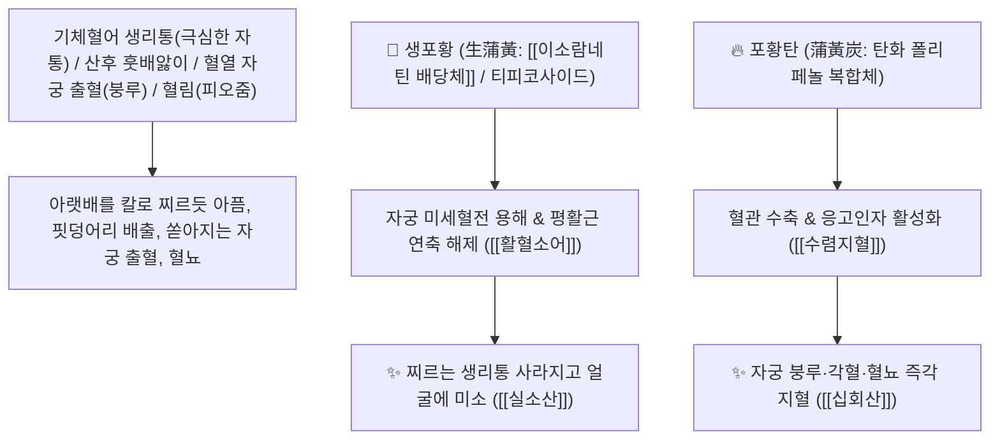

# 🌿 [[포황]] (蒲黃 / 蒲黃炭, Typhae Pollen / 부들꽃가루)

> **핵심 요약 (Key Summary)**:
> 부들과(*Typhaceae*) 부들(*Typha orientalis*) 또는 넓은잎부들의 건조한 황색 꽃가루(화분 花粉, 초탄 가공한 포황탄 蒲黃炭)
> 플라보노이드 배당체인 [[이소람네틴-3-O-네오헤스페리도시드]](Isorhamnetin neohesperidoside)와 티피코사이드가 자궁 평활근 율동을 조절하고 혈액 응고를 촉진하며 미세혈전을 용해하여 활혈산어 및 지혈통림 양방향 작용 발휘
> 생용(生用) 시 어혈(瘀血)로 인한 쥐어짜는 생리통·산후 훗배앓이 복통(실소산 失笑散)·혈림(피오줌)을 뚫고, 탄용(炭用) 시 자궁 붕루·토혈·코피·혈변을 멎게 하는 천하제일의 [[활혈소어]](活血消瘀)·[[량혈지혈]](凉血止血)·[[리뇨통림]](利尿通淋)·[[실소산]](失笑散)의 군약(君藥)

---
## 📌 목차
1. [기본 본초 정보 & 화학 구조 (Pharmacognosy)](#1-기본-본초-정보--화학-구조-pharmacognosy)
2. [핵심 분자약리 기전 & 이소람네틴 배당체·지혈/활혈 양방향 네트워크](#2-핵심-분자약리-기전--이소람네틴-배당체지혈활혈-양방향-네트워크)
3. [해부생체역학 / 자궁 내막 혈관망 & 방광 요로 점막 연계](#3-해부생체역학--자궁-내막-혈관망--방광-요로-점막-연계)
4. [사상의학 및 생포황(활혈산어) vs 포황탄(수렴지혈) 정밀 감별](#4-사상의학-및-생포황활혈산어-vs-포황탄수렴지혈-정밀-감별)
5. [고전 의학 및 배오 원리 (실소산 & 포황산)](#5-고전-의학-및-배오-원리-실소산--포황산)
6. [핵심 처방 비교 매트릭스](#6-핵심-처방-비교-매트릭스)
7. [출처 및 학술 참고 문헌 (References)](#7-출처-및-학술-참고-문헌-references)

---
## 1. 기본 본초 정보 & 화학 구조 (Pharmacognosy)

> [!abstract]+ 🧪 3D 약리 분자 구조 (Interactive 3D Viewer)
> <iframe src="https://molecule-viewer-rho.vercel.app/?cid=44566503" style="width: 100%; height: 600px; border: none; border-radius: 12px; box-shadow: 0 4px 20px rgba(0,0,0,0.15);" allowfullscreen></iframe>


| 항목 | 상세 내용 |
| :--- | :--- |
| **기원 식물** | 부들과(Typhaceae) 부들 *Typha orientalis* Presl 또는 동속 근연식물의 노란색 꽃가루(화분) |
| **성미 (性味)** | 甘, 平 (달고 평이하며 매우 곱고 미끄러운 황색 미세 분말) |
| **귀경 (歸經)** | 肝·心包經 (간경, 심포경) - **간혈의 어혈을 깨뜨리고 혈맥의 출혈을 지혈** |
| **효능 (Actions)** | • **생용(生用)**: [[활혈소어]](活血消瘀), [[리뇨통림]](利尿通淋), [[행혈지통]](行血止痛)<br>• **탄용(炭用, 포황탄)**: [[량혈지혈]](凉血止血), [[수렴지혈]](收斂止血) |
| **주요 성분** | • **플라보노이드 배당체(핵심 지표)**: [[이소람네틴-3-O-네오헤스페리도시드]] (Isorhamnetin neohesperidoside, KP 규격 $\ge 0.50\%$), 티피코사이드(Typhaneoside)<br>• **플라보놀 및 스테롤**: 퀘르세틴, 이소람네틴, $\beta$-시토스테롤<br>• **지방산 화합물**: 팔미트산, 리놀레산 |

> **[유래 및 본초학적 기전]**:
> * 부들(蒲)의 이삭에서 날리는 노란(黃) 꽃가루라 하여 '포황(蒲黃)'이라 불렸습니다.
> * **생것으로 쓰면(생포황 生蒲黃) 엉긴 어혈을 부수고 혈맥을 뚫어 생리통과 산후 복통을 웃음 짓게 치료하며(실소산 失笑散)**, **불에 까맣게 볶아 쓰면(포황탄 蒲黃炭) 자궁 출혈과 피오줌을 멎게 하는 신비로운 양방향 조절 명약**입니다.
> * 외용으로 상처에 뿌리면 피를 멎게 하고 상처를 아물게 합니다.

### 🔬 포황의 주요 이소람네틴 배당체 화학 구조
```
     [ 이소람네틴 플라보놀 골격 ]───O──[ 네오헤스페리도오스 (Rha-Glc) ]  <-- Isorhamnetin-3-O-neohesperidoside
```
> **[구조적 특징 및 활혈/지혈 이중 기전]**: 포황의 플라보노이드 복합체는 혈소판 트롬복산과 프로스타사이클린 균형을 정상화하여 혈관 손상부 지혈을 가속하면서도 미세혈관 내 혈전 생성을 차단합니다.

---
## 2. 핵심 분자약리 기전 & 이소람네틴 배당체·지혈/활혈 양방향 네트워크



### (1) 표적 활혈산어 및 지혈통림 작용
* **극심한 어혈성 생리통 및 산후 복통 완치 ([[실소산]] 失笑散)**:
  * 아랫배가 쥐어뜯기듯 아파 비명을 지르던 환자가 약을 먹고 아픔이 사라져 절로 웃음을 짓는다 하여 실소산(失笑散)이라 불립니다.
* **혈열 붕루 및 소변 출혈(혈림) 지혈 ([[포황탄]] 蒲黃炭)**:
  * 볶은 포황탄을 써서 쏟아지는 자궁 출혈과 요로 출혈을 부작용 없이 멎게 합니다.
* **외상성 타박상 어혈 멍 및 출혈 외용 수복**:
  * 환부에 가루를 뿌려 피를 멎게 하고 멍을 삭입니다.

---
## 3. 해부생체역학 / 자궁 내막 혈관망 & 방광 요로 점막 연계

* **자궁 나선동맥(Spiral Artery) 혈류 저항 개선**:
  * 생리혈의 원활한 배출을 도와 자궁 근층의 허혈성 통증을 완화합니다.

---
## 4. 사상의학 및 생포황(활혈산어) vs 포황탄(수렴지혈) 정밀 감별

```
[🔍 포황 가공 포제별 효능 감별]
• 생포황(生蒲黃, 가공 안 한 황색 분말): 活血化瘀, 利尿通淋 $\rightarrow$ 생리통, 산후 어혈 복통, 혈림(피오줌), 실소산
• 포황탄(蒲黃炭, 까맣게 볶은 흑갈색 분말): 收斂止血, 凉血 $\rightarrow$ 토혈, 코피, 자궁 붕루, 혈변, 지혈 목적

[⚠️ 전탕 수칙 (포전 包煎)]
• 미세한 가루가 물에 뜨고 국물을 탁하게 하므로 반드시 천 주머니에 싸서 달이는 포전(包煎)을 시행
```

---
## 5. 고전 의학 및 배오 원리 (실소산 & 포황산)

### (1) 어혈 통증을 치료하는 천하제일 황제방: 실소산(失笑散)
* **어혈 통증 최고 배오**:
  * [[포황]](생)` + [[오령지]] (동량 산제/환제) $\rightarrow$ 모든 찌르는 생리통과 심복통을 멎게 하는 불후 명방 ([[실소산]])
  * [[포황탄]] + [[애엽탄]] + [[아교]] $\rightarrow$ 자궁 붕루를 멎게 함

---
## 6. 핵심 처방 비교 매트릭스

| 처방명 | 구성 약재 | 주치 병증 및 임상 타깃 | 특징 및 감별점 |
| :--- | :--- | :--- | :--- |
| [[실소산]] | [[포황]](생), [[오령지]] (동량 산제) | **혈어 심복 자통, 부인 생리통, 월경불순, 산후 훗배앓이** | 통증이 사라져 절로 웃음 지음 |
| [[십회산]] | [[대소계]], [[하엽]], [[측백엽]], [[포황]](탄), [[천초근]] | 혈열 망행, 구혈, 토혈, 각혈, 혈변, 붕루 | 출혈을 멎게 하는 제1방 |
| [[포황산]] | [[포황]], [[생지황]], [[당귀]], [[작약]] | **산후 어혈 복통, 오로 부진, 요슬 산통** | 어혈을 풀고 혈을 보함 |

---
## 7. 출처 및 학술 참고 문헌 (References)

2. **대한민국약전(KP) 제12개정 (2022)**. 의약품각조 제2부: 포황 (Typhae Pollen) 규격 기준.
   - **[공정서 규격]**: 건조 꽃가루 기준 이소람네틴-3-O-네오헤스페리도시드($\text{C}_{28}\text{H}_{32}\text{O}_{16}$) 0.50% 이상 함유 필수 규격 명시.
