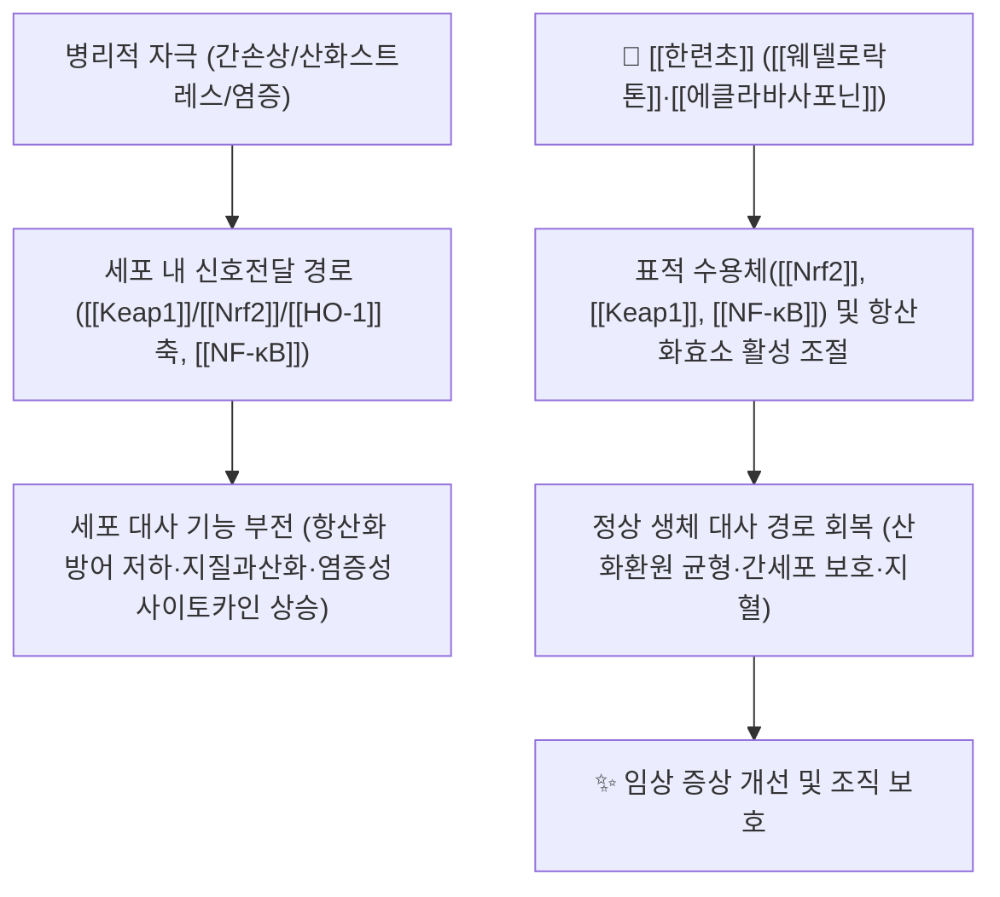

![[한련초_1.jpg|540]]
> [그림 1: Eclipta prostrata (Asteraceae) 01.jpg]

# 🌿 [[한련초]] (旱蓮草, *Eclipta prostrata* (L.) L. / Ecliptae Herba)

> **핵심 요약 (Key Summary)**:
> 국화과(Asteraceae) 기원식물 *Eclipta prostrata* (L.) L. [이명 *Eclipta alba* (L.) Hassk.]의 **전초(全草)** 를 개화기에 채취·음건한 약재로, 한의학에서는 性味 甘·酸·寒, 歸經 肝·腎의 **滋補肝腎(자보간신)·凉血止血(양혈지혈)·烏鬚髮(오수발)** 본초로 분류된다.
> 핵심 지표 성분인 [[웨델로락톤]](wedelolactone, coumestan 골격)을 비롯한 [[에클라바사포닌]](eclalbasaponin) 계열 triterpenoid saponin, [[아피제닌]]·[[루테올린]] 등 플라보노이드가 **[[Keap1]]/[[Nrf2]]/[[HO-1]] 축**, **[[NF-κB]] 염증 신호** 등 산화환원·염증 네트워크를 조절하여 항산화·항염·간보호·지혈 관련 분자약리 효과를 발휘하는 것으로 리뷰 및 전임상 연구에서 보고되었다.
> 전통적으로는 **肝腎陰虛(간신음허)** 로 인한 眩暈耳鳴·腰膝酸軟·鬚髮早白, 그리고 陰虛血熱性 出血(吐血·咯血·尿血·崩漏)의 대표적인 **[[자음]](滋陰)·[[수렴지혈]](收斂止血)** 약재이며, [[여정자]]와 배오한 [[이지환]](二至丸)이 대표 조합이다.

---
## 📌 목차
1. [기본 본초 정보 & 화학 구조 (Pharmacognosy)](#1-기본-본초-정보--화학-구조-pharmacognosy)
2. [핵심 분자약리 기전 & 대사 네트워크](#2-핵심-분자약리-기전--대사-네트워크)
3. [해부생체역학 / 근육·신경 대사 연계](#3-해부생체역학--근육신경-대사-연계)
4. [사상의학 및 체질별 임상 응용 (적응증 vs 금기)](#4-사상의학-및-체질별-임상-응용-적응증-vs-금기)
5. [상한론 『약징(藥徵)』 분석 및 배오 원리](#5-상한론-약징藥徵-분석-및-배오-원리) 또는 한의학적 고찰(유래와 특징)
6. [핵심 처방 비교 매트릭스](#6-핵심-처방-비교-매트릭스)
7. [출처 및 학술 참고 문헌 (References)](#7-출처-및-학술-참고-문헌-references)

---
## 1. 기본 본초 정보 & 화학 구조 (Pharmacognosy)

> [!abstract]+ 🧪 핵심 지표성분 3D 분자 구조 (Interactive 3D Viewer)
> <iframe src="https://molecule-viewer-rho.vercel.app/?cid=5281814" width="100%" height="450px" frameborder="0" allow="webgl" style="border-radius: 8px;"></iframe>
> *(cid 5281814 = 웨델로락톤 / wedelolactone)*

| 항목 | 상세 내용 |
| :--- | :--- |
| **기원 식물** | 국화과(Asteraceae, 구 Compositae) *Eclipta prostrata* (L.) L. [이명 *Eclipta alba* (L.) Hassk.]의 **전초(全草, 지상부)**. 여름~가을 개화기에 채취하여 음건한다. 두 학명은 동일 종에 대한 이명(異名) 관계로, 한국·중국 문헌에서는 주로 旱蓮草(묵한련)로, 인도 아유르베르다 문헌에서는 *E. alba* 명칭이 혼용된다. |
| **성미 (性味)** | 甘·酸, 寒 (감산, 한). 質潤하며 陰分으로 들어가는 性向. |
| **귀경 (歸經)** | 肝, 腎 |
| **효능 (Actions)** | 滋補肝腎(자보간신) · 凉血止血(양혈지혈) · 烏鬚髮(오수발). 즉 **補肝腎陰** + **수렴·청열 지혈**의 이중 효능군에 속한다. |
| **주요 성분** | • **지표 성분**: [[웨델로락톤]](wedelolactone, coumestan 골격) 및 데메틸웨델로락톤(demethylwedelolactone)<br>• **유효 활성 성분군**: [[에클라바사포닌]](eclalbasaponin I–X, echinocystic acid 유도체 triterpenoid saponin), [[아피제닌]]·[[루테올린]]·[[퀘르세틴]] 등 플라보노이드, ecliptine 등 소량 알칼로이드, 정유·스테롤류 |
| **PubChem CID** | [5281814](https://pubchem.ncbi.nlm.nih.gov/compound/5281814) (웨델로락톤 기준) |
| **규격·품질관리** | 대한민국약전(KP)·대한민국한약전(KHP) 수재 여부 및 지표성분 함량 기준은 **근거 미확인**(본 노트 작성 시 확인된 1차 공정서 근거 없음). 중국약전(ChP)에서는 墨旱蓮(Ecliptae Herba)으로 수재되어 있는 것으로 알려져 있으나, 본 노트의 인용 범위(제공된 PubMed 논문)에서는 공정서 규격 수치를 확인할 수 없다. |

### 🔬 주요 지표물질 화학 구조

* **골격적 특징**: 웨델로락톤은 **coumestan(쿠메스탄)** 골격, 즉 쿠마린(C6–C3) 단위와 이소플라본계 벤젠환이 산소 가교로 축합된 **평면성 5환 복소환(polycyclic lactone)** 구조(C16H10O7, MW ≈ 314.25)이다. 분자 내에 3개의 페놀성 수산기와 1개의 메톡시기를 가진 **polyhydroxy coumestan**으로, 데메틸체는 메톡시가 수산기로 치환된 1,3,8,9-tetrahydroxycoumestan이다.
* **활성–구조 상관**: 다수의 페놀성 -OH는 자유라디칼 소거 및 금속이온 킬레이션을 가능하게 하여 **항산화·항염 활성의 화학적 기반**이 된다(리뷰 PMID 34827736, 31395303에서 정리된 성분–활성 관계). 평면성·공액 구조는 단백질 kinase/전사인자 결합 포켓에 삽입되어 신호전달을 조절할 수 있는 것으로 논의된다.
* **배당체 형태와 생체이용률**: 웨델로락톤은 **aglycone(coumestan 유리형)** 으로 존재하는 반면, eclalbasaponin류는 echinocystic acid의 **3-O- 및 28-O- 이중 O-배당체** 형태다. O-배당체는 경구 투여 시 장내 미생물에 의한 가수분해 후 흡수되는 것이 일반적 약동학 원리이나, **한련초 성분의 실제 흡수율·생체이용률 수치는 본 노트가 인용한 논문에서 확인되지 않아 근거 미확인**으로 표기한다. Coumestan aglycone은 상대적으로 친지성이 있어 세포막 투과가 유리할 것으로 추정되나 이 역시 정량 근거는 미확인이다.

---
## 2. 핵심 분자약리 기전 & 대사 네트워크



### (1) 표적 수용체 및 신호전달 경로

* **[[Keap1]]/[[Nrf2]]/[[HO-1]] 축 (산화환원 스위치)**:
  * 가장 명확하게 보고된 분자 경로다. 다발성골수종(multiple myeloma) 모델에서 *E. prostrata* **에탄올 추출물**이 **Keap1/Nrf2/HO-1 축을 조절하여 페로프토시스(ferroptosis)를 유도**하는 것으로 보고되었다(PMID 38507850). 즉 암세포에서는 Nrf2–HO-1 매개의 항산화 방어 시스템을 억제(Keap1 상향 / Nrf2·HO-1 하향 방향)함으로써 **지질 과산화물·유리철(Fe²⁺)·ROS 축적**을 초래하고, 그 결과 철 의존성 지질과산화 세포사(ferroptosis)에 이른다는 해석이 제시된다.
  * 반면 간보호·항산화 계열 전임상 연구들은 한련초 추출물이 **산화스트레스를 감소**시키는 방향으로 작용함을 보고한다(PMID 34827736, 31395303). 정상세포에서는 항산화 방어를 강화하고 암세포에서는 항산화 방어를 무력화하는 **세포 유형·용량 의존적 이중성**이 시사되나, 이 상반된 방향성이 하나의 기전으로 정합되는지에 대한 명확한 설명은 **근거 미확인**이다.
* **[[NF-κB]] 및 염증 매개체 조절**:
  * 리뷰 문헌들은 한련초 성분의 항염 활성을 염증성 사이토카인(TNF-α, IL-6, NO, PGE₂ 등) 및 관련 전사인자 신호 억제로 정리한다(PMID 34827736, 31395303, 27355071). 다만 특정 인산화 단계(IKK/IκB 등)에 대한 개별 검증 데이터는 본 노트의 인용 범위에서 **근거 미확인**이다.
* **항암 표적 탐색(in silico)**:
  * 2025년 연구는 한련초의 활성 파이토케미컬을 스크리닝하고 인간 악성종양 관련 표적 단백질과의 **분자 도킹(molecular docking)** 을 수행하여 후보 화합물–표적 상호작용을 예측했다(PMID 41439000). 이는 **계산·예측 단계의 근거**로, 실제 세포·동물 수준 검증은 별도로 필요하다. 도킹에 사용된 개별 표적 단백질 목록과 결합 친화도 수치는 본 노트에서 **근거 미확인**으로 표기한다.
* **대사 및 면역 조절**:
  * 리뷰 수준에서 간보호(hepatoprotective), 항당뇨, 면역조절, 항균 활성이 정리되어 있으며(PMID 34827736, 31395303, 27355071), 항산화효소 체계(SOD/CAT/GPx 등) 조절이 공통 기전으로 논의된다. 개별 효소 활성의 정량적 변화 배수는 **근거 미확인**.

---
## 3. 해부생체역학 / 근육·신경 대사 연계

* **신경 및 인지 기능**:
  * *Eclipta alba* 의 성분화학 및 **신경보호(neuroprotective) 효과**에 대한 리뷰가 보고되었다(PMID 31116703). 핵심 기전은 **항산화·항염·항세포자멸(anti-apoptotic)** 축으로 정리되며, 산화스트레스가 병태생리에 관여하는 퇴행성 신경질환 모델에서 보호 가능성이 논의된다. 다만 특정 질환(예: 알츠하이머병·파킨슨병)에서의 임상 지표(MMSE, UPDRS 등) 개선 근거와 유효 용량은 **근거 미확인**이다.
* **혈관·지혈(출혈–응고 균형)**:
  * 전통적으로 **수렴지혈** 약재로 분류되어 吐血·咯血·尿血·崩漏·외상출혈에 응용되지만, 본 노트가 인용한 PubMed 문헌들은 **항암·항산화·간보호·신경보호 중심**으로 정리되어 있어 **혈소판 응집, 응고인자, 혈관수축 기전에 대한 분자 수준 근거는 확인되지 않음(근거 미확인)**. 지혈 효능은 한의학 전통 효능 분류 및 본초학 문헌에 근거한 임상 응용으로 이해해야 한다.
* **근육 섬유 대사(미토콘드리아·젖산 대사)**:
  * 한련초가 골격근의 유산소/무산소 대사, 미토콘드리아 지방산 산화, 칼슘 채널, 젖산 청소율에 미치는 영향에 대한 직접 연구는 **본 노트 인용 범위에서 확인되지 않음(근거 미확인)**. 근육 대사 연계는 현재로서는 서술 근거가 없다.
* **모발·피부(부속기관)**:
  * 민족약리학 문헌에서 **모발 성장 촉진 및 烏鬚髮(수발을 검게 함)** 용도가 반복적으로 보고되며(PMID 27355071, 34827736), 모낭·멜라닌세포 관련 활성이 리뷰 수준에서 언급된다. 개별 성장인자·멜라닌 합성 효소(TYR 등) 조절의 정량 데이터는 **근거 미확인**.

---
## 4. 사상의학 및 체질별 임상 응용 (적응증 vs 금기)

```
[✅ 최적 적응증 (Sweet Spot)]
• 肝腎陰虛(간신음허) 계열 병증: 眩暈耳鳴, 腰膝酸軟, 五心煩熱, 鬚髮早白, 齒牙動搖
• 陰虛血熱(음허혈열)성 출혈: 吐血, 咯血, 尿血, 便血, 崩漏, 外傷出血
• 체질적으로는 陰虛熱證 경향을 보이는 태음인·소양인 영역의 만성 음허 상태에서 배오 응용을 고려
• 만성 간질환·만성 염증성 질환에서 보조적 항산화·간보호 목적의 전임상 근거 기반 응용 가능성

[⚠️ 신중 투여 및 금기 (Caution / Contraindication)]
• 脾胃虛寒(비위허한): 性寒·質潤하여 腹痛·軟便·설사·식욕부진을 악화시킬 수 있음
• 陽虛寒證 및 소음인 한성 병증: 자음·청열 약성이 병증 방향과 상충할 수 있음
• 항응고제·항혈소판제 복용자: 전통적 지혈 효능과 서로 상충되는 약물 상호작용 가능성 — 근거 미확인이나 임상적 주의 필요
• 임신부·수유부: 안전성 데이터 근거 미확인
• 악성종양 환자: 페로프토시스 유도(PMID 38507850)는 in vitro/전임상 수준 결과로, 항암치료와의 병용은 반드시 전문의 판단 하에 이루어져야 함
```

* **사상의학적 위치에 대한 주의**: 사상의학(四象醫學)의 4상 처방 체계에서 한련초를 주약으로 배오한 전형 처방은 본 노트의 인용 범위에서 확인되지 않는다. 즉 **체질–처방 매핑은 문헌 근거가 확립되어 있지 않으며(근거 미확인)**, 위 적응증은 전통 본초학의 性味·歸經 이론에 기반한 **임상 추론**임을 명시한다.

---
## 5. 상한론, 『약징(藥徵)』 분석 및 배오 원리

### (1) 『[[약징]]』 수재 여부와 한의학적 고찰

> **"『약징(藥徵)』에는 한련초 조문이 존재하지 않는다."**
> 길익동동(吉益東洞)의 『약징』(1784)은 張仲景 『상한론』·『금궤요략』 처방에 실제로 사용된 약 50여 종(정확한 수재 약물 수는 **근거 미확인**)의 약물만을 대상으로 主治·旁治를 논한 저작이다. 한련초(旱蓮草)는 『상한론』 처방 구성 약재가 아니므로 『약징』식 약징 분석은 성립하지 않으며, 본 노트에서는 **한의학적 고찰(유래·특징)** 로 대체한다.

* **전통 본초학적 위상(요약)**: 性味 甘酸寒, 歸經 肝腎. 補肝腎陰(자보간신)과 凉血止血(양혈지혈)을 겸하며, 烏鬚髮·固齒의 용도로도 쓰인다. 즉 **"보(補)"와 "지혈(止血)"의 이중 작용**을 가진 드문 약재로, 補陰藥群과 止血藥群의 교집합에 위치한다. (본 절의 고전 문헌적 서술은 전통 본초학 지식에 기반하며, 제공된 PubMed 논문의 직접 조문 인용이 아님을 밝힌다.)
* **현대 약리와의 접점**: 전통 효능 중 肝 관련 작용(간보호·항산화)과 止血 작용 중 항염·조직보호 측면은 리뷰에서 전임상 근거가 축적되어 있다(PMID 34827736, 31395303). 반면 **지혈의 직접 기전(응고·혈소판)은 근거 미확인**이다.

### (2) 핵심 약재 배오(짝)의 묘미

* **[[한련초]] + [[여정자]](女貞子)** → **[[이지환]](二至丸)**: 補肝腎陰·凉血止血. 肝腎陰虛로 인한 眩暈耳鳴, 腰膝酸軟, 鬚髮早白, 陰虛血熱性 출혈에 응용. 女貞子의 補陰·평보 작용과 旱蓮草의 凉血·지혈 작용이 상보적으로 결합한 대표 배오다.
* **[[한련초]] + [[생지황]]·[[현삼]]** → 陰虛血熱 出血(吐血·咯血)에서 凉血·滋陰 방향 강화 배오. (고전 처방 단위 근거는 **근거 미확인**, 임상 배오 관행 수준.)
* **[[한련초]] + [[백모근]]·[[측백엽]]** → 上部(폐위) 출혈의 凉血止血 상승 배오. (동일하게 문헌 근거 수준 상이 → 근거 미확인.)
* **[[한련초]] + [[하수오]]·[[생지황]]** → 烏鬚髮·補肝腎 목적의 배오. 민족약리학적 모발 관련 용도(PMID 27355071)와 방향성이 일치한다.

---
## 6. 핵심 처방 비교 매트릭스

| 처방명 | 구성 약재 | 주치 병증 및 임상 타깃 | 특징 및 감별점 |
| :--- | :--- | :--- | :--- |
| **[[이지환]] (二至丸)** | [[여정자]], [[한련초]] | 肝腎陰虛: 眩暈耳鳴, 腰膝酸軟, 鬚髮早白, 陰虛血熱性 出血 | 補陰 + 凉血止血을 동시에 담당하는 최소 구성 처방. 平補 위주로 滋膩하지 않아 만성 음허 상태에 응용. 한련초 단독보다 補陰 지속력이 우수 |
| **二至丸加味 (임상 가감)** | 이지환 + [[생지황]], [[단피]], [[측백엽]] 등 | 陰虛血熱 出血 경향이 뚜렷한 경우(吐血·뉵혈·붕루) | 凉血·지혈 강화형. **고전 처방이 아닌 임상 가감 조합**으로 처방 단위 임상 근거는 근거 미확인 |
| **단미 응용 (單味, 외용·신용)** | 한련초 전초(생즙 또는 건조 분말) | 외상 출혈, 수발 조백 부위 국소 도포 | 국소 수렴지혈·오발(烏髮) 목적의 민간요법적 응용.全身 투여 대비 흡수·전신 효과는 제한적 |

> **표 해석 시 주의**: 본 노트가 인용한 PubMed 문헌들은 **단미 추출물 및 성분 중심의 전임상 연구**이며, 위 처방들의 **처방 단위 RCT 근거는 제공하지 않는다(근거 미확인)**. 처방 비교는 전통 본초학·방제학 이론에 근거한 임상적 감별 기준으로 이해해야 한다.

---
## 7. 출처 및 학술 참고 문헌 (References)

1. **Timalsina D, Devkota HP (2021)**. *Eclipta prostrata (L.) L. (Asteraceae): Ethnomedicinal Uses, Chemical Constituents, and Biological Activities*. **Biomolecules**. PMID: 34827736
   - **[연구 요약]**: *E. prostrata*의 민족약리학적 용도·화학성분·생물활성을 종합한 총설. 주요 성분군으로 coumestan(웨델로락톤 등), 플라보노이드, triterpenoid saponin, 알칼로이드, 정유를 정리하고, 간보호·항산화·항염·항균·모발 성장 촉진·진통·면역조절 활성을 in vitro/in vivo 자료 중심으로 보고. 임상(RCT) 근거는 제한적임을 시사.
2. **Li W, Yin X (2024)**. *Ethanol extract of Eclipta prostrata induces multiple myeloma ferroptosis via Keap1/Nrf2/HO-1 axis*. **Phytomedicine**. PMID: 38507850
   - **[연구 요약]**: 다발성골수종 모델에서 *E. prostrata* 에탄올 추출물이 **Keap1/Nrf2/HO-1 축 조절**을 매개로 **페로프토시스(ferroptosis)** 를 유도함을 보고. 즉 항산화 방어 경로 억제 → 철·ROS·지질과산화 축적 → 철 의존성 세포사 유도라는 기전 프레임을 제시. 세포 유형 특이적 효과 및 용량–반응 세부 수치는 원문 확인 필요.
3. **Hossain MS, Khatun S (2025)**. *Screening the Active Phytochemicals From Eclipta prostrata and Unraveling Their Molecular Insight Into Human Malignancies*. **Cancer Innov**. PMID: 41439000
   - **[연구 요약]**: 한련초 활성 파이토케미컬을 스크리닝하고 인간 악성종양 관련 표적에 대한 **분자 도킹(in silico)** 을 수행하여 후보 화합물–표적 상호작용을 예측. 계산 기반 근거로, 실험적 검증 이전 단계이며 개별 표적·친화도 수치는 본 노트에서 근거 미확인으로 표기.
4. **Feng L, Zhai YY (2019)**. *A review on traditional uses, phytochemistry and pharmacology of Eclipta prostrata (L.) L.* **J Ethnopharmacol**. PMID: 31395303
   - **[연구 요약]**: 전통 용도·화학·약리를 통합한 총설. 간보호, 항염, 항산화, 항종양, 항당뇨, 면역조절, 모발 성장 촉진 등 약리 활성을 정리하고 성분 프로파일 및 품질관리 지표를 논의. 본 노트의 성미·효능·성분 항목의 현대 약리 대응 근거로 활용.
5. **Guenné S, Ouattara N (2019)**. *Phytochemistry and neuroprotective effects of Eclipta alba (L.) Hassk.* **J Complement Integr Med**. PMID: 31116703
   - **[연구 요약]**: *E. alba* 의 성분화학과 **신경보호 효과**를 정리한 리뷰. 항산화·항염·항세포자멸 기전을 중심으로 신경세포 보호 가능성을 논의. 특정 신경질환에서의 임상 지표 개선 근거와 유효 용량은 제한적(근거 미확인).
6. **Jahan R, Al-Nahain A (2014)**. *Ethnopharmacological Significance of Eclipta alba (L.) Hassk. (Asteraceae)*. **Int Sch Res Notices**. PMID: 27355071
   - **[연구 요약]**: 민족약리학적 의의 총설. 간질환, 모발(烏髮), 진통·항염, 항균 등 전통 사용과 이에 대응하는 전임상 활성을 정리. 전통적 지혈·수발 관련 응용의 인류학적·약리학적 배경 자료.
7. **WHO Monographs on Selected Medicinal Plants (연도 미상)**. *Ecliptae Herba 관련 공식 모노그래프 수재 여부 및 규격*.
   - **[공인 데이터]**: 본 노트 작성 시 해당 본초의 WHO 모노그래프 수재 여부·규격·안전성 데이터를 확인하지 못했음 — **근거 미확인**.
8. **대한민국약전(KP) 제12개정 (2022)**. 의약품각조: 한련초(旱蓮草) 생약 규격.
   - **[공정서 규격]**: KP/KHP 수재 여부 및 지표성분(웨델로락톤 등) 기준 함량은 **근거 미확인**. 공정서 확인 후 본 항목 갱신 필요.
9. **길익동동 (1784)**. 『약징(藥徵)』.
   - **[고전 원전]**: 張仲景 처방 구성 약물을 대상으로 主治·旁治를 논한 저작으로, **한련초는 수재 약물이 아니어서 해당 조문 없음**. 본 노트 제5절은 이 한계를 명시하고 한의학적 고찰로 대체하였다.

<!-- 보관 태그(1회용·링크오류, 필요시 복원): 자음, 凉血 -->
