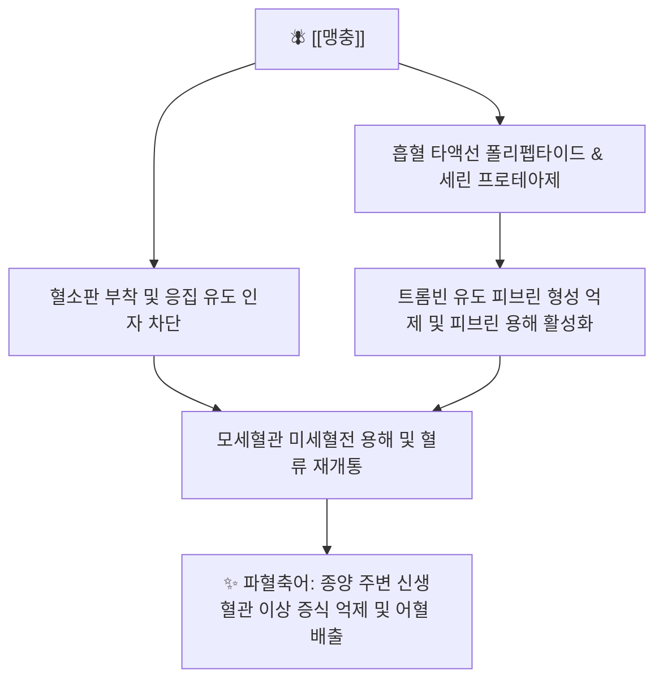

# 🪰 [[맹충]] (虻蟲, Tabanus)

> **핵심 요약 (Key Summary)**:
> 등에과에 속한 곤충인 쇠등에의 암컷 성충 건조체로 파혈축어와 통경소징의 대표적 충류약
> 타액선 분비 단백분해효소 및 항혈전 펩타이드로 트롬빈 활성 억제와 미세혈관 혈전 용해
> 하초 축혈로 인한 혈어경폐, 징가적취, 만성 간경변 및 저당탕·대황자충환의 핵심 군약

---

> [!abstract]+ 🧪 3D 약리 분자 구조 (Interactive 3D Viewer)
> <iframe src="https://molecule-viewer-rho.vercel.app/?cid=118701161" style="width: 100%; height: 600px; border: none; border-radius: 12px; box-shadow: 0 4px 20px rgba(0,0,0,0.15);" allowfullscreen></iframe>

## 📌 목차
1. [기본 본초 정보 & 기원](#1-기본-본초-정보--기원)
2. [본초학적 특성 & 포제법](#2-본초학적-특성--포제법)
3. [분자약리 기전 & 현대 의학적 효능](#3-분자약리-기전--현대-의학적-효능)
4. [대표 배오 처방 & 임상 응용](#4-대표-배오-처방--임상-응용)
5. [안전성, 부작용 및 복용 금기](#5-안전성-부작용-및-복용-금기)
6. [출처 및 학술 참고 문헌 (References)](#6-출처-및-학술-참고-문헌-references)

---
## 1. 기본 본초 정보 & 기원

| 항목 | 상세 내용 |
| :--- | :--- |
| **본초명** | [[맹충]] (虻蟲, Tabanus) |
| **이명** | 비맹(蜚虻), 우맹(牛虻) |
| **기원 동물** | 등에과(Tabanidae) 쇠등에(*Tabanus bivittatus* Matsumura) 또는 황등에의 암컷 성충 |
| **약용 부위** | 충체 전체 (포제 시 날개와 다리 제거) |
| **분류** | 활혈거어약(活血祛瘀藥) / 파혈축어약(破血逐瘀藥) |

---
## 2. 본초학적 특성 & 포제법

| 항목 | 상세 내용 |
| :--- | :--- |
| **성미 (性味)** | 고(苦), 미한(微寒), 유독(有毒) |
| **귀경 (歸經)** | 간경(肝經) |
| **효능 (Actions)** | 파혈축어(破血逐瘀), 통경소징(通經消癥), 산어지통(散瘀止痛) |
| **주치 (Indications)** | 혈어경폐(血瘀經閉), 징가적취(癥瘕積聚), 하초축혈(下焦蓄血), 타박상어혈 |

### 🔬 포제 및 법제 (Processing)
* **거족익(去足翼)**: 맹충의 날개와 다리에는 약효가 없고 인후와 위점막을 자극할 수 있으므로 반드시 비벼서 제거함.
* **초제(炒製)**: 맑은 물이나 쌀뜨물에 씻은 후 약한 불에서 노랗게 볶거나 활석분(滑石粉)과 함께 볶아 독성을 완화하고 비린내를 제거함.

---
## 3. 분자약리 기전 & 현대 의학적 효능

### (1) 혈소판 응집 억제 및 혈전 용해 (Thrombolytic Action)
* 맹충의 타액 추출물은 혈액 응고 캐스케이드의 주요 단계를 차단하고, 이미 형성된 피브린 섬유망을 신속히 분해하여 골반강 및 복강 내 울혈을 제거함.
* [[수질]]과 함께 배오 시 상가적 항응고 효과를 발휘하여 미세순환 부전을 극적으로 개선함.

### (2) 항섬유화 및 조직 재생
* 만성 간손상 모델에서 간성상세포 활성화를 억제하고 세포외 기질 축적을 막아 간경변 진행을 완화함.

---
## 4. 대표 배오 처방 & 임상 응용

| 처방명 | 배오 목적 및 주치 | 배오 특징 |
| :--- | :--- | :--- |
| [[저당탕]] | 상한론 태양병 하초축혈증, 발광, 소복경만통 | [[수질]], [[도인]], [[대황]]과 배오하여 급성 파혈축어 |
| [[대황자충환]] | 오로허극(五勞虛極), 건혈(乾血) 내저, 형체소수, 피부갑착 | [[수질]], [[자충]], [[도인]], [[수우각]]과 함께 만성 어혈 제거 |
| [[저당환]] | 하초축혈증이 완만하여 서서히 어혈을 공벌해야 할 때 | 저당탕의 약재를 환제로 빚어 복용 |

---
## 5. 안전성, 부작용 및 복용 금기

* **임산부 절대 금기**: 맹렬한 파혈 작용으로 자궁 수축을 유발하여 유산 위험이 극히 높음.
* **출혈성 소인 환자 금기**: 월경 과다, 혈우병, 소화성 궤양 출혈기 환자 및 와파린 등 항응고제 복용자 투여 금지.
* **유독성 관리**: 정해진 탕전 용량을 초과하지 않도록 하며, 목표 어혈이 해소되면 복용을 즉시 중단함.

---
## 6. 출처 및 학술 참고 문헌 (References)

* 장중경, 《상한론(傷寒論)》, 《금궤요략(金匱要略)》
* 전국한의과대학 본초학교수 공편저, 《본초학》, 영림사
* Xu X et al. Antithrombotic and anticoagulant activities of medicinal tabanid extracts. J Thromb Thrombolysis. 2014.
  * [연구 요약] 쇠등에 추출물의 트롬빈 특이적 억제 활성과 혈전성 모델에서의 혈관 개통 효과를 확인 규명함.
