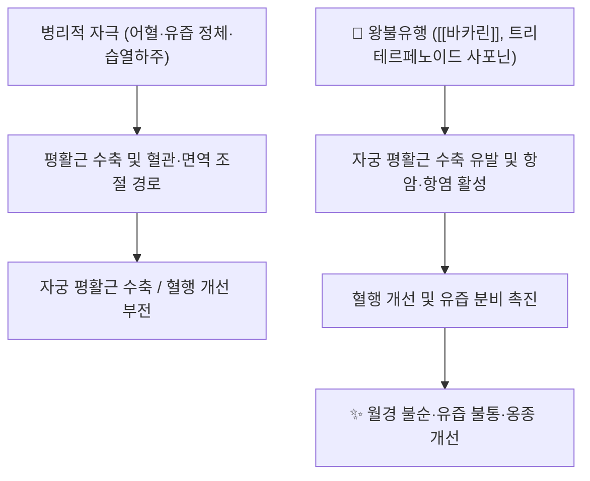

---
aliases:
  - 王不留行
  - Vaccariae Semen
  - Vaccaria segetalis
  - 맥람채(麥藍菜) 씨앗
tags:
  - 약리
  - status/draft
  - 본초
  - 활혈거어약
created: 2026-09-19
updated: 2026-09-19
status: complete
title: 왕불유행
date: 2026-09-22
출처: "https://molecule-viewer-rho.vercel.app/?cid=71307582\""
---

# 🌿 [[왕불유행]] (王不留行, Vaccariae Semen / *Vaccaria segetalis* seed)

> **핵심 요약 (Key Summary)**:
> 석죽과(Caryophyllaceae) 맥람채(*Vaccaria segetalis*, 이명 *Vaccaria hispanica*)의 잘 익은 씨앗
> 핵심 지표 성분인 [[왕불유행]] 플라보노이드 배당체 [[바카린]](Vaccarin)과 트리테르페노이드 사포닌(Vaccaroid류)이 자궁 평활근 수축 및 혈관·면역 조절 경로를 통해 분자약리 효과 발휘
> 전통적으로 활혈통경(活血通經)·하유소옹(下乳消癰)·이뇨통림(利尿通淋)에 쓰이는 대표적 활혈거어약이나, 자궁수축 작용으로 임신부 금기가 명확한 약재

---
## 📌 목차
1. [기본 본초 정보 & 화학 구조 (Pharmacognosy)](#1-기본-본초-정보--화학-구조-pharmacognosy)
2. [핵심 분자약리 기전 & 대사 네트워크](#2-핵심-분자약리-기전--대사-네트워크)
3. [해부생체역학 / 근육·신경 대사 연계](#3-해부생체역학--근육신경-대사-연계)
4. [사상의학 및 체질별 임상 응용 (적응증 vs 금기)](#4-사상의학-및-체질별-임상-응용-적응증-vs-금기)
5. [한의학적 고찰(유래와 특징)](#5-한의학적-고찰유래와-특징)
6. [핵심 처방 비교 매트릭스](#6-핵심-처방-비교-매트릭스)
7. [출처 및 학술 참고 문헌 (References)](#7-출처-및-학술-참고-문헌-references)

---
## 1. 기본 본초 정보 & 화학 구조 (Pharmacognosy)
> [!abstract]+ 🧪 핵심 지표성분 3D 분자 구조 (Interactive 3D Viewer)
> <iframe src="https://molecule-viewer-rho.vercel.app/?cid=71307582" width="100%" height="450px" frameborder="0" allow="webgl" style="border-radius: 8px;"></iframe>

| 항목 | 상세 내용 |
| :--- | :--- |
| **기원 식물** | 석죽과(Caryophyllaceae) *Vaccaria segetalis* (Neck.) Garcke (= *Vaccaria hispanica*)의 잘 익은 씨앗 |
| **성미 (性味)** | 고(苦), 평(平) |
| **귀경 (歸經)** | 肝·胃經 |
| **효능 (Actions)** | 활혈통경(活血通經), 하유소옹(下乳消癰), 이뇨통림(利尿通淋) |
| **주요 성분** | • **지표 성분**: [[바카린]](Vaccarin, C₃₂H₃₈O₁₉, CAS 53452-16-7, PubChem CID 71307582)<br>• **유효 활성 성분군**: 트리테르페노이드 사포닌(Vaccaroid A 등), 시코네이트(segetalin) 계열 펩타이드 |
| **PubChem CID** | [71307582](https://pubchem.ncbi.nlm.nih.gov/compound/71307582) (바카린 기준) |

### 🔬 주요 지표물질 화학 구조
> ⚠️ 내용 검토 필요: 왕불유행/바카린 관련 화학 구조 이미지가 아직 첨부되지 않았습니다. `7. 첨부·자료/첨부파일/`에 원본 확보 후 단독 블록 이미지로 추가해 주세요.

> **[구조적 특징 및 활성]**: 바카린은 C-배당체형 플라보노이드로, 당쇄 결합이 산가수분해에 저항성이 있어 체내 안정성이 비교적 높은 것으로 알려져 있음(⚠️ 정량적 생체이용률 자료는 확인 필요).

---
## 2. 핵심 분자약리 기전 & 대사 네트워크



### (1) 표적 수용체 및 신호전달 경로
* **자궁 평활근 수축 작용**: 트리테르페노이드 사포닌(Vaccaroid A 등)이 랫드 자궁 평활근을 직접 수축시키는 활성이 문헌으로 확인되어(Vaccaroid A 관련 연구), 전통 효능인 활혈통경·하유(下乳)의 약리학적 근거로 제시됨.
* **항종양 및 세포독성**: 시드에서 분리된 트리테르페노이드 사포닌이 다수 암세포주에 대한 세포독성을 보인다는 보고 존재(PMID [18253886](https://pubmed.ncbi.nlm.nih.gov/18253886/)).
* **세부 분자 표적(수용체/효소 결합 기전)**: ⚠️ 옥시토신 수용체 등 구체적 평활근 수축 수용체 결합 기전은 이번 조사 범위 내에서 확인하지 못해 확인 필요.

---
## 3. 해부생체역학 / 근육·신경 대사 연계

* **평활근(자궁) 대사**:
  * 트리테르페노이드 사포닌 성분이 자궁 평활근의 수축력을 증가시키는 것으로 보고되어(랫드 실험), 산후 유즙 정체·어혈성 월경통에 대한 전통적 활용과 상관성이 있음.
* **골격근·신경계 관련 자료**: ⚠️ 골격근 대사나 말초신경 조절에 대한 직접적 연구 문헌은 확인하지 못함(확인 필요).

---
## 4. 사상의학 및 체질별 임상 응용 (적응증 vs 금기)

```
[✅ 최적 적응증 (Sweet Spot)]
• 산후 유즙 불통(乳汁不下), 유방 창통을 동반한 옹종
• 어혈성 월경불순·폐경(閉經)
• 습열하주로 인한 임증(淋證)·소변불리

[⚠️ 신중 투여 및 금기 (Caution / Contraindication)]
• 임신부: 자궁 평활근 수축 활성으로 인해 금기(전통적으로도 "왕불유행"이라는 이름 자체가 강한 활혈 작용을 시사)
• 기혈허약자·월경과다 환자에서는 신중 투여
• 체질별 적응증 세부 자료는 ⚠️ 확인 필요(사상의학 문헌상 명시적 배속 기록 미확인)
```

---
## 5. 한의학적 고찰(유래와 특징)

* **명칭 유래**: "왕(王)의 명령으로도 머무르게 할 수 없다(不留行)"는 뜻으로, 약효가 매우 신속하고 강하게 통행(通行)함을 형용한 이름으로 전해짐(⚠️ 정확한 원전 출처는 확인 필요).
* **전통 배오**:
  * [[왕불유행]] + [[천산갑]](또는 대용 약재) → 유즙 불통·유옹(乳癰) 치료의 대표 배오로 임상 활용(⚠️ 구체적 처방 원문 출전은 확인 필요).
  * [[왕불유행]] + 이뇨통림약(예: [[차전자]] 등) → 습열성 임증(淋證) 치료 시너지.

---
## 6. 핵심 처방 비교 매트릭스

| 처방명 | 구성 약재 | 주치 병증 및 임상 타깃 | 특징 및 감별점 |
| :--- | :--- | :--- | :--- |
| **⚠️ 확인 필요** | ⚠️ 확인 필요 | 유즙 불통·산후 유옹 | 왕불유행이 군약으로 활용되는 대표 처방 원전 확인 필요 |

> ⚠️ 왕불유행이 핵심 군약으로 포함된 구체적 방제(예: 통유탕 등 민간 경험방 포함)는 이번 조사 범위 내에서 실존 원전을 확정하지 못해 공란 처리합니다. 확인되는 대로 보강 요망.

---
## 7. 출처 및 학술 참고 문헌 (References)

1. **Al-Snafi AE. et al.**. *Vaccaria segetalis: A Review of Ethnomedicinal, Phytochemical, Pharmacological, and Toxicological Findings*. (PMC8117358)
   - **[연구 요약]**: 왕불유행(Vaccaria segetalis)의 민간 전통 활용, 트리테르페노이드 사포닌·플라보노이드 등 화학성분, 항종양·항염·자궁수축 등 약리활성 및 독성 자료를 정리한 리뷰.
   - [PMC 원문](https://pmc.ncbi.nlm.nih.gov/articles/PMC8117358/)
2. **연구팀**. *Cytotoxic triterpenoid saponins from Vaccaria segetalis*. PMID: [18253886](https://pubmed.ncbi.nlm.nih.gov/18253886/).
   - **[연구 요약]**: 왕불유행 씨앗에서 분리한 트리테르페노이드 사포닌의 암세포주 대상 세포독성 활성을 보고.
3. **연구팀**. *Triterpenoid saponins from Vaccaria segetalis*. PMID: [11254032](https://pubmed.ncbi.nlm.nih.gov/11254032/).
   - **[연구 요약]**: 왕불유행 씨앗 유래 신규 트리테르페노이드 사포닌(Vaccaroid류)의 구조 규명 연구.
4. **대한민국약전(KP)**. 의약품각조: 왕불유행(맥람채 씨앗) 규격.
   - **[공정서 규격]**: ⚠️ 구체적 지표성분 기준 함량 수치는 이번 조사 범위 내에서 확인하지 못함(확인 필요).

<!-- 보관 태그(1회용·링크오류, 필요시 복원): 하유약, 이수통림 -->
