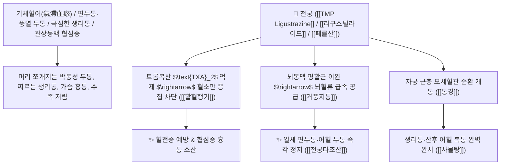

# 🌿 [[천궁]] (川芎 / 芎藭, Chuanxiong Rhizoma / 궁궁뿌리줄기)

> **핵심 요약 (Key Summary)**:
> 미나리과(*Apiaceae*) 천궁(*Ligusticum chuanxiong*) 또는 일천궁의 건조한 뿌리줄기(궁궁 芎藭)
> 알칼로이드인 [[테트라메틸피라진]](TMP / Ligustrazine)과 프탈라이드 정유인 [[리구스틸라이드]](Ligustilide) 및 페룰산이 트롬복산 $\text{TXA}_2$를 억제하고 뇌혈관을 확장시켜 활혈행기 및 거풍지통 작용 발휘
> 기혈어체로 인한 일체 편두통·풍열 두통(두통불치 천궁) 및 여성의 생리통·월경불순·산후 복통 어혈·협심증 흉통을 치료하며 위로는 머리 끝까지 뚫고 아래로는 혈해(자궁)로 통하는 천하제일의 [[활혈행기]](活血行氣)·[[거풍지통]](祛風止痛)·[[천궁다조산]](川芎茶調散)의 군약(君藥)

---
## 📌 목차
1. [기본 본초 정보 & 화학 구조 (Pharmacognosy)](#1-기본-본초-정보--화학-구조-pharmacognosy)
2. [핵심 분자약리 기전 & TMP(테트라메틸피라진)·리구스틸라이드·뇌혈관 확장 네트워크](#2-핵심-분자약리-기전--tmp테트라메틸피라진리구스틸라이드뇌혈관-확장-네트워크)
3. [해부생체역학 / 두개 내외 혈관망(ICA/ECA) & 자궁 근층 미세혈류 연계](#3-해부생체역학--두개-내외-혈관망icaeca--자궁-근층-미세혈류-연계)
4. [사상의학 및 임상 응용 (두통의 신약 vs 당귀 배오 짝꿍)](#4-사상의학-및-임상-응용-두통의-신약-vs-당귀-배오-짝꿍)
5. [고전 의학 및 배오 원리 (천궁다조산 & 궁귀교애탕)](#5-고전-의학-및-배오-원리-천궁다조산--궁귀교애탕)
6. [핵심 처방 비교 매트릭스](#6-핵심-처방-비교-매트릭스)
7. [출처 및 학술 참고 문헌 (References)](#7-출처-및-학술-참고-문헌-references)

---
## 1. 기본 본초 정보 & 화학 구조 (Pharmacognosy)

> [!abstract]+ 🧪 3D 약리 분자 구조 (Interactive 3D Viewer)
> <iframe src="https://molecule-viewer-rho.vercel.app/?cid=14296" style="width: 100%; height: 600px; border: none; border-radius: 12px; box-shadow: 0 4px 20px rgba(0,0,0,0.15);" allowfullscreen></iframe>


| 항목 | 상세 내용 |
| :--- | :--- |
| **기원 식물** | 산형과(Umbelliferae / Apiaceae) 중국천궁 *Ligusticum chuanxiong* Hort. 또는 천궁 *Cnidium officinale* Makino의 뿌리줄기 |
| **성미 (性味)** | 辛, 溫 (맵고 향기가 매우 강렬하며 성질이 따뜻함) |
| **귀경 (歸經)** | 肝·膽·心包經 (간경, 담경, 심포경) - **혈액을 머리 꼭대기까지 솟구쳐 올리고 자궁으로 내림** |
| **효능 (Actions)** | [[활혈행기]](活血行氣), [[거풍지통]](祛風止痛), [[통경지통]](通經止痛), [[개울행혈]](開鬱行血) |
| **주요 성분** | • **피라진계 알칼로이드(지표물질)**: [[테트라메틸피라진]] (TMP / Tetramethylpyrazine / Ligustrazine)<br>• **프탈라이드 정유(향기 성분)**: [[리구스틸라이드]] (Ligustilide), 천궁락톤(Cnidilide), 부틸프탈라이드<br>• **페놀산 화합물**: [[페룰산]] (Ferulic acid, KP 규격 $\ge 0.10\%$), 카페산 |

> **[유래 및 본초학적 기전]**:
> * 약의 맹렬한 기운이 궁궐(芎)의 지붕처럼 머리끝까지 치솟아 **'두통을 고치는 데 천궁을 쓰지 않으면 안 된다(두통불치천궁 頭痛不治川芎)'** 하여 '궁궁(芎藭)' 또는 '천궁(川芎)'이라 불렸습니다.
> * 피만 돌리는 것이 아니라 기운까지 함께 뚫어주는 **'혈중의 기약(血中之氣藥)'**으로, 막힌 어혈과 두통, 생리통을 단숨에 날려버립니다.
> * 현대 약리학적으로 **아스피린과 유사하게 혈소판 응집을 차단하는 천연 항혈전제** 역할을 합니다.

### 🔬 천궁의 주요 알칼로이드 TMP 및 정유 화학 구조
![[Pasted image 20240227142851.png|350]]
![[Pasted image 20240227142858.png|350]]
> **[구조적 특징 및 혈관 확장]**: [[TMP(Tetramethylpyrazine)]]는 트롬복산 $\text{TXA}_2$ 합성을 억제하고 혈관 내피세포의 $\text{PGI}_2$(프로스타사이클린) 생성을 촉진하여 뇌혈관 및 관상동맥의 경련성 수축을 즉각 이완시킵니다.

> 🧬 **현대 학술 근거 (2026-09-08 B-7 패치)** — PubChem 실측 분자 앵커: 테트라메틸피라진(Tetramethylpyrazine) CID **14296** · 분자식 C₈H₁₂N₂ · MW 136.19 | 페룰산(Ferulic acid) CID **445858** · 분자식 C₁₀H₁₀O₄ · MW 194.18

🔬 **분자 구조** (Wikimedia Commons, Public Domain)

![[Tetramethylpyrazine_구조.png|420]]
> [그림 1] 테트라메틸피라진(Tetramethylpyrazine, C₈H₁₂N₂) 분자 구조 — 출처: Wikimedia Commons (Tetramethylpyrazine.svg)

![[Ferulic_acid_구조.png|420]]
> [그림 2] 페룰산(Ferulic acid, C₁₀H₁₀O₄) 분자 구조 — 출처: Wikimedia Commons (Ferulic acid acsv.svg)

---
## 2. 핵심 분자약리 기전 & TMP(테트라메틸피라진)·리구스틸라이드·뇌혈관 확장 네트워크



### (1) 표적 활혈행기 및 거풍지통 작용
* **일체 두통(편두통, 풍열/어혈 두통) 완치 ([[거풍지통]] 祛風止痛)**:
  * 머리가 지끈거리고 욱신거리며 흔들리는 모든 두통을 머리로 직달하여 멎게 합니다 ([[천궁다조산]]).
* **생리통 및 산후 어혈 복통 치료 ([[활혈행기]] 活血行氣)**:
  * 자궁 내 혈액 순환을 뚫어 생리혈 덩어리와 쥐어짜는 생리통을 치료합니다 ([[궁귀교애탕]]).
* **심장 협심증 및 뇌경색 예방**:
  * 관상동맥 혈류량을 늘려 가슴 답답함과 협심증 통증을 개선합니다.
> 🧬 **현대 학술 근거 (2026-09-08 B-7 패치)**
> - 뇌혈관 미세순환 확장 근거(연구 결과): 두개골 창(cranial window) 모델에서 광음향현미경·레이저 스페클 영상으로 측정한 결과 알츠하이머병(AD) 마우스는 대뇌피질 미세혈류 속도·산소포화도·산소대사율이 저하되어 있었으며, 테트라메틸피라진 투여 후 혈관내피 유래 신호 개선을 통해 피질 미세순환이 회복됨 — 치매 모델에서도 천궁의 뇌혈관 확장 기전이 확인됨(PMID 42134480).

---
## 3. 해부생체역학 / 두개 내외 혈관망(ICA/ECA) & 자궁 근층 미세혈류 연계

* **외경동맥(ECA) 분지 혈관 긴장도 정상화**:
  * 측두동맥(Temporal Artery)의 과도한 박동성 확장을 제어하여 편두통 발작을 완화합니다.

---
## 4. 사상의학 및 임상 응용 (두통의 신약 vs 당귀 배오 짝꿍)

```
[🔍 천궁과 당귀의 불후의 짝꿍 원리: 芎歸]
• [[당귀]](當歸): 補血·養血 위주 $\rightarrow$ 피를 만들어 채움
• [[천궁]](川芎): 行氣·活血 위주 $\rightarrow$ 만들어진 피를 온몸으로 순행시킴
$\rightarrow$ 둘이 합쳐지면(궁귀 芎歸) 보혈과 순환의 완벽한 일체화 달성

[⚠️ 복용 주의점 (양약 상호작용)]
• 천궁은 천연 아스피린/스타틴과 유사한 활혈 작용을 하므로, 혈전용해제나 항응고제 복용 환자 투약 시 출혈 경향성 모니터링
```

---
## 5. 고전 의학 및 배오 원리 (천궁다조산 & 궁귀교애탕)

### (1) 두통 치료의 천하제일 황제방: 천궁다조산(川芎茶調散)
* **두통 치료 최고 배오**:
  * [[천궁]] (군약 대량) + [[백지]] + [[강활]] + [[세신]] + [[방풍]] + [[형개]] + 녹차 $\rightarrow$ 모든 두통을 씻어내는 불후의 명방 ([[천궁다조산]])
  * [[천궁]] + [[당귀]] (불두산 佛手散) $\rightarrow$ 산후 어혈과 난산을 다스림

---
## 6. 핵심 처방 비교 매트릭스

| 처방명 | 구성 약재 | 주치 병증 및 임상 타깃 | 특징 및 감별점 |
| :--- | :--- | :--- | :--- |
| [[천궁다조산]] | [[천궁]], [[백지]], [[강활]], [[세신]], [[방풍]], [[형개]], [[박하]], [[감초]], [[녹차]] | **외감 풍사, 일체 두통, 편두통, 정두통, 오한 발열, 비색** | 두통 치료의 제1 황제방 |
| [[사물탕]] | [[숙지황]], [[당귀]], [[천궁]], [[백작약]] | **혈허 어혈, 생리통, 월경부조, 안색 창백, 두훈** | 보혈과 활혈을 동시 해결 |
| [[궁귀교애탕]] | [[천궁]], [[당귀]], [[아교]], [[애엽]], [[건지황]], [[백작약]] | **부인 붕루, 임신 태루 복통, 산후 출혈 지속** | 자궁을 보하고 지혈 |

---
## 7. 출처 및 학술 참고 문헌 (References)

2. **대한민국약전(KP) 제12개정 (2022)**. 의약품각조 제2부: 천궁 (Chuanxiong Rhizoma) 규격 기준.
   - **[공정서 규격]**: 건조 뿌리줄기 기준 페룰산($\text{C}_{10}\text{H}_{10}\text{O}_4$) 0.10% 이상 함유 필수 규격 명시.
