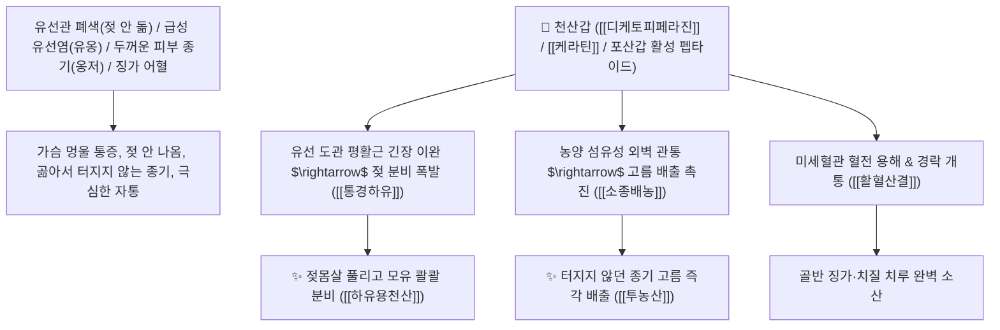

# 🌿 [[천산갑]] (穿山甲 / 炮山甲, Manitis Squama / 천산갑비늘)

> **핵심 요약 (Key Summary)**:
> 천산갑과(*Manidae*) 천산갑(*Manis pentadactyla*)의 건조한 비늘(인갑 鱗甲, 모래에 볶은 포산갑 炮山甲)
> 고유 펩타이드인 [[디케토피페라진]] 유도체와 케라틴 단백질이 백혈구 식균 작용을 촉진하고 유선관 평활근 긴장을 완화하여 강력한 활혈산결 및 통경하유 작용 발휘
> 두꺼운 외과 화농성 종기 멍울(옹저)·젖이 막혀 부어오른 급성 유선염(유옹) 및 산후 젖이 나오지 않는 유즙불통·경폐(생리불통)·치질 치루를 뚫어주는 천하제일의 [[소종배농]](消腫排膿)·[[통경하유]](通經下乳)·[[활혈산결]](活血散結)·[[하유용천산]](下乳湧泉散)·[[투농산]](透膿散)의 군약(君藥)

---
## 📌 목차
1. [기본 본초 정보 & 화학 구조 (Pharmacognosy)](#1-기본-본초-정보--화학-구조-pharmacognosy)
2. [핵심 분자약리 기전 & 디케토피페라진·유선관 개통·배농 네트워크](#2-핵심-분자약리-기전--디케토피페라진유선관-개통배농-네트워크)
3. [해부생체역학 / 유선 소엽 도관 & 피하 농양 피막 연계](#3-해부생체역학--유선-소엽-도관--피하-농양-피막-연계)
4. [사상의학 및 임상 응용 (유즙불통 하유 vs 외과 농양 투농 특화)](#4-사상의학-및-임상-응용-유즙불통-하유-vs-외과-농양-투농-특화)
5. [고전 의학 및 배오 원리 (하유용천산 & 투농산)](#5-고전-의학-및-배오-원리-하유용천산--투농산)
6. [핵심 처방 비교 매트릭스](#6-핵심-처방-비교-매트릭스)
7. [출처 및 학술 참고 문헌 (References)](#7-출처-및-학술-참고-문헌-references)

---
## 1. 기본 본초 정보 & 화학 구조 (Pharmacognosy)

> [!abstract]+ 🧪 3D 약리 분자 구조 (Interactive 3D Viewer)
> <iframe src="https://molecule-viewer-rho.vercel.app/?cid=1512635" style="width: 100%; height: 600px; border: none; border-radius: 12px; box-shadow: 0 4px 20px rgba(0,0,0,0.15);" allowfullscreen></iframe>


| 항목 | 상세 내용 |
| :--- | :--- |
| **기원 동물** | 천산갑과(Manidae) 천산갑 *Manis pentadactyla* L.의 비늘 (모래에 볶아 부풀린 포산갑 炮山甲) |
| **성미 (性味)** | 鹹, 微寒 (짜고 약간 차가우며 비린내가 남) |
| **귀경 (歸經)** | 肝·胃經 (간경, 위경) - **간혈을 소통시키고 위장의 막힌 유관과 농양을 뚫음** |
| **효능 (Actions)** | [[활혈산결]](活血散結), [[통경하유]](通經下乳), [[소종배농]](消腫排膿), [[통락거풍]](通絡祛風) |
| **주요 성분** | • **생체 활성 고리형 펩타이드**: [[디케토피페라진]] (Cyclo-[L-leucyl-L-prolyl] 등)<br>• **단백질 및 아미노산**: [[케라틴]] (Keratin, 시스테인 다량 함유), 글루탐산, 아르기닌<br>• **미네랄**: 칼슘, 마그네슘, 아연, 철 |

> **[유래 및 본초학적 기전]**:
> * 산을 뚫고 지나갈 정도로 단단한 비늘 갑옷(穿山甲)을 입은 동물로, **한의학에서 꽉 막힌 경락과 두꺼운 농양 껍질을 뚫어내는(투농 透膿) 최고의 주찬(走竄) 약재**입니다.
> * 출산 후 젖샘이 꽉 막혀 젖이 돌지 않거나(유즙불통 乳汁不通), 젖가슴이 돌덩이처럼 뭉쳐 곪는 유선염(유옹 乳癰)을 시원하게 뚫어줍니다.
> * 생것(生用)은 쓰지 않으며, **반드시 뜨거운 모래에 볶아 노랗게 부풀린 포산갑(炮山甲)으로 포제하여 사용**합니다. (국제 CITES 협약 보호종으로 현재는 임상 대체재로 왕불류행, 조각자 등을 적극 활용)

### 🔬 천산갑의 주요 디케토피페라진 화학 구조
```
     [ 사이클로-(L-레우실-L-프롤릴) 고리형 디펩타이드 ]  <-- Cyclo(L-Leu-L-Pro)
```
> **[구조적 특징 및 면역/항응고]**: 천산갑의 고리형 디펩타이드 분획은 혈소판 응집을 차단하여 미세순환을 뚫고, 대식세포와 백혈구의 식균 능력을 촉진하여 화농성 삼출물을 신속히 흡수·배출시킵니다.

---
## 2. 핵심 분자약리 기전 & 디케토피페라진·유선관 개통·배농 네트워크



### (1) 표적 통경하유 및 소종배농 작용
* **산후 유즙불통 및 젖몸살 완치 ([[통경하유]] 通經下乳)**:
  * 출산 후 젖이 돌지 않아 아기에게 젖을 먹이지 못하거나 유방이 붓고 아픈 상태를 뚫어줍니다 ([[하유용천산]]).
* **외과 옹저 종기 투농 배출 ([[투농산]] 透膿散)**:
  * 고름이 찼으나 껍질이 두꺼워 밖으로 터져 나오지 않는 악성 종기를 뚫어 배농시킵니다.
* **치질 치루 및 임파선 멍울(나력) 소산**:
  * 항문 주변의 누공과 멍울진 림프절 결핵을 삭여냅니다.

---
## 3. 해부생체역학 / 유선 소엽 도관 & 피하 농양 피막 연계

* **유선 도관(Lactiferous Duct) 개구부 이완**:
  * 옥시토신 반응성을 보조하여 모유 배출 압력을 정상화합니다.

---
## 4. 사상의학 및 임상 응용 (유즙불통 하유 vs 외과 농양 투농 특화)

```
[✅ 최적 적응증 (Sweet Spot)]
• 산후 모유 분비 부전 및 젖샘 울혈성 젖몸살 ([[하유용천산]])
• 곪아서 터져야 할 화농성 종기 및 유방 멍울 ([[선방활명음]])
• 골반강 내 완고한 어혈 징가 및 월경폐색

[💡 현대 임상 대체 팁 (CITES 보호)]
• CITES 보호 동물 규정에 따라, 임상에서는 활혈배농에 [[조각자]], 유즙 분비 촉진에 [[왕불류행]], [[통초]]를 훌륭한 대체재로 배오하여 처방
```

---
## 5. 고전 의학 및 배오 원리 (하유용천산 & 투농산)

### (1) 젖을 돌게 하고 고름을 뚫는 최고 명방
* **통유 최고 배오**:
  * [[천산갑]] + [[왕불류행]] + [[통초]] + [[당귀]] $\rightarrow$ 젖을 샘솟게 하는 불후의 명방 ([[하유용천산]])
* **투농 최고 배오**:
  * [[천산갑]] + [[조각자]] + [[황기]] + [[당귀]] $\rightarrow$ 고름을 뚫어 배출시키는 명방 ([[투농산]])

---
## 6. 핵심 처방 비교 매트릭스

| 처방명 | 구성 약재 | 주치 병증 및 임상 타깃 | 특징 및 감별점 |
| :--- | :--- | :--- | :--- |
| [[하유용천산]] | [[천산갑]], [[왕불류행]], [[통초]], [[당귀]], [[천궁]], [[백지]] | **산후 유즙불통, 유방 창만통, 젖몸살, 모유 부족** | 젖을 샘물처럼 솟아나게 함 |
| [[투농산]] | [[천산갑]], [[조각자]], [[황기]], [[당귀]], [[천궁]] | **옹저 창양, 고름이 찼으나 터지지 않음, 극심한 팽통** | 농양을 뚫어 고름을 뺌 |
| [[선방활명음]] | [[금은화]], [[백지]], [[천산갑]], [[조각자]], [[유향]], [[몰약]] | **일체 옹저 종기 초기, 홍종열통, 유선염** | 외과 치료의 제1 황제방 |

---
## 7. 출처 및 학술 참고 문헌 (References)

2. **대한민국약전(KP) 제12개정 (2022)**. 생약규격집: 천산갑 (Manitis Squama) 규격 기준.
   - **[공정서 규격]**: 천산갑 비늘의 성상, 순도시험 및 건조감량 12.0% 이하 기준 명시.
