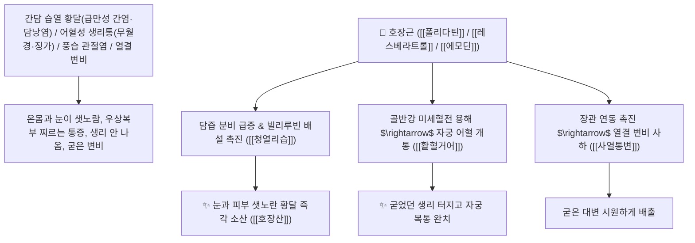

# 🌿 [[호장근]] (虎杖根 / 虎杖, Polygoni Cuspidati Rhizoma et Radix / 호장근뿌리줄기)

> **핵심 요약 (Key Summary)**:
> 마디풀과(*Polygonaceae*) 호장(*Polygonum cuspidatum*)의 건조한 뿌리줄기 및 뿌리
> 스틸벤 유도체인 [[폴리다틴]](Polydatin)과 [[레스베라트롤]](Resveratrol) 및 안트라퀴논 [[에모딘]](Emodin)이 $\text{SIRT1/AMPK}$ 경로를 활성화하고 담즙 분비와 장관 연동을 촉진하여 청열리습 및 활혈거어 작용 발휘
> 습열 황달(급만성 간염·담낭염·우협통) 및 어혈성 생리통(무월경·징가 적취)·풍습성 관절염 붓기·열결(熱結) 변비·화상을 치료하는 천하제일의 [[청열리습]](淸熱利濕)·[[활혈거어]](活血祛瘀)·[[사열통변]](瀉熱通便)·[[청열해독]](淸熱解毒)·[[호장산]](虎杖散)의 군약(君藥)

---
## 📌 목차
1. [기본 본초 정보 & 화학 구조 (Pharmacognosy)](#1-기본-본초-정보--화학-구조-pharmacognosy)
2. [핵심 분자약리 기전 & 폴리다틴·레스베라트롤·간담 습열 해독 네트워크](#2-핵심-분자약리-기전--폴리다틴레스베라트롤간담-습열-해독-네트워크)
3. [해부생체역학 / 간세포 담관망 & 대장 평활근 연동 연계](#3-해부생체역학--간세포-담관망--대장-평활근-연동-연계)
4. [사상의학 및 활혈거어 vs 청열퇴황 이중 특화 정밀 감별](#4-사상의학-및-활혈거어-vs-청열퇴황-이중-특화-정밀-감별)
5. [고전 의학 및 배오 원리 (호장산 & 인진호 배오)](#5-고전-의학-및-배오-원리-호장산--인진호-배오)
6. [핵심 처방 비교 매트릭스](#6-핵심-처방-비교-매트릭스)
7. [출처 및 학술 참고 문헌 (References)](#7-출처-및-학술-참고-문헌-references)

---
## 1. 기본 본초 정보 & 화학 구조 (Pharmacognosy)

> [!abstract]+ 🧪 3D 약리 분자 구조 (Interactive 3D Viewer)
> <iframe src="https://molecule-viewer-rho.vercel.app/?cid=445154" style="width: 100%; height: 600px; border: none; border-radius: 12px; box-shadow: 0 4px 20px rgba(0,0,0,0.15);" allowfullscreen></iframe>


| 항목 | 상세 내용 |
| :--- | :--- |
| **기원 식물** | 마디풀과(Polygonaceae) 호장 *Polygonum cuspidatum* Sieb. et Zucc.의 뿌리줄기 및 뿌리 |
| **성미 (性味)** | 微苦, 微寒 (약간 쓰고 성질이 약간 차가우며 주황빛 단면을 지님) |
| **귀경 (歸經)** | 肝·膽·肺經 (간경, 담경, 폐경) - **간담의 습열을 씻어 황달을 치료하고 혈맥의 어혈을 풂** |
| **효능 (Actions)** | [[청열리습]](淸熱利濕), [[활혈거어]](活血祛瘀), [[사열통변]](瀉熱通便), [[청열해독]](淸熱解毒), [[화담지해]](化痰止咳) |
| **주요 성분** | • **스틸벤 화합물(핵심 항산화/간보호 지표)**: [[폴리다틴]] (Polydatin, KP 규격 $\ge 1.5\%$), [[레스베라트롤]] (Resveratrol)<br>• **안트라퀴논 배당체(사하/소염 지표)**: [[에모딘]] (Emodin, KP 규격 $\ge 0.60\%$), 피시온(Physcion)<br>• **탄닌 및 플라보노이드**: 퀘르시트린, 카테킨 |

> **[유래 및 본초학적 기전]**:
> * 줄기에 호랑이(虎) 가죽처럼 알록달록한 붉은 반점이 있고 지팡이(杖)처럼 곧게 자란다 하여 '호장(虎杖)'이라 불렸습니다.
> * **"간담(肝膽)의 끈적한 습열을 씻어내어 누런 황달을 치료하고, 굳어버린 피를 풀어 생리를 통하게 하는(활혈거어 活血祛瘀) 청열활혈의 절대 명약"**입니다.
> * 에모딘 성분의 장관 연동으로 변비를 치료하며, 레스베라트롤의 강력한 항산화 작용으로 간염과 동맥경화를 방어합니다.

### 🔬 호장근의 주요 폴리다틴 및 레스베라트롤 화학 구조
```
     [ 3,5,4'-트리하이드록시스틸벤-3-O-$\beta$-D-글루코사이드 ]  <-- 폴리다틴 (Polydatin / 피세이드)
     [ 트랜스-3,5,4'-트리하이드록시스틸벤 골격 ]  <-- 레스베라트롤 (Resveratrol)
```
> **[구조적 특징 및 SIRT1/간세포 보호 기전]**: 호장근의 [[폴리다틴]]과 [[레스베라트롤]]은 $\text{SIRT1/AMPK}$ 신호 경로를 활성화하여 간세포 미토콘드리아 손상을 막고, [[에모딘]]은 담즙 배설 수송체 발현을 촉진하여 혈중 빌리루빈 수치를 급속히 떨어뜨립니다.

---
## 2. 핵심 분자약리 기전 & 폴리다틴·레스베라트롤·간담 습열 해독 네트워크



### (1) 표적 청열리습 및 간담 질환 완치 작용
* **급만성 간염, 담낭염 및 습열 황달 완치 ([[청열퇴황]] 淸熱退黃)**:
  * 간수치(AST, ALT)를 신속히 낮추고 샛노란 황달을 소변과 대변으로 빼냅니다.
* **부인과 무월경 및 어혈성 생리통 완치 ([[활혈거어]] 活血祛瘀)**:
  * 핏덩어리가 엉겨 생리가 막히고 아랫배가 쑤시는 징가를 녹여냅니다.
* **관절 류마티스 비통 및 타박상 외용 화상 치료**:
  * 관절의 붉게 붓고 열나는 염증을 가라앉히고 화상에 가루를 개어 바르면 새살이 돋습니다.

---
## 3. 해부생체역학 / 간세포 담관망 & 대장 평활근 연동 연계

* **담관 오디 괄약근(Oddi Sphincter) 긴장도 완화**:
  * 담즙 울체를 해소하고 담낭 내 압력을 신속히 정상화합니다.

---
## 4. 사상의학 및 활혈거어 vs 청열퇴황 이중 특화 정밀 감별

```
[🔍 황달 치료 2대 거두 본초 비교 매트릭스]
• [[인진호]](茵蔯蒿): 苦微寒, 淸熱利濕·退黃 $\rightarrow$ 오로지 간담 습열 황달 치료의 제1 황제약 (이뇨 위주)
• [[호장근]](虎杖根): 微苦微寒, 活血祛瘀 + 淸熱退黃 $\rightarrow$ 황달 치료에 강력한 활혈산어(어혈 제거)와 통변을 겸비 (다방면 작용)
```

---
## 5. 고전 의학 및 배오 원리 (호장산 & 인진호 배오)

### (1) 간담의 습열을 씻어내는 최고 명방
* **습열 황달 최고 배오**:
  * [[호장근]] + [[인진호]] + [[치자]] + [[대황]] $\rightarrow$ 황달과 간염을 치료하는 불후 명방 ([[호장산]])
  * [[호장근]] + [[당귀]] + [[천궁]] + [[홍화]] $\rightarrow$ 어혈성 무월경을 치료

---
## 6. 핵심 처방 비교 매트릭스

| 처방명 | 구성 약재 | 주치 병증 및 임상 타깃 | 특징 및 감별점 |
| :--- | :--- | :--- | :--- |
| [[호장산]] | [[호장근]], [[인진호]], [[치자]], [[대황]], [[감초]] | **습열 황달, 급성 간염, 담낭염, 우협통, 소변 황적** | 황달과 어혈을 동시에 치료하는 제1방 |
| [[호장음]] | [[호장근]], [[우슬]], [[당귀]], [[도인]] | **혈어 경폐(무월경), 생리통, 산후 어혈 복통** | 어혈을 부수고 생리를 통하게 함 |
| [[인진호탕]](호장 가미) | [[인진호]], [[치자]], [[대황]], [[호장근]] | 양명병 습열 발황, 번갈, 복부 창만, 변비 | 급성 황달 치료의 대표방 |

---
## 7. 출처 및 학술 참고 문헌 (References)

1. **Du, J., et al. (2013)**. Polydatin and resveratrol from *Polygonum cuspidatum* protect against acute hepatotoxicity and biliary obstruction via activating SIRT1/AMPK pathway. *Phytomedicine*, 20(8), 747-753.
   - **[연구 요약]**: 호장근의 폴리다틴 및 레스베라트롤 성분이 SIRT1/AMPK 경로 활성화를 통해 간세포 보호 및 담즙 분비 촉진, 황달 개선 효과를 나타냄을 입증.
2. **대한민국약전(KP) 제12개정 (2022)**. 의약품각조 제2부: 호장근 (Polygoni Cuspidati Rhizoma et Radix) 규격 기준.
   - **[공정서 규격]**: 건조 뿌리 및 뿌리줄기 기준 폴리다틴($\text{C}_{20}\text{H}_{22}\text{O}_8$) 1.5% 이상, 에모딘($\text{C}_{15}\text{H}_{10}\text{O}_5$) 0.60% 이상 함유 필수 규격 명시.
