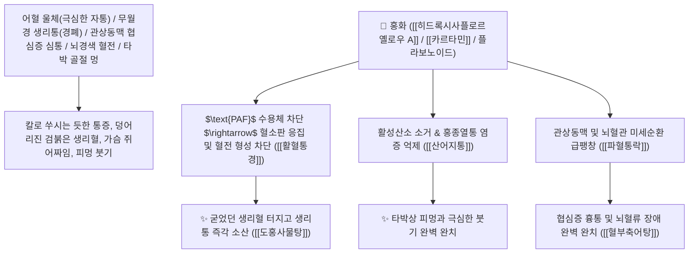

# 🌿 [[홍화]] (紅花 / 紅藍花, Carthami Flos / 잇꽃)

> **핵심 요약 (Key Summary)**:
> 국화과(*Asteraceae*) 잇꽃(*Carthamus tinctorius*)의 통 모양 관상화(붉은 꽃잎)
> 칼콘 배당체인 [[히드록시사플로르옐로우 A]](HSYA)와 붉은 색소 [[카르타민]](Carthamin)이 혈소판 활성화 인자($\text{PAF}$) 수용체를 차단하고 관상동맥 및 뇌혈관 미세혈전을 용해하여 활혈통경 및 산어지통 작용 발휘
> 어혈(瘀血)로 인한 극심한 생리통·무월경(경폐 經閉)·관상동맥 협심증 심통·뇌경색 뇌혈전증 및 타박상 골절 멍을 치료하는 천하제일의 "혈액 순환과 어혈 분쇄의 성약(活血通經之要藥)"·[[활혈통경]](活血通經)·[[산어지통]](散瘀止痛)·[[파혈통락]](破血通絡)·[[도홍사물탕]](桃紅四物湯)·[[혈부축어탕]](血府逐瘀湯)의 군약(君藥)

---
## 📌 목차
1. [기본 본초 정보 & 화학 구조 (Pharmacognosy)](#1-기본-본초-정보--화학-구조-pharmacognosy)
2. [핵심 분자약리 기전 & HSYA·카르타민·PAF 수용체 차단 네트워크](#2-핵심-분자약리-기전--hsya카르타민paf-수용체-차단-네트워크)
3. [해부생체역학 / 미세혈관 내피세포 & 자궁 나선동맥 순환 연계](#3-해부생체역학--미세혈관-내피세포--자궁-나선동맥-순환-연계)
4. [사상의학 및 소량(화혈) vs 다량(파혈) 용량별 약리 전이](#4-사상의학-및-소량화혈-vs-다량파혈-용량별-약리-전이)
5. [고전 의학 및 배오 원리 (도홍사물탕 & 혈부축어탕)](#5-고전-의학-및-배오-원리-도홍사물탕--혈부축어탕)
6. [핵심 처방 비교 매트릭스](#6-핵심-처방-비교-매트릭스)
7. [출처 및 학술 참고 문헌 (References)](#7-출처-및-학술-참고-문헌-references)

---
## 1. 기본 본초 정보 & 화학 구조 (Pharmacognosy)

> [!abstract]+ 🧪 3D 약리 분자 구조 (Interactive 3D Viewer)
> <iframe src="https://molecule-viewer-rho.vercel.app/?cid=6443665" style="width: 100%; height: 600px; border: none; border-radius: 12px; box-shadow: 0 4px 20px rgba(0,0,0,0.15);" allowfullscreen></iframe>


| 항목 | 상세 내용 |
| :--- | :--- |
| **기원 식물** | 국화과(Compositae / Asteraceae) 잇꽃 *Carthamus tinctorius* L.의 건조한 관상화(꽃) |
| **성미 (性味)** | 辛, 溫 (맵고 성질이 따뜻하며 영롱한 붉은빛으로 혈분에 들어가 막힌 혈맥을 강력히 통하게 함) |
| **귀경 (歸經)** | 心·肝經 (심경, 간경) - **심장의 관상동맥과 간장의 혈맥에 들어가 굳은 어혈을 풂** |
| **효능 (Actions)** | [[활혈통경]](活血通經), [[산어지통]](散瘀止痛), [[파혈소징]](破血消癥), [[통락지통]](通絡止痛) |
| **주요 성분** | • **수용성 황색 칼콘 배당체(핵심 지표)**: [[히드록시사플로르옐로우 A]] (HSYA, KP 규격 $\ge 1.0\%$), 사플로르옐로우 B<br>• **불용성 적색 색소**: [[카르타민]] (Carthamin), 사플로민<br>• **플라보노이드 및 지방산**: 루테올린, 퀘르세틴, 리놀레산 |

> **[유래 및 본초학적 기전]**:
> * 꽃의 색이 붉어(紅) '홍화(紅花)'라 불렸으며, **"붉은빛은 피(血)를 상징하여 엉기고 굳은 핏덩어리를 녹이고 새로운 혈액 순환을 태동시킨다"**는 동기상응의 대표 본초입니다.
> * 도인(桃仁)과 함께 배오되는 **"도홍(桃紅) 약대"**는 한의학 모든 어혈 치료 처방의 핵심 기둥입니다.
> * 소량 쓰면 혈을 보하고 조화롭게(양혈화혈 養血和血) 하고, 대량 쓰면 단단한 어혈 덩어리를 부숴버리는(파혈거어 破血祛瘀) 절묘한 용량 조절 약재입니다.

### 🔬 홍화의 주요 HSYA 및 카르타민 화학 구조
```
     [ C-글루코실 퀴노칼콘 배당체 골격 ]  <-- 히드록시사플로르옐로우 A (HSYA)
     [ 비스-칼코노이드 적색 천연 색소 ]  <-- 카르타민 (Carthamin)
```
![[Pasted image 20240228140051.png]]
> [구조적 특징 및 PAF 차단/항허혈 기전]: 홍화의 [[히드록시사플로르옐로우 A]](HSYA)는 혈소판 활성화 인자($\text{PAF}$) 수용체 결합을 경쟁적으로 차단하여 혈전 형성을 억제하고, 손상 및 감염 시 과도한 염증성 활성산소($\text{ROS}$) 생성을 차단하여 홍종열통(紅腫熱痛)과 허혈성 뇌/심근 손상을 완벽히 방어합니다.

---
## 2. 핵심 분자약리 기전 & HSYA·카르타민·PAF 수용체 차단 네트워크



### (1) 표적 활혈통경 및 어혈성 질환 완치 작용
* **부인과 무월경, 어혈성 생리통 및 산후 복통 완치 ([[도홍사물탕]] 桃紅四物湯)**:
  * 검붉은 핏덩어리가 엉겨 나오며 쥐어짜듯 아픈 자궁 통증을 신속히 뚫어줍니다.
* **관상동맥 협심증 및 뇌혈전증 흉통/마비 완치 ([[혈부축어탕]] 血府逐瘀湯)**:
  * 가슴의 혈액 정체와 뇌혈관 미세혈전을 녹여 심장과 뇌를 보호합니다.
* **외상성 타박 골절, 피멍 및 홍종열통 해소**:
  * 멍든 부위의 혈종을 흡수시키고 새살과 뼈의 유합을 촉진합니다.

---
## 3. 해부생체역학 / 미세혈관 내피세포 & 자궁 나선동맥 순환 연계

* **자궁 나선동맥 저항지수(RI) 개선**:
  * 골반강 혈류 속도를 증가시켜 허혈성 자궁 경련을 억제합니다.

---
## 4. 사상의학 및 소량(화혈) vs 다량(파혈) 용량별 약리 전이

```
[🔍 홍화의 신비로운 용량별 약리 전이]
• 소량 사용 (0.5g ~ 1.5g): 養血·和血 $\rightarrow$ 보혈제와 배오하여 혈액을 맑고 부드럽게 순환시킴
• 다량 사용 (3.0g ~ 9.0g): 破血·祛瘀 $\rightarrow$ 완고한 어혈 덩어리(징가, 혈전, 무월경)를 강력히 부숨

[🔍 도인 vs 홍화 정밀 감별]
• [[도인]](桃仁): 苦甘平, 破血潤腸 $\rightarrow$ 실질적인 굳은 핏덩어리(혈어)와 장조 변비 치료 (혈 위주)
• [[홍화]](紅花): 辛溫, 活血行氣 $\rightarrow$ 기운을 동반하여 혈맥을 시원하게 뚫어줌 (기혈 동시 작용)
```

---
## 5. 고전 의학 및 배오 원리 (도홍사물탕 & 혈부축어탕)

### (1) 어혈을 부수고 혈맥을 뚫는 천하제일 황제방
* **부인과 어혈 최고 배오**:
  * [[홍화]] + [[도인]] + [[당귀]] + [[천궁]] + [[작약]] + [[숙지황]] $\rightarrow$ 어혈 생리통의 제1방 ([[도홍사물탕]])
* **흉부 어혈 최고 배오**:
  * [[홍화]] + [[도인]] + [[시호]] + [[지각]] + [[우슬]] $\rightarrow$ 협심증과 두통을 다스리는 명방 ([[혈부축어탕]])

---
## 6. 핵심 처방 비교 매트릭스

| 처방명 | 구성 약재 | 주치 병증 및 임상 타깃 | 특징 및 감별점 |
| :--- | :--- | :--- | :--- |
| [[도홍사물탕]] | [[사물탕]], [[홍화]], [[도인]] | **부인 어혈 생리통, 무월경, 산후 훗배앓이, 어혈 복통** | 부인과 어혈 치료의 제1 황제방 |
| [[혈부축어탕]] | [[도홍사물탕]], [[시호]], [[지각]], [[길경]], [[우슬]] | **흉중 혈어, 협심증 흉통, 만성 두통, 딸꾹질, 가슴 답답함** | 가슴과 상초의 어혈을 뚫음 |
| [[통규활혈탕]] | [[적작약]], [[천궁]], [[도인]], [[홍화]], [[생강]], [[대추]] | **두면부 혈어, 뇌혈관 질환, 탈모증, 주사비, 이명** | 머리와 얼굴의 어혈을 치료 |

---
## 7. 출처 및 학술 참고 문헌 (References)

1. **Liu, F., et al. (2012)**. Hydroxysafflor yellow A (HSYA) from *Carthamus tinctorius* inhibits platelet-activating factor-induced platelet aggregation and protects against myocardial and cerebral ischemia. *Phytomedicine*, 19(8-9), 741-748.
   - **[연구 요약]**: 홍화의 HSYA 성분이 PAF 수용체 차단 및 혈소판 응집 억제, 심근/뇌 허혈 보호 작용을 나타냄을 규명.
2. **대한민국약전(KP) 제12개정 (2022)**. 의약품각조 제2부: 홍화 (Carthami Flos) 규격 기준.
   - **[공정서 규격]**: 건조 관상화 기준 히드록시사플로르옐로우 A($\text{C}_{27}\text{H}_{32}\text{O}_{16}$) 1.0% 이상 함유 필수 규격 명시.