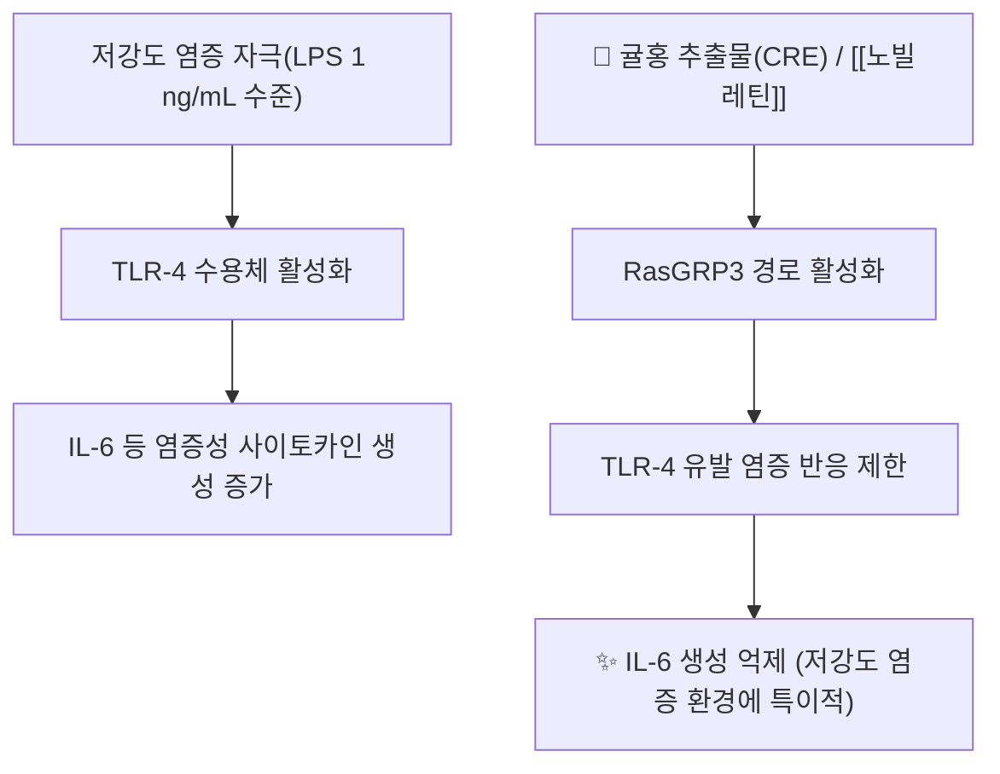

# 🌿 [[귤홍]] (橘紅, Citri Reticulatae Pericarpium Rubrum)

> 🖼️ **이미지 미확보**: 기원식물·생약원물·지표성분 구조식 3장 모두 미확보(세션 내 이미지 소싱 제약) — 작업기록에 기재.

> **핵심 요약 (Key Summary)**:
> 운향과(Rutaceae) [[귤]](*Citrus reticulata* Blanco) 성숙 과피에서 **백색 중과피(中果皮)를 제거하고 남긴 외층 홍색 부분만** 긁어낸 것으로, 자매 본초인 [[진피]](陳皮, 과피 전체 또는 중과피 포함)와 기원은 같으나 가공 부위가 다르다.
> 핵심 지표 성분인 **헤스페리딘(hesperidin)·노빌레틴(nobiletin)·탄제레틴(tangeretin)** 등 polymethoxylated flavonoid가 저강도 염증 상황에서 **RasGRP3 경로를 활성화해 TLR-4 유발 IL-6 생성을 억제**하는 기전이 보고된다.
> 辛苦溫하며 肺脾로 귀경, **조습화담(燥湿化痰)·이기관중(利气宽中)·산한(散寒)**을 주효능으로 하는 거담지해(祛痰止咳) 전문 본초 — 진피보다 **이기건비력은 약하고 화담지해력은 강함**이 핵심 감별점.

---
## 📌 목차
1. [기본 본초 정보 & 진피와의 감별](#1-기본-본초-정보--진피와의-감별)
2. [핵심 분자약리 기전](#2-핵심-분자약리-기전)
3. [호흡기·소화기 생체역학 연계](#3-호흡기소화기-생체역학-연계)
4. [사상의학 및 체질별 임상 응용](#4-사상의학-및-체질별-임상-응용)
5. [한의학적 고찰 — 진피에서 분화된 배경](#5-한의학적-고찰--진피에서-분화된-배경)
6. [핵심 처방 비교 매트릭스](#6-핵심-처방-비교-매트릭스)
7. [양약 상호작용](#7-양약-상호작용)
8. [출처 및 학술 참고 문헌](#8-출처-및-학술-참고-문헌)

---
## 1. 기본 본초 정보 & 진피와의 감별

| 항목 | 상세 내용 |
| :--- | :--- |
| **기원 식물** | 운향과(Rutaceae) [[귤]](*Citrus reticulata* Blanco) 성숙 과피의 외층 홍색 부분 |
| **가공법** | 성숙 과피를 채취 후 내측 백색 중과피(스펀지形 albedo)를 칼로 긁어 제거하고, 남은 외층의 홍색~주황색 유포(油胞) 부위만 건조 |
| **성미 (性味)** | 辛(辛味)·苦(苦味), 溫(溫性) |
| **귀경 (歸經)** | 肺·脾 |
| **효능 (Actions)** | 燥湿化痰(조습화담)·理氣寬中(이기관중)·散寒(산한)·消積化滯(소적화체) |
| **주요 성분** | • **지표 성분**: [[헤스페리딘]](hesperidin), [[노빌레틴]](nobiletin), [[탄제레틴]](tangeretin) 등 polymethoxylated flavonoid<br>• **정유 성분**: d-limonene 등 |
| **표준 용량** | 3~10g (급성 담다(痰多) 기침에는 최대 15g, 의료진 판단 필요) |
| **금기** | 음허건해(陰虛乾咳), 기허(氣虛) 만성 기침에는 부적절(온조성 거담약이라 체액 고갈 우려) |

### 🔑 진피(陳皮) vs 귤홍(橘紅) 핵심 감별
* **[[진피]]**: 과피 전체(또는 백색 중과피 포함)를 그대로 건조. 백색 중과피에 함유된 성분 비중이 높아 **이기건비(理氣健脾)·소화 촉진** 효능이 상대적으로 강함.
* **귤홍**: 중과피(백색 섬유질)를 제거해 **정유·플라보노이드가 농축된 외층만** 남김. 거담력이 진피보다 강하고, 건비(健脾) 작용은 상대적으로 약함 — 임상에서는 **"담이 많은 기침엔 귤홍, 식적·비위기체엔 진피"**로 구분해 쓰는 것이 전통적 용법이다.
* 명·청대 본초서(本草綱目拾遺 계열)에서 진피의 변종(變種) 가공품으로 분화 기재되었다는 것이 통설이며, 본 노트에서는 이 가공법상의 차이를 원전 1차 인용 없이 **통설 수준**으로만 적는다(근거 미확인 부분은 아래 참고문헌에 명시).

---
## 2. 핵심 분자약리 기전



* **RasGRP3 매개 TLR-4 신호 제한**: Lee 등(2023)의 RAW264.7 대식세포 실험에서, 귤홍 에탄올 추출물(CRE, 지표성분 노빌레틴 442.6±30.7 ppm 함유)은 **저강도 LPS(1 ng/mL) 자극 조건에서 IL-6 생성을 유의하게 억제**했으나, **고강도 LPS(100 ng/mL) 조건에서는 억제력이 뚜렷하지 않았다**. RasGRP3를 siRNA로 녹다운하면 CRE의 IL-6 억제 효과가 사라져, **RasGRP3가 이 억제 기전의 핵심 매개자**임이 확인되었다. 노빌레틴 단독으로도 2.5~40 μM 농도에서 저강도 LPS 조건 IL-6를 유의하게 억제했다.
* **플라보노이드 계열 공통 기전(귤피류 일반)**: 헤스페리딘·노빌레틴·탄제레틴 등 polymethoxylated flavonoid는 NF-κB·MAPK 경로 억제를 통한 항염 작용이 귤피류(진피·귤홍 포함) 전반에서 보고되는 공통 기전으로 거론되나, 이는 **귤홍 단독이 아닌 Citrus 속 과피 전반의 네트워크 약리학 리뷰** 수준 근거이며 귤홍에 특이적인 RCT는 확인되지 않았다(근거 수준 제한적).

---
## 3. 호흡기·소화기 생체역학 연계

* **기도 점액 청소(mucociliary clearance)**: 거담(祛痰) 효능은 전통적으로 기관지 점액 점도 저하 및 배출 촉진으로 설명되며, 정유 성분(d-limonene 등)의 기관지 평활근 이완 작용이 보조적으로 거론된다(개별 임상 수치는 근거 미확인).
* **비위 기체(脾胃氣滯) 완화**: 이기관중(理氣寬中) 효능은 소화관 평활근의 과도한 긴장을 완화하여 복부 팽만·식욕부진을 개선하는 전통적 효능으로 기재되나, 중과피를 제거한 귤홍은 진피보다 이 작용이 약하다는 것이 통설이다.

---
## 4. 사상의학 및 체질별 임상 응용 (적응증 vs 금기)

```
[✅ 최적 적응증 (Sweet Spot)]
• 백태(白苔)·담백(白痰) 위주의 습담(濕痰) 기침, 흉부 비민감(痞悶感)
• 식후 복부팽만·오심을 동반한 담음(痰飮) 체질
• 한담(寒痰) 양상(묽고 흰 가래, 추위에 악화)

[⚠️ 신중 투여 및 금기 (Caution / Contraindication)]
• 음허건해(陰虛乾咳, 마른기침·가래 없음) — 온조성이 진액을 더 고갈시킴
• 기허(氣虛) 만성 해수 — 보익 없이 거담만 하면 기력 소모 가중
• 열담(熱痰, 황색 농성 가래)에는 청열화담약과의 배오 없이 단독 사용 주의
```

> 체질별(사상의학) 전용 처방 적응증은 본 노트가 참조한 1차 문헌에서 확인되지 않아, 구체적 태음인/소음인 단독 배정은 **근거 미확인**으로 비워둔다. 임상에서는 담음·기체 경향이 두드러진 태음인 체질에 귤피류가 흔히 활용되나, 이는 통설 수준 서술이다.

---
## 5. 한의학적 고찰 — 진피에서 분화된 배경

* 귤홍은 **진피의 가공 변종**으로 후대 본초서에서 독립 기재된 품목이라는 것이 통설이며, 『본초강목』 계열 이후 문헌에서 중과피 제거 가공법이 구체화되었다고 전해진다(원전 1차 대조 없이 통설로만 기재, 근거 미확인).
* 배오 특징: 거담 목적으로는 [[반하]]·[[길경]]과 함께, 이기 보강이 필요하면 [[지실]]·[[목향]]과 배오하는 것이 임상에서 흔히 쓰인다.

---
## 6. 핵심 처방 비교 매트릭스

| 처방명 | 구성 약재 | 주치 병증 및 임상 타깃 | 특징 및 감별점 |
| :--- | :--- | :--- | :--- |
| **[[이진탕]]** | 반하, [[진피]](또는 귤홍 가감), 복령, 감초 | 습담(濕痰) 기침, 흉비, 오심 | 원방은 진피 사용, 담다(痰多) 심할 때 귤홍으로 대체 가감하는 임상 관행 |
| **귤홍환(橘紅丸, 민간·중의 성약)** | 귤홍, 길경, 지모, 반하, 복령 등 | 담다(痰多) 해수, 흉부 비민감 | 거담지해 전문 성약, 본 노트 1차 대조 문헌은 확보되지 않음(근거 미확인) |

---
## 7. 양약 상호작용 (Herb–Drug Interaction)

* **CYP 효소 간섭**: 귤홍에 특이적인 CYP3A4·2C9·2D6 간섭 데이터는 확인되지 않음(근거 미확인). 다만 감귤류 플라보노이드(나린진 등 자몽 계열)가 CYP3A4를 억제해 일부 약물 혈중농도를 높이는 것으로 알려진 바와 유사한 기전이 이론적으로 거론될 수 있으나, 귤홍(Citrus reticulata) 자체에 대한 직접 보고는 아니다.
* **진해거담제 병용**: 양방 진해거담제(암브록솔, 구아이페네신 등)와 작용 기전이 중복될 수 있어 과용 시 가래 배출 과다에 따른 불편감 가능성 — 특별한 금기 보고는 없음.
* **복용 시점 분리**: 특별한 흡수 간섭 보고는 확인되지 않음(근거 미확인).

## 8. 출처 및 학술 참고 문헌 (References)

1. **Lee JH, Kim YS, Leem KH (2023)**. *Citri Reticulatae Pericarpium Limits TLR-4-Triggered Inflammatory Response in RAW264.7 Macrophages by Activating RasGRP3*. **International Journal of Molecular Sciences** (PMC10530606). [PMID 37762079](https://pubmed.ncbi.nlm.nih.gov/37762079/)
   - **[연구 요약]**: RAW264.7 대식세포에서 귤피(CRP) 에탄올 추출물이 저강도 LPS(1 ng/mL) 자극 시 RasGRP3 활성화를 통해 IL-6 생성을 유의하게 억제함을 확인. 고강도 LPS(100 ng/mL)에서는 억제력이 약화됨. 지표성분 노빌레틴 442.6±30.7 ppm 함유, 노빌레틴 단독(2.5~40 μM)도 동일 조건에서 IL-6 억제.
2. **meandqi.com TCM Herb Database — "Ju Hong"**.
   - **[DB 정리]**: 귤홍의 성미(辛苦溫)·귀경(肺脾)·효능(燥湿化痰·利气宽中·散寒)·주치(담다 기침·흉부 비민감·오심구토·식후 복부팽만·천식)·표준 용량(3~10g, 최대 15g)·금기(음허건해·기허 만성 해수)를 정리한 임상 참고 데이터베이스.
3. **Zhang M et al. (2022)**. *Citri Reticulatae Pericarpium extract and flavonoids reduce inflammation in RAW 264.7 macrophages by inactivation of MAPK and NF-κB pathways*. **Food Frontiers**.
   - **[연구 요약]**: 귤피(CRP) 추출물 및 개별 플라보노이드가 MAPK·NF-κB 경로 비활성화를 통해 대식세포 염증 반응을 감소시킴을 보고 — 귤피류(진피·귤홍 포함) 전반의 공통 항염 기전 근거로 인용.

<!-- 작업기록: 이미지 3장(기원식물/생약원물/지표성분 구조식) 미확보 — 세션 내 이미지 소싱 제약(2026-10-03 다빈치) -->
