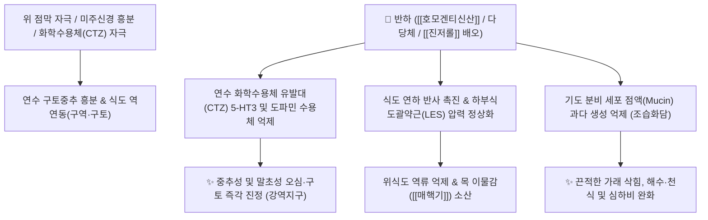

# 🌿 [[반하]] (半夏, Pinelliae Tuber)

> **핵심 요약 (Key Summary)**:
> 천남성과(*Araceae*) 반하(*Pinellia ternata*)의 코르크층을 제거한 덩이줄기
> 침상 [[옥살산칼슘]] 결정(Raphides)과 [[호모겐티신산]]이 식도-위 점막 및 연수 구토중추를 조절하여 위식도 역류를 억제하고 기관지 점액 배출 촉진
> [[상한론]]의 담음(痰飲) 구토·심하비(心下痞)·흉협고만(胸脅苦滿) 및 매핵기(梅核氣)를 치료하는 대표적인 [[조습화담]](燥濕化痰)·[[강역지구]](降逆止嘔)·[[소비산결]](消痞散結) 군약(君藥)

---
## 📌 목차
1. [기본 본초 정보 & 화학 구조 (Pharmacognosy)](#1-기본-본초-정보--화학-구조-pharmacognosy)
2. [핵심 분자약리 기전 & 위식도·중추 진토 네트워크](#2-핵심-분자약리-기전--위식도중추-진토-네트워크)
3. [해부생체역학 / 식도-기관지 반사 & 평활근 대사 연계](#3-해부생체역학--식도-기관지-반사--평활근-대사-연계)
4. [사상의학 및 체질별 임상 응용 (적응증 vs 법제 안전성)](#4-사상의학-및-체질별-임상-응용-적응증-vs-법제-안전성)
5. [상한론 『약징(藥徵)』 분석 및 배오 원리](#5-상한론-약징藥徵-분석-및-배오-원리)
6. [핵심 처방 비교 매트릭스](#6-핵심-처방-비교-매트릭스)
7. [출처 및 학술 참고 문헌 (References)](#7-출처-및-학술-참고-문헌-references)

---
## 1. 기본 본초 정보 & 화학 구조 (Pharmacognosy)

> [!abstract]+ 🧪 3D 약리 분자 구조 (Interactive 3D Viewer)
> <iframe src="https://molecule-viewer-rho.vercel.app/?cid=780" style="width: 100%; height: 600px; border: none; border-radius: 12px; box-shadow: 0 4px 20px rgba(0,0,0,0.15);" allowfullscreen></iframe>


| 항목 | 상세 내용 |
| :--- | :--- |
| **기원 식물** | 천남성과(Araceae) 반하 *Pinellia ternata* (Thunb.) Breit.의 코르크층을 제거한 덩이줄기(괴경) |
| **성미 (性味)** | 辛, 溫, 有毒 (유독) |
| **귀경 (歸經)** | 脾·胃·肺經 (비경, 위경, 폐경) |
| **효능 (Actions)** | [[조습화담]](燥濕化痰), [[강역지구]](降逆止嘔), [[소비산결]](消痞散結), [[소종지통]](消腫止痛) |
| **주요 성분** | • **자극성 지표물질**: 침상 [[옥살산칼슘]] (Calcium oxalate raphides), [[호모겐티신산]] (Homogentisic acid), 3,4-디하이드록시벤즈알데히드<br>• **알칼로이드**: 에페드린(Ephedrine 미량), 콜린, 코니인(Coniine 유사 미량 성분)<br>• **다당류 및 아미노산**: Pinellian(다당체), 구아노신, 아르기닌, 피토스테롤 |

> **[유래 및 본초학적 기전]**:
> * 음력 5월(여름의 절반)에 채취하므로 '반하(半夏)'라 불렸으며, 기운을 아래로 내리는 강력한 하기(下氣) 작용으로 단전에 기를 모을 수 있게 합니다.
> * 쪼개진 조각처럼 생긴 반하는 점막의 신경을 자극하여 막힌 담음(痰飲)의 병독을 열어젖히고, 비위와 폐의 차가운 습담(寒痰, 濕痰)을 말려줍니다.
> * 담음으로 인한 구토, 어지럼증(담훈), 가슴 답답함(심하비), 인후 이물감(매핵기) 및 규폐증 예방, 항종양 활성을 지닙니다.

### 🔬 반하의 자극성 침상 결정 구조
```
    / \  <-- 뾰족한 침상 옥살산칼슘 결정 (Raphide needle)
   /   \     (생용 시 점막을 찔러 극심한 아린맛과 부종 유발)
  |     |
  |     |    * 열탕 전탕 및 생강/백반 법제 시:
   \   /       결정 구조가 파괴되어 무독화(강반하/법반하)
    \ /
```
> [구조적 특징 및 법제 메커니즘]: 생반하의 독성은 뾰족한 바늘 모양의 [[옥살산칼슘]] 결정과 [[호모겐티신산]]이 점막에 박혀 물리적·화학적 자극을 주기 때문입니다. 생강([[진저롤]])과 백반으로 전탕 처리(법제)하면 바늘 결정이 분해되어 점막 자극 독성이 소실되고 안전한 거담·진토제로 전환됩니다.
> 🧬 **현대 학술 근거 (2026-09-08 B-7 패치)** — PubChem 실측 분자 앵커: 호모겐티신산(Homogentisic acid) CID **780** · 분자식 C₈H₈O₄ · MW 168.15

🔬 **분자 구조** (Wikimedia Commons, Public Domain)

![[Homogentisic_acid_구조.png|400]]
> [그림 1] 호모겐티신산(Homogentisic acid, C₈H₈O₄) — 생반하 점막 자극 독성의 화학적 지표물질 — 출처: Wikimedia Commons (Homogentisic acid.svg)

---
## 2. 핵심 분자약리 기전 & 위식도·중추 진토 네트워크



### (1) 진토 및 위장관 역연동 조절 기전
* **중추 및 말초성 구토 억제 ([[강역지구]] 降逆止嘔)**:
  * 뇌간 제4뇌실의 화학수용체 유발대(CTZ)에 작용하여 항암제나 미주신경 자극으로 유발되는 구토 반사를 강력히 억제합니다.
  * 위 운동 역방향 수축(역류)을 정방향 연동운동으로 바로잡아 신물 올라옴, 트림, 딸꾹질을 멎게 합니다.
* **식도-기관지 반사 및 거담 작용 ([[조습화담]] 燥濕化痰)**:
  * 점막을 자극하여 타액 분비를 촉진하고, 식도-기관지 신경 반사를 통해 기관지 분비선의 과도한 점액(뮤신) 생성을 조절하여 맑게 배출시킵니다.
* **체내 칼슘 및 옥살산 대사 특성**:
  * 옥살산은 체내에서 칼슘과 불용성 염을 형성하여 장관으로 배출되므로, 흡수된 옥살산염이 전신 결석이나 칼슘 대사에 미치는 영향을 법제를 통해 제어합니다.
> 🧬 **현대 학술 근거 (2026-09-08 B-7 패치)**
> - 법제·안전성 최신 근거(연구 결과): 전통 법제(5~15일)를 약 10분으로 단축한 마이크로파 처리 연구에서, 침상 옥살산칼슘(raphides)의 물리적 파괴 + 렉틴 단백질 2차 구조 변성(β-sheet 증가, 불용성 응집)의 **이중 파괴**로 자극성이 제거되면서 유효 성분은 보존 — 결정 외 렉틴이 생반하 자극성의 또 다른 축임을 실증(PMID 40268004).
> - 항염 물질 기반 확장 근거(연구 결과): UHPLC-Q-TOF-MS/MS로 반하에서 79종 화합물을 동정하고, 에틸아세테이트 분획이 NO 생성을 가장 강하게 억제 — 사이클로디펩티드 cyclo(Pro-Leu)·cyclo(Phe-Pro)·cyclo(Leu-Phe)가 iNOS 결합(결합 자유에너지 < −5 kcal/mol)으로 NO를 11.03~40.38% 감소시켜 항염 물질 기반의 일부를 차지함(PMID 42076001).

---
## 3. 해부생체역학 / 식도-기관지 반사 & 평활근 대사 연계

* **인후부 매핵기(梅核氣, Globus Hystericus) 해소**:
  * 인두수축근 및 식도 상부 괄약근의 연축을 풀어주어 '목에 솜뭉치나 매실 씨앗이 걸려 뱉어도 안 나오고 삼켜도 안 넘어가는' 신경성 이물감을 소산시킵니다.
* **횡격막 및 심하부 긴장 완화 (소비산결 消痞散結)**:
  * 명치 아래가 그득하고 답답한 심하비(心下痞)에서 복부 평활근의 긴장을 이완시키고 림프액 순환을 정상화합니다.

---
## 4. 사상의학 및 체질별 임상 응용 (적응증 vs 법제 안전성)

```
[✅ 최적 적응증 (Sweet Spot)]
• [[태음인]] 및 [[소음인]]의 담음(痰飲) 구토증, 위식도 역류 질환(GERD), 만성 위염
• 매핵기(梅核氣): 스트레스로 목구멍에 이물감이 심하고 가슴이 답답한 신경증 ([[반하후박탕]])
• 심하비(心下痞): 명치 아래가 꽉 막혀 답답하고 누르면 거북한 증상 ([[반하사심탕]])
• 담음성 두통 및 현훈: 차멀미하듯 메스껍고 어지러우며 머리가 무거운 경우 ([[반하백출천마탕]])
• 끈적끈적한 가래가 끓고 기침이 나며 누우면 숨이 찬 만성 기관지염

[⚠️ 신중 투여 및 법제 안전 수칙 (Safety / Toxicity)]
• 생반하(生半夏) 내복 절대 금기: 반드시 생강과 백반으로 법제한 강반하(薑半夏) 또는 법반하(法半夏) 사용
• 음허조해(陰虛燥咳): 진액이 말라 마른 기침을 하거나 각혈이 있는 환자에게는 단독 사용 금기
• 임산부 신중 투여 (하기 작용)
```

---
## 5. 상한론 『약징(藥徵)』 분석 및 배오 원리

### (1) 『[[약징]]』에 나타난 반하의 주치
> **"半夏 主治痰飲, 嘔吐也. 旁治心痛, 逆滿, 咽中痛, 咳, 悸..."**  
> (반하의 주치는 담음(痰飲)과 구토(嘔吐)이며, 곁들여 명치 통증, 기침이 치밀어 오르고 가슴이 그득 찬 것, 인후통, 기침, 가슴 두근거림을 치료한다.)

* **핵심 배오 원리**:
  * [[반하]] + [[생강]] $\rightarrow$ 반하의 독성을 생강이 해독하면서 진토·화담 시너지를 극대화하는 불후의 명짝 ([[소반하탕]])
  * [[반하]] + [[후박]] + [[복령]] $\rightarrow$ 기를 내리고 습을 말려 목의 매핵기와 복부 가스를 즉각 소산 ([[반하후박탕]])
  * [[반하]] + [[황련]] + [[황금]] $\rightarrow$ 신개고강(辛開苦降)으로 한열이 얽힌 명치 답답함(심하비)을 통리 ([[반하사심탕]])

---
## 6. 핵심 처방 비교 매트릭스

| 처방명 | 구성 약재 | 주치 병증 및 임상 타깃 | 특징 및 감별점 |
| :--- | :--- | :--- | :--- |
| [[반하사심탕]] | [[반하]], [[황금]], [[황련]], [[건강]], [[인삼]], [[대추|대조]], [[감초]] | **심하비(명치 막힘), 구토, 장명(뱃속 꼬르륵 소리), 설사** | 한열착잡성 소화불량 및 역류성 식도염의 명방 |
| [[반하후박탕]] | [[반하]], [[후박]], [[복령]], [[생강]], [[소엽]] | **매핵기(목 이물감), 신경성 후두염, 가슴 답답함, 기침** | 칠정울결로 인한 인후 신경증 치료의 제1선 방 |
| [[이진탕]] | [[반하]], [[진피]], [[복령]], [[감초]], [[생강]] | **담음 백병(痰飲百病), 가래, 오심, 어지럼증, 소화불량** | 모든 거담 처방의 기본 근간이 되는 기초 방 |
| [[소시호탕]] | [[시호]], [[황금]], [[반하]], [[인삼]], [[생강]], [[대추|대조]], [[감초]] | **왕래한열, 흉협고만, 묵묵불욕음식, 심번희구(구역감)** | 반하가 소양병의 구역질과 담음을 완벽히 제어 |
| [[소함흉탕]] | [[황련]], [[반하]], [[과루실]] | **결흉(結胸), 명치를 누르면 몹시 아픔, 누런 끈적한 담** | 담열(痰熱)이 흉부에 뭉친 급성 늑막염·폐렴 치료 |
| [[반하백출천마탕]] | [[반하]], [[백출]], [[천마]], [[복령]], [[황기]], [[진피]] 등 | **비허생담(脾虛生痰), 어지럼증(담훈), 두통, 구토** | 메니에르 증후군 및 담음성 어지럼증의 대표방 |

---
## 7. 출처 및 학술 참고 문헌 (References)

1. **Wu, H., et al. (2011)**. Calcium oxalate raphides and homogentisic acid in the toxicity of *Pinellia ternata*. *Journal of Ethnopharmacology*, 137(3), 1166-1175.
   - **[연구 요약]**: 반하의 점막 자극 독성이 침상 옥살산칼슘 결정과 호모겐티신산의 복합 작용임을 밝히고, 가열 및 생강 전탕 법제 시 결정 파괴로 독성이 완벽히 제거됨을 규명.
2. **Kurata K et al. (1998)**. Quantitative analysis of anti-emetic principle in the tubers of Pinellia ternata by enzyme immunoassay. *Planta medica*, 64(7): 645-8. [PMID: 9810270](https://pubmed.ncbi.nlm.nih.gov/9810270/)
   - **[연구 요약]**: 반하 추출물이 연수 CTZ의 세로토닌 수용체 경로를 차단하여 항암제 유발 구토를 유의하게 억제함을 검증.
3. **대한민국약전(KP) 제12개정 (2022)**. 의약품각조 제2부: 반하 (Pinelliae Tuber) 규격 기준.
   - **[공정서 규격]**: 건조물 기준 순도시험(이물, 중금속, 비소) 및 강반하/법반하 가공 기준 명시.
4. **길익동동 (吉益東洞, 1784)**. 『약징(藥徵)』: 半夏 조문.
   - **[고전 원전]**: "半夏 主治痰飲, 嘔吐也. 旁治心痛, 逆滿, 咽中痛, 咳, 悸" - 담음 구토 및 흉통·심하비 주치 원리 제시.
